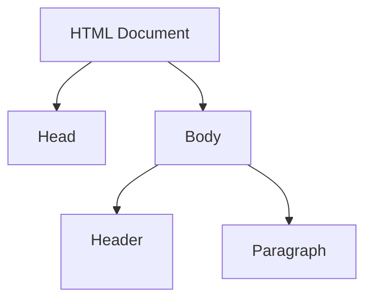
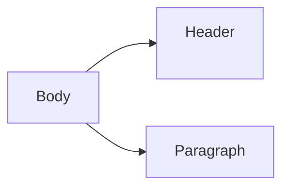
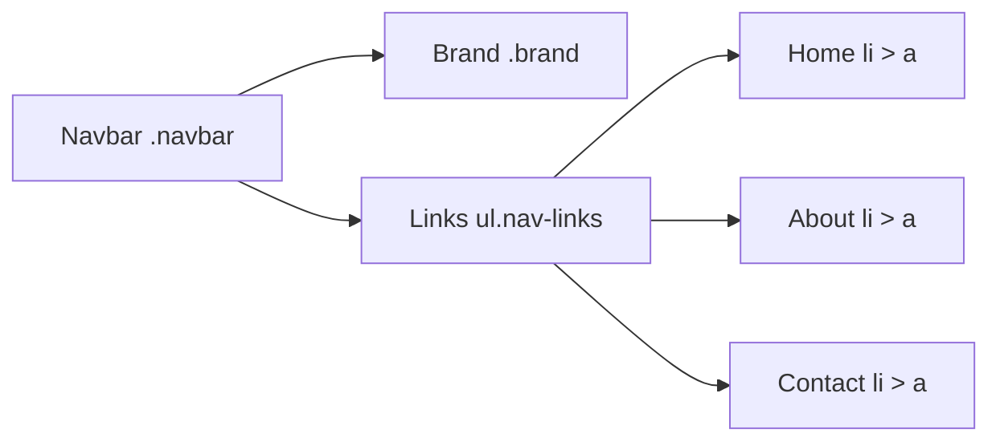

# HTML & CSS Basics

> This chapter introduces the fundamentals of HTML and CSS for building web pages.  
> Step-by-step instructions, code examples, and diagrams are included.

---

## 1. HTML Structure

HTML documents have a basic structure:

```html
<!DOCTYPE html>
<html lang="en">
<head>
  <meta charset="UTF-8">
  <title>My First Page</title>
</head>
<body>
  <h1>Welcome to HTML</h1>
  <p>This is a paragraph.</p>
</body>
</html>
```

**Explanation:**
1. `<!DOCTYPE html>`: Declares HTML5 document.
2. `<html>`: Root element.
3. `<head>`: Metadata.
4. `<body>`: Content visible in the browser.

---

## 2. Page Layout Diagram



> The diagram above shows the relationship between the main sections of an HTML page.

---

## 3. CSS Basics

CSS adds styles to HTML elements.

```html
<style>
  body {
    font-family: Arial, sans-serif;
    background-color: #f0f0f0;
  }

  h1 {
    color: #0d6efd;
    text-align: center;
  }

  p {
    color: #333333;
    line-height: 1.5;
  }
</style>
```

**Explanation:**
- `body` selector: Styles the entire page.
- `h1` selector: Styles all `<h1>` elements.
- `p` selector: Styles all paragraphs.

---

## 4. Step-by-Step Example: Styled Page

```html
<!DOCTYPE html>
<html lang="en">
<head>
  <meta charset="UTF-8">
  <title>Styled Page</title>
  <style>
    body { font-family: Verdana, sans-serif; margin: 40px; }
    h1 { color: darkblue; }
    p { color: darkgreen; }
  </style>
</head>
<body>
  <h1>HTML & CSS Example</h1>
  <p>This page demonstrates basic styling.</p>
</body>
</html>
```

---

## 5. Layout Diagram (Visualizing Boxes)



> This helps students visualize how elements are nested in the page.

---

## 6. Next Steps (Copilot-Friendly Prompt)

Below are three practical exercises you can give students to practice HTML and CSS. Each exercise includes a short description, a small code snippet to start from, a Mermaid diagram to visualize structure, and a few hints/solutions.

### Exercise 1 — Simple Navigation Bar
Description: Create a horizontal navigation bar with links, a brand on the left, and links on the right. Use Flexbox for layout and add a hover effect.

Starter code:

```html
<nav class="navbar">
  <div class="brand">MySite</div>
  <ul class="nav-links">
    <li><a href="#">Home</a></li>
    <li><a href="#">About</a></li>
    <li><a href="#">Contact</a></li>
  </ul>
</nav>

<style>
.navbar {
  display: flex;
  justify-content: space-between;
  align-items: center;
  background: #0d6efd;
  padding: 10px 20px;
}
.nav-links { list-style: none; display: flex; gap: 16px; margin: 0; padding: 0; }
.nav-links a { color: #fff; text-decoration: none; padding: 6px 8px; border-radius: 4px; }
.nav-links a:hover { background: rgba(255,255,255,0.15); }
.brand { color: #fff; font-weight: bold; }
</style>
```

Visual diagram:



Hints / Solution notes:
- Use `display: flex` and `justify-content: space-between` to position brand and links.
- Remove default list padding/margins from the `<ul>`.

---

### Exercise 2 — Card Layout with Flexbox
Description: Build a simple card component with an image, title, and description. Arrange multiple cards in a row that wrap on smaller screens.

Starter code:

```html
<div class="card-row">
  <article class="card">
    
    <h3>Card Title</h3>
    <p>Short description of the card content.</p>
  </article>
  <article class="card">...</article>
  <article class="card">...</article>
</div>

<style>
.card-row { display: flex; gap: 20px; flex-wrap: wrap; }
.card { background: #fff; border-radius: 8px; box-shadow: 0 1px 4px rgba(0,0,0,0.1); padding: 12px; width: 300px; }
.card img { width: 100%; border-radius: 6px; }
</style>
```

Visual diagram:

```mermaid
graph LR
    Row[.card-row (flex wrap)] --> Card1[.card]
    Row --> Card2[.card]
    Row --> Card3[.card]
    Card1 --> Img[img]
    Card1 --> Title[h3]
    Card1 --> Desc[p]
```

Hints / Solution notes:
- Use `flex-wrap: wrap` so cards flow to the next line on narrow screens.
- Set a fixed max width on `.card` so multiple cards fit side-by-side on larger screens.

---

### Exercise 3 — Responsive Image Gallery (CSS Grid)
Description: Create a responsive gallery using CSS Grid that shows 3 columns on desktop, 2 on tablet, and 1 on mobile.

Starter code:

```html
<div class="gallery">
  <figure class="photo"></figure>
  <figure class="photo">...</figure>
  <figure class="photo">...</figure>
  <figure class="photo">...</figure>
</div>

<style>
.gallery { display: grid; gap: 12px; grid-template-columns: repeat(3, 1fr); }
.gallery img { width: 100%; height: auto; display: block; border-radius: 6px; }

@media (max-width: 900px) {
  .gallery { grid-template-columns: repeat(2, 1fr); }
}
@media (max-width: 600px) {
  .gallery { grid-template-columns: 1fr; }
}
</style>
```

Visual diagram:

```mermaid
flowchart TD
    Gallery[.gallery (grid)] --> Photo1[.photo]
    Gallery --> Photo2[.photo]
    Gallery --> Photo3[.photo]
    Gallery --> Photo4[.photo]
```

Hints / Solution notes:
- Use `grid-template-columns` with `repeat()` for concise column definitions.
- Use media queries to change the number of columns at breakpoints.

---

You can paste these exercises directly into the chapter to give students hands-on practice. For each exercise, encourage them to try modifying colors, spacing, and responsive breakpoints to see the effects.

