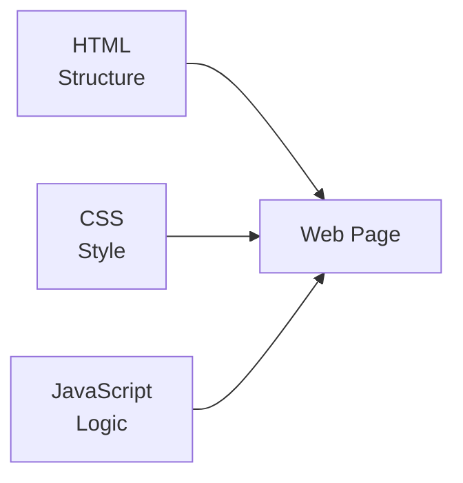
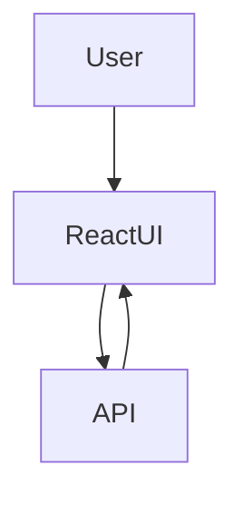
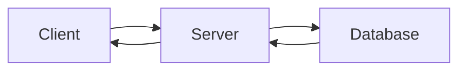
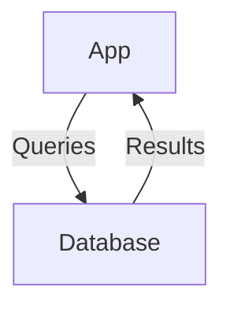

# Technology Overview for Web Development

## 1. Introduction
Modern web applications are built using a combination of client-side technologies, server-side technologies, and databases. This overview explains the role of each major technology and how they fit together, with special focus on the MERN stack.

---

## 2. Client-Side Technologies (Frontend)

### 2.1 HTML – Structure of the Web
HTML (HyperText Markup Language) defines the **structure** of a web page.

**Role of HTML:**
- Creates page layout
- Defines headings, paragraphs, forms, images, and links
- Acts as the skeleton of a website

HTML alone cannot provide styling or interactivity.

---

### 2.2 CSS – Presentation and Styling
CSS (Cascading Style Sheets) controls the **look and feel** of web pages.

**Role of CSS:**
- Colors, fonts, spacing
- Layout systems (Flexbox, Grid)
- Responsive design for mobile devices

CSS improves usability and visual appeal.

---

### 2.3 JavaScript – Behavior and Interactivity
JavaScript adds **logic and interactivity** to web pages.

**Role of JavaScript:**
- Handle user events (clicks, form submissions)
- Manipulate HTML and CSS dynamically
- Communicate with servers using APIs

JavaScript runs in the browser and is the foundation for modern frontend frameworks.

---

## 3. jQuery, Bootstrap & Modern Frontend Libraries

### 3.1 jQuery – Simplified JavaScript
jQuery is a JavaScript library designed to simplify DOM manipulation.

**Why jQuery was popular:**
- Shorter syntax
- Easier event handling
- Cross-browser support

**Current Status:**
- Still used in legacy projects
- Less common in modern React-based apps

---

### 3.2 Bootstrap & UI Libraries
Bootstrap is a CSS framework that provides pre-built components.

**Why use Bootstrap-like libraries:**
- Faster UI development
- Consistent design
- Built-in responsiveness

**Examples:**
- Bootstrap
- Tailwind CSS
- Material UI

These libraries reduce development time but may limit design flexibility.

---

### 3.3 React – Modern Frontend Framework
React is a JavaScript library for building **component-based user interfaces**.

**Why React is used:**
- Reusable components
- Virtual DOM for performance
- Manages complex UI states

**Where React fits:**
- Used when applications become large and interactive
- Replaces heavy use of jQuery

---

## 4. Server-Side Technologies (Backend)

### 4.1 Role of a Server
The server handles **business logic**, **authentication**, and **data access**.

**Server Responsibilities:**
- Process client requests
- Validate data
- Communicate with databases
- Send responses (JSON/HTML)

In MERN, this role is handled by Node.js and Express.

---

### 4.2 Server-Side Language Options
Different programming languages can be used on the server.

**Common Options:**
- JavaScript (Node.js)
- Python (Django, Flask)
- PHP (Laravel)
- Java (Spring)
- C# (.NET)

**Selection Factors:**
- Performance requirements
- Community support
- Developer expertise
- Project scalability

MERN uses JavaScript on both client and server for consistency.

---

## 5. Databases

### 5.1 What is a Database?
A database stores application data in an organized manner.

**Examples of Data Stored:**
- User accounts
- Products
- Orders
- Logs

---

### 5.2 Types of Databases

#### Relational Databases (SQL)
- Structured tables with rows and columns
- Fixed schema

**Examples:**
- MySQL
- PostgreSQL
- Oracle

#### NoSQL Databases
- Flexible schema
- Scalable for large applications

**Examples:**
- MongoDB
- Firebase
- Cassandra

MERN uses **MongoDB**, a NoSQL document-based database.

---

## 6. Summary
HTML, CSS, and JavaScript form the foundation of frontend development. Libraries like jQuery and Bootstrap simplify development, while React handles complex user interfaces. The server manages logic and communication with databases, which store application data. Together, these technologies enable full-stack web development using the MERN stack.
