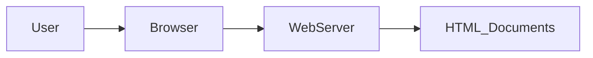
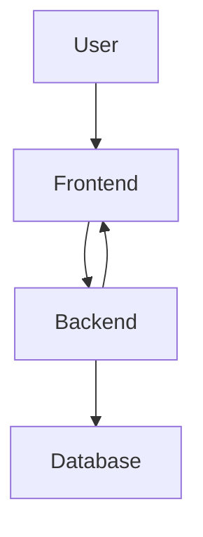
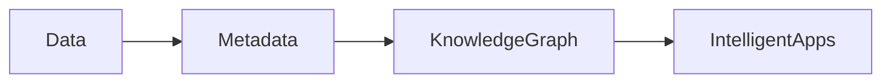
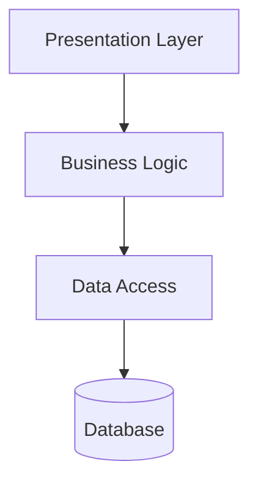
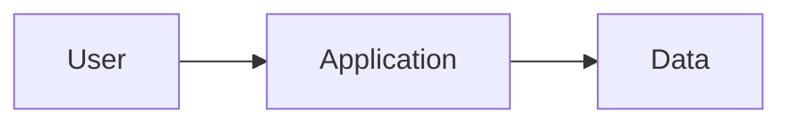
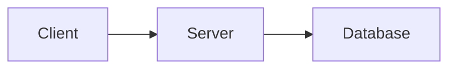
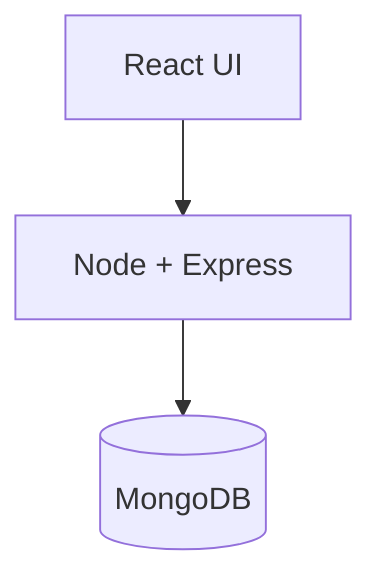
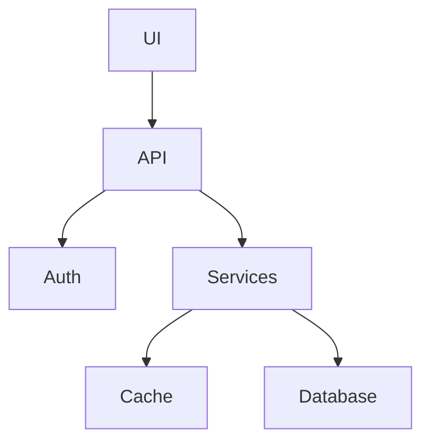

# Categories of Web Applications & Web Architectures

## 1. Introduction
Web applications can be classified based on how content is managed and how systems are architected. Understanding these categories and architectures is critical before building scalable MERN stack applications.

---

## 2. Categories of Web Applications

### 2.1 Document-Centric Web Applications
Document-centric applications focus on delivering static or semi-static content.

**Characteristics:**
- Content-driven
- Minimal user interaction
- Mostly read-only

**Examples:**
- Blogs
- News websites
- Documentation portals

---

### 2.2 Social Web Applications
Social web applications emphasize interaction, collaboration, and user-generated content.

**Characteristics:**
- User profiles
- Real-time communication
- Content sharing

**Examples:**
- Facebook
- Twitter
- Instagram

---

### 2.3 Semantic Web Applications
Semantic web applications aim to make data machine-understandable.

**Characteristics:**
- Structured data
- Metadata and ontologies
- Intelligent data processing

**Examples:**
- Knowledge graphs
- Recommendation systems

---

## 3. Web Architectures

### 3.1 Layered Architecture
A general architectural pattern where responsibilities are separated into layers.

**Common Layers:**
- Presentation Layer
- Business Logic Layer
- Data Access Layer

---

### 3.2 One-Tier Architecture
All components exist on a single machine.

**Characteristics:**
- Simple
- No network dependency
- Limited scalability

**Example:**
- Desktop applications

---

### 3.3 Two-Tier Architecture
Client communicates directly with the database server.

**Characteristics:**
- Client–Server model
- Business logic on client or server

**Example:**
- Simple client-server apps

---

### 3.4 Three-Tier Architecture
Most common architecture for web applications.

**Tiers:**
1. Presentation Tier (Frontend)
2. Application Tier (Backend)
3. Data Tier (Database)

**MERN Mapping:**
- React → Presentation Tier
- Node.js & Express → Application Tier
- MongoDB → Data Tier

---

### 3.5 N-Layered Architecture
An extension of three-tier architecture with more specialized layers.

**Examples of Layers:**
- API Layer
- Authentication Layer
- Caching Layer
- Microservices

**Advantages:**
- High scalability
- Better maintainability

---

## 4. Summary
Understanding web application categories and architectures helps developers choose the right design approach. MERN stack typically follows a three-tier or N-layered architecture for scalable and maintainable applications.
