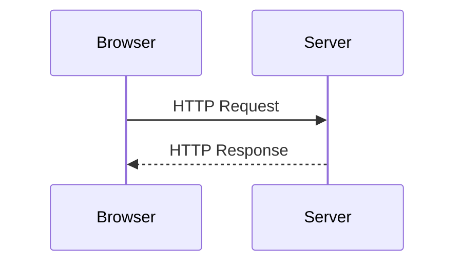
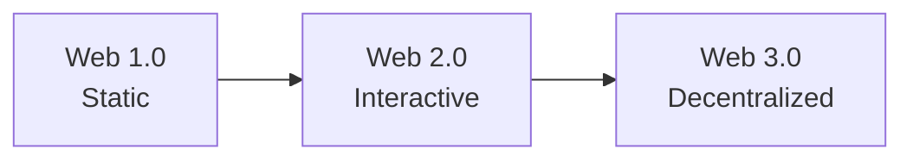
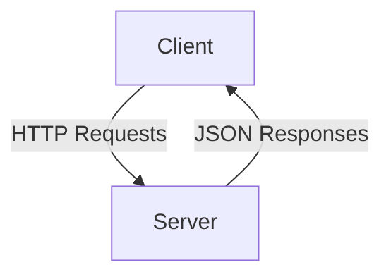

# Overview of Web Platforms

## Introduction
The web platform is the foundation on which modern web applications are built. It consists of technologies, standards, and protocols that enable communication between clients (browsers) and servers. Understanding these basics is essential before moving into MERN stack development.

---

## Web Terminologies

### Client
A client is typically a web browser (Chrome, Firefox, Edge) that sends requests to a server and displays responses.

### Server
A server is a machine or software that processes client requests and sends back responses. In MERN, Node.js acts as the server environment.

### Website vs Web Application
- **Website**: Mostly static content (blogs, portfolios).
- **Web Application**: Interactive and dynamic (e-commerce, dashboards).

### Frontend and Backend
- **Frontend**: User interface (HTML, CSS, JavaScript, React).
- **Backend**: Server-side logic and database handling (Node.js, Express, MongoDB).

### API
An Application Programming Interface allows different software systems to communicate. REST APIs are commonly used in MERN.

---

## Web Communication Protocol (HTTP)

### What is HTTP?
HTTP (HyperText Transfer Protocol) is the protocol used for communication between clients and servers on the web.

### Request–Response Cycle

### Common HTTP Methods
- **GET** – Retrieve data
- **POST** – Send data
- **PUT** – Update data
- **DELETE** – Remove data

### HTTP Status Codes
- **200** – OK
- **201** – Created
- **400** – Bad Request
- **401** – Unauthorized
- **404** – Not Found
- **500** – Server Error

---

## Web Generations

### Web 1.0 – Read Only
- Static pages
- Limited user interaction
- Example: Early HTML websites

### Web 2.0 – Read & Write
- User-generated content
- Social media and web apps
- Example: Facebook, YouTube

### Web 3.0 – Read, Write & Own
- Decentralization
- Blockchain-based apps
- Focus on data ownership

---

## Web Standards & Constraints

### Web Standards
Standards are defined by organizations like **W3C** and ensure compatibility across browsers.

Examples:
- HTML5
- CSS3
- ECMAScript (JavaScript)
- HTTP/HTTPS

### Constraints of the Web
- Stateless nature of HTTP
- Network latency
- Security challenges
- Browser compatibility

### REST Architectural Constraints
- Client–Server architecture
- Stateless communication
- Uniform interface
- Resource-based URLs

---

## Summary
This overview builds the foundation for understanding how web applications work. These concepts directly apply to MERN stack development, where React handles the frontend, Node.js and Express manage HTTP communication, and MongoDB stores application data.
