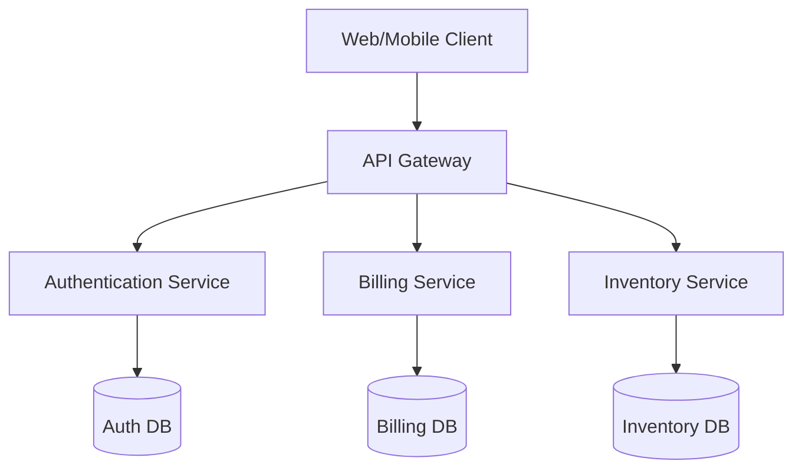
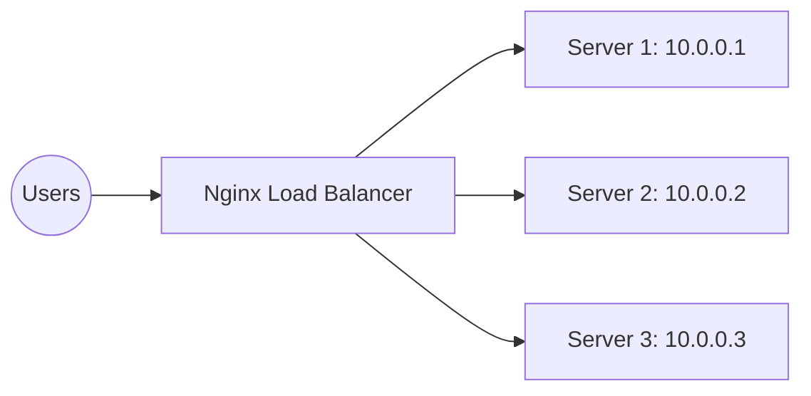
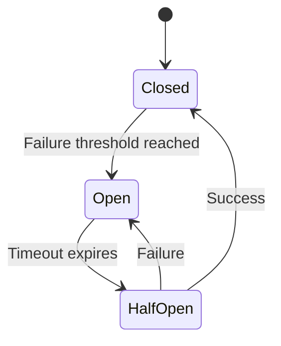

# Chapter: Web System Architectures

## 1. Introduction to System Architecture

Welcome to the foundational bedrock of modern software engineering. Web system architecture defines the conceptual model that dictates how components, services, and users interact across a network. A well-designed architecture ensures that a system is **Scalable** (capable of handling growth), **Maintainable** (easy to update and debug), and **Resilient** (capable of recovering from failures).

As architects, we don't just ask *how* to build something, we ask *why*. Why choose a distributed system over a monolith? Why prioritize availability over strict consistency? In this chapter, we will answer these questions, exploring the trade-offs that shape internet-scale applications.

---

## 2. Core Architectural Patterns

### Monolithic Architecture

In a monolith, all software components—from the user interface to the business logic and data access layers—are bundled together into a single, cohesive unit.

- **Pros:** Extremely simple to develop, test, and deploy initially. Latency between internal components is essentially zero since they run in the same memory space.
- **Cons:** As the application grows, the monolith becomes unwieldy. A single bug can crash the entire system. Furthermore, you cannot scale individual features; you must replicate the entire application, which is highly inefficient.

### Microservices Architecture

Microservices represent a paradigm shift: breaking an application into a collection of small, autonomous services modeled around specific business domains (e.g., User Auth, Billing, Inventory).



- **Independence:** Each service can be written in a different programming language and managed by dedicated teams.
- **Scalability:** If the Billing service is under heavy load, you can scale it independently without scaling the Inventory service.
- **Complexity:** Distributed systems introduce network latency, require robust service discovery, and make debugging exponentially harder.

#### The CAP Theorem

When moving to distributed architectures like microservices, architects must navigate the **CAP Theorem**. It states that a distributed data store can only simultaneously guarantee two out of the following three properties:
1. **Consistency (C):** Every read receives the most recent write or an error.
2. **Availability (A):** Every request receives a (non-error) response, without the guarantee that it contains the most recent write.
3. **Partition Tolerance (P):** The system continues to operate despite an arbitrary number of messages being dropped (or delayed) by the network between nodes.

Because network partitions are inevitable in distributed systems, architects must usually choose between **Consistency (CP)** or **Availability (AP)**. For example, a financial transaction system prioritizes Consistency (CP), whereas a social media feed prioritizes Availability (AP).

---

## 3. High Availability and Scaling

To handle millions of concurrent users, systems must move far beyond a single-server setup. Understanding how to grow your system is the hallmark of a senior architect.

### Vertical vs. Horizontal Scaling

Let's explore a real-world traffic scenario. Imagine you launch an e-commerce platform. On day one, you have 100 users. A single server handles it easily. Then, Black Friday hits, and traffic spikes to 100,000 users. How do you scale?

#### Vertical Scaling (Scaling Up)
Vertical scaling means adding more raw power—CPU, RAM, or faster storage—to your existing server.
- **The Reality:** It is the easiest to implement. You simply upgrade your cloud instance. However, it has a hard ceiling; a machine can only get so big. Furthermore, it introduces a single point of failure. If that mega-server goes down, your entire business is offline.

#### Horizontal Scaling (Scaling Out)
Horizontal scaling means adding more machines to your server pool. Instead of one massive server, you use fifty smaller ones.
- **The Reality:** This is the industry standard for modern web systems. It provides infinite scalability and fault tolerance. However, it requires your application to be *stateless*—meaning any server can handle any request without relying on local memory.

### Load Balancing

If you have fifty servers (horizontal scaling), how do users know which one to talk to? Enter the **Load Balancer**. It sits in front of your server pool and distributes incoming network traffic.



Here is a practical example of how you would configure an **Nginx** load balancer using a Round Robin algorithm:

```nginx
# nginx.conf
http {
    upstream backend_servers {
        # Round Robin is the default distribution algorithm
        server 10.0.0.1:3000;
        server 10.0.0.2:3000;
        server 10.0.0.3:3000;
    }

    server {
        listen 80;
        location / {
            proxy_pass http://backend_servers;
            proxy_set_header Host $host;
            proxy_set_header X-Real-IP $remote_addr;
        }
    }
}
```

---

## 4. Caching Strategies: Latency vs. Throughput

In architecture, **Latency** is how long a single request takes (the delay), while **Throughput** is how many requests the system can handle simultaneously (the volume). Caching drastically improves both by storing copies of data in a fast, temporary storage layer.

- **Client-Side:** Browser caching via HTTP headers (e.g., `Cache-Control`).
- **CDN (Content Delivery Network):** Geographically distributed servers that store static assets closer to the user, defeating the speed of light.
- **Server-Side (Distributed Cache):** Using in-memory data stores like **Redis** to intercept frequent database queries.

Here is a simple example of using Redis in a Node.js environment to cache a database query:

```javascript
const redis = require('redis');
const client = redis.createClient({ url: 'redis://localhost:6379' });

async function getUserProfile(userId) {
    // 1. Check Cache
    const cachedProfile = await client.get(`user:${userId}`);
    if (cachedProfile) {
        return JSON.parse(cachedProfile); // Cache Hit (Fast)
    }

    // 2. Cache Miss: Query Database (Slow)
    const profile = await database.query('SELECT * FROM users WHERE id = ?', [userId]);
    
    // 3. Store in Cache for 60 seconds
    await client.setEx(`user:${userId}`, 60, JSON.stringify(profile));
    
    return profile;
}
```

---

## 5. Communication Patterns: Asynchronous and Event-Driven

While synchronous HTTP requests (like REST) are easy to reason about, they block operations. In complex systems, we move to **Asynchronous (Event-Driven)** patterns. Let's compare two dominant models.

### Message Queues vs. Pub/Sub Models

When a user places an order, you might need to charge their card, send an email, and update inventory. Doing this synchronously makes the user wait. Asynchronously, we use brokers.

```mermaid
graph TD
    subgraph Message Queue Pattern (e.g., RabbitMQ / AWS SQS)
        P1[Producer] --> Q[Queue]
        Q --> C1[Consumer 1]
        Q --> C2[Consumer 2]
    end
    
    subgraph Pub/Sub Pattern (e.g., Kafka / AWS SNS)
        Pub[Publisher] --> T[Topic]
        T --> Sub1[Subscriber A: Email Service]
        T --> Sub2[Subscriber B: Inventory Service]
    end
```

- **Message Queues (Point-to-Point):** A message is placed in a queue and processed by *exactly one* consumer. Once consumed, it is deleted. This is perfect for task delegation (e.g., image processing jobs).
- **Pub/Sub and Event Streaming (e.g., Apache Kafka):** A publisher broadcasts an event to a "topic." Multiple independent subscribers can listen to that topic and process the same event in their own way. Furthermore, Kafka stores these events as an immutable log, allowing new services to "replay" history. This is the backbone of modern Event-Driven Architectures.

---

## 6. Resilience Patterns: Designing for Failure

"Everything fails all the time." — Werner Vogels, CTO of Amazon.
A senior architect assumes networks will partition, databases will lock, and servers will crash. We must design for graceful degradation.

### The Circuit Breaker Pattern

Imagine your API calls an external payment gateway. The gateway goes down, causing requests to hang for 30 seconds before timing out. Suddenly, thousands of pending threads tie up your server, bringing your entire application down.

The **Circuit Breaker** prevents this cascading failure.



- **Closed:** Traffic flows normally. If failures exceed a threshold, the circuit "trips."
- **Open:** The circuit trips open. All requests fail instantly without waiting for a timeout, protecting your server resources.
- **Half-Open:** After a cooldown period, the circuit allows a test request through. If it succeeds, the circuit closes. If it fails, it remains open.

### The Bulkhead Pattern

Derived from naval engineering, where a ship's hull is divided into isolated watertight compartments (bulkheads). If one compartment floods, the ship stays afloat.

In software, a Bulkhead isolates resources into distinct pools. For example, if your application interacts with three different databases, you allocate separate connection pools for each. If Database A experiences severe latency, only the threads in Pool A are exhausted. Pools B and C remain healthy, allowing the rest of the application to continue functioning.

---

## 7. Database Architectures

Finally, no system scales without a robust data strategy.
- **Relational (SQL):** Best for highly structured data requiring strict ACID compliance (e.g., financial ledgers).
- **Non-Relational (NoSQL):** Best for unstructured data, rapid iteration, and high-speed horizontal scaling across distributed clusters.
- **Read Replicas:** A scaling technique where "read" traffic is directed to multiple secondary database nodes, drastically reducing the load on the single primary "write" node.

By combining these architectural patterns—horizontal scaling, strategic caching, event-driven communication, and resilience mechanisms—you transition from building simple web applications to engineering robust, enterprise-grade distributed systems.