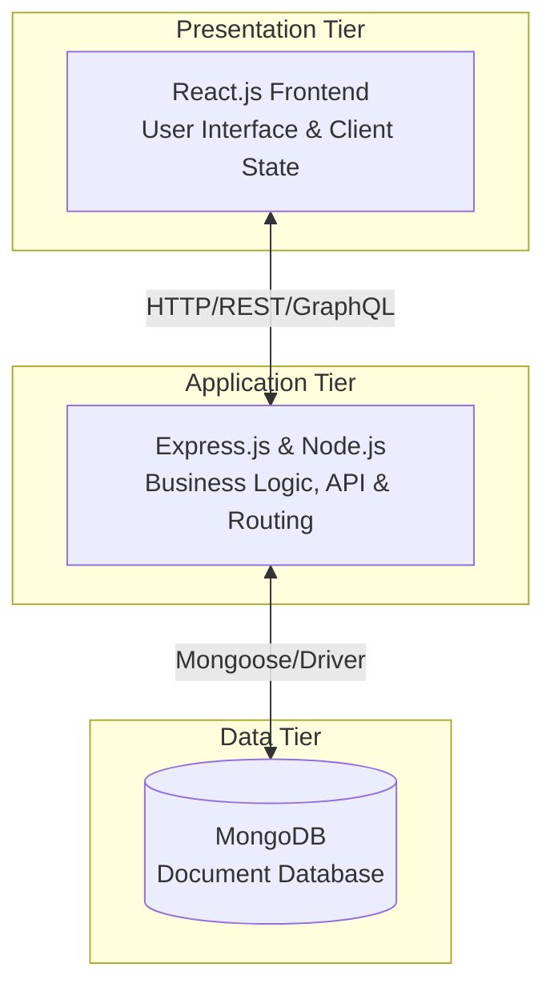
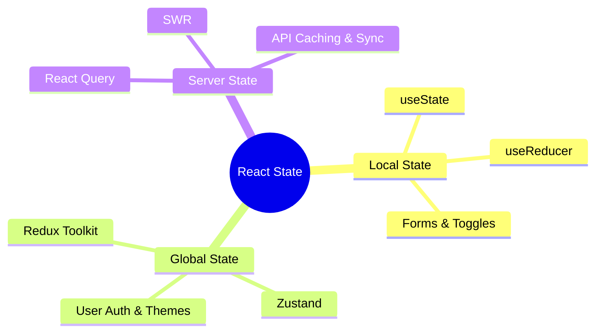
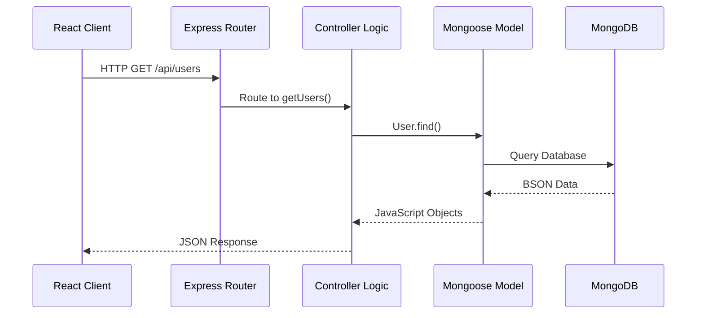
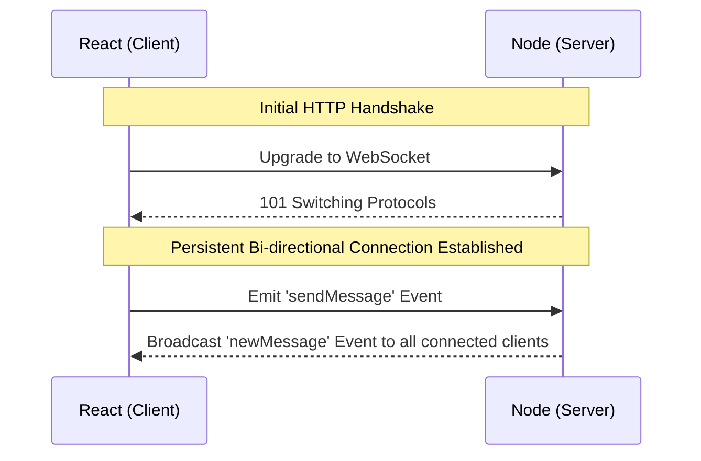
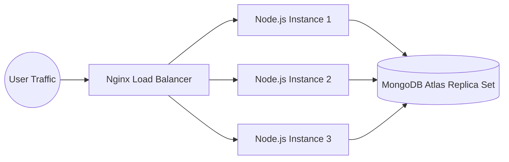
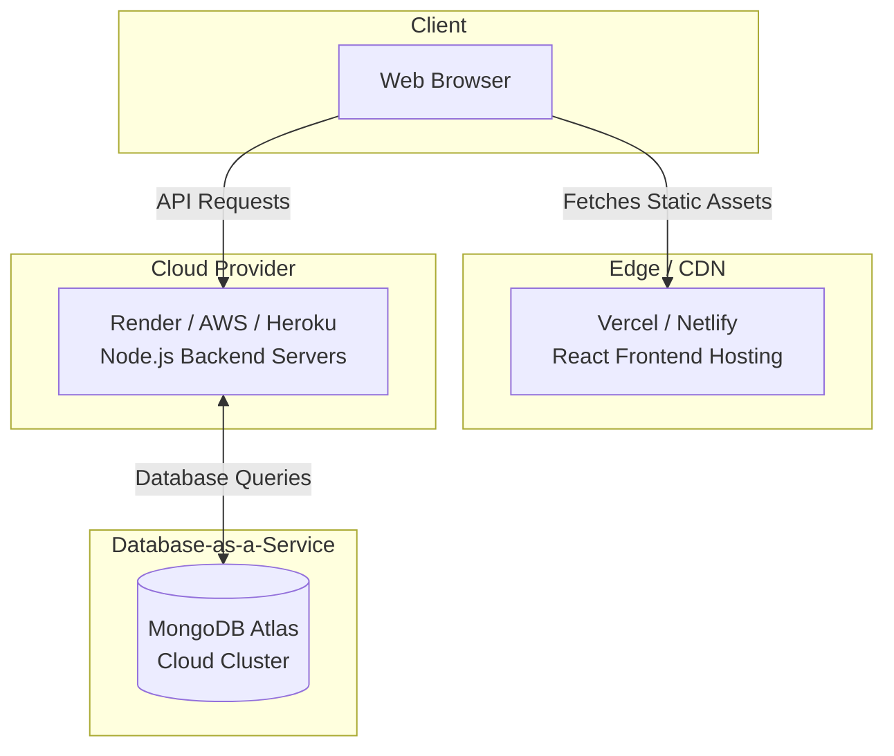

# Chapter: Web Architectures in the MERN Stack

## 1. Introduction to MERN Architecture

Welcome, future architects! The MERN stack (MongoDB, Express, React, and Node.js) represents a monumental shift toward unified, JavaScript-based web development. In this chapter, we will dissect how these four powerful technologies orchestrate together to form resilient, scalable, and modern web applications. 

### The Unified Language Advantage

Historically, a developer might have used PHP on the server, MySQL for the database, and HTML/CSS/JavaScript on the client. Context switching between these paradigms was mentally taxing. The MERN stack changes this paradigm completely. By adopting **JavaScript across the entire stack**, developers can seamlessly share logic between the client and server, dramatically reduce context switching, and leverage a single, massive package ecosystem (NPM). This uniformity translates to faster development cycles and easier maintenance.

---

## 2. The Core Architectural Model: 3-Tier Architecture

At its heart, the MERN stack is a quintessential example of the **3-tier architectural pattern**. This pattern logically and physically separates an application into three distinct computing tiers. As architects, we enforce this separation to ensure that each layer can scale, be maintained, and be updated independently.

- **Presentation Tier (Frontend):** Developed with **React.js**. This tier is strictly responsible for what the user sees and interacts with. It handles UI rendering, user input routing, and client-side state management.
- **Application Tier (Backend):** Developed with **Node.js** and **Express.js**. This is the "brain" of the operation. It processes incoming requests from the frontend, executes complex business logic, manages authentication, and determines how to interact with the database.
- **Data Tier (Database):** **MongoDB** serves as our robust, document-based database. It stores data in a JSON-like format called BSON. This is a critical advantage: the data format matches the native JavaScript objects used in both the backend and frontend, eliminating the "impedance mismatch" found in traditional relational databases.

---

## 3. Frontend Architecture Patterns

Modern React applications are not just a loose collection of components; they demand rigorous structural integrity. A poorly architected frontend quickly becomes an unmaintainable "prop-drilling" nightmare.

### Component-Based Design

To maintain sanity in large applications, we apply structured design methodologies:
- **Atomic Design:** We break UI down into Atoms (buttons, inputs), Molecules (search bars), Organisms (navigation bars), Templates, and Pages. This promotes ultimate reusability.
- **Container/Presenter Pattern:** Also known as Smart/Dumb components. We isolate data-fetching and complex logic into "Container" components, which then pass data down via props to purely visual "Presenter" components.

### State Management Strategy

Choosing the right state management tool is a critical architectural decision. We categorize state into three distinct types:

- **Local State:** Data specific to a single component (e.g., a dropdown toggle). We use `useState` and `useReducer`.
- **Global State:** Data required across widely separated parts of the app (e.g., User Authentication status, UI Themes). We implement **Redux Toolkit** or lightweight alternatives like **Zustand**.
- **Server State:** The most complex state—data fetched from the backend. Instead of putting this in Redux, modern architecture dictates using **TanStack Query (React Query)** to handle caching, background synchronization, and loading/error states out-of-the-box.

---

## 4. Backend Architecture & API Design

The backend serves as the secure bridge between the untrusted frontend and your sensitive database. 

### The MVC Pattern in Express

While Express itself is unopinionated, enterprise MERN applications demand structure. We heavily lean on a variation of the **Model-View-Controller (MVC)** pattern, specifically adapting it to Model-Controller-Route for API development:

- **Models:** Built with **Mongoose**, these define the rigid schemas, validation rules, and business logic for our data structures.
- **Controllers:** These files house the core application logic. They receive the validated request, interact with the Models, and formulate the correct response.
- **Routes:** Purely navigational. They define the API endpoints (e.g., `/api/products`) and map incoming HTTP methods directly to their corresponding Controllers.

### API Paradigms: REST vs. GraphQL
- **RESTful APIs:** The industry standard. We design predictable URL structures utilizing standard HTTP verbs (GET, POST, PUT, DELETE). 
- **GraphQL:** For advanced, data-heavy applications, GraphQL allows the React frontend to query exactly the data it needs—nothing more, nothing less—solving the over-fetching and under-fetching problems inherent to REST.

---

## 5. Communication & Data Flow

Understanding how data flows through the MERN stack is essential for debugging and optimization.

### JSON as the Universal Language

One of the most elegant features of MERN is the continuous flow of JSON. A document is pulled from MongoDB as BSON, instantly converted to a JavaScript Object in Node via Mongoose, sent across the network as a JSON string, and parsed back into a native JavaScript Object in React. This frictionless pipeline drastically reduces the need for complex data transformation layers.

### Real-Time Capabilities with WebSockets

Modern users expect live updates. While traditional HTTP is stateless and unidirectional (client requests, server responds), we augment our architecture for real-time needs.

By integrating **Socket.io**, we enable persistent, bi-directional, event-driven communication. This is non-negotiable for features like live notifications, chat applications, or collaborative dashboards.

---

## 6. Security and Scalability

A system is only as good as its ability to withstand attacks and handle traffic spikes.

### Security Architecture

- **Authentication via JWT:** We use JSON Web Tokens for stateless authentication. Upon login, the server signs a JWT and sends it to the client. The client stores it securely (preferably in HTTP-only cookies) and includes it in the header of subsequent API requests.
- **Middleware Protections:** We insert specialized Express middleware into our request pipeline:
  - `helmet`: Sets crucial security HTTP headers.
  - `cors`: Strictly controls which domains can access our API.
  - `express-rate-limit`: Prevents brute-force and DDoS attacks by capping requests per IP.

### Scalability Patterns

As our application grows, a single Node.js instance will become a bottleneck.

- **Horizontal Scaling:** We spin up multiple instances of our Express server and place them behind a Load Balancer (like Nginx or AWS ALB). The Load Balancer intelligently distributes incoming traffic across the instances.
- **Microservices:** For massive enterprise applications, we eventually break the backend monolith down into independent microservices (e.g., an Auth Service, a Billing Service) that communicate with each other over internal networks.

---

## 7. Deployment and DevOps

The final architectural consideration is how we reliably deliver our application to end-users.

### Containerization

"It works on my machine" is a phrase architects despise. We use **Docker** to containerize our application. By writing `Dockerfile`s, we package the Node app, its dependencies, and its runtime environment into an immutable image. This guarantees that the application runs identically on a developer's laptop, a CI/CD pipeline, and the production server.

### Cloud Infrastructure

Modern MERN deployments leverage managed cloud services to minimize dev-ops overhead:

- **Frontend Hosting:** Platforms like Vercel, Netlify, or AWS CloudFront/S3 are purpose-built for hosting static React builds globally on Edge CDNs for blazing-fast load times.
- **Backend Hosting:** Platform-as-a-Service (PaaS) providers like Render, Heroku, or AWS Elastic Beanstalk provide scalable environments for our Node.js processes without requiring us to manage raw Linux servers.
- **Database:** **MongoDB Atlas** offers a fully managed Database-as-a-Service. It automatically handles backups, replica sets for high availability, and auto-scaling, allowing us to focus entirely on application logic.