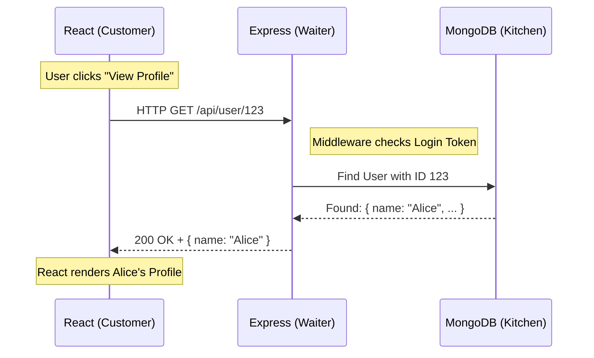

# HTTP: The Heartbeat of the Web: Understanding Request and Response

Welcome back! So far, we've looked at the big picture of how web applications are structured. But how do the different parts actually talk to each other? The answer is **HTTP**.

**HTTP** (HyperText Transfer Protocol) is the language of the web. It is the fundamental communication loop that allows your browser to ask for data and the server to send it back. Think of it as the "heartbeat" that keeps the internet alive.

---

## 1. The Restaurant Analogy: How the Web Works

To understand HTTP, let's step away from the computer for a second and imagine you are sitting in a busy Italian restaurant.

### The Customer (The Client)
You are the **Client**. You have a seat (your browser), and you want something—maybe a plate of pasta. However, you can't just walk into the kitchen and start cooking. You need a way to communicate your request.

### The Waiter (The API / Server)
The **Waiter** is the **Server** (or specifically, the **API**). They come to your table to take your order. They don't cook the food; their job is to take your request to the right place and bring back what you asked for.

### The Kitchen (The Database)
The **Kitchen** is the **Database**. This is where the actual resources (the ingredients and the final dish) live. The waiter takes your request to the kitchen, the chefs prepare the meal, and the waiter brings the finished plate back to you.

> [!TIP]
> **Pro-Tip:** In the MERN stack, your **React** app is the Customer, **Express** is the Waiter, and **MongoDB** is the Kitchen!

---

## 2. The 4-Phase Communication Loop

Every single thing you do online—from liking a post to logging into your email—follows this exact four-phase process.

### Phase 1: The Trigger
Everything starts with a user action. In a **React** application, this might be a user clicking a "Submit" button on a login form or a "Buy Now" button on a product page. This action triggers a piece of code that says, "Hey, we need to talk to the server!"

### Phase 2: The Request
The Client (browser) packages up a **Request**. This is like the slip of paper the waiter writes your order on. It contains four key pieces of information:
1.  **Method:** What do you want to do? (e.g., `GET` to fetch data, `POST` to send new data).
2.  **URL:** Where are you sending the request? (e.g., `https://api.example.com/search?q=query`). These must be properly **Encoded** to handle spaces and special characters.
3.  **Headers:** Extra information, like "I want my response in JSON format" (Content-Type) or "Here is my secret security token."
4.  **Body:** The actual data you are sending. This can be in several **Formats** depending on what you're sending (text, files, etc.).

### Phase 3: The Processing
The **Express** server receives the request. Before it does anything, it might pass the request through **Middleware**—think of this as the waiter checking if you're old enough to order wine or confirming you have a reservation. Once cleared, the server runs the "Business Logic" (the recipe) and talks to the Database if needed.

### Phase 4: The Response
Finally, the server sends back a **Response**. This includes a **Status Code** (to tell you if it worked) and a **Payload** (usually a piece of **JSON** data containing the information you asked for).

---

## 3. Deep Dive: URLs and Data Formats

As a developer, you need to know exactly how to "package" your data so the waiter can read it.

### URL Encoding (The "Secret Code" of URLs)
URLs can only contain a specific set of characters (like letters and numbers). If you want to include a space, a question mark, or an emoji in a URL, it must be **URL Encoded** (also called Percent-Encoding).

*   **Space** becomes `%20` or `+`.
*   **Special characters** like `&` or `=` are encoded so they don't break the URL structure.

**Example:**
*   Original: `search item = blue shirt`
*   Encoded: `search%20item%20%3D%20blue%20shirt`

### Common Request Data Formats
When you send data in the **Body** of a request, you must tell the server what "format" you are using via the `Content-Type` header.

#### 1. JSON (JavaScript Object Notation)
This is the "gold standard" for the MERN stack. It looks like a JavaScript object and is incredibly easy for both React and Express to read.
*   **Content-Type:** `application/json`
*   **Best for:** Sending structured data like user profiles or settings.

#### 2. Form Data (URL-Encoded)
This is the "old school" way that traditional HTML forms send data. It looks like a URL query string.
*   **Content-Type:** `application/x-www-form-urlencoded`
*   **Best for:** Simple text-based forms.

#### 3. Multipart / Form-Data (Files)
When you need to upload a **file** (like a profile picture or a PDF), JSON isn't enough. You use **Multipart** data, which allows you to send "chunks" of different types of data in one go.
*   **Content-Type:** `multipart/form-data`
*   **Best for:** Uploading images, videos, and documents.

> [!TIP]
> **Pro-Tip:** In Express, you'll use different "body-parser" middlewares to handle these different formats. For example, `express.json()` for JSON and `multer` for files!

---

## 4. Visualizing the Flow

Here is how that loop looks in a real MERN application:

---

## 5. Try This: Peek Under the Hood

You don't have to take my word for it—you can see HTTP in action right now!

1.  Open any website (like Google or GitHub).
2.  **Right-click** anywhere and select **Inspect** (or press `F12`).
3.  Click on the **Network** tab at the top of the panel.
4.  **Refresh the page.**
5.  Watch the list fill up! Each line is a real **HTTP Request**. Click on one to see the **Headers**, the **Preview** of the data, and the **Status Code**.

---

## 6. Common Pitfalls: Understanding Status Codes

Servers use three-digit numbers to tell the Client what happened. Think of these as the waiter's quick responses:

### The "Good" Codes (2xx)
*   **200 OK:** Everything went perfectly! Here is your pasta.
*   **201 Created:** Success! We just finished making that new account for you.

### The "Client Error" Codes (4xx)
These mean the browser (the Customer) made a mistake.
*   **400 Bad Request:** You asked for something the server doesn't understand (like ordering a taco at an Italian restaurant).
*   **401 Unauthorized:** You haven't "logged in" or given the waiter your ID.
*   **404 Not Found:** This is the most famous error. It means the URL you asked for doesn't exist. You're asking for a table that isn't there!

### The "Server Error" Codes (5xx)
These mean the server (the Kitchen) messed up.
*   **500 Internal Server Error:** Something went wrong in the kitchen (maybe the stove caught fire!). It’s not your fault, but you can't get your data right now.

> [!IMPORTANT]
> **Pro-Tip:** If you see a **400-level** error, check your frontend code. If you see a **500-level** error, check your backend logs!
