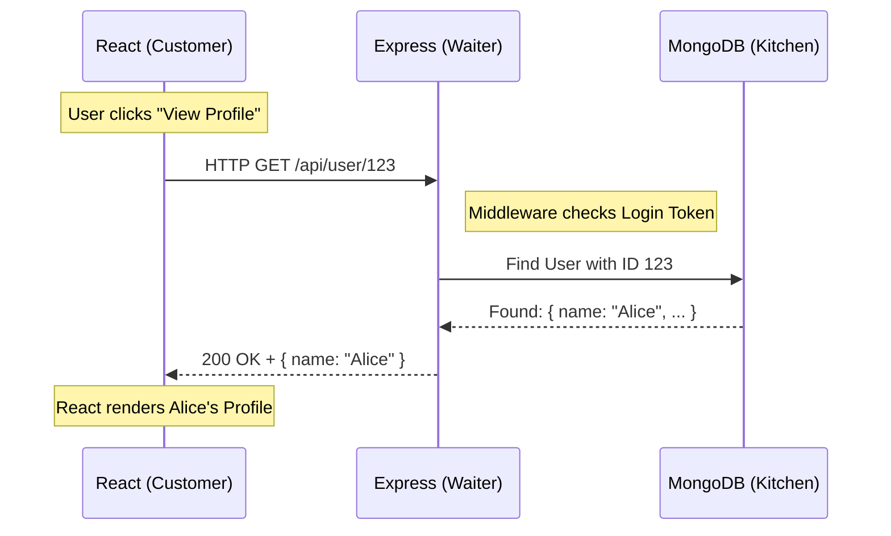

# HTTP: The Heartbeat of the Web: Understanding Request and Response

Welcome back! So far, we've looked at the big picture of how web applications are structured. But how do the different parts actually talk to each other? The answer is **HTTP**.

**HTTP** (HyperText Transfer Protocol) is the language of the web. It is the fundamental communication loop that allows your browser to ask for data and the server to send it back. Think of it as the "heartbeat" that keeps the internet alive.

---

## 1. HTTP vs. HTTPS: The "S" stands for Secure

Before we dive into how the communication works, you’ve probably noticed that some web addresses start with `http://` and others with `https://`. 

**HTTP** is the basic protocol. The problem is that data sent over plain HTTP is "in the clear." This means that if you're on a public Wi-Fi at a coffee shop, someone else on that network could potentially "eavesdrop" and see your password or credit card info as it travels to the server.

**HTTPS** (HyperText Transfer Protocol Secure) solves this by using **Encryption** (via SSL/TLS).
- **Encryption:** It scrambles the data into a secret code that only the Client and Server can read. Even if someone intercepts it, they’ll just see a jumble of nonsense characters.
- **Trust:** It uses "Certificates" to prove that the website you're visiting is actually who they say they are.
- **Ports:** While HTTP usually uses Port **80**, HTTPS uses Port **443**.

> [!IMPORTANT]
> **Pro-Tip:** In modern web development, **HTTPS is no longer optional**. Browsers like Chrome will mark your site as "Not Secure" if you don't use it, and many modern APIs will simply refuse to work over plain HTTP!

---

## 2. The Restaurant Analogy: How the Web Works

To understand HTTP, let's step away from the computer for a second and imagine you are sitting in a busy Italian restaurant.

### The Customer (The Client)
You are the **Client**. You have a seat (your browser), and you want something—maybe a plate of pasta. However, you can't just walk into the kitchen and start cooking. You need a way to communicate your request.

### The Waiter (The API / Server)
The **Waiter** is the **Server** (or specifically, the **API**). They come to your table to take your order. They don't cook the food; their job is to take your request to the right place and bring back what you asked for.

### The Kitchen (The Database)
The **Kitchen** is the **Database**. This is where the actual resources (the ingredients and the final dish) live. The waiter takes your request to the kitchen, the chefs prepare the meal, and the waiter brings the finished plate back to you.

> [!TIP]
> **Pro-Tip:** In the MERN stack, your **React** app is the Customer, **Express** is the Waiter, and **MongoDB** is the Kitchen!

---

## 3. The 4-Phase Communication Loop

Every single thing you do online—from liking a post to logging into your email—follows this exact four-phase process.

### Phase 1: The Trigger
Everything starts with a user action. In a **React** application, this might be a user clicking a "Submit" button on a login form or a "Buy Now" button on a product page. This action triggers a piece of code that says, "Hey, we need to talk to the server!"

### Phase 2: The Request
The Client (browser) packages up a **Request**. This is like the slip of paper the waiter writes your order on. It contains four key pieces of information:
1.  **Method:** What do you want to do? (e.g., `GET` to fetch data, `POST` to send new data).
2.  **URL:** Where are you sending the request? (e.g., `https://api.example.com/search?q=query`). These must be properly **Encoded** to handle spaces and special characters.
3.  **Headers:** Extra information, like "I want my response in JSON format" (Content-Type) or "Here is my secret security token."
4.  **Body:** The actual data you are sending. This can be in several **Formats** depending on what you're sending (text, files, etc.).

### Phase 3: The Processing
The **Express** server receives the request. Before it does anything, it might pass the request through **Middleware**—think of this as the waiter checking if you're old enough to order wine or confirming you have a reservation. Once cleared, the server runs the "Business Logic" (the recipe) and talks to the Database if needed.

### Phase 4: The Response
Finally, the server sends back a **Response**. This is the waiter bringing the plate back to your table. It contains:
1.  **Status Code:** A three-digit number telling you if the request succeeded or failed (e.g., `200 OK`).
2.  **Headers:** Metadata about the response (e.g., `Content-Type: application/json`).
3.  **Payload (Body):** The actual data you requested (usually a **JSON** object) or an error message.

---

## 4. Deep Dive: URLs, Headers, and Data Formats

As a developer, you need to know exactly how to "package" your data so the waiter can read it.

### URL Encoding (The "Secret Code" of URLs)
URLs can only contain a specific set of characters (like letters and numbers). If you want to include a space, a question mark, or an emoji in a URL, it must be **URL Encoded** (also called Percent-Encoding).

*   **Space** becomes `%20` or `+`.
*   **Special characters** like `&` or `=` are encoded so they don't break the URL structure.

**Example:**
*   Original: `search item = blue shirt`
*   Encoded: `search%20item%20%3D%20blue%20shirt`

### HTTP Headers: The Metadata
Headers are key-value pairs sent with both requests and responses. They provide **metadata**—information *about* the request or response that isn't the main data itself.

#### Common Request Headers:
- **`Content-Type`**: Tells the server the format of the data in the body (e.g., `application/json`).
- **`Authorization`**: Carries credentials (like a JWT token) to prove who you are.
- **`Accept`**: Tells the server what formats the client can handle (e.g., `application/json`, `text/html`).
- **`User-Agent`**: Identifies the browser or device making the request.

#### Common Response Headers:
- **`Content-Type`**: Tells the client what the server is sending back.
- **`Set-Cookie`**: Instructions from the server to the browser to store a cookie.
- **`Cache-Control`**: Tells the browser how long to keep a local copy of the response.

### Anatomy of the Request Body: Format Examples
When you send data in the **Body**, it is literally "embedded" after the headers. Here is what that look like in different formats:

#### 1. JSON (JavaScript Object Notation)
The most common format for APIs. It is a string that represents a JavaScript object.
- **Content-Type:** `application/json`
- **Raw Body Example:**
```json
{
  "username": "alice",
  "password": "secretpassword123"
}
```

#### 2. Form Data (URL-Encoded)
The default format for HTML forms. It looks exactly like a URL query string.
- **Content-Type:** `application/x-www-form-urlencoded`
- **Raw Body Example:**
```text
username=alice&password=secretpassword123
```

#### 3. Multipart / Form-Data (Files & Fields)
Used when sending files or a mix of files and text. It uses a "boundary" string to separate different parts of the data.
- **Content-Type:** `multipart/form-data; boundary=----WebKitFormBoundary7MA4YWxkTrZu0gW`
- **Raw Body Example:**
```text
------WebKitFormBoundary7MA4YWxkTrZu0gW
Content-Disposition: form-data; name="username"

alice
------WebKitFormBoundary7MA4YWxkTrZu0gW
Content-Disposition: form-data; name="profilePic"; filename="alice.jpg"
Content-Type: image/jpeg

[BINARY DATA OF THE IMAGE]
------WebKitFormBoundary7MA4YWxkTrZu0gW--
```

> [!TIP]
> **Pro-Tip:** In Express, you'll use different "body-parser" middlewares to handle these different formats. For example, `app.use(express.json())` parses JSON, and libraries like `multer` are used for `multipart/form-data`!

---

## 5. Visualizing the Flow

Here is how that loop looks in a real MERN application:



---

## 6. Try This: Peek Under the Hood

You don't have to take my word for it—you can see HTTP in action right now!

1.  Open any website (like Google or GitHub).
2.  **Right-click** anywhere and select **Inspect** (or press `F12`).
3.  Click on the **Network** tab at the top of the panel.
4.  **Refresh the page.**
5.  Watch the list fill up! Each line is a real **HTTP Request**. Click on one to see the **Headers**, the **Preview** of the data, and the **Status Code**.

---

## 7. Common Pitfalls: Understanding Status Codes

Servers use three-digit numbers to tell the Client what happened. Think of these as the waiter's quick responses:

### Common Status Codes Reference

| Category | Code | Name | Meaning |
| :--- | :--- | :--- | :--- |
| **1xx: Informational** | 101 | Switching Protocols | Used when upgrading to WebSockets. |
| **2xx: Success** | 200 | OK | The request was successful and data was returned. |
| | 201 | Created | A new resource (like a user) was successfully created. |
| | 204 | No Content | Success, but there is no data to send back (common for DELETE). |
| **3xx: Redirection** | 301 | Moved Permanently | The resource has a new permanent URL. |
| | 302 | Found | The resource is temporarily at a different URL. |
| | 304 | Not Modified | Use the cached version; nothing has changed. |
| **4xx: Client Error** | 400 | Bad Request | The server couldn't understand the request (syntax error). |
| | 401 | Unauthorized | You need to log in to access this. |
| | 403 | Forbidden | You are logged in, but you don't have permission for this. |
| | 404 | Not Found | The requested URL does not exist. |
| | 405 | Method Not Allowed | You tried the wrong method (e.g., POSTing to a GET-only route). |
| | 429 | Too Many Requests | You've been rate-limited (Slow down!). |
| **5xx: Server Error** | 500 | Internal Server Error | The server crashed or encountered an unexpected error. |
| | 502 | Bad Gateway | One server got an invalid response from another (proxy issue). |
| | 503 | Service Unavailable | The server is overloaded or down for maintenance. |
| | 504 | Gateway Timeout | The server took too long to respond. |

> [!IMPORTANT]
> **Pro-Tip:** If you see a **400-level** error, check your frontend code. If you see a **500-level** error, check your backend logs!
