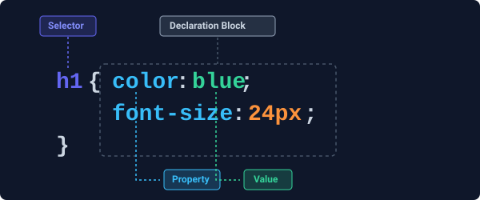

# Introduction to CSS

**Cascading Style Sheets (CSS)** is the standard language used to control the visual presentation of web pages. While **HTML** serves as the structural framework (the bones), **CSS** acts as the skin, clothing, and styling, defining how those structural elements are formatted, positioned, and rendered across different devices and screen sizes.

Separating content (HTML) from presentation (CSS) is one of the foundational design paradigms of web development.

---

## The Role of CSS

Modern CSS provides several key benefits to web developers:

1. **Separation of Concerns**: Keeping structure and styling distinct makes your code cleaner, more readable, and easier to debug.
2. **Design Consistency**: By styling elements globally or using reusable classes, you ensure a uniform look and feel across your entire website.
3. **Efficiency and Scalability**: Changes made to a single external stylesheet instantly propagate to all HTML pages linking to it, saving massive amounts of developer effort.
4. **Bandwidth Optimization**: Browsers cache external CSS files after the first page load, reducing page load times and bandwidth consumption on subsequent requests.
5. **Adaptive and Responsive Layouts**: CSS powers fluid layouts that adapt dynamically to smartphones, tablets, laptops, and ultra-wide desktops.

---

## Core CSS Syntax

CSS is a rule-based language. You define rules that specify styling groups for particular HTML elements.

A complete set of CSS styling rules is known as a **Rule Set**. Here is its structure:

 *(Placeholder illustration description: A diagram showing a selector pointing to h1, and a declaration block enclosing declarations of property: value).*

```css
selector {
    property: value;
    property: value;
}
```

### Breakdown of Components

- **Selector**: The pattern pointing to the HTML element(s) you wish to style (e.g., `h1`, `.button`, `#main-heading`).
- **Declaration Block**: The area wrapped inside curly braces `{ ... }` containing one or more semicolon-separated declarations.
- **Declaration**: A single styling rule combining a property and a value, separated by a colon (e.g., `color: blue;`).
- **Property**: The specific aesthetic quality you want to change (e.g., `background-color`, `font-size`, `margin`, `border`).
- **Value**: The configuration setting applied to the property (e.g., `#ffffff`, `16px`, `10px auto`, `1px solid black`).

### Syntax Example

```css
/* Rule set targeting all h1 elements */
h1 {
    color: #4f46e5;          /* Changes text color to indigo */
    font-size: 32px;         /* Sets font size to 32 pixels */
    text-align: center;      /* Centers the text horizontally */
}
```

---

## How to Include CSS in HTML

There are three standard methods for applying CSS to an HTML document:

### 1. Inline Styles

Inline styles are written directly within the HTML element using the global `style` attribute.

```html
<p style="color: red; font-weight: bold;">This is an inline-styled paragraph.</p>
```

- **Pros**: Useful for quick testing, single-use styling tweaks, or dynamically setting values via JavaScript.
- **Cons**: High maintenance, bypasses the "cascading" nature of CSS, bloats HTML markup, and makes global updates extremely difficult.
- **Use Case**: Avoid in production websites, except for highly dynamic values generated by JS.

---

### 2. Internal Styles (Embedded CSS)

Internal styles are defined within a `<style>` element placed inside the `<head>` section of a single HTML document.

```html
<!DOCTYPE html>
<html lang="en">
<head>
    <meta charset="UTF-8">
    <title>Internal CSS Example</title>
    <style>
        body {
            background-color: #f3f4f6;
            font-family: Arial, sans-serif;
        }
        .highlight {
            color: #d97706;
            font-weight: bold;
        }
    </style>
</head>
<body>
    <p>This page uses <span class="highlight">internal styling</span>.</p>
</body>
</html>
```

- **Pros**: Excellent for single-page sites, email newsletters, or quickly experimenting with layout designs.
- **Cons**: Styles cannot be shared across multiple HTML files, increasing duplication.
- **Use Case**: Best restricted to standalone pages or rapid prototyping.

---

### 3. External Stylesheets

External styles are authored in a standalone `.css` file (e.g., `styles.css`) and linked to the HTML page using the `<link>` tag in the `<head>` block. This is the **industry standard** for production web development.

#### The HTML File (`index.html`)
```html
<!DOCTYPE html>
<html lang="en">
<head>
    <meta charset="UTF-8">
    <meta name="viewport" content="width=device-width, initial-scale=1.0">
    <title>External CSS Example</title>
    <!-- Link to the external stylesheet -->
    <link rel="stylesheet" href="styles.css">
</head>
<body>
    <main class="card">
        <h2>Modern Web Styling</h2>
        <p>This layout is clean, organized, and scalable.</p>
    </main>
</body>
</html>
```

#### The CSS File (`styles.css`)
```css
/* Global body styling */
body {
    background-color: #f9fafb;
    color: #1f2937;
    font-family: 'Segoe UI', Tahoma, Geneva, Verdana, sans-serif;
    margin: 0;
    padding: 40px;
}

/* Card container styling */
.card {
    background-color: #ffffff;
    border: 1px solid #e5e7eb;
    border-radius: 8px;
    box-shadow: 0 4px 6px -1px rgba(0, 0, 0, 0.1);
    max-width: 400px;
    margin: 0 auto;
    padding: 24px;
}

.card h2 {
    color: #2563eb;
    margin-top: 0;
}
```

- **Pros**: Maximizes separation of concerns, enables browser caching, styles multiple pages simultaneously, and simplifies responsive styling.
- **Cons**: Requires an extra HTTP request (mitigated by modern HTTP/2 protocol or bundling).
- **Use Case**: **Always use this method** for standard web project architectures.

---

## Comparison Summary

| Inclusion Method | Best For | Maintainability | Performance (Caching) |
| :--- | :--- | :--- | :--- |
| **Inline Styles** | Quick debugging, JS overlays | Extremely Low | None |
| **Internal CSS** | Standalone landing pages, HTML Emails | Medium | None |
| **External CSS** | Multi-page sites, Production apps | **Extremely High** | **Excellent (Cached)** |

---

## Practice Exercise

1. Create an `index.html` file and an accompanying `styles.css` file.
2. In your HTML, create a main container with a heading, an image, and a call-to-action button.
3. Link `styles.css` to your HTML.
4. Add styling to your stylesheet to give the page a dark background (`#111827`), a high-contrast text color, and style the button with a hover transition effect.
