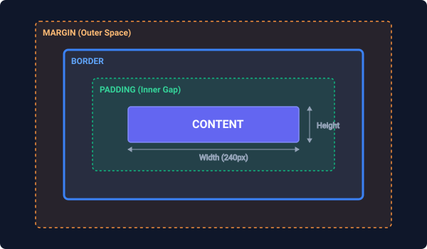

# The CSS Box Model

In CSS, **every HTML element is represented as a rectangular box**. The layout engine stacks and flows these boxes on top of or next to one another. Understanding how the size, spacing, and boundaries of these boxes are computed—known as the **CSS Box Model**—is one of the most critical requirements for building accurate, reliable web layouts.

---

## 1. The Four Layers of the Box Model

An element's box consists of four concentric layers, starting from the inside and working out:

 *(Placeholder description: A diagram showing a box with Content inside, surrounded by Padding, then Border, then Margin).*

### A. Content
The core area where the actual text, images, or child HTML elements reside. Its dimensions are controlled by the `width` and `height` properties.

### B. Padding
The transparent space immediately surrounding the content. Padding sits **inside** the element's border. Applying a `background-color` to the element will color this padding area.
- Properties: `padding-top`, `padding-right`, `padding-bottom`, `padding-left`.
- Shorthand: `padding: [top] [right] [bottom] [left];` (TRBL - "Trouble", top-right-bottom-left clockwise).

```css
padding: 10px;                  /* 10px on all 4 sides */
padding: 10px 20px;             /* 10px top/bottom, 20px left/right */
padding: 10px 15px 20px;        /* 10px top, 15px left/right, 20px bottom */
padding: 10px 15px 20px 25px;   /* 10px top, 15px right, 20px bottom, 25px left */
```

### C. Border
A line wrapped around the padding and content. You can style the border's width, color, and line style.
- Properties: `border-width`, `border-style`, `border-color`.
- Shorthand: `border: [width] [style] [color];` (e.g., `border: 2px solid #3b82f6;`).

### D. Margin
The outer transparent spacing that pushes adjacent boxes away from this element. Margins sit **outside** the border. Margins are completely transparent and do not show background colors or images of the element.
- Properties: `margin-top`, `margin-right`, `margin-bottom`, `margin-left`.
- Shorthand: Same multi-value rules as `padding` (TRBL).

---

## 2. Box Sizing: `content-box` vs `border-box`

How a browser calculates the total layout footprint of an element depends on the `box-sizing` property.

### A. Default: `content-box`
By default, the browser applies `box-sizing: content-box`. When you set the `width` and `height` properties, you are styling **only the Content area**. Any padding or borders you add are tacked on **outside** this width, making the element physically larger on screen than the set width.

#### The Mathematical Formula:
$$\text{Total Physical Width} = \text{width} + \text{padding-left} + \text{padding-right} + \text{border-left-width} + \text{border-right-width}$$

#### Concrete Example:
```css
.card-content-box {
    box-sizing: content-box;
    width: 300px;
    padding: 20px;
    border: 5px solid black;
    margin: 15px;
}
```
- **Content Area**: 300px wide.
- **Physical Layout Width on Screen**: $300 + 20 (\text{left}) + 20 (\text{right}) + 5 (\text{left}) + 5 (\text{right}) = \mathbf{350\text{px}}$.
- **Total Spacing Footprint (with margins)**: $350 + 15 (\text{left margin}) + 15 (\text{right margin}) = \mathbf{380\text{px}}$.

This default behavior is highly counter-intuitive and frequently leads to layouts breaking or overflowing their parent containers when padding is added.

---

### B. Modern Solution: `border-box`
When you set `box-sizing: border-box`, the `width` and `height` properties set the **entire physical boundary of the box** (Content + Padding + Border combined). Padding and borders do not make the element wider; instead, they compress the content area inward.

#### The Mathematical Formula:
$$\text{Total Physical Width} = \text{width} \quad (\text{Padding and border are absorbed inside})$$
$$\text{Inner Content Width} = \text{width} - (\text{padding-left} + \text{padding-right} + \text{border-left-width} + \text{border-right-width})$$

#### Concrete Example:
```css
.card-border-box {
    box-sizing: border-box;
    width: 300px;
    padding: 20px;
    border: 5px solid black;
    margin: 15px;
}
```
- **Physical Layout Width on Screen**: $\mathbf{300\text{px}}$ exactly!
- **Inner Content Width**: $300 - 20 (\text{left padding}) - 20 (\text{right padding}) - 5 (\text{left border}) - 5 (\text{right border}) = \mathbf{250\text{px}}$.
- **Total Spacing Footprint (with margins)**: $300 + 15 (\text{left margin}) + 15 (\text{right margin}) = \mathbf{330\text{px}}$.

---

### Universal `border-box` Reset
Because `border-box` makes layout math incredibly straightforward, it is a universal best practice in modern web development to reset all elements to `border-box`:

```css
*, *::before, *::after {
    box-sizing: border-box;
}
```

This simple reset ensures that adding borders or padding to any element on your site will never break your responsive grid widths.

---

## 3. Margin Collapsing

A unique behavior of the CSS Box Model is **vertical margin collapsing**. 

When two block-level elements are stacked directly on top of each other, their vertical margins do not add up. Instead, their touching margins collapse into a single vertical margin. The collapsed margin size is equal to **the largest of the two touching margins**.

### Concrete Example:
```html
<p class="first">Paragraph One</p>
<p class="second">Paragraph Two</p>
```

```css
.first {
    margin-bottom: 30px;
}
.second {
    margin-top: 20px;
}
```

- Instead of a total gap of 50px ($30\text{px} + 20\text{px}$) between the paragraphs, the actual physical gap between them is **30px** (the larger of 30px and 20px).

### Important Rules of Margin Collapsing:
1. **Vertical only**: Collapsing only happens between top and bottom margins. Horizontal margins (left and right) **never** collapse.
2. **Block elements only**: Collapsing only affects block-level elements. Flex items, grid items, and inline-block elements do not collapse margins.
3. **Parent/Child Collapsing**: An empty parent element's top/bottom margins can collapse with its first or last child's margins if there is no padding or border in between them to keep them apart.

### How to Prevent Margin Collapsing:
If you need to ensure margins do not collapse, you can:
- Add a tiny padding (e.g., `padding-top: 0.1px;`) or a transparent border to the parent element.
- Set the container to `overflow: hidden;` or `display: flow-root;`.
- Use CSS Flexbox or CSS Grid for layouts instead of standard block stacking.

---

## Practice Exercise

1. Create a `<div>` element with a class `.box`.
2. Apply the following styles using **both** `content-box` and `border-box` models:
   - `width: 250px;`
   - `padding: 24px;`
   - `border: 8px solid #4f46e5;`
   - `margin: 20px;`
3. Draw or calculate the physical width of the element and the total spacing footprint on the parent container under both models.
