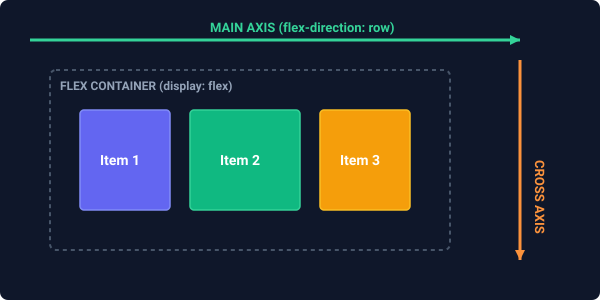

# Flexbox Layout

**CSS Flexible Box Layout (Flexbox)** is a robust, one-dimensional layout model designed for laying out elements in either a single row or a single column. Flexbox excels at distributing space within a container, aligning items dynamically, and handling sizing changes fluidly, even when the dimensions of the items are unknown or dynamic.

---

## 1. Core Concepts: The Two Axes

Before styling elements with Flexbox, you must understand its coordinate space. Flexbox operates on a system of two axes:

 *(Placeholder description: A diagram showing the Flex Container, Flex Items, the horizontal Main Axis running from left to right, and the vertical Cross Axis running from top to bottom).*

- **Main Axis**: The primary axis along which flex items are laid out. By default, it runs horizontally from left to right.
- **Cross Axis**: The axis perpendicular to the main axis. By default, it runs vertically from top to bottom.

The starting and ending points of these axes are called **Main Start/End** and **Cross Start/End**.

---

## 2. Flex Container Properties

To turn an element into a flexbox container, apply `display: flex` or `display: inline-flex`. The container's immediate children instantly become **flex items**.

### A. `flex-direction`
Defines the main axis direction and how items are stacked inside the container.
- `row` (default): Horizontal, left to right.
- `row-reverse`: Horizontal, right to left.
- `column`: Vertical, top to bottom.
- `column-reverse`: Vertical, bottom to top.

### B. `flex-wrap`
Governs whether flex items are forced onto a single line or allowed to wrap onto multiple lines.
- `nowrap` (default): All items are squeezed onto a single line, even if it causes horizontal overflow.
- `wrap`: Items wrap onto multiple rows if they run out of space.
- `wrap-reverse`: Items wrap vertically from bottom to top.

### C. `justify-content`
Defines how flex items are aligned along the **Main Axis** (horizontally, by default).

```css
justify-content: flex-start;      /* Items align to start of container (default) */
justify-content: flex-end;        /* Items align to end of container */
justify-content: center;          /* Items are centered together */
justify-content: space-between;   /* First item at start, last at end, remaining space distributed evenly between */
justify-content: space-around;    /* Items have equal space on all sides (spacing at edges is half the inner spacing) */
justify-content: space-evenly;    /* All gaps between items (and edges) are exactly equal */
```

### D. `align-items`
Defines how flex items align along the **Cross Axis** (vertically, by default) on a **single line**.

```css
align-items: stretch;     /* Items stretch to fill parent height (default - if height is not set) */
align-items: flex-start;  /* Items align to the top of cross axis */
align-items: flex-end;    /* Items align to the bottom of cross axis */
align-items: center;      /* Items are vertically centered */
align-items: baseline;    /* Items align their text baselines */
```

### E. `align-content`
Defines alignment of **multiple rows** along the cross axis when `flex-wrap: wrap` is enabled and there is extra vertical space. *(Note: This has no effect on a single-line flex container).*
- Values include: `stretch`, `flex-start`, `flex-end`, `center`, `space-between`, `space-around`.

### F. `gap`
Specifies the physical spacing between adjacent rows and columns of flex items, without needing manual margins.
- Syntax: `gap: [row-gap] [column-gap];` (e.g., `gap: 20px 10px;` or `gap: 15px;` for all gaps).

---

## 3. Flex Item Properties

Flex items can be styled individually to alter their proportions and arrangement.

### A. `flex-grow`
Specifies an item's ability to grow if there is remaining space in the container. It takes a unitless ratio.
- `0` (default): The item does not grow.
- `1`: The item will grow to absorb a fair share of empty space. If all items are `1`, space is distributed equally. An item styled with `flex-grow: 2` will grow twice as much as a `1` sibling.

### B. `flex-shrink`
Specifies an item's ability to shrink when the container is too narrow to hold all items at their default size.
- `1` (default): The item will shrink equally to avoid overflow.
- `0`: The item will **never shrink**, keeping its physical width even if it breaks layouts.

### C. `flex-basis`
Defines the default initial size of an element before empty space is distributed or shrinking begins.
- Default: `auto` (size defaults to the item's `width` or content size).
- Values: Absolute sizes like `200px`, `50%`, or `10rem`.

### D. Shorthand: `flex`
It is highly recommended to use the `flex` shorthand property rather than writing individual grow, shrink, and basis rules.

```css
/* Shorthand: flex: [grow] [shrink] [basis]; */
flex: 0 1 auto; /* Default: don't grow, shrink, auto size */
flex: 1 1 auto; /* Grow/shrink dynamically (highly flexible) */
flex: 0 0 250px;/* Fixed layout: never grow, never shrink, exactly 250px wide */
flex: 1;        /* Equivalent to: flex: 1 1 0px; (absorbs all available space) */
```

### E. `align-self`
Allows an individual flex item to override the container's global `align-items` alignment.
- Values: `auto` (inherits `align-items`), `flex-start`, `flex-end`, `center`, `baseline`, `stretch`.

### F. `order`
Alters the visual order in which items are rendered inside the container, without changing the HTML markup.
- Default: `0`. Items with lower values stack first (e.g. `order: -1`).

---

## 4. Modern UI Flexbox Layout Patterns

### Pattern A: Absolute Centering
The easiest, most robust way to center any content vertically and horizontally inside a container.

```css
.center-container {
    display: flex;
    justify-content: center; /* Center horizontally */
    align-items: center;     /* Center vertically */
    height: 100vh;           /* Take full screen height */
}
```

---

### Pattern B: Split Navigation Bar
A common header pattern with a brand logo on the left and navigation links aligned to the far right.

```css
.navbar {
    display: flex;
    align-items: center;
    background-color: #0f172a;
    padding: 15px 30px;
}

.nav-links {
    display: flex;
    gap: 20px;
    margin-left: auto; /* Pushes the entire list to the far right */
    list-style: none;
}
```

---

### Pattern C: Dynamic Card Grid (Flex-wrap)
A layout that creates a fluid grid of responsive cards that automatically wraps to new rows as viewport space shrinks.

```css
.card-container {
    display: flex;
    flex-wrap: wrap; /* Allows wrapping */
    gap: 24px;       /* Margin-free padding between cards */
}

.card {
    flex: 1 1 300px; /* Highly responsive: grow/shrink with an initial base width of 300px */
    background: white;
    border: 1px solid #e2e8f0;
    border-radius: 8px;
    padding: 20px;
}
```

---

### Pattern D: Sticky Footer
Ensures the footer of your website always sticks to the very bottom of the browser viewport, even on pages with little to no content.

#### The HTML Structure
```html
<body class="sticky-layout">
    <header>Site Header</header>
    <main class="content-body">Main Content Area</main>
    <footer>Site Footer</footer>
</body>
```

#### The CSS Stylesheet
```css
.sticky-layout {
    display: flex;
    flex-direction: column; /* Stack components vertically */
    min-height: 100vh;      /* Force full viewport height */
    margin: 0;
}

.content-body {
    flex: 1; /* Absorbs all remaining vertical space, pushing the footer down */
}
```

---

## Practice Exercise

1. Create a container with 3 boxes labeled "Box A", "Box B", and "Box C".
2. Set the container to `display: flex;` and center the items vertically and horizontally.
3. Add a gap of `20px` between them.
4. Set Box B to have `flex-grow: 2` and Box A & C to `flex-grow: 1`. Verify that Box B expands to take up twice the shared remaining space.
5. Set Box C to `order: -1` and verify that Box C shifts visually to the first position.
