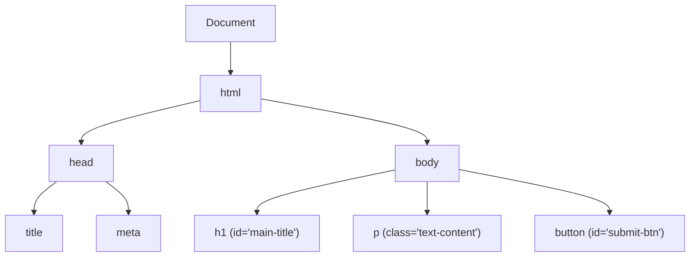

# DOM Manipulation: Controlling Web Pages

Welcome to the DOM! Have you ever wondered how JavaScript actually changes what you see on a web page? The answer is the DOM.

"DOM" stands for **Document Object Model**. Think of it as a bridge between your HTML code and JavaScript. When your browser loads an HTML file, it builds a tree-like structure of all the elements (headings, paragraphs, buttons) inside the browser's memory. JavaScript can reach into this tree, pick out an element, and change it!

Here is what the DOM tree looks like when your browser parses a basic HTML page:



## Selecting Elements (Finding things on the page)

Before you can change an element, you have to find it. JavaScript gives us several different tools ("Selectors") to find elements based on how they are written in HTML.

### Selecting by ID
This is the most common and fastest way to find a single, specific element.
**HTML:** `<h1 id="main-title">Welcome!</h1>`
```javascript
// Grab the element with the ID of "main-title"
const titleElement = document.getElementById("main-title");

// Let's print it to the console to make sure we got it
console.log(titleElement);
```

### Selecting by Class Name
Use this when you want to find *multiple* elements that share the same class. It returns a list of elements.
**HTML:** `<p class="alert-message">Error!</p>`
```javascript
// Grabs ALL elements with the class "alert-message"
const alerts = document.getElementsByClassName("alert-message");

// You have to specify WHICH one you want, like an array
console.log(alerts[0]); // Gets the first alert
```

### Selecting with Query Selector (The Modern Way)
This is the most versatile selector. You use the exact same syntax you would use in CSS!
```javascript
// Select by ID (uses # symbol just like CSS)
const heroBtn = document.querySelector("#hero-button");

// Select by Class (uses . symbol just like CSS)
// NOTE: querySelector only grabs the FIRST matched element!
const firstParagraph = document.querySelector(".text-content");

// Grab ALL matched elements
const allParagraphs = document.querySelectorAll(".text-content");
```

---

## Modifying Elements (Changing things)

Now that we have selected an element, what can we do with it? We can change its text, its HTML, and even its CSS styles!

### Changing Text and HTML
```javascript
const myHeader = document.querySelector("h1");

// 1. Changing plain text (Safe and easy)
myHeader.textContent = "Hello, JavaScript World!";

// 2. Changing the actual HTML inside
myHeader.innerHTML = "Hello, <span style='color: blue'>JavaScript</span> World!";
```

### Changing Styles (CSS)
You can directly modify CSS properties using JavaScript. *Note: CSS property names that usually have hyphens (like `background-color`) become camelCase in JavaScript (`backgroundColor`).*

```javascript
const warningBox = document.getElementById("warning");

warningBox.style.backgroundColor = "red";
warningBox.style.color = "white";
warningBox.style.fontSize = "24px";
warningBox.style.display = "none"; // Hide the element entirely!
```

### Modifying Classes
Instead of changing styles one by one, it's often better to just add or remove a CSS class that you've already predefined in your stylesheet.

```javascript
const navMenu = document.querySelector("#nav");

// Add a class
navMenu.classList.add("is-active");

// Remove a class
navMenu.classList.remove("is-hidden");

// Toggle a class (If it has it, remove it. If it doesn't, add it!)
// This is perfect for dropdown menus or dark mode!
navMenu.classList.toggle("dark-mode");
```

---

## Creating and Removing Elements

Sometimes you need to create brand new elements out of thin air and insert them into the page.

### Creating an Element

```javascript
// 1. Create a brand new, empty <li> element in memory
const newListItem = document.createElement("li");

// 2. Add some text to it
newListItem.textContent = "Buy Groceries";

// 3. Give it a class
newListItem.classList.add("todo-item");

// 4. Find the list on the page where we want to put it
const listContainer = document.getElementById("shopping-list");

// 5. Append (add) the new item to the end of the list
listContainer.appendChild(newListItem);
```

### Removing an Element
```javascript
const bannerAd = document.querySelector("#annoying-ad");

// Remove it completely from the DOM
bannerAd.remove();
```
