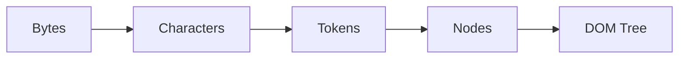

# Chapter 1: Introduction to HTML

Welcome to the comprehensive guide to HTML. While HTML is often considered a "beginner" language, mastering it deeply is the hallmark of a senior frontend engineer. This chapter explores not just *what* HTML is, but exactly *how* it operates beneath the surface.

## The True Nature of HTML

**HTML** (HyperText Markup Language) is not a programming language—it is a **declarative markup language**. It descended from SGML (Standard Generalized Markup Language) and was designed originally for sharing scientific documents across networks. 

Today, HTML5 is a living standard maintained by the WHATWG (Web Hypertext Application Technology Working Group). It defines two main things:
1. The semantics (meaning) of elements.
2. The APIs that allow JavaScript to interact with these elements.

## How Browsers Parse HTML: The Critical Rendering Path

To understand HTML deeply, you must understand how a browser interprets it. When a browser requests a page, the server responds with a stream of bytes. The browser goes through the following steps:

1. **Bytes to Characters**: The browser converts the raw bytes into characters based on the specified encoding (usually UTF-8).
2. **Tokens**: It converts the characters into tokens (e.g., "Start tag `<p>`", "Text `Hello`", "End tag `</p>`").
3. **Nodes**: These tokens are converted into "Objects" or "Nodes".
4. **The DOM Tree**: Finally, these nodes are linked together in a complex tree data structure called the **Document Object Model (DOM)**.



Every single HTML tag becomes a JavaScript object in the DOM that takes up memory and processing power. Writing bloat-free HTML directly impacts the performance of your application.

## HTML vs CSS vs JavaScript: The Separation of Concerns

Professional web development relies on the strict "Separation of Concerns" principle.

- **HTML (Content & Structure)**: It should *never* dictate how things look. It only dictates what things *are*. If an element doesn't have semantic meaning, it shouldn't be an HTML tag.
- **CSS (Presentation)**: Handled entirely by the CSS Object Model (CSSOM). It paints the DOM.
- **JavaScript (Behavior)**: Manipulates both the DOM and the CSSOM. 

*Anti-pattern example:* Using `<br><br>` to create visual space instead of using CSS `margin-top`. This violates the separation of concerns.

## A Robust HTML5 Example

Here is a robust, modern snippet that goes beyond simple tags, utilizing attributes that enhance accessibility and machine readability:

```html
<!-- A semantically rich article snippet -->
<article lang="en" id="post-42" data-author="usman">
    <header>
        <h1 class="post-title">Deep Dive into the DOM</h1>
        <p>Published on <time datetime="2026-10-12T08:00:00Z">October 12th, 2026</time></p>
    </header>
    
    <div class="post-content">
        <p>Understanding the <strong>Critical Rendering Path</strong> is essential for web performance optimization.</p>
    </div>
    
    <footer>
        <a href="/author/usman" rel="author">Read more by Usman</a>
    </footer>
</article>
```
Notice the use of the `data-*` attribute (`data-author`), the `datetime` attribute on the `<time>` tag, and the `rel="author"` attribute on the anchor tag. These are the details that elevate standard HTML into professional, machine-readable markup.
