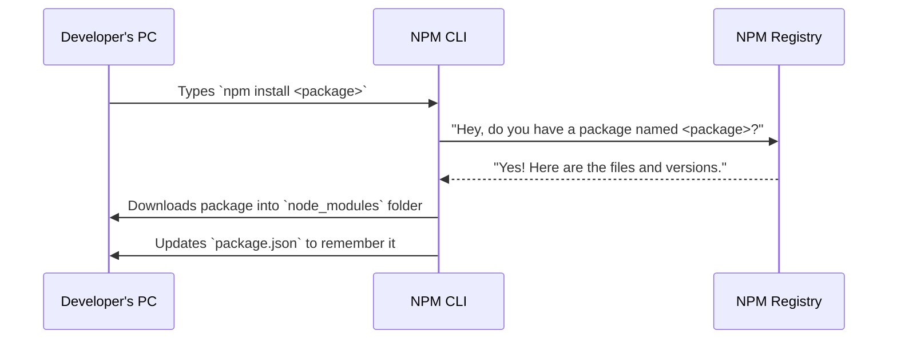
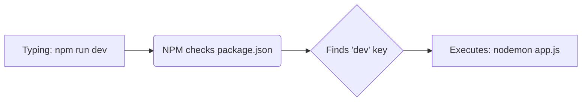

# NPM: The Node Package Manager

If Node.js is the engine of your server-side JavaScript vehicle, then packages are all the amazing add-ons—the GPS, the sound system, the heated seats—that you can plug into your car so you don't have to build them from scratch.

When you install Node.js, it magically comes with a powerful companion: **NPM (Node Package Manager)**. 

In this chapter, we will explore what NPM is, how it revolutionizes the way developers build software, and how to use it to manage the building blocks of your MERN stack applications.

---

## 2.1 What is NPM?

At its core, **NPM is the world's largest software registry.** 

Imagine you are building a house. You could chop down trees, cut them into planks, forge your own nails, and slowly piece it together. Or, you could go to a massive hardware store and buy perfectly crafted planks, shiny nails, and even pre-built windows. 

In the software world, NPM is that hardware store. Instead of writing complex logic for password encryption, connecting to a database, or generating random IDs completely from scratch, you can browse the NPM registry and download pre-written, highly-tested code packages created by other developers.

NPM consists of three distinct components:
1. **The Website (npmjs.com):** A search engine where developers discover packages, read documentation, and manage their published code.
2. **The Command Line Interface (CLI):** The tool you run in your terminal to interact with NPM (e.g., to install or publish a package).
3. **The Registry:** A colossal, public database of JavaScript software and meta-information surrounding it.

Here is a visual representation of how the NPM ecosystem operates when you decide to use a package:



---

## 2.2 The Heart of the Project: `package.json`

Every modern JavaScript project relies on a critical file called `package.json`. Think of this file as the **manifest** or the **resume** of your project. It contains metadata about your app (its name, version, author) and, most importantly, a list of every single external NPM package your project needs to function.

To create this file, open your terminal, navigate to a new empty folder, and run:

```bash
npm init
```

The CLI will ask you a series of questions (package name, version, description, entry point, etc.). If you want to skip the questions and use the default settings, you can add the `-y` flag:

```bash
npm init -y
```

After running this, an `package.json` file will appear in your folder. It looks something like this:

```json
{
  "name": "my-awesome-app",
  "version": "1.0.0",
  "description": "Learning how NPM works",
  "main": "app.js",
  "scripts": {
    "test": "echo \"Error: no test specified\" && exit 1"
  },
  "keywords": [],
  "author": "Future MERN Developer",
  "license": "ISC"
}
```

This simple JSON file makes your project highly organized and portable.

---

## 2.3 Installing Packages (Dependencies)

Let's put NPM to use! Suppose we want to write a script that generates a universally unique identifier (UUID) for a user. Writing a truly random, collision-free UUID function from scratch is hard. Let's use NPM instead.

We tell NPM to install the `uuid` package by running:

```bash
npm install uuid
```

*(Note: You can use the shorthand `npm i uuid`).*

Once you press Enter, several magical things happen simultaneously:
1. NPM connects to the internet and downloads the `uuid` package.
2. It creates a massive folder named `node_modules` and puts the code inside it.
3. It updates your `package.json` to keep track of this new addition.
4. It creates a `package-lock.json` file.

Look at your `package.json` now. You'll see a new section at the bottom:

```json
"dependencies": {
  "uuid": "^9.0.1"
}
```

The `dependencies` section is the shopping list for your app. It tells the world: *"To run this project properly, you absolutely need version 9.x.x of the `uuid` package."*

Now, let's use it in our `app.js` file!

```javascript
// app.js

// We require the package by its exact NPM name.
// Node will automatically look inside the node_modules folder to find it!
const { v4: uuidv4 } = require('uuid');

console.log("Generating a unique user ID...");
const newUserId = uuidv4();
console.log("Success! Your ID is:", newUserId);
```

Run `node app.js`, and you will see a perfectly generated UUID!

---

## 2.4 The `node_modules` Folder and Portability

When you ran `npm install`, NPM created a folder called `node_modules`. 

The `node_modules` folder is notorious in the developer community for being incredibly massive. Even if you only install one package, that package might rely on three other packages, and those three might rely on ten more! This deeply nested hierarchy is stored here.

```mermaid
graph TD
    A[Your Project] --> B(node_modules folder)
    B --> C[uuid package]
    B --> D[express package]
    B --> E[mongoose package]
    D --> F[body-parser package <br/>(a dependency of express)]
    D --> G[cookie package]
    F --> H[bytes package]
```

### The Golden Rule of `node_modules`
Because this folder can easily swell to hundreds of megabytes, **you should NEVER share, upload, or commit your `node_modules` folder to GitHub.** 

Instead, you only share your code and the tiny `package.json` file. When another developer (or a web server) downloads your project, they will see that `node_modules` is missing. All they have to do is type:

```bash
npm install
```

NPM will read your `package.json` file, look at the `dependencies` list, and automatically rebuild the exact `node_modules` folder needed for your project! This makes sharing Node.js projects incredibly fast and efficient.

---

## 2.5 Regular Dependencies vs. Dev Dependencies

Not all packages are created equal. Some packages are required for your app to run in production (like a framework or database connector). Other packages are only useful to you, the developer, while you are writing the code (like testing libraries or code formatters).

NPM allows you to separate these. 

If you want to install a package specifically for development, use the `--save-dev` flag (or `-D`):

```bash
npm install nodemon --save-dev
```

*(`nodemon` is a brilliant tool that automatically restarts your server whenever you save a file so you don't have to manually type `node app.js` every time).*

Your `package.json` will now categorize it nicely:

```json
"dependencies": {
  "uuid": "^9.0.1"
},
"devDependencies": {
  "nodemon": "^3.0.0"
}
```

When you deploy your app to a live server for actual users, the server will ignore the `devDependencies` and only install the core `dependencies`, saving space and memory.

---

## 2.6 Automating Workflows with NPM Scripts

Typing long commands in the terminal can get tedious. Thankfully, your `package.json` comes with a highly useful `scripts` object. It allows you to create custom alias commands.

Let's modify our `package.json` scripts section to use the `nodemon` package we just installed:

```json
"scripts": {
  "start": "node app.js",
  "dev": "nodemon app.js",
  "test": "echo \"Running some automated testing!\""
}
```

Now, instead of typing complex paths or flags, you can just return to your terminal and use NPM to run these aliases!

- To run the app normally: `npm start` *(Note: `start` and `test` are special keywords in NPM)*
- To run your custom dev script: `npm run dev` *(Notice the `run` keyword used for custom scripts)*



By leveraging NPM scripts, you can automate testing, building, and running your application, making your developer experience significantly smoother.

---

## 2.7 Understanding Semantic Versioning (SemVer)

When you look at your `package.json`, you might notice that the version numbers look like `^9.0.1`. They aren't just random decimals; they follow a strict universal standard called **Semantic Versioning** (or SemVer).

A version number is divided into three pieces, separated by dots: **MAJOR.MINOR.PATCH** (e.g., `9.0.1`).

Here is what changing each number tells you about the package update:

1. **PATCH (9.0.x)**: The author fixed a bug. The code works exactly the same way, but it is now safer or less buggy.
   * *Example:* A library had a minor security flaw, and the author released `9.0.2` to patch it.
2. **MINOR (9.x.0)**: The author added a brand new feature, but it **does not break** any of the existing code (it is backwards-compatible). All your old code will still work perfectly.
   * *Example:* The author added an optional `generateShortUUID()` function alongside the normal ones. Welcome to `9.1.0`.
3. **MAJOR (x.0.0)**: The author made massive structural changes that **will break** your existing code if you update. Functions might be renamed, deleted, or their underlying logic completely altered.
   * *Example:* The author deleted the `uuidv4()` function entirely in favor of a new class-based system. This warrants a jump to `10.0.0`.

### The Caret (`^`) and Tilde (`~`)
In your `package.json`, you'll often see a caret (`^`) before the version number (like `^9.0.1`). This is an auto-update instruction for NPM:

* **`^9.0.1` (Caret - Default)**: *"Hey NPM, when I run `npm install`, you are allowed to automatically install newer MINOR and PATCH versions (like 9.1.0 or 9.5.4) because they are safe, but NEVER jump to a new MAJOR version (like 10.0.0) because it might break my app!"*
* **`~9.0.1` (Tilde)**: *"Hey NPM, only automatically give me PATCH versions (bug fixes like 9.0.5). Don't even give me new features."*

### When to Update / When NOT to Update

* **DO Update (Patch & Minor)**: It is generally a great practice to run `npm update` occasionally. This safely bumps your packages to the latest minor and patch versions, granting you free security fixes, optimizations, and new tools without breaking your code.
* **DO NOT Update (Major without a plan)**: Never blindly force an update to a Major version (e.g., manually changing your `package.json` to 10.x.x or running `npm install uuid@latest` when you are on v9). If you decide your app needs the new Major version, you must first read the package's **Changelog / Migration Guide** meticulously. You will almost certainly have to rewrite parts of your own code to stop your server from crashing.

## Summary

In this section, we unlocked the immense power of the open-source community through NPM:
1. **NPM** is a registry, website, and CLI tool that handles installing external code packages.
2. The **`package.json`** file acts as the project's brain, logging metadata and tracking all external dependencies.
3. Packages are downloaded into the **`node_modules`** folder, which is massive and should never be shared directly.
4. Developers can distinguish between **dependencies** (for production) and **devDependencies** (for building/testing).
5. **NPM Scripts** provide brilliant shortcuts to automate running and building our Node.js programs.
6. **Semantic Versioning (SemVer)** ensures we can safely apply minor updates and bug fixes without accidentally bringing in code-breaking major changes.

Next up, we will put this new power to use. Instead of writing raw Node.js code to create web servers, we will use NPM to download the most pivotal framework in the MERN stack: **Express.js**.
