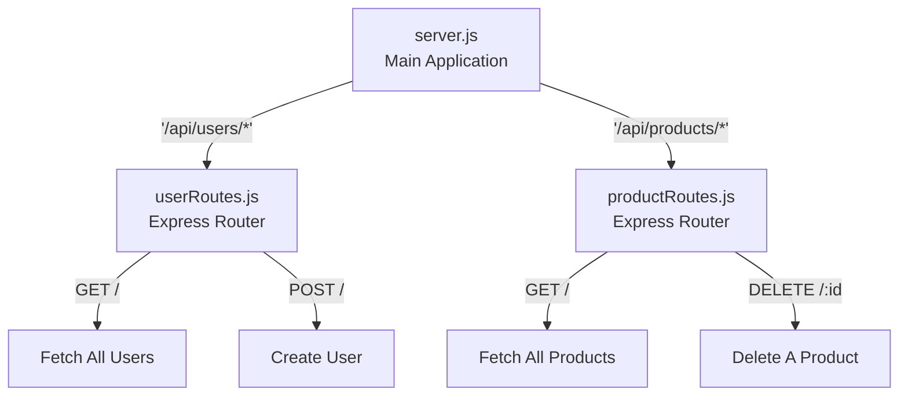

# Advanced Express Routing and the `express.Router`

Congratulations! You have successfully built a functional API. Using `app.get()` and `app.post()`, your server is taking requests and sending intelligent JSON responses. 

However, as your application grows, you will inevitably run into two major problems:
1. **Dynamic Content:** How do you get the profile of a *specific* user without writing 1,000 separate `app.get('/user/1')` routes?
2. **The "God File" Anti-Pattern:** A real-world application has hundreds of routes. If you put all of them into a single `server.js` file, it will become an unreadable, 5,000-line monster.

In this chapter, we explore how to capture dynamic data directly from the URL, and how to elegantly break our massive server into tiny, manageable chapters using the `express.Router`.

---

## 6.1 Route Parameters: Capturing Dynamic Data

Imagine you are building an e-commerce website. A user clicks on a pair of shoes, and their browser makes a request to fetch the details. The URL looks like this: `http://localhost:3000/api/products/482`.

You cannot hardcode `app.get('/api/products/482')` because you have thousands of products! We solve this using **Route Parameters**. Route parameters map a placeholder in the URL path to a variable inside the `req` object.

To define a route parameter, you simply prefix a word with a colon (`:`).

```javascript
// server.js
app.get('/api/products/:productId', (req, res) => {
    
    // Express automatically grabs whatever the user typed after /products/
    const id = req.params.productId;
    
    // In a real application, you would use this 'id' to query MongoDB
    res.json({ message: `Fetching the product with ID: ${id}` });
});
```

You can even extract multiple route parameters sequentially!

```javascript
// Fetching a specific photo belonging to a specific user
app.get('/api/users/:userId/photos/:photoId', (req, res) => {
    const { userId, photoId } = req.params; // Using Object Destructuring

    res.json({
        message: "Photo Fetched!",
        user: userId,
        photo: photoId
    });
});
```

---

## 6.2 Query Strings: Capturing Optional Filters

Sometimes, you don't need a specific item. You need a list of items, but you want them *filtered* or *sorted*. For example, fetching all shirts, but sorting them from lowest price to highest.

On the internet, this is achieved using **Query Strings** at the very end of a URL. Anything occurring after a question mark (`?`) in a URL is ignored by the router's path-matching engine, but Express cleanly captures these variables inside `req.query`.

Given a URL like: `http://localhost:3000/api/shirts?color=blue&sort=asc&limit=10`

```javascript
app.get('/api/shirts', (req, res) => {
    
    // Express parses everything after the '?' into a clean object!
    const color = req.query.color; // 'blue'
    const sort = req.query.sort;   // 'asc'
    const limit = req.query.limit; // '10'

    res.json({
        message: `Returning ${limit} ${color} shirts sorted by ${sort}.`
    });
});
```

*Rule of Thumb:* Use **Route Parameters (`req.params`)** when fetching a highly specific, required resource (like an ID). Use **Query Strings (`req.query`)** for optional parameters, sorting, filtering, and pagination.

---

## 6.3 The "God File" Problem

Let's say our application manages Users, Products, and Reviews. Each of these entities requires full CRUD operations (Create, Read, Update, Delete).

If we write this the way we've learned so far...

```javascript
// server.js (The God File)
const express = require('express');
const app = express();

// --- USER ROUTES ---
app.get('/api/users', (req, res) => { ... });
app.post('/api/users', (req, res) => { ... });
app.get('/api/users/:id', (req, res) => { ... });
app.delete('/api/users/:id', (req, res) => { ... });

// --- PRODUCT ROUTES ---
app.get('/api/products', (req, res) => { ... });
app.post('/api/products', (req, res) => { ... });
// ... and so on ...
```

By the time you finish, `server.js` will be hundreds of lines long. It becomes impossible to navigate or debug. In enterprise architecture, we demand **Modularity**. 

---

## 6.4 The Solution: `express.Router`

Express gives us a tool called `express.Router()`. 

You can think of a Router as a "mini-app" or a separate bucket that solely exists to hold a specific group of routes. Once you fill the bucket with routes, you carry it back to your main `server.js` file and plug it in.



### Step 1: Create the Router File

In modern MERN apps, we create a dedicated folder named `routes`. Inside it, let's create `userRoutes.js`.

```javascript
// routes/userRoutes.js

const express = require('express');
// Initialize the mini-app router
const router = express.Router();

// Define your routes attached to the ROUTER, not the APP!
// NOTE: We do not write '/api/users' here. We only write '/' or '/:id'
// We will define the base URL later in server.js!

router.get('/', (req, res) => {
    res.json({ message: "Fetching all users..." });
});

router.post('/', (req, res) => {
    res.status(201).json({ message: "User successfully created!" });
});

router.get('/:id', (req, res) => {
    res.json({ message: `Fetching user details for ID: ${req.params.id}` });
});

// Finally, export the router so server.js can import it
module.exports = router;
```

### Step 2: Plug the Router into `server.js`

Now, we return to our main entry point file. We are going to import that router bucket, and tell Express to redirect all traffic meant for users into it.

```javascript
// server.js

const express = require('express');
const app = express();

// 1. Import our custom Router
const userRoutes = require('./routes/userRoutes');

// 2. The magic connection!
// "Hey Express, anytime a request starts with '/api/users', 
// stop looking here and hand it over to the userRoutes file!"
app.use('/api/users', userRoutes);

app.listen(3000, () => {
    console.log("Modular app listening on port 3000");
});
```

**Look at how beautiful and tiny `server.js` has become!** If a user requests `GET /api/users/45`, the main app sees `/api/users`, immediately delegates the request to `userRoutes.js`, and the router catches the `/45` through its `/:id` parameter block.

## Summary

In this section, we mastered how to handle dynamic internet traffic and scale our application cleanly:
1. **Route Parameters (`req.params`)**: Used to capture specific identifiers (like IDs) dynamically from a URL using the `/:variable` syntax.
2. **Query Strings (`req.query`)**: Automatically captures optional URL filters placed after a question mark `?sort=asc`.
3. **The `express.Router`**: Saves us from the dreaded "God File" anti-pattern. It allows us to split our logic into dozens of isolated, modular files (like `userRoutes.js`), keeping the main `server.js` application clean, readable, and highly organized.

Now that our routing architecture is professional and modular, we are missing one critical piece: How do we extract actual *data payloads* (like passwords and form data) from `POST` requests without writing messy Node buffers? In the next chapter, we unravel the powerful magic of **Express Middlewares**.
