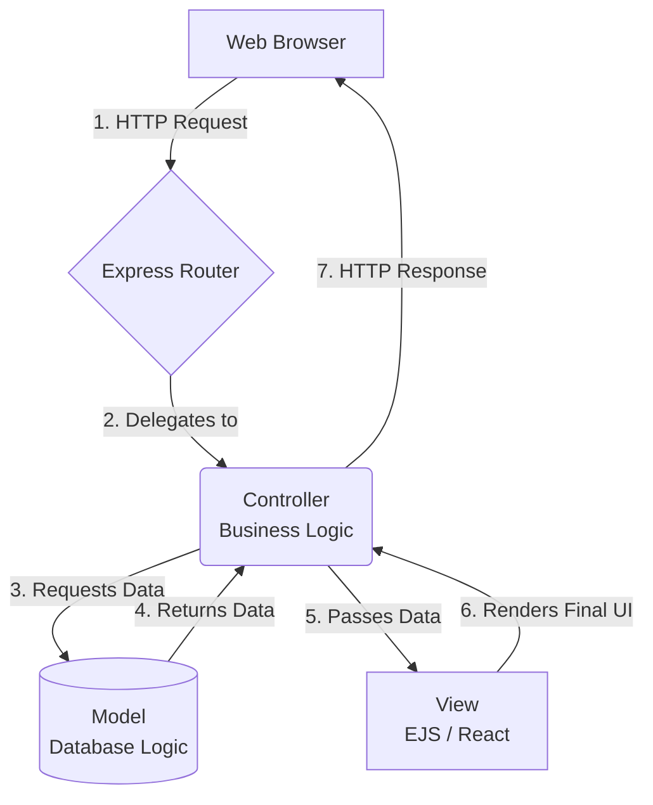

# The MVC Architecture: Structuring Enterprise Express Apps

Up to this point, you have learned how to create routes, use middlewares, render EJS views, and accept form data. While your Express servers are functional, storing all your business logic, database queries, and HTML rendering inside a single router file is still considered bad practice for large-scale applications.

When building massive systems (like a social network or an e-commerce platform), developers follow strict organizational blueprints called **Design Patterns**. The most famous and universally adopted design pattern in web development is **MVC (Model-View-Controller)**.

In this chapter, we will separate the concerns of our application into three distinct layers. This structure prepares us perfectly to introduce databases while keeping our codebase clean, scalable, and easy to debug.

---

## What is MVC?

MVC completely separates the three core responsibilities of a web application so that they never step on each other's toes. 

* **Model:** Handles all data, logic, and rules. It is the *only* part of the application allowed to talk to the database.
* **View:** Handles whatever the user actually sees on their screen (the UI). It is completely unaware of how the data was fetched.
* **Controller:** The brain or the "middleman." It receives the user's request, asks the Model for data, and physically hands that data over to the View to be rendered.



Let's look at how to structure these three pieces in a real Express application using clean coding examples.

---

## The Model (Data Logic)

The Model is strictly responsible for representing your data and communicating with the database. 

*(Hint: In the next chapter, we will use a library called **Mongoose** to connect our Models directly to a real MongoDB database. For now, to keep things simple, our Model will just use a fake array to simulate fetching data).*

Let's create a dedicated `models/` folder and build a `User.js` model.

```javascript
// models/User.js

// In the future, this file is where Mongoose will strictly define 
// what a User looks like (e.g., must have a String username, must have a password).

// For now, let's simulate a database table using an array.
const fakeDatabase = [
 { id: 1, name: "Alice", role: "Admin" },
 { id: 2, name: "Bob", role: "User" }
];

class User {
 // A simulated method to fetch all users from our "database"
 static fetchAll() {
 return fakeDatabase;
 }

 // A simulated method to find one user
 static findById(id) {
 return fakeDatabase.find(user => user.id === id);
 }
}

module.exports = User;
```
Notice that the Model doesn't know anything about URLs, HTTP Requests, or EJS files. It only knows about raw data.

---

## The View (Presentation Logic)

The View is strictly responsible for the User Interface. We explored this in the previous chapter using EJS templates. 

The View doesn't ask *how* Alice and Bob got into the system. It simply expects an array of users to be handed to it, and it writes the HTML to display them.

Let's create `views/users.ejs`:

```html
<!-- views/users.ejs -->
<!DOCTYPE html>
<html>
<head><title>All Users</title></head>
<body>
 <h1>System Directory</h1>
 
 <ul>
 <!-- The View blindly trusts that a "users" array was given to it -->
 <% for(let user of users) { %>
 <li><%= user.name %> (Role: <%= user.role %>)</li>
 <% } %>
 </ul>
</body>
</html>
```

---

## The Controller (The Brain)

This is where the magic happens. The Controller acts as the manager. It imports the Model, it knows about the View, and it handles the actual `req` and `res` objects.

Let's create a `controllers/` folder and build `userController.js`:

```javascript
// controllers/userController.js

// 1. The Controller imports the Model to get access to the database
const User = require('../models/User');

// 2. We define our logic as separate exported functions

exports.getAllUsers = (req, res) => {
 // 1. Ask the Model for all the data
 const allUsers = User.fetchAll();
 
 // 2. Hand that data directly to the View and send the Response!
 res.render('users', { users: allUsers });
};

exports.getUserProfile = (req, res) => {
 // Extract the ID from the URL (Request)
 const requestedId = parseInt(req.params.id);
 
 // Ask the Model to find this specific person
 const singleUser = User.findById(requestedId);

 if (singleUser) {
 res.render('profile', { user: singleUser });
 } else {
 res.status(404).send("User not found!");
 }
};
```

---

## Bringing it Together: The Router

If the Controller is the brain, the Router is the traffic cop. Its only job is to look at the URL and point to the correct Controller function. 

Look at how incredibly clean and readable our routing file becomes once we extract the messy logic into Controllers!

```javascript
// routes/userRoutes.js
const express = require('express');
const router = express.Router();

// Import our Controller
const userController = require('../controllers/userController');

// The Router delegates the Request to the specific Controller function.
// It reads like perfect English!
router.get('/', userController.getAllUsers);
router.get('/:id', userController.getUserProfile);

module.exports = router;
```

And finally, our absolute root `server.js` file remains a pristine, 10-line skeleton:

```javascript
// server.js
const express = require('express');
const userRoutes = require('./routes/userRoutes');

const app = express();
app.set('view engine', 'ejs');

// Plug in the router
app.use('/users', userRoutes);

app.listen(3000, () => console.log('MVC Server running on port 3000'));
```

## Summary

By adopting the **Model-View-Controller** architecture, you have transformed your codebase from a messy script into a professional, enterprise-grade application.

1. **The Model** isolates database queries and data validation.
2. **The Controller** isolates the business logic, pulling data from the Model and pushing it to the View.
3. **The View** handles nothing but the visual UI representation (whether that is EJS now, or React later!).
4. **The Router** connects URLs to their respective Controllers.

Because our data logic is now fully isolated inside the `models/` folder, we are in the perfect position to delete our fake array and replace it with a real, permanent database. 

It is officially time to introduce **MongoDB and Mongoose**.
