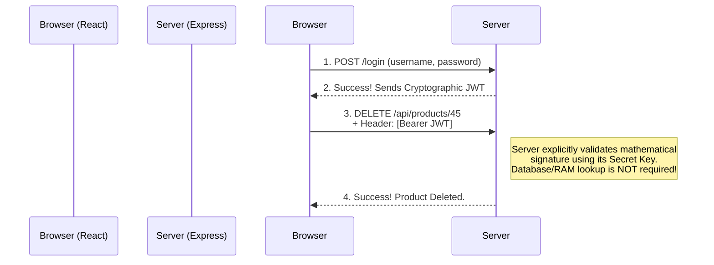

# The Guardians of the Web: Authentication & Authorization

You have successfully built an E-Commerce storefront and a RESTful API. However, if anyone with an internet connection can blindly hit your `DELETE /api/products/:id` endpoint and erase your database, your business will collapse overnight.

We need a way to lock the doors. We need **Security**. 

In web development, security dictates that we master two distinctly different concepts:
1. **Authentication (Who are you?):** The process of verifying a user's identity (e.g., verifying a username and password).
2. **Authorization (What are you allowed to do?):** Checking if the authenticated user has the necessary permissions (e.g., an Admin can delete a product, but a regular Customer cannot).

The problem is that the HTTP protocol is entirely **Stateless**. Every request the browser makes is completely independent. Even if a user logs in successfully, the next time they click a link, the server forgets who they are instantly. To solve this amnesia, we must confidently store an "ID Badge" directly in the user's browser.

---

## 15.1 The Browser Vault: Client-Side Storage Options

Before we issue an ID Badge, we must understand *where* the browser can store it. If we store it insecurely, hackers will steal the ID badge and impersonate the user. The browser provides three main vaults:

### 1. LocalStorage & SessionStorage
These are simple key-value databases built directly into the browser.
*   **LocalStorage:** Survives even if you close the browser and restart your computer.
*   **SessionStorage:** Is instantly wiped the moment the user closes the browser tab.
*   **The Issue (XSS):** Any JavaScript code running on your website can read Local/Session storage. If a hacker injects malicious JavaScript into your site (a **Cross-Site Scripting or XSS** attack), they can instantly read `localStorage.getItem('token')` and steal the badge!

### 2. Cookies (HttpOnly)
Cookies are tiny text files exclusively managed by the browser. 
*   **The Magic:** Whenever the browser makes an HTTP Request to your backend, it automatically attaches the Cookie to the network headers. You don't have to write any JavaScript to send it.
*   **HttpOnly Flag:** If the backend flags a Cookie as `HttpOnly`, it becomes completely invisible to JavaScript. Even if a hacker successfully executes an XSS attack on your React app, they physically cannot read an HttpOnly cookie!
*   **The Issue (CSRF):** Because browsers attach cookies *automatically* to every request, hackers can trick users into clicking links on fake websites that send commands to your server (a **Cross-Site Request Forgery or CSRF** attack).

Now that we know our storage vaults, let's explore the three dominant strategies for creating the actual ID Badge.

---

## 15.2 Strategy 1: Session-Based Authentication

For the first twenty years of the web, almost every application used **Sessions**. This strategy is deeply intertwined with traditional Server-Side Rendered (SSR) applications like the EJS store.

### How it Works
The server fundamentally acts as a massive memory vault. When a user logs in, the server generates a random string (e.g., `xyz123`) called a **Session ID**, stores it in physical memory, and sends it to the browser as a Cookie. The browser automatically sends `xyz123` back on every subsequent request.

### Coding Example
We use the `express-session` middleware to automate this complex dance.

```javascript
const express = require('express');
const session = require('express-session');
const app = express();

// 1. Configure the Session Middleware
app.use(session({
    secret: 'my_super_secret_string', // Used to sign the cookie
    resave: false,
    saveUninitialized: false,
    cookie: { 
        httpOnly: true, // Crucial: Protects against XSS attacks
        maxAge: 1000 * 60 * 60 * 24 // 1 Day
    }
}));

// 2. The Login Route
app.post('/login', (req, res) => {
    // Assume we checked MongoDB and the password is correct!
    const user = { id: 89, username: "MernNinja" }; 

    // We explicitly attach the user data to the incredibly magical req.session object.
    // Express automatically generates the 'xyz123' Session ID and sets the Cookie in the browser!
    req.session.userId = user.id; 
    
    res.send("Logged in securely!");
});

// 3. A Protected Route
app.get('/dashboard', (req, res) => {
    // If the browser didn't automatically send a valid cookie, req.session.userId is undefined
    if (!req.session.userId) {
        return res.status(401).send("You are not logged in!");
    }
    res.send(`Welcome to your secure dashboard, User #${req.session.userId}!`);
});
```

### The Issues
*   **Memory Scaling:** If you have 10 million active users, storing 10 million Session IDs in your Node.js RAM will crash your server. You must install a dedicated session-database (like Redis) to handle this.
*   **Horizontal Scaling:** If you deploy three Node.js servers, Server B does not know about the sessions stored in Server A's memory. Load-balancing becomes a nightmare.

---

## 15.3 Strategy 2: JSON Web Tokens (JWT)

When Single Page Applications (React) and Mobile Apps became popular, developers needed scalable APIs. Using Node.js RAM to store state was no longer viable. Hence, the entirely **Stateless** JWT was born. 

### How it Works
Instead of storing memories on the Node server, the server mathematically cryptographically signs a JSON object using a secret key, converting it into a massive scrambled string (a JWT), and hands it to the frontend.



### Coding Example
We use the immensely popular `jsonwebtoken` package.

```javascript
const express = require('express');
const jwt = require('jsonwebtoken'); // 1. Import JWT
const app = express();

const SECRET_KEY = "NEVER_HARDCODE_THIS_IN_PRODUCTION";

// 2. The Login Route
app.post('/api/login', (req, res) => {
    // Validate credentials against MongoDB...
    
    const payload = { userId: 89, role: "Admin" };
    
    // Mathematically sign the payload! 
    const token = jwt.sign(payload, SECRET_KEY, { expiresIn: '1h' });
    
    res.json({ message: "Login Success", token: token }); 
});

// 3. A Protected Route (Acts as Middleware)
const verifyToken = (req, res, next) => {
    // The React frontend must manually send the token inside the Authorization Header
    const authHeader = req.headers['authorization']; 
    const token = authHeader && authHeader.split(' ')[1]; // Extracts "Bearer <token>"

    if (!token) return res.status(401).send("Token entirely missing!");

    // Instant Mathematical Verification!
    jwt.verify(token, SECRET_KEY, (err, decodedData) => {
        if (err) return res.status(403).send("Token mathematically invalid or expired.");
        
        req.user = decodedData; // { userId: 89, role: "Admin" }
        next(); // Proceed to Route!
    });
};

app.get('/api/dashboard', verifyToken, (req, res) => {
    res.send(`Welcome Admin #${req.user.userId}!`);
});
```

### The Issues
*   **The Revocation Problem:** Because the server stores absolutely *nothing* in memory, it cannot easily "delete" a session. If a hacker steals an Admin JWT, that JWT remains fully valid until its mathematical `expiresIn` timestamp is explicitly reached.
*   **Storage Vulnerability:** If you store the JWT in `LocalStorage` so React can easily attach it to headers, you are totally vulnerable to XSS attacks. If you store it in an `HttpOnly Cookie`, you are protected from XSS but vulnerable to CSRF. (The industry standard is an HttpOnly Cookie combined with heavy CSRF tokens).

---

## 15.4 Strategy 3: OAuth (Third-Party Delegation)

Developing world-class registration forms, managing password reset emails, securing passwords with `bcrypt`, and implementing Two-Factor Authentication (2FA) is a tremendous security liability.

OAuth bypasses this completely by utilizing **Delegated Trust** (e.g., "Log in with Google/GitHub"). Instead of forcing the user to create a password on your server, you delegate the entire authentication process to a tech giant.

### How it Works
1. User clicks "Login with Google".
2. Your Node server instantly redirects their browser to Google's official server.
3. The user securely logs into Google using their 2FA and passwords.
4. Google redirects the user back to your Express server, carrying a secure, temporary 'Access Code'.
5. Your Express server secretly trades that Access Code for a verified JSON User Profile (`email: "bob@gmail.com"`).
6. Your server logs Bob in (by generating a JWT or an Express Session tied to that email).

### Conceptual Coding Example (`passport-google-oauth20`)

Implementing OAuth natively involves complex cryptographic handshake algorithms. We exclusively use the `passport` package to handle the heavy lifting.

```javascript
const passport = require('passport');
const GoogleStrategy = require('passport-google-oauth20').Strategy;

// 1. Configure the Strategy Configuration
passport.use(new GoogleStrategy({
    clientID: process.env.GOOGLE_CLIENT_ID,
    clientSecret: process.env.GOOGLE_CLIENT_SECRET,
    callbackURL: "/auth/google/callback" // Where Google redirects them back to
  },
  async function(accessToken, refreshToken, profile, done) {
      // 2. We received the Google Profile! 
      // Do they exist in our MongoDB?
      let user = await User.findOne({ googleId: profile.id });
      
      if (!user) {
          // If not, silently create a new Mongo user without a password!
          user = await User.create({ 
              googleId: profile.id, 
              name: profile.displayName, 
              email: profile.emails[0].value 
          });
      }
      return done(null, user);
  }
));

// 3. The actual Routes
app.get('/auth/google', passport.authenticate('google', { scope: ['profile', 'email'] }));

app.get('/auth/google/callback', passport.authenticate('google'), (req, res) => {
    // If successful, generate a JWT here and redirect them to their React dashboard!
    res.redirect('http://localhost:3000/dashboard'); 
});
```

### The Issues
*   **Third-Party Reliance:** If Google suspends your Google Cloud account, every single user inside your application permanently loses the ability to log in.
*   **Architectural Complexity:** Setting up Client IDs, dealing with OAuth Callback URIs across localhost and production, and testing the flow can be notoriously frustrating for beginners.

## Summary

Security dictates the absolute foundation of your architecture:
1. **Client Storage:** You must understand the deep vulnerability differences between `LocalStorage` (XSS vulnerable) and `HttpOnly Cookies` (CSRF vulnerable).
2. **Sessions (`express-session`):** The traditional SSR vault paradigm. Extremely controllable, but suffers heavily under intense, horizontal scaling due to RAM constraints.
3. **JWTs (`jsonwebtoken`):** The modern, mathematically stateless API paradigm. Ideal for decoupled architectures like MERN, but notably difficult to forcefully invalidate before expiration.
4. **OAuth (`passport.js`):** The ultimate friction-reducer. Offloads heavy security liabilities and password hashing to tech giants, but enforces total reliance on their specific APIs.

Because the ultimate goal of the MERN stack is to construct decoupled APIs driving sophisticated React applications, the modern industry actively embraces **JWTs**. In the following sections, as we pivot to the frontend, we will architect our React application to explicitly handle and transmit these tokens.
