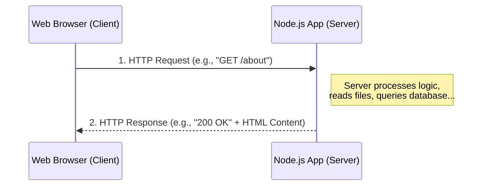

# 3. Building a Web Server: The Built-in `http` Module

Up until now, the JavaScript we have written in Node.js has run directly inside our terminal. We typed `node app.js`, it did some math or printed a message, and then it immediately finished and exited. 

But web applications don't work like that. A web application doesn't just run once and turn off; it **listens**. It sits patiently on a computer somewhere in the world, waiting 24/7 for a user to open their browser and ask for an HTML page or some data.

To make Node.js wait and listen, we have to turn it into a **Web Server**. In this chapter, we will learn how to build our very first web server from scratch using Node.js's native `http` module.

---

## 3.1 The Client-Server Relationship (Request & Response)

Before we write code, we must understand the fundamental conversation of the internet: the **Request-Response Cycle**. 

Every time you type a URL into your browser (like `google.com`) or click a link, your computer acts as a **Client**. It sends a message across the internet to another computer, essentially saying, *"Hello, give me the homepage!"*

The computer receiving that message is the **Server**. Its job is to figure out what you want, prepare the data, and send it back. 



As MERN stack developers, our job is to write the code that lives inside that **Server** box. 

---

## 3.2 Creating Your First Web Server

Node.js provides a built-in core module specifically designed to handle this internet traffic. It is called the `http` module. 

Since it's a core module, we don't need to run `npm install`. We just require it directly! Let's create a new file named `server.js` and build the simplest web server possible:

```javascript
// server.js

// 1. Import the built-in HTTP module
const http = require('http');

// 2. Create the server
const server = http.createServer((req, res) => {
    // This callback function runs EVERY time a user visits the server!
    console.log("A new request has arrived!");
    
    // Send a message back to the user's browser
    res.end("Hello from the Node.js Server!");
});

// 3. Tell the server to start listening for requests on Port 3000
const PORT = 3000;
server.listen(PORT, () => {
    console.log(`Server is up and actively listening on http://localhost:${PORT}`);
});
```

### Running the Server
Go to your terminal and run:
```bash
node server.js
```
Notice something different? The terminal didn't give you back the prompt. The program didn't exit! It is now permanently running, actively listening to `Port 3000`.

Open your web browser and type `http://localhost:3000` into the address bar. You should see a plain web page displaying: *"Hello from the Node.js Server!"* Look at your terminal, and you'll see your `console.log` confirming that the request arrived.

*(To stop the server, go back to your terminal and press `Ctrl + C`).*

---

## 3.3 Dissecting `req` (Request) and `res` (Response)

In the code above, the `createServer()` function takes a callback with two incredibly important objects: `req` and `res`.

```mermaid
graph LR
    A[Incoming Network Traffic]
    A -->|Turns into| REQ[req (Request Object)]
    REQ -->|Contains| R1[Method: GET/POST]
    REQ -->|Contains| R2[URL: /about]
    REQ -->|Contains| R3[Headers & Data]
    
    RES[res (Response Object)] -->|Turns into| C[Outgoing Network Traffic]
    RES -->|Requires| S1[Status Code: 200/404]
    RES -->|Requires| S2[Content-Type: HTML/JSON]
    RES -->|Requires| S3[Body content]
```

### 1. The `req` (Request) Object
The `req` object represents the incoming message from the user's browser. It is packed with useful information about *what* the user is asking for. If you `console.log(req.url)`, you can see exactly what page they are trying to visit!

### 2. The `res` (Response) Object
The `res` object is your toolbox for crafting the reply. A proper HTTP reply needs more than just text; it needs metadata (headers).

Let's upgrade our server to send a proper HTML response:

```javascript
const http = require('http');

const server = http.createServer((req, res) => {
    
    // 1. Write the "Header" 
    // Status 200 means "OK / Success". 
    // Content-Type tells the browser to expect HTML, not plain text.
    res.writeHead(200, { 'Content-Type': 'text/html' });

    // 2. Write the body of the response
    res.write("<h1>Welcome to my amazing Node Server!</h1>");
    res.write("<p>I am serving actual HTML now!</p>");

    // 3. End the response so the browser stops loading
    res.end(); 
});

server.listen(3000, () => console.log('Server listening on port 3000'));
```

---

## 3.4 Routing: Handling Different Pages

Currently, our server is a bit dumb. Whether the user visits `localhost:3000/`, `localhost:3000/about`, or `localhost:3000/contact`, the server blindly sends back the exact same "Welcome" message.

A real website has different pages. In web development, checking the requested URL and deciding what code to run is called **Routing**. 

Since we are using the raw `http` module, we have to build routing manually using `if/else` statements against the `req.url` property:

```javascript
const http = require('http');

const server = http.createServer((req, res) => {
    
    // Grab the URL the user is trying to visit
    const url = req.url;

    if (url === '/') {
        res.writeHead(200, { 'Content-Type': 'text/html' });
        res.write("<h1>Home Page</h1>");
        res.end("<p>Welcome to our beautiful home page.</p>");
    } 
    else if (url === '/about') {
        res.writeHead(200, { 'Content-Type': 'text/html' });
        res.write("<h1>About Us</h1>");
        res.end("<p>We are a team of MERN stack enthusiasts.</p>");
    } 
    else if (url === '/api/data') {
        // We can even send back JSON data instead of HTML!
        res.writeHead(200, { 'Content-Type': 'application/json' });
        const myData = { name: "John", age: 25 };
        // We must convert the JavaScript object to a JSON string
        res.end(JSON.stringify(myData)); 
    } 
    else {
        // What happens if they visit a page that doesn't exist?
        // We send a 404 Status Code (Not Found)!
        res.writeHead(404, { 'Content-Type': 'text/html' });
        res.write("<h1>404 File Not Found</h1>");
        res.end("<p>Sorry, that page does not exist!</p>");
    }
});

server.listen(3000, () => console.log('Server is running on port 3000'));
```

If you run this updated server, you now have a fully functional web application with multiple pages and an API endpoint!

---

## 3.5 The Limitations of the Raw `http` Module

You have just built a server from scratch. That is a massive accomplishment! However, as a framework developer, you might be looking at the routing code above and thinking: *"Wow, if my application had 100 different pages, that massive chain of `if/else` statements would become an absolute nightmare to manage."*

You would be completely correct. 

Building complex web applications using *only* the native `http` module is exhausting:
1. **Messy Routing:** Managing URLs and HTTP methods (`GET`, `POST`, `DELETE`) requires thousands of lines of nested `if` statements.
2. **Reading Files is Manual:** To serve an actual `index.html` file or an image, you have to manually use the `fs` module to read the file, guess its content type, and pipe it to the response.
3. **Handling Form Data is Hard:** When a user submits a login form, reading that incoming data directly from the `req` object requires complex buffer manipulation.

## Summary

In this chapter, you became a true backend developer by bringing a server to life:
1. The **Request/Response Cycle** dictates that the browser asks (Request) and the server answers (Response).
2. The built-in **`http` module** is used via `createServer()` to make Node.js listen indefinitely on a port (like 3000).
3. The **`req` object** holds incoming data (like `req.url`), while the **`res` object** is used to send headers (`res.writeHead`) and data (`res.end`) back to the user.
4. **Routing** can be achieved by checking `req.url`, allowing us to serve different pages or JSON data to the browser.
5. While powerful, the raw `http` module becomes visually disorganized and difficult to maintain as an application grows.

Because the raw `http` module is so frustrating to use for large apps, the community built a revolutionary NPM package to solve these exact problems. In the next chapter, we say goodbye to raw Node HTTP, and introduce the "E" in MERN: **Express.js**.
