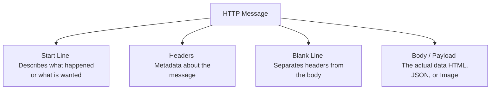

# 4. Deep Dive: Anatomy of HTTP Requests and Responses

In the previous chapter, we built our very first web server and briefly encountered the `req` (request) and `res` (response) objects. We used them to check the URL and send back simple text or HTML.

However, to become a proficient MERN stack developer, you need to understand that HTTP is a highly structured language. The browser and the server don't just throw raw text at each other; they send beautifully organized packages of information. 

In this chapter, we will pull out our magnifying glass and thoroughly dissect the anatomy of these two critical objects. Understanding *exactly* what hides inside a Request and a Response is the key to building secure, dynamic, and powerful APIs.

---

## 4.1 The HTTP Message Structure

Whether it's a request flying out of your browser or a response flying back from the server, every HTTP message shares a nearly identical physical structure, structured like a formal letter.



Let's break down how this structure applies to the Request and the Response independently.

---

## 4.2 Dissecting the Request (`req`)

When a user interacts with your application—whether they are navigating to a new page, submitting a login form, or uploading a profile picture—the browser packages that action into an **HTTP Request**.

The Request primarily consists of three crucial pieces of information:

### 1. The Start Line (Method & URL)
The very first line of a request tells the server **what action** to take and **where** to take it. 

The "Where" is the URL (e.g., `/users` or `/about`). The "Action" is defined by an **HTTP Verb** (or Method). There are four primary verbs you will use endlessly in the MERN stack (often referred to as CRUD: Create, Read, Update, Delete):

- **`GET` (Read)**: *"Give me some data."* (Used when loading a webpage or fetching a list of users).
- **`POST` (Create)**: *"Take this new data and save it."* (Used when submitting a registration form).
- **`PUT` / `PATCH` (Update)**: *"Take this data and update an existing record."* (Changing a password or updating a profile).
- **`DELETE` (Delete)**: *"Destroy this record."* (Removing an item from a shopping cart).

### 2. The Headers (Metadata)
Headers are hidden key-value pairs that provide the server with context about the request. The user never sees them, but your server relies on them heavily. 
- `User-Agent`: Tells the server if the user is on Google Chrome, an iPhone Safari browser, or a web scraper.
- `Content-Type`: Tells the server what format the data is in (e.g., `application/json` or `text/html`).
- `Authorization`: Contains hidden tokens or passwords to prove the user is logged in.

### 3. The Body (The Payload)
If a user is sending data *to* the server (like a `POST` or `PUT` request), the actual data (their username, their password, the image file) lives in the Body. `GET` requests usually do not have a body.

### Inspecting the Request in Node.js

Let's write a quick server to pry open the `req` object and look at its guts!

```javascript
// server.js
const http = require('http');

const server = http.createServer((req, res) => {
    // 1. Inspecting the Method and URL (The Start Line)
    console.log(`Incoming Request: [${req.method}] ${req.url}`);

    // 2. Inspecting the Headers
    console.log("User's Browser:", req.headers['user-agent']);
    
    res.writeHead(200);
    res.end("Check your terminal to see the Request details!");
});

server.listen(3000, () => console.log('Spying on requests at port 3000...'));
```

When you visit `http://localhost:3000` in your Chrome browser, your Node.js terminal will output something like:
```
Incoming Request: [GET] /
User's Browser: Mozilla/5.0 (Windows NT 10.0; Win64; x64) AppleWebKit/537.36...
```

---

## 4.3 Dissecting the Response (`res`)

Once your server has parsed the Request, queried the database, or read a file, it must send an **HTTP Response** back to the client so the browser knows what to render on the screen.

Just like the Request, the Response has a Start Line, Headers, and a Body.

### 1. The Start Line (Status Codes)
The Start Line of a response contains the HTTP Version and, most importantly, the **HTTP Status Code**. This is a 3-digit number that instantly tells the browser if the request was a magnificent success or a catastrophic failure.

You must memorize the 5 families of Status Codes:
- **100s (Informational)**: *"Hold on, I'm still processing."*
- **200s (Success)**: *"Everything went perfectly!"*
  - `200 OK`: Standard success.
  - `201 Created`: Successfully created a new resource (e.g., after a POST).
- **300s (Redirection)**: *"The page moved. Go over there instead."*
- **400s (Client Error)**: *"You messed up."*
  - `400 Bad Request`: The user sent invalid data.
  - `401 Unauthorized`: The user needs to log in first.
  - `404 Not Found`: The user asked for a page that doesn't exist.
- **500s (Server Error)**: *"I (the server) messed up."*
  - `500 Internal Server Error`: Your Node.js code crashed or the database blew up.

### 2. The Headers & Body
Just like the Request, the Response uses headers to give context. The most vital response header is `Content-Type`. It tells the browser how to interpret the Body. If you send HTML but tell the browser it's plain text, the browser will literally print `<h1>Hello</h1>` onto the white screen instead of rendering a bold header.

### Sending a Comprehensive Response in Node.js

Let's build a server that explicitly defines the Status Code, sets multiple headers, and sends a JSON body payload:

```javascript
// server.js
const http = require('http');

const server = http.createServer((req, res) => {
    
    // We only want to respond to GET requests on the '/profile' route
    if (req.method === 'GET' && req.url === '/profile') {
        
        // 1. Prepare our Database (in this case, just an object)
        const userProfile = {
            username: "MernNinja",
            role: "Admin",
            points: 9001
        };

        // 2. Craft the Start Line & Headers
        res.writeHead(200, {
            'Content-Type': 'application/json',
            'X-Powered-By': 'Node.js Magic' // You can invent custom headers!
        });

        // 3. Send the Body and end the Response
        // Remember: The network only understands Strings or Buffers, not raw JS Objects.
        res.end(JSON.stringify(userProfile));
        
    } else {
        // If they visit any other page, send a 404 Client Error
        res.writeHead(404, { 'Content-Type': 'text/plain' });
        res.end("404 Error: Sorry, we couldn't find what you were looking for.");
    }
});

server.listen(3000, () => console.log('Server running...'));
```

---

## 4.4 The Complexity of the Payload (Why pure Node is hard)

We established earlier that a `POST` request carries data in its **Body**. For example, when a user fills out a registration form and clicks submit, their username and password are included in the request body.

You might think you could just type `console.log(req.body)` to see their password. Unfortunately, the raw `http` module doesn't work that way.

When data is sent over the internet, it doesn't arrive all at once. It arrives in tiny, fragmented chunks. To read a `POST` body in raw Node.js, you have to manually catch these chunks as they arrive, stitch them together in a "Buffer", and parse them when the stream is finished.

```javascript
const http = require('http');

const server = http.createServer((req, res) => {
    if (req.method === 'POST' && req.url === '/register') {
        let body = ''; // A bucket to hold the chunks
        
        // Listen for the 'data' event. This fires every time a tiny chunk arrives.
        req.on('data', (chunk) => {
            body += chunk.toString(); // Stitch the chunk into our bucket
        });

        // Listen for the 'end' event. This fires when the transfer is complete.
        req.on('end', () => {
            console.log("We successfully stitched the body together!");
            console.log(body); // e.g., "username=john&password=123"
            
            res.writeHead(201); // 201 Created
            res.end("User successfully registered!");
        });
    }
});
```

### The Express.js Savior

If the code block above made you sweat a little, don't worry. Manually stitching data chunks together using events like `req.on('data')` is fragile, tedious, and prone to security issues. 

It highlights exactly *why* modern developers rarely write raw `http` servers. 

## Summary

In this deep dive, you learned how to systematically pull apart the messages driving the web:
1. Every HTTP message is split into a **Start Line**, **Headers** (Metadata), and a **Body** (Payload).
2. The **Request (`req`) Start Line** contains the **HTTP Method** (GET/POST/PUT/DELETE) and the URL.
3. The **Response (`res`) Start Line** contains the highly critical **Status Code** (ranging from 100 to 500) that signals success or failure.
4. Extracting JSON or form data manually from a raw Node.js `req` object requires complex buffer streaming and event listeners.

Now that you possess a deep understanding of what happens at the network baseline, we are fully equipped to install **Express.js** and let it handle all of this complex stitching and routing for us automatically!
