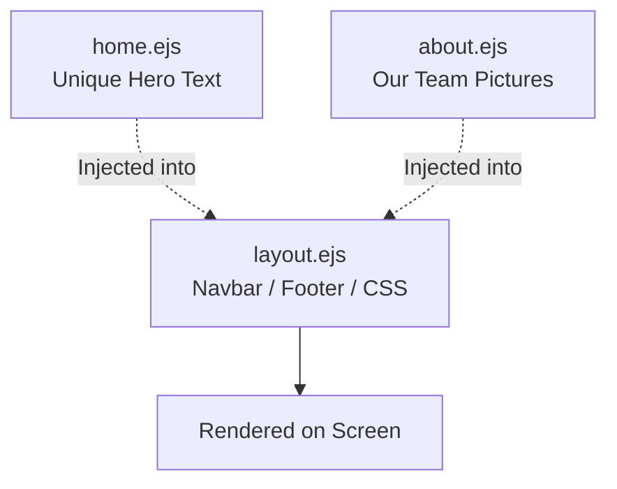

# 13. Mastering EJS: Eliminating Repetition with Layouts

In Chapter 8, we discovered how to use Server-Side Rendering (SSR) via Embedded JavaScript (EJS). We dynamically injected data into our HTML templates before shipping them to the user.

However, as you build increasingly complex, multi-page applications, you will encounter a frustrating violation of the DRY (Don't Repeat Yourself) principle.

Think about a standard website. The `Home` page, the `About` page, and the `Contact` page all share the exact same `<html>` tags, `<head>` meta tags, CSS `<link>` tags, Top Navigation Bar, and Bottom Footer. If you have 50 pages and you want to change a link on the Navigation Bar, do you manually open and edit 50 individual `.ejs` files?

Absolutely not. In this chapter, we will eliminate HTML boilerplate by introducing an incredibly popular package called **`express-ejs-layouts`**.

---

## 13.1 The Layout Paradigm

Instead of copying and pasting the shell of the website into every single file, we will create a **Master Layout** file. This master file acts as the permanent, unmoving frame of our application (holding the Navbars and Footers).

Inside this master layout is a massive, dynamic hole. When the user visits `/about`, Express takes the unique content for the About page and dynamically injects it straight into that hole!



---

## 13.2 Installation and Setup

Like everything powerful in Node.js, `express-ejs-layouts` is a piece of **Middleware** downloaded from NPM.

First, install the package:
```bash
npm install express-ejs-layouts
```

Next, configure your main `server.js` file:
```javascript
// server.js
const express = require('express');
const expressLayouts = require('express-ejs-layouts'); // 1. Import it

const app = express();

// 2. Set the EJS view engine
app.set('view engine', 'ejs');

// 3. Mount the layout middleware BEFORE your route handlers!
app.use(expressLayouts);

app.get('/', (req, res) => {
    // 4. Render the page as normal. 
    // The middleware magically intercepts this and wraps it in the layout!
    res.render('home'); 
});

app.listen(3000, () => console.log('Server is running...'));
```

---

## 13.3 Creating the Master Layout

By default, the middleware specifically hunts for a file named `layout.ejs` in your `views` folder. Let's create it.

Pay special attention to the `<%- body %>` tag. 

*   Earlier, we learned that `<%= %>` (with an equals sign) safely prints raw text. 
*   However, `<%- %>` (with a dash) tells EJS to render **Unescaped Raw HTML**. Because we are injecting entire pages of HTML code, we must use the dash!

```html
<!-- views/layout.ejs -->
<!DOCTYPE html>
<html lang="en">
<head>
    <meta charset="UTF-8">
    <title>My SSR Website</title>
    <!-- We put our global CSS and Bootstrap links here ONE time! -->
    <link rel="stylesheet" href="/css/styles.css">
</head>
<body>
    
    <!-- Permanent Navigation Bar -->
    <nav style="background: black; color: white; padding: 10px;">
        <a href="/">Home</a> | <a href="/about">About</a> | <a href="/shop">Shop</a>
    </nav>

    <!-- THE MAGIC HOLE -->
    <!-- This is where all specific page content will be beautifully injected -->
    <main style="padding: 20px;">
        <%- body %>
    </main>

    <!-- Permanent Footer -->
    <footer>
        <p>&copy; 2024 The MERN Ninja Academy. All rights reserved.</p>
    </footer>

</body>
</html>
```

---

## 13.4 Building the Unique Pages

Now that the master shell is configured, building our individual pages becomes magically simple. 

We completely discard all the repetitive doctypes, head tags, and body tags. Our `views/home.ejs` and `views/about.ejs` files now *strictly* contain their unique inner content.

```html
<!-- views/home.ejs -->

<!-- Notice: NO <html> or <head> tags! -->
<h1>Welcome to the Dashboard</h1>
<p>This paragraph will be perfectly centered inside the Layout's <main> tag.</p>
<button>Click Here to Start</button>
```

```html
<!-- views/about.ejs -->

<h2>About Us</h2>
<p>We are a team of passionate MERN stack developers building clean SSR applications.</p>
```

When someone hits your `.get('/about')` route and the server runs `res.render('about')`, the middleware silently grabs `about.ejs`, runs over to `layout.ejs`, replaces `<%- body %>` with the about content, and ships the fully formed HTML to the browser!

## Summary

In this essential chapter, we solved the nightmare of repetitive styling and HTML structures:
1. **DRY Principle:** Repeating standard HTML elements (Navbars, tags) across dozens of files makes a website impossible to safely maintain or update.
2. **`express-ejs-layouts`**: We installed an NPM middleware that elegantly surrounds specific page content inside a master graphical frame.
3. **The Unescaped Tag (`<%- body %>`)**: We utilized the unescaped EJS print tag (the dash) to allow raw `<main>` page HTML to flow directly into the layout shell securely.

Now that our Express applications are highly modular, visually clean, and effortlessly connected to a Database, we have all the puzzle pieces required to build a real-world enterprise SSR application. 

In the next chapter, we will put this knowledge to the ultimate test by building a dynamic, server-rendered E-Commerce Storefront from scratch!
