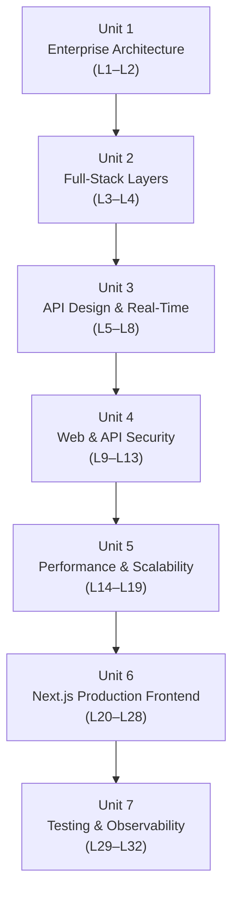

# Advanced Web Technologies (CSC337)

**Credit hours:** 3 (2 lecture + 1 lab) · **Pre-requisite:** CSC336 — Web Technologies
**Audience:** BS Computer Science, 6th semester

Advanced Web Technologies picks up exactly where Web Technologies leaves off. Where CSC336
taught you to build a working full-stack application, CSC337 teaches you to build a
**production-grade** one: designed with proper architecture, secured against real attacks,
fast under real load, observable in production, and shipped with Next.js instead of a
plain React SPA.

## Course objectives

- Understand the enterprise architecture of a web application.
- Design and implement scalable, real-time, production-grade applications in Express.js.
- Implement security on REST APIs.
- Implement front-end applications using Next.js.
- Understand how full-stack development works end to end.
- Build a full, scalable web application and API using current technologies.

## What you will be able to do (Course Learning Outcomes)

| CLO | You will be able to... | Bloom's level |
|---|---|---|
| CLO-1 | Explain principles and architectures of full-stack web applications | Understanding |
| CLO-2 | Apply principles of full-stack web application development to given requirements | Applying |
| CLO-3 | Evaluate technologies and architectural approaches for full-stack development | Evaluating |
| CLO-4 | Apply testing, monitoring, security and deployment practices | Applying |
| CLO-5 | Implement full-stack web applications using modern development technologies | Creating |
| CLO-6 | Develop full-stack web applications using appropriate development practices | Creating |

## How the book is organized

The 32 lectures are grouped into 7 units, matching the official course description form.

| Unit | Topic | Lectures |
|---|---|---|
| 1 | [Enterprise Architecture Foundations](lecture-01-course-overview-and-enterprise-architecture.md) | 1–2 |
| 2 | [Full-Stack Architecture Layers](lecture-03-business-infrastructure-application-layers.md) | 3–4 |
| 3 | [API Design and Real-Time Communication](lecture-05-professional-api-design.md) | 5–8 |
| 4 | [Web and API Security](lecture-09-authentication-and-authorization.md) | 9–13 |
| 5 | [Performance, Caching and Scalability](lecture-14-frontend-performance.md) | 14–19 |
| 6 | [Production Frontend with Next.js](lecture-20-nextjs-architecture-and-setup.md) | 20–28 |
| 7 | [Testing, Reliability and Monitoring](lecture-29-web-application-and-api-testing.md) | 29–32 |

## Assessment

Quizzes, assignments and a midterm (lecture 17) build toward a comprehensive final exam
(50%), alongside a semester project demonstrated during the course review (lecture 32).

## Recommended books

- *Web Development with Node and Express* — Ethan Brown (O'Reilly)
- *Node.js Design Patterns* — Mario Casciaro & Luciano Mammino
- *Designing Data-Intensive Applications* — Martin Kleppmann
- *Real-World Next.js* — Michele Riva
- *MongoDB: The Definitive Guide* — Shannon Bradshaw, Eoin Brazil & Kristina Chodorow
- Official Next.js Documentation ([nextjs.org/learn](https://nextjs.org/learn))

!!! tip "Prerequisite check"
    If terms like tiered architecture, REST, sessions, ORMs or React hooks are unfamiliar,
    revisit [Web Technologies (CSC336)](../web-technologies/index.md) first — this course
    builds directly on it.

---

Ready? Start with **[Lecture 1 — Course Overview and Enterprise Web Application Architecture](lecture-01-course-overview-and-enterprise-architecture.md)**.
