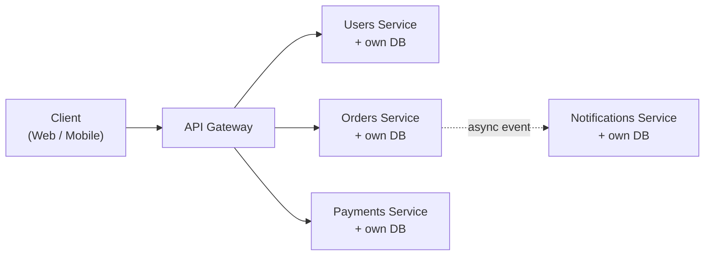
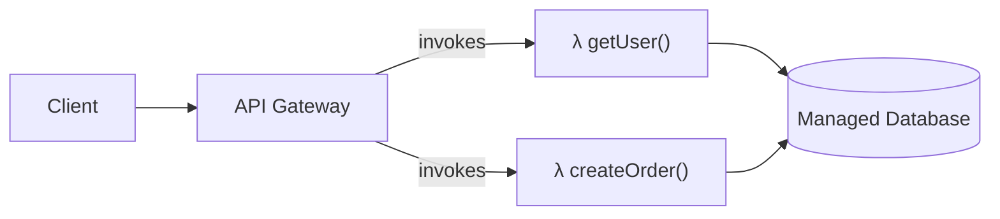
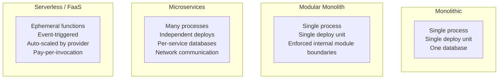
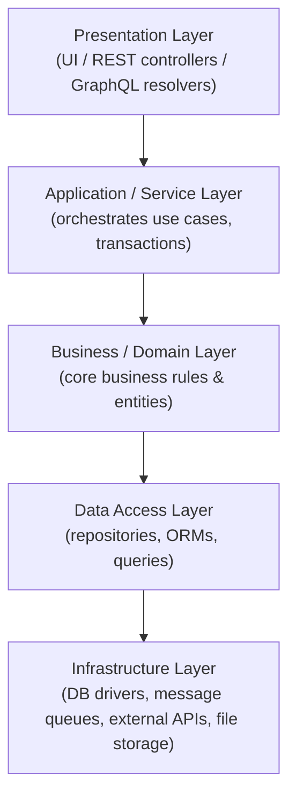
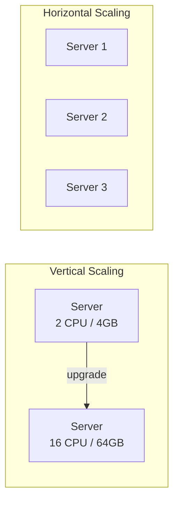
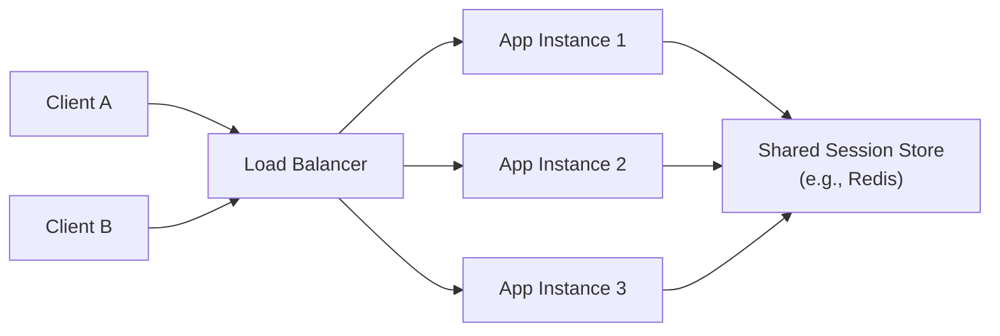
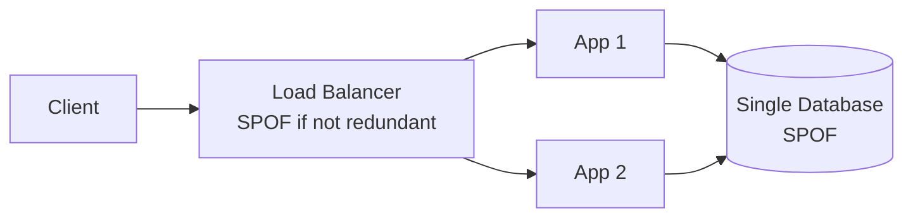

# Lecture 1: Course Overview and Enterprise Web Application Architecture

This lecture sets the stage for the entire course: it explains what changes when a web
application has to survive contact with real users, real traffic, and real failure — and
introduces the vocabulary of enterprise architecture you'll use for the rest of the
semester.

## In This Lecture

- Understand how this course builds on Web Technologies (CSC336) and what "production-grade"
  means in practice
- Compare monolithic, modular monolith, microservices, and serverless architectures
- Understand layered architecture: presentation, application/service, business/domain,
  data access, and infrastructure layers
- Understand scalability fundamentals: horizontal vs. vertical scaling, statelessness,
  load balancing, and single points of failure

## From "A Working App" to "A Production-Grade App"

In Web Technologies (CSC336), you built a full-stack application: an Express REST API
backed by MongoDB, consumed by a React front end. That application almost certainly
worked correctly when you demoed it — a handful of requests, one server, one database, no
adversarial traffic, and nobody watching what happened when something broke.

That is a **working application**. It is not yet a **production-grade** one. The gap
between the two is not about adding more features — it's about everything that has to be
true *around* the features once real users depend on the system:

- **It has to stay up.** A crash, a slow database query, or a dependency timeout can't
  take the whole application down with it.
- **It has to handle load it wasn't tested at.** Traffic is bursty and unpredictable; the
  system needs a plan for 10x the expected load, not just the load you tested with.
- **It has to be secure against people actively trying to break it**, not just against
  accidental misuse.
- **It has to be observable.** When something goes wrong at 3 a.m., someone needs to be
  able to find out *why* without reading through the entire codebase.
- **It has to be maintainable by a team**, not just by the one person who wrote it,
  often for years after the original developer has moved on.

CSC337 is about closing that gap. Over the semester you will learn to design proper
architecture, secure REST APIs against real attacks, build for real-time communication,
optimize for performance under load, and ship a production frontend with Next.js. This
first unit gives you the conceptual foundation — the vocabulary and mental models — that
every later unit builds on.

!!! note "Why architecture comes first"
    It's tempting to jump straight to "how do I secure my API" or "how do I make this
    fast." But security, performance, and scalability are all *consequences* of
    architectural decisions made early. A poorly architected system can be patched but
    never truly fixed without a rewrite — so we start here.

## Web Application Architectures

An application's **architecture** is the set of decisions about how its components are
structured, where they run, and how they communicate. At the enterprise level, four
architectural styles dominate discussion: **monolithic**, **modular monolith**,
**microservices**, and **serverless**. None of them is universally "correct" — each is a
different answer to the trade-off between simplicity and flexibility.

### Monolithic Architecture

A **monolith** is an application built and deployed as a single, unified unit. All of
its functionality — user management, orders, payments, notifications, and so on — lives
in one codebase, runs in one process (or a set of identical replicas of that same
process), and is deployed together as a single artifact.

```text
my-app/
├── src/
│   ├── users/
│   ├── orders/
│   ├── payments/
│   └── notifications/
├── package.json
└── server.js        # one process, one deployment
```

This is almost certainly the shape of the Express application you built in CSC336, and
it's how the overwhelming majority of new applications should start.

**Advantages:**

- **Simple to develop and reason about** — one codebase, one language, one set of
  dependencies, one place to look for any piece of logic.
- **Simple to deploy** — a single build artifact, a single deployment pipeline.
- **Simple to test end-to-end** — no network calls between components to mock or
  simulate.
- **Low operational overhead** — no service discovery, no distributed tracing, no
  inter-service network to secure.

**Disadvantages:**

- **Scales as a single unit.** If only the "notifications" feature is under heavy load,
  you still have to scale the *entire* application, wasting resources on the parts that
  didn't need it.
- **Tight coupling over time.** Without discipline, modules start reaching into each
  other's internals, and the codebase becomes harder to change safely as it grows.
- **A single bug can bring down everything**, since all functionality shares the same
  process.
- **The whole application must be redeployed for any change**, however small, which
  slows down release cycles as the team and codebase grow.

### Modular Monolith

A **modular monolith** is still deployed as a single unit, but the *internal* code is
strictly organized into well-defined modules with explicit boundaries and APIs between
them — as if each module were a mini-service, minus the network hop.

```text
my-app/
├── src/
│   ├── modules/
│   │   ├── users/          # owns its own models, logic, routes
│   │   │   ├── users.controller.js
│   │   │   ├── users.service.js
│   │   │   └── users.repository.js
│   │   ├── orders/
│   │   └── payments/
│   ├── shared/              # only truly cross-cutting code lives here
│   └── server.js
└── package.json
```

Modules communicate through explicit interfaces (function calls or internal events)
rather than reaching directly into each other's database tables or internal state. This
gives you most of the maintainability benefits of microservices — clear ownership,
enforced boundaries, easier reasoning about change impact — while keeping the operational
simplicity of a single deployable.

!!! tip "Start here, almost always"
    For the vast majority of applications — including most startups and most enterprise
    internal tools — a modular monolith is the right starting point. It's easy to later
    extract a module into its own microservice *if and when* you have a concrete,
    measured reason to (e.g., that module needs to scale independently, or a separate
    team needs to own its release cycle). Extracting a module that was always cleanly
    bounded is far cheaper than untangling a tangled monolith later.

### Microservices Architecture

A **microservices** architecture splits the application into a set of small, independently
deployable services, each owning a specific business capability and, typically, its own
data store. Services communicate over the network — usually via HTTP/REST, gRPC, or
asynchronous messaging.



**Advantages:**

- **Independent scaling** — scale only the services under load (e.g., replicate the
  Orders service 10x during a sale, leave everything else as-is).
- **Independent deployment** — teams ship their own service on their own schedule
  without coordinating a company-wide release.
- **Technology flexibility** — each service can use the language, framework, or database
  best suited to its job.
- **Fault isolation** — if one service fails, the rest of the system can often continue
  operating (perhaps in a degraded mode).

**Disadvantages:**

- **Massive operational complexity** — you now need service discovery, distributed
  tracing, network security between services, orchestration (e.g., Kubernetes), and much
  more monitoring.
- **Distributed data management** — no more simple database joins across features; you
  need patterns for keeping data consistent across services that each own their own
  database.
- **Network latency and reliability** — every inter-service call can fail, time out, or
  be slow, and your code has to handle that.
- **Harder local development and testing** — running "the whole system" locally can mean
  running a dozen services at once.

We will study microservices in depth in Lecture 2, including service boundaries and
inter-service communication patterns.

### Serverless Architecture

**Serverless** architecture (most commonly realized as **Functions-as-a-Service**, or
FaaS — e.g., AWS Lambda, Vercel Functions, Azure Functions) goes a step further: instead
of deploying and managing long-running server processes at all, you deploy individual
functions that the cloud provider runs on demand, in response to events (an HTTP request,
a message on a queue, a file upload), and scales automatically — including scaling down
to *zero* running instances, and zero cost, when there is no traffic.



**Advantages:**

- **No server management** — no OS patching, no capacity planning, no idle servers to
  pay for.
- **Automatic, near-instant scaling** — the platform handles scale-out (and scale-to-zero)
  for you.
- **Pay-per-execution pricing** — you pay for actual invocations and compute time, not
  for idle capacity.

**Disadvantages:**

- **Cold starts** — a function that hasn't run recently may take noticeably longer to
  respond to its first request while the platform provisions it.
- **Vendor lock-in** — serverless code is often tightly coupled to a specific cloud
  provider's APIs and event formats.
- **Harder to reason about state and long-running processes** — functions are meant to
  be short-lived and (mostly) stateless, which doesn't suit every workload (e.g.,
  WebSocket connections, long computations).
- **Debugging and local testing are harder** — the execution environment is managed by
  the provider and can be difficult to fully replicate locally.

### Comparing the Four Styles



| Factor | Monolith | Modular Monolith | Microservices | Serverless |
|---|---|---|---|---|
| **Deployment unit** | Whole app | Whole app | Per service | Per function |
| **Scaling granularity** | Whole app | Whole app | Per service | Per function, automatic |
| **Operational complexity** | Low | Low | High | Low–Medium (provider-managed) |
| **Team autonomy** | Low | Medium | High | High |
| **Best for** | Small–medium apps, startups, MVPs | Growing apps that need internal discipline | Large orgs, independently scaling domains | Spiky/event-driven workloads, glue code |

!!! warning "Don't cargo-cult microservices"
    Companies like Netflix and Amazon use microservices because they have hundreds of
    engineering teams and traffic patterns that genuinely require independent scaling.
    Adopting microservices for a project with a five-person team mostly buys you the
    disadvantages (operational complexity, distributed debugging) without the benefits
    you actually need. Architecture should follow *measured* requirements, not trends.

## Layered Architecture

Where the architectures above describe how an application is split **physically**
(across processes, deployments, and machines), **layered architecture** describes how
code is organized **logically**, inside any one of those deployment units. Every style
above — monolith, modular monolith, or an individual microservice — should still be
internally layered.

A well-layered enterprise application typically has five layers:



1. **Presentation layer** — the entry point into the system: REST controllers, GraphQL
   resolvers, or a rendered UI. Its job is to handle input/output (parsing requests,
   validating shapes, formatting responses) and nothing more. It should not contain
   business rules.

2. **Application / service layer** — orchestrates *use cases*: "register a new user,"
   "place an order." It coordinates calls into the business layer and the data access
   layer, manages transactions, and enforces application-level workflow (e.g., "send a
   confirmation email after an order is placed").

3. **Business / domain layer** — the heart of the system: the core business rules and
   entities that make your application what it is (e.g., "an order cannot be shipped
   until it is paid," "a discount code cannot be combined with another discount code").
   This layer should be independent of *how* data is stored or *how* requests arrive —
   it shouldn't know or care whether it's called from a REST API or a CLI script.

4. **Data access layer** — responsible for translating between the domain layer's
   objects and however data is actually persisted: repositories, ORM/ODM models (e.g.,
   Mongoose schemas), and query logic live here.

5. **Infrastructure layer** — the lowest level: actual database drivers, message queue
   clients, third-party API SDKs, file storage clients, email providers. This is the
   layer most likely to change when you swap a vendor (e.g., moving from local file
   storage to Amazon S3).

```text
src/
├── presentation/        # controllers, route definitions, request/response DTOs
├── application/         # use-case orchestration (e.g., PlaceOrderService)
├── domain/              # business entities and rules (e.g., Order, DiscountPolicy)
├── data-access/         # repositories (e.g., OrderRepository)
└── infrastructure/       # DB clients, queue clients, email/SMS providers
```

!!! note "Dependencies point inward"
    A core rule of layered architecture: each layer should only depend on the layer(s)
    "below" it in the diagram above (presentation depends on application, which depends
    on business, and so on) — never the reverse, and never skipping layers casually. The
    business layer, in particular, should have no idea that a database or an HTTP request
    even exists. This is what makes it possible to unit-test business rules without
    spinning up a real database, and to swap the database technology without touching
    business logic.

!!! tip "You already did a simplified version of this"
    In CSC336's tiered architecture lecture, you separated presentation, application, and
    data *tiers* physically. Layered architecture applies that same separation-of-concerns
    thinking *inside* a single tier's codebase — and, as you'll see in Lecture 3–4, real
    enterprise applications combine both: tiers for physical deployment, layers for code
    organization within each tier.

## Scalability and Reliability Fundamentals

Once an architecture is chosen, it has to actually hold up under load and keep running
when parts of it fail. Four concepts underpin almost every scalability discussion you'll
have this semester.

### Horizontal vs. Vertical Scaling

**Vertical scaling** ("scaling up") means giving a single machine more resources — more
CPU cores, more RAM, faster disks.

**Horizontal scaling** ("scaling out") means adding *more machines* (or containers,
or processes) running copies of the same application, and distributing load across them.



| Factor | Vertical Scaling | Horizontal Scaling |
|---|---|---|
| **How** | Bigger machine | More machines |
| **Ceiling** | Hard physical/cost limit on a single machine | Effectively unlimited (add more machines) |
| **Downtime to scale** | Often requires a restart/migration | New instances can join without downtime |
| **Fault tolerance** | None — still one machine, one failure point | High — one instance failing doesn't take down the rest |
| **Complexity** | Low | Higher — requires load balancing, often statelessness |

Modern enterprise systems overwhelmingly favor horizontal scaling because it has no hard
ceiling and, critically, improves fault tolerance — but it only works cleanly if the
application is designed to support it, which brings us to statelessness.

### Stateless Applications

An application server is **stateless** when it does not store any client-specific data
(like session data) in its own memory or local disk between requests. Every request
carries (or can retrieve, e.g., via a token or an external store) everything needed to
process it, so *any* instance of the application can handle *any* request.



If instead session data were stored in one server's local memory, that server would have
to handle every future request from that same client (a pattern called **sticky
sessions**) — which defeats much of the point of horizontal scaling, and means losing
that one server also loses every session it was holding.

!!! tip "Where does the state go, then?"
    Statelessness doesn't mean an application has no state anywhere — it means state
    doesn't live *inside a specific application instance's memory*. Instead, it lives in
    a shared, external store: a database, or a shared cache like Redis. Any instance can
    read that shared state, so any instance can serve any request.

### Load Balancing

A **load balancer** sits in front of a set of horizontally-scaled application instances
and distributes incoming requests across them, according to some algorithm (round-robin,
least-connections, or based on server health/response time). It is what makes horizontal
scaling actually usable from a client's point of view — the client only ever talks to
one address (the load balancer), which transparently routes to whichever backend
instance is best suited to handle the request right now.

Load balancers typically also perform **health checks**, routing traffic away from
instances that are failing or overloaded, which directly improves reliability.

### Single Points of Failure

A **single point of failure (SPOF)** is any component whose failure alone is enough to
bring down the whole system. A single database server with no replica, a single
application instance with no redundancy, or — perhaps counterintuitively — an
un-replicated load balancer itself, are all SPOFs.



Eliminating single points of failure is a matter of **redundancy**: multiple load
balancers (often with a DNS or network-level failover), multiple database replicas, and
multiple application instances spread across, ideally, more than one physical location
or availability zone.

!!! warning "Horizontal scaling alone does not equal reliability"
    Adding more application instances behind a load balancer improves *capacity* and
    reduces the impact of any single instance failing. But if all those instances still
    depend on one un-replicated database, you haven't removed your SPOF — you've just
    moved it. Reliability requires examining *every* layer of the architecture for
    single points of failure, not just the one you scaled first.

## Try It Yourself

1. Sketch (on paper or as a mermaid `flowchart`) the architecture of an application you
   use daily — for example, a food delivery app. Decide whether you think it's closer to
   a monolith, a modular monolith, microservices, or a mix, and justify your reasoning in
   2–3 sentences based on what you'd expect its scaling needs to be.
2. Take the Express + MongoDB application you built in CSC336. Identify, in writing,
   which parts of your existing code would map to each of the five layers (presentation,
   application, business/domain, data access, infrastructure) discussed in this lecture.
   Note any places where two layers' responsibilities were mixed together in the same
   file or function.

## Key Takeaways

- CSC337 is about the gap between a **working** application and a **production-grade**
  one: uptime, scalability, security, observability, and team maintainability.
- **Monoliths** are simple to build and deploy but scale and deploy as a single unit;
  **modular monoliths** add internal boundaries for maintainability while staying simple
  to operate.
- **Microservices** allow independent scaling and deployment per service, at the cost of
  significant operational and data-management complexity.
- **Serverless/FaaS** removes server management and scales automatically (including to
  zero), but introduces cold starts and provider lock-in.
- **Layered architecture** (presentation, application, business, data access,
  infrastructure) organizes code *inside* any deployment unit, with dependencies pointing
  inward toward the business/domain layer.
- **Horizontal scaling** (more machines) is generally preferred over **vertical scaling**
  (bigger machines) for fault tolerance and effectively unlimited growth, but it requires
  **stateless** application instances and a **load balancer** in front of them.
- A **single point of failure** is any component whose failure alone takes down the whole
  system — reliability requires finding and removing SPOFs at every layer, not just
  scaling the first bottleneck you notice.
