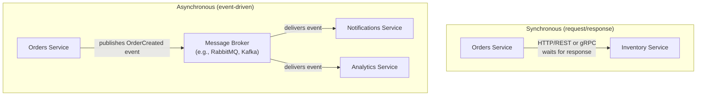
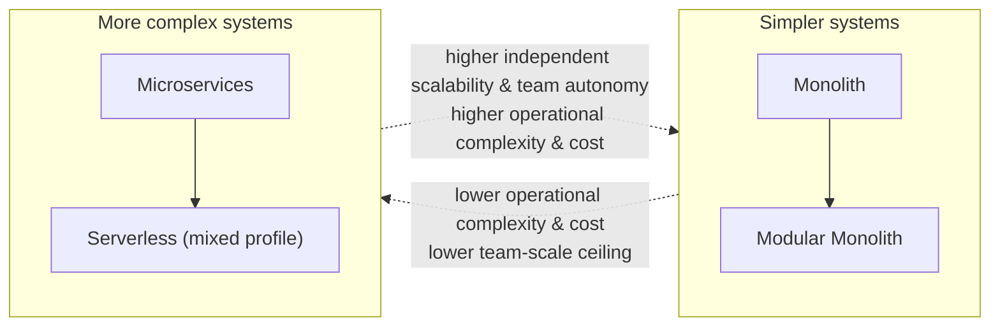
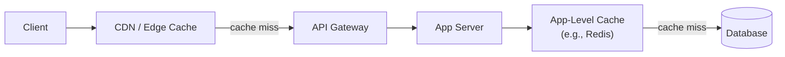
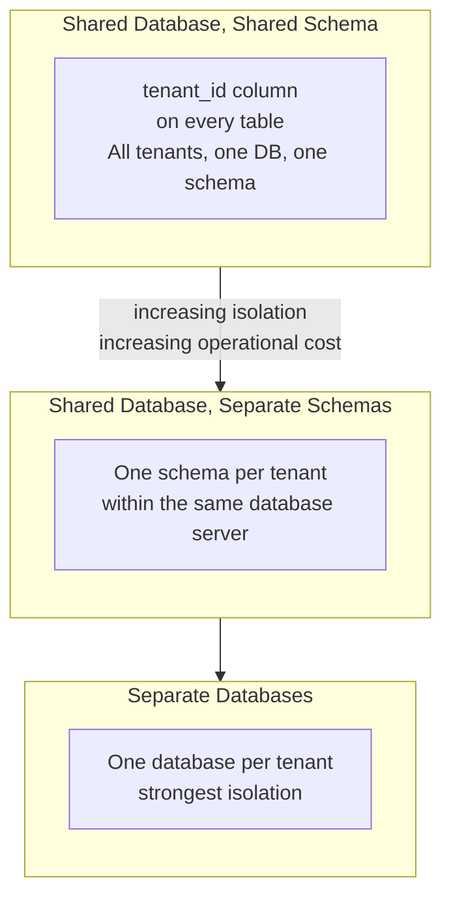

# Lecture 2: Technology Selection and Cross-Cutting Concerns

Choosing an architecture is only half the job — you also have to choose the right
architecture *for your specific problem*, and design for the concerns that cut across
every layer and every service regardless of which architecture you picked. This lecture
gives you the decision-making framework and vocabulary for both.

## In This Lecture

- Understand microservices fundamentals: service boundaries, benefits, challenges, and
  inter-service communication
- Learn a framework for architecture and technology selection based on real trade-offs
- Understand the cross-cutting concerns every enterprise application must address:
  security, performance, communication, and deployment
- Get a conceptual introduction to multi-tenancy SaaS architecture

## Microservices Fundamentals

Lecture 1 introduced microservices as one of four architectural styles. Before you can
reasonably decide *when* to use them, you need a firmer grip on how they're actually
structured — starting with the single hardest problem in microservices design: drawing
the boundaries.

### Service Boundaries

A **service boundary** defines what a single microservice is responsible for — what data
it owns, what operations it exposes, and, just as importantly, what it does *not* do. Get
boundaries wrong and you end up with what practitioners call a **distributed monolith**:
services that are physically separate (deployed independently, running in separate
processes) but so tightly coupled in practice — constantly calling each other
synchronously, sharing a database, or needing to be deployed together to work correctly —
that you inherit all the operational cost of microservices with none of the benefits.

The most reliable technique for drawing sound boundaries is to organize services around
**business capabilities** rather than technical layers. A common and effective heuristic
borrowed from domain-driven design is the **bounded context**: a boundary within which a
particular business concept (e.g., "Order," "User," "Product") has one consistent
meaning, one team that owns it, and one data model — even if the same real-world concept
looks different in another service's bounded context.

```text
Wrong: boundaries by technical layer      Right: boundaries by business capability
   (produces a distributed monolith)         (produces real microservices)

   ui-service/                                users-service/
   business-logic-service/                    orders-service/
   database-service/                          payments-service/
                                               notifications-service/
```

!!! note "A rule of thumb: the database test"
    If two "services" need to read from or write to the same database tables to do their
    jobs, they are probably not correctly bounded — they're really one service, or the
    boundary needs to be redrawn. Each microservice should own its data exclusively;
    other services access that data only through the owning service's API, never
    directly.

### Benefits, Revisited

Correctly bounded services deliver the benefits introduced in Lecture 1 in a very
concrete way:

- **Independent deployability** — the Orders team can ship ten times a day without
  coordinating with the Payments team, as long as the API contract between them doesn't
  break.
- **Independent scalability** — during a flash sale, you scale only the Orders and
  Payments services, not Notifications or user-profile management.
- **Fault isolation** — if Notifications goes down, users can still place orders; they
  just don't get a confirmation email until it recovers.
- **Technology fit** — a service doing heavy numerical computation might be written in a
  different language/runtime than a simple CRUD service, without affecting the rest of
  the system.

### Challenges

These benefits come with real, recurring costs that every team adopting microservices
must budget for:

- **Distributed data consistency.** Without a single shared database, an operation that
  used to be one local database transaction (e.g., "create the order and decrement
  inventory") now spans two services and two databases. You need patterns like the
  **saga pattern** (a sequence of local transactions coordinated via events, with
  compensating actions to undo earlier steps if a later step fails) to keep data
  consistent without a traditional distributed transaction.
- **Network unreliability.** Every inter-service call can time out, fail, or arrive out
  of order. Code that used to be a simple function call now needs retries, timeouts, and
  fallback behavior.
- **Operational overhead.** You need service discovery (how does Orders find Payments'
  current network address?), centralized logging and distributed tracing (how do you
  follow one user's request across five services?), and typically an orchestration
  platform like Kubernetes.
- **Testing complexity.** Testing one service in isolation is easy; testing that the
  *system* behaves correctly end-to-end requires either a full staging environment or
  careful contract testing between services.
- **Organizational overhead.** Microservices work best when team boundaries mirror
  service boundaries (a principle sometimes summarized via **Conway's Law**: systems tend
  to mirror the communication structure of the organizations that build them). A small
  team maintaining twenty microservices often struggles more than it would with one
  well-organized modular monolith.

### Inter-Service Communication

Once services are correctly bounded, they still need to talk to each other. There are
two fundamentally different communication styles, and most real systems use a mix of
both.



**Synchronous communication** (typically HTTP/REST or gRPC) means the calling service
sends a request and blocks, waiting for a response, before continuing. It's simple to
reason about — it behaves like a function call — but it creates **temporal coupling**:
the calling service now depends on the called service being available and responsive
*right now*. A chain of synchronous calls (A calls B calls C) means A is only as reliable
and as fast as the slowest link in that chain.

**Asynchronous (event-driven) communication** means a service publishes an event (e.g.,
"OrderCreated") to a message broker without waiting for anyone to process it, and any
number of other services can subscribe to and react to that event independently, in
their own time. This decouples services in time — the publisher doesn't need the
subscriber to be available at the moment of publishing — and naturally supports adding
new subscribers later without changing the publisher at all.

| Factor | Synchronous (REST/gRPC) | Asynchronous (Events/Queues) |
|---|---|---|
| **Coupling** | Tighter — caller waits on callee's availability | Looser — publisher doesn't know or wait for subscribers |
| **Best for** | Needing an immediate answer (e.g., "is this in stock?") | Notifying/reacting to something that happened, fan-out to multiple consumers |
| **Failure handling** | Caller must handle timeouts/retries directly | Broker can retry delivery; consumers can be offline temporarily |
| **Complexity** | Lower to start | Higher (requires a message broker, eventual consistency reasoning) |

!!! tip "Default to sync for reads you need now, async for facts about what happened"
    A helpful rule of thumb: if you need an answer to proceed ("what is this user's
    current balance?"), use synchronous communication. If you're announcing that
    something already happened and other services merely need to *react* eventually
    ("an order was placed"), use asynchronous events. Most production systems use both.

## Architecture and Technology Selection

With the architectural styles from Lecture 1 and the microservices detail above in hand,
the real skill this course is building toward is **selection**: knowing when to reach for
which tool. There is no formula that outputs "the right answer" — but there is a
disciplined way to ask the question.

### A Framework for the Decision

Ask these questions, roughly in order, whenever you're choosing an architecture for a new
system or evaluating whether to evolve an existing one:

1. **What's the actual current scale, and what's the credible near-term scale?**
   Architecture should be justified by real or clearly-projected numbers (users,
   requests per second, data volume) — not by "we might be Google someday."
2. **How many teams will work on this, and how independent do they need to be?**
   One team can maintain a modular monolith very effectively. Multiple teams that need to
   release on independent schedules start to benefit from service boundaries.
3. **Which parts of the system have fundamentally different scaling or reliability
   needs?** If 95% of your load is on one feature (e.g., product search), that's a strong
   signal that feature might deserve to be its own scalable service, even if the rest of
   the app stays a monolith.
4. **What operational maturity does the team already have?** Running microservices well
   requires comfort with containers, orchestration, distributed tracing, and on-call
   practices. Adopting microservices without that maturity tends to produce more outages,
   not fewer.
5. **What is the cost budget** — both in infrastructure spend and in engineering time
   spent on operations rather than features?

### The Trade-off Table

Every architectural choice trades along the same four axes:

| Axis | What it means |
|---|---|
| **Complexity** | How hard is the system to understand, build, test, and change safely? |
| **Cost** | Infrastructure spend (servers, managed services) plus the engineering time spent on operations |
| **Performance** | Latency and throughput characteristics under real load |
| **Maintainability** | How easily can the system evolve over months and years, especially with team turnover? |



!!! warning "There is no free lunch"
    Every axis you improve by adding architectural sophistication, you generally pay for
    on another axis. Microservices improve independent scalability and team autonomy but
    cost you simplicity and often raw request latency (extra network hops). Serverless
    improves cost-at-idle and removes server management but costs you cold-start latency
    and long-running-process support. Evaluate trade-offs explicitly instead of assuming
    any one architecture is "better" in the abstract.

### A Worked Example

Consider a university course-registration system used by one institution, with a small
development team of four engineers.

- **Scale:** A few thousand students, sharp usage spikes only during registration week.
- **Teams:** One team, working closely together.
- **Differentiated needs:** Registration submission has a sharp spike; everything else
  (browsing the course catalog) is low and steady traffic.

A reasonable choice here is a **modular monolith**, with the course-catalog-browsing
module and the registration-submission module clearly separated internally — so that, if
registration week traffic ever genuinely requires it, the registration module alone could
be pulled out into its own horizontally-scaled service without a rewrite of the rest of
the system. Full microservices from day one would mean this four-person team maintaining
service discovery, distributed tracing, and inter-service contracts for a problem that a
well-organized single deployable solves just fine.

## Cross-Cutting Concerns

A **cross-cutting concern** is a requirement that doesn't belong to any single layer or
service, but instead applies *across* the entire system — every layer, every service,
every request. Getting these right is what separates production-grade systems from
working demos, regardless of which architecture you chose.

### Security

Security has to be designed in at every layer, not bolted on afterward:

- **Authentication and authorization** at the presentation/API boundary (who is this
  user, and what are they allowed to do?) — covered in depth in Unit 4.
- **Transport security** — encrypting data in transit (TLS/HTTPS) for every network hop,
  including *between* internal services, not just between client and server.
- **Input validation** at every trust boundary — every layer that receives data from
  outside itself (including from another internal service) should validate it, rather
  than trusting that "it was already validated upstream."
- **Least privilege** — each service, and each layer within it, should have only the
  data access and permissions it actually needs (e.g., the Notifications service should
  not have write access to the Payments database).

### Performance: Latency, Throughput, and Caching

Three concepts anchor almost every performance discussion in this course:

- **Latency** is how long a single request takes to complete, usually measured in
  milliseconds. Users perceive latency directly — it's "how fast does this feel."
- **Throughput** is how many requests the system can process per unit of time (e.g.,
  requests per second). A system can have low latency but low throughput (fast for one
  user, falls over under many), or vice versa.
- **Caching** stores the result of expensive work (a database query, a computed value)
  so that a later, identical request can be served instantly instead of redone. Caching
  can happen at multiple layers — in front of the database (e.g., Redis), at the
  application layer, or at the edge (a CDN caching static assets close to users
  geographically).



!!! tip "Cache invalidation is the hard part"
    Adding a cache is easy; the hard problem is deciding *when to invalidate it* — how
    do you make sure users don't see stale data after something changes? This is
    genuinely one of the notoriously hard problems in computer science, and we'll return
    to concrete caching strategies (cache-aside, write-through, TTLs) in Unit 5.

### Communication

Beyond the inter-service patterns discussed above, cross-cutting communication concerns
include:

- **API contracts** — a stable, versioned interface between the presentation layer and
  clients, and between services, so that one side can change its internals without
  breaking the other.
- **Consistent error handling and status codes** across every service and endpoint, so
  clients can rely on predictable behavior.
- **Timeouts and retries** applied consistently everywhere a network call happens, so a
  slow dependency degrades gracefully instead of cascading into a full outage.

### Deployment

How code gets from a developer's machine into production is itself a cross-cutting
concern that touches every layer and every service:

- **CI/CD (continuous integration/continuous deployment)** pipelines that build, test,
  and deploy automatically and consistently, rather than manually and differently each
  time.
- **Environment parity** — keeping development, staging, and production as similar as
  possible, so "it worked on my machine" happens less often.
- **Configuration management** — secrets, API keys, and environment-specific settings
  managed outside the codebase (e.g., environment variables, a secrets manager), never
  hardcoded.
- **Rollback strategy** — the ability to quickly revert a bad deployment, which matters
  more, not less, as the number of independently-deployed services grows.

## Multi-Tenancy SaaS Architecture (Introduction)

Many enterprise applications aren't built for one organization — they're built as
**Software-as-a-Service (SaaS)** products serving many different customer organizations
(**tenants**) from the same running application. **Multi-tenancy** is the architectural
approach of serving multiple tenants from shared infrastructure while keeping each
tenant's data and configuration properly isolated from every other tenant.

At a conceptual level, there are three common data-isolation strategies, offering a
spectrum from lowest to highest isolation:



| Strategy | Isolation | Operational cost | Typical use case |
|---|---|---|---|
| Shared DB, shared schema (`tenant_id` on every row) | Lowest | Lowest — one database to manage | Many small tenants, cost-sensitive SaaS |
| Shared DB, separate schema per tenant | Medium | Medium | Moderate number of tenants needing some isolation |
| Separate database per tenant | Highest | Highest — N databases to manage, back up, migrate | Large enterprise customers, strict compliance requirements |

The shared-schema approach is the most common starting point: every table that holds
tenant data includes a `tenantId` field, and every single query in the application must
filter by it — a discipline enforced at the data-access layer so that no code path can
accidentally leak one tenant's data to another.

!!! warning "The most common multi-tenancy bug is also the most dangerous"
    Forgetting a `tenantId` filter on even one query in a shared-schema system doesn't
    just cause a cosmetic bug — it can leak one customer's private data to another
    customer. This is precisely why the data access layer discussed in Lecture 1 matters:
    centralizing all data access through a consistent layer makes it possible to enforce
    tenant filtering in one place, rather than hoping every developer remembers it in
    every query, everywhere in the codebase.

This is a conceptual introduction only — we will return to multi-tenant SaaS architecture
in much greater depth, including concrete implementation patterns, later in this course.

## Try It Yourself

1. Pick two services from an e-commerce platform (for example, "Inventory" and
   "Shipping"). Decide whether the connection between them should be synchronous or
   asynchronous, and justify your choice in 2–3 sentences using the coupling and
   failure-handling trade-offs discussed in this lecture.
2. Using the five-question framework under "Architecture and Technology Selection,"
   evaluate whether a **microservices** architecture or a **modular monolith** is the
   better starting point for a note-taking app you expect to launch with under 1,000
   users, built by a team of two. Write 3–4 sentences justifying your answer.

## Key Takeaways

- Draw microservice **boundaries around business capabilities**, not technical layers —
  boundaries drawn along technical layers tend to produce a **distributed monolith**
  instead of real microservices.
- Microservices offer independent deployability, scalability, and fault isolation, but
  cost you distributed data consistency, network unreliability, and significant
  operational overhead.
- **Synchronous** communication is simpler but creates temporal coupling; **asynchronous**
  (event-driven) communication decouples services in time at the cost of added
  complexity and eventual consistency.
- Choosing an architecture is a disciplined trade-off exercise across **complexity**,
  **cost**, **performance**, and **maintainability** — driven by real scale, team
  structure, and differentiated needs, not by trends.
- **Cross-cutting concerns** — security, performance (latency, throughput, caching),
  communication, and deployment — apply across every layer and every service, and must
  be designed in deliberately rather than added as an afterthought.
- **Multi-tenancy** lets one SaaS application serve many customer organizations from
  shared infrastructure, with isolation strategies ranging from a shared schema with a
  `tenantId` column to fully separate databases per tenant.
