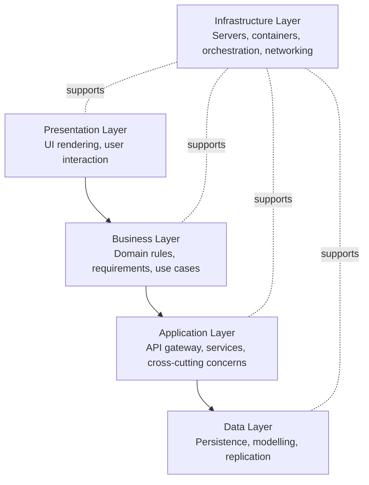
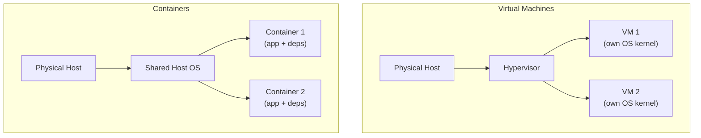
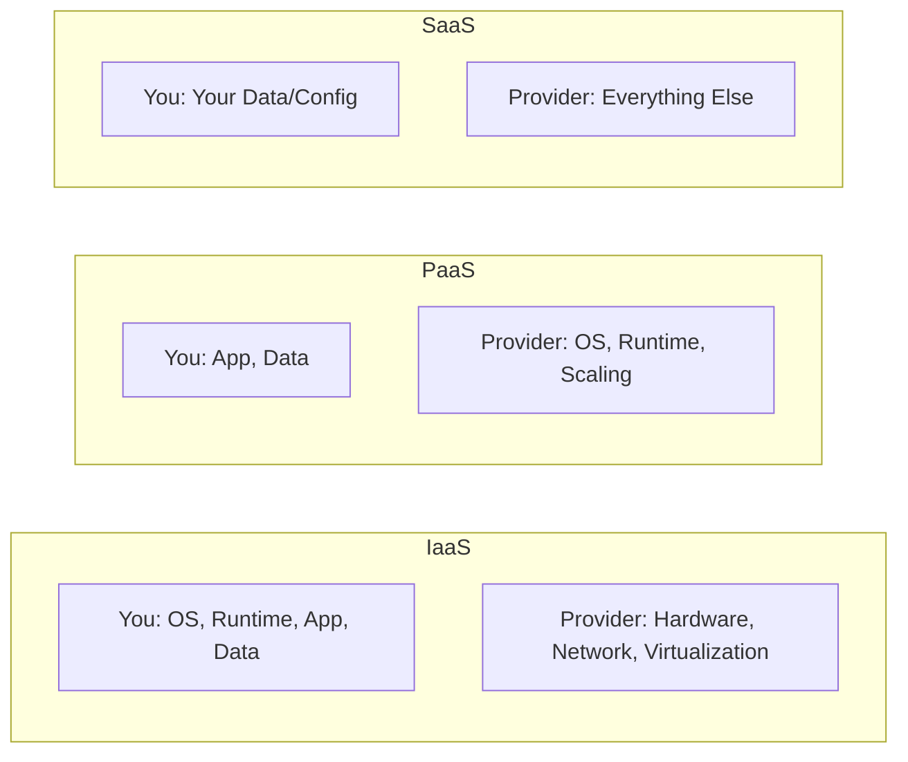
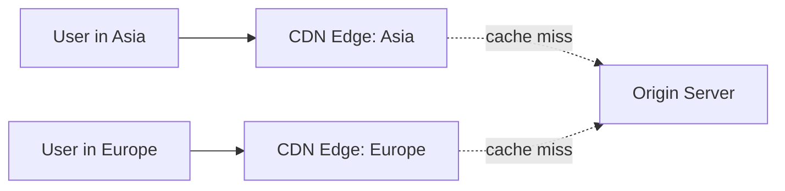
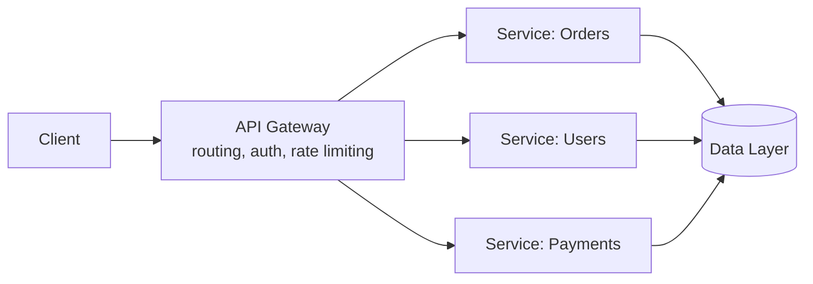
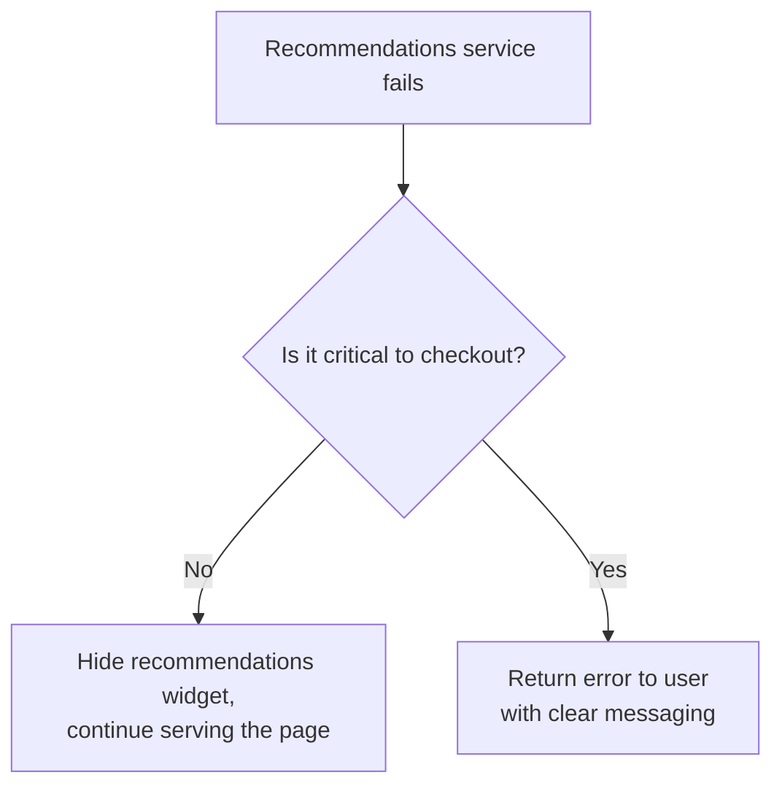

# Lecture 3: Full-Stack Application Architecture — Business, Infrastructure and Application Layers

In CSC336 you learned to build applications that work. This lecture starts the shift toward
building applications that are *engineered* — where every layer of the system exists for a
reason you can articulate, and every decision trades one quality (speed, cost, simplicity)
against another (scalability, resilience, maintainability). You will learn to decompose a
full-stack system into its constituent layers and reason precisely about what belongs in each
one.

## In This Lecture

- Define software architecture and distinguish the five logical layers of a full-stack
  application: presentation, business, infrastructure, application, and data
- Understand the business layer: domain modelling, requirements gathering, business rules,
  use cases, and user stories
- Distinguish functional from non-functional requirements and learn to specify both precisely
- Understand the infrastructure layer: servers, virtual machines, containers, orchestration,
  cloud service models (IaaS/PaaS/SaaS), load balancing, and CDNs
- Understand the application layer: API gateways, the service layer, cross-cutting concerns,
  stateful vs. stateless design, fault tolerance, and graceful degradation

## What Is Software Architecture?

**Software architecture** is the set of high-level structural decisions about a system: what
its major components are, what responsibilities each one owns, how they communicate, and what
constraints govern how they can change over time. Architecture is distinct from *design* in
scope — design decides how a single module or class is built; architecture decides how modules
relate to one another and to the outside world. It is distinct from *implementation* in
abstraction — architecture describes shapes and boundaries, not source code.

Architecture decisions are expensive to reverse. Choosing a monolith over microservices, or a
relational database over a document store, shapes months of subsequent work. This is why
architecture is worth studying deliberately rather than discovering by accident under
deadline pressure. Every architectural decision is ultimately a trade-off: you are almost
always exchanging one desirable quality (development speed, cost, simplicity) for another
(scalability, fault tolerance, long-term maintainability), and a good architect can state
explicitly what was traded for what.

### The Five Logical Layers

CSC336 introduced *tiers* (physical deployment boundaries) and *layers* (logical code
organization). This course focuses on layers, refining the three-tier picture
(presentation/application/data) into five layers that better describe production systems:



- **Presentation layer** — what the user sees and interacts with (a React/Next.js UI, a
  mobile app). You covered this extensively in CSC336 and will revisit it in the Next.js unit
  of this course.
- **Business layer** — the *why* of the system: the domain knowledge, rules, and requirements
  that define what the software must do, independent of any particular technology.
- **Application layer** — the *how* of request handling: the code that receives requests,
  coordinates business logic, and applies concerns like authentication, logging, and rate
  limiting to every request uniformly.
- **Infrastructure layer** — the physical and virtual computing resources the application
  runs on, and the mechanisms that keep it available and scalable.
- **Data layer** — how information is modelled, stored, and retrieved. This is the subject of
  Lecture 4.

Notice that the infrastructure layer is drawn differently: it does not sit in the request
path the way the others do. Instead it *underpins* every other layer — servers, containers,
and networking exist to run the presentation, business, application, and data layers, not to
process a specific request themselves. Keeping this distinction sharp will help you reason
about where a given engineering decision belongs. "Should we cache this database query?" is a
data/application-layer question. "Should we add another server?" is an infrastructure-layer
question. Conflating the two leads to solving the wrong problem — for example, throwing more
servers at a slow, unindexed database query instead of fixing the query itself.

!!! note "Layers are not tiers"
    A single physical server (one tier) can still run code organized into all five layers.
    Conversely, a system with many tiers (load balancer, app servers, database servers,
    CDN) is still reasoned about using the same five logical layers. Don't assume "layer"
    implies "separate machine."

## The Business Layer

The business layer captures *what the software is for*, expressed independently of
implementation technology. Before a single line of application code is written, an engineer
needs to understand the problem domain well enough to make sound implementation decisions
later. Getting this layer wrong is the single most expensive class of mistake in software
engineering — a beautifully engineered application that solves the wrong problem, or misses a
critical business rule, has to be substantially reworked no matter how clean its code is.

### Domain Understanding

**Domain understanding** is the process of learning the vocabulary, workflows, constraints,
and goals of the business or field the software will serve — an e-commerce checkout flow, a
hospital's patient-intake process, a university's course-registration rules. You cannot design
correct software for a domain you do not understand. This typically involves talking to
stakeholders (the people who will use or pay for the software), reading existing
documentation, and observing current workflows (even manual, paper-based ones) before writing
requirements.

### Requirements, Business Rules, Use Cases, and User Stories

Once you understand the domain, you translate that understanding into artifacts that guide
implementation:

- **Requirements** are statements of what the system must do or must be. They are the
  contract between "what the business needs" and "what engineers will build."
- **Business rules** are constraints or policies the domain imposes, independent of any
  particular software feature — e.g., "a student cannot register for more than 18 credit
  hours per semester" or "refunds are only permitted within 30 days of purchase." Business
  rules often outlive individual features; they get enforced across many parts of the system.
- **Use cases** describe a goal-oriented interaction between an actor (a user, or another
  system) and the system, including the main success path and alternate/error paths. A use
  case for "Register for a Course" would describe the student selecting a course, the system
  checking prerequisites and seat availability, and the possible failure branches (course
  full, prerequisite unmet).
- **User stories** are a lightweight, conversational way of capturing a requirement from the
  end user's perspective, commonly written as:

  ```text
  As a <role>, I want <capability>, so that <benefit>.
  ```

  For example: *"As a returning customer, I want my previous shipping address saved, so that
  I can check out faster."* User stories are deliberately small and are often paired with
  **acceptance criteria** — concrete, testable conditions that must hold for the story to be
  considered done.

!!! tip "Use cases vs. user stories"
    Use cases tend to be more formal and exhaustive (good for regulated domains, e.g.,
    banking or healthcare, where every failure path must be documented). User stories are
    lighter-weight and iterative, fitting well with agile development. Many teams use both:
    use cases to establish the full behavior of a critical flow, user stories to break
    delivery into small, shippable increments.

### Functional vs. Non-Functional Requirements

Requirements split into two categories that are frequently confused but must be tracked
separately, because they are validated differently and often owned by different people.

**Functional requirements (FRs)** describe *what* the system does — specific behaviors,
features, and capabilities. "The system shall allow a user to reset their password via a
time-limited email link" is a functional requirement.

**Non-functional requirements (NFRs)**, also called *quality attributes*, describe *how well*
the system performs its functions — constraints on performance, security, reliability,
usability, and so on, rather than specific features. "The system shall respond to 95% of API
requests within 200ms under a load of 1,000 concurrent users" is a non-functional requirement.

| | Functional Requirement | Non-Functional Requirement |
|---|---|---|
| Answers | What must the system do? | How well must it do it? |
| Example | "Users can filter search results by price." | "Search results must return in under 300ms." |
| Validated by | Feature testing (does the behavior exist?) | Load testing, security audits, monitoring |
| Typical owner | Product/business stakeholders | Engineering/architecture |

Common categories of non-functional requirements include:

- **Performance** — response time, throughput, resource usage.
- **Scalability** — ability to handle growth in users or data.
- **Availability/Reliability** — uptime guarantees, fault tolerance.
- **Security** — authentication, authorization, data protection.
- **Usability** — accessibility, learnability.
- **Maintainability** — how easily the system can be changed or extended.

!!! warning "NFRs are easy to skip and expensive to retrofit"
    A team under deadline pressure will often ship every functional requirement while
    ignoring non-functional ones — the app "works" in a demo, but collapses under real
    traffic, leaks data, or is unusable on a slow connection. Retrofitting performance or
    security after launch is dramatically more expensive than designing for it from the
    start. Non-functional requirements should be specified, not assumed.

## The Infrastructure Layer

The infrastructure layer is the physical and virtual computing substrate that everything else
runs on. As a full-stack engineer, you will not usually manage physical hardware, but you must
understand infrastructure well enough to make and evaluate deployment decisions.

### Servers, VMs, and Containers

- A **server** is a physical (or virtual) machine that runs software and responds to requests.
  In cloud computing, you rarely touch a physical server directly.
- A **virtual machine (VM)** is a software-emulated computer running on top of a physical host,
  complete with its own operating system kernel. VMs let a cloud provider run many isolated
  "computers" on one physical machine, each with strong isolation but meaningful overhead
  (each VM boots a full OS and consumes dedicated memory).
- A **container** packages an application together with its dependencies and runtime, but
  shares the host machine's OS kernel rather than running its own. Containers (most commonly
  built and run with **Docker**) start in seconds instead of minutes, are far lighter-weight
  than VMs, and guarantee that "it works on my machine" also means "it works in production,"
  because the container carries its own consistent environment.



### Orchestration

Once an application is split across many containers (as microservices architectures do — see
Lecture 4), someone has to decide which container runs on which machine, restart containers
that crash, scale the number of running instances up or down with load, and route traffic to
healthy instances. This is **container orchestration**. **Kubernetes** is the dominant
orchestration platform: you describe the *desired state* of your system (e.g., "run 5
instances of this service"), and Kubernetes continuously works to keep the actual state
matching it — restarting failed containers, rescheduling work off a dead machine, and scaling
instance counts automatically.

### Cloud Service Models

Cloud providers (AWS, Azure, Google Cloud) offer infrastructure at different levels of
abstraction, trading control for convenience:

| Model | You manage | Provider manages | Example |
|---|---|---|---|
| **IaaS** (Infrastructure as a Service) | OS, runtime, application, data | Physical hardware, networking, virtualization | AWS EC2, Azure VMs |
| **PaaS** (Platform as a Service) | Application code, data | OS, runtime, scaling, patching | Heroku, AWS Elastic Beanstalk, Render |
| **SaaS** (Software as a Service) | Your own data/configuration | Everything else | Gmail, Salesforce, Slack |



As you move from IaaS toward SaaS, you give up control in exchange for reduced operational
burden. A team building a custom Node.js API typically chooses PaaS or a managed
container-orchestration service — enough control to deploy custom code, without needing to
patch operating systems.

### Load Balancing and CDNs

A **load balancer** sits in front of multiple application server instances and distributes
incoming requests across them, based on strategies like round-robin, least-connections, or
resource-based routing. Load balancing serves two purposes at once: it lets you scale
horizontally (add more servers to handle more traffic) and it improves availability (if one
instance fails, the load balancer stops routing to it and traffic continues flowing to the
rest).

A **Content Delivery Network (CDN)** is a geographically distributed network of servers that
cache and serve static content (images, CSS, JavaScript bundles, and increasingly
server-rendered HTML) from a location physically close to the requesting user. This reduces
latency (less distance for data to travel) and reduces load on your origin servers (the CDN
serves cached content without ever reaching your application).



!!! tip "CDN vs. load balancer"
    A CDN mostly serves *static, cacheable* content close to the user. A load balancer
    distributes *dynamic, per-request* traffic across your own servers. Production systems
    typically use both together: the CDN absorbs the bulk of static-asset traffic, and the
    load balancer manages what actually reaches your application servers.

## The Application Layer

The application layer is where requests are actually received, authenticated, routed, and
turned into responses — it is the layer most full-stack engineers spend their time writing
code in, and the layer where an Express.js or similar backend framework lives.

### API Gateway and Service Layer

An **API gateway** is a single entry point that sits in front of one or more backend services.
It handles concerns common to *every* incoming request — routing to the correct backend
service, authentication, rate limiting, request/response transformation, and sometimes
aggregating responses from multiple services into one. In a simple Express application, the
API gateway and the application itself may be the same process; in a microservices
architecture (Lecture 4), the gateway is a distinct component in front of many independent
services.

The **service layer** sits behind the gateway and contains the actual business logic
orchestration: coordinating calls to the business layer's rules, calling the data layer to
persist or retrieve data, and assembling the result to send back. Keeping the service layer
distinct from route-handling code (the layer that merely parses HTTP requests) means the core
logic can be tested and reused without depending on Express, HTTP, or any particular
transport.



### Cross-Cutting Concerns

**Cross-cutting concerns** are pieces of functionality that apply uniformly across many parts
of a system, rather than belonging to any single feature. Examples include logging,
authentication, input validation, error handling, and caching. Implementing a cross-cutting
concern separately inside every route handler is repetitive and error-prone; instead, these
concerns are typically implemented once as **middleware** (which you met in CSC336) that runs
on every request, or every request matching a pattern.

```js
// Express middleware applied once, addressing a cross-cutting concern
app.use((req, res, next) => {
  console.log(`${req.method} ${req.path} — ${new Date().toISOString()}`);
  next();
});
```

### Stateful vs. Stateless Design

A **stateless** application server does not retain any client-specific data between requests
— every request must carry all the information needed to process it (e.g., a token
identifying the user). A **stateful** server retains information about a specific client
between requests (e.g., session data held in server memory).

Stateless design is strongly preferred at the application layer in production systems, for a
concrete infrastructural reason: if any server instance can handle any request because no
server holds client-specific state, a load balancer can freely route each request to *any*
healthy instance, and instances can be added or removed without disrupting active users. A
stateful server, by contrast, requires "sticky sessions" (routing a given user's requests
back to the same server), which complicates load balancing and makes horizontal scaling
harder.

!!! note "Statelessness pushes state downward, it doesn't eliminate it"
    Making the application layer stateless doesn't mean the system has no state — it means
    state that must persist (sessions, user data) is pushed down into the data layer or a
    shared cache (like Redis) that every application instance can reach, rather than being
    held in any one server's memory.

### Fault Tolerance and Graceful Degradation

**Fault tolerance** is a system's ability to continue operating, possibly at reduced
capacity, when part of it fails. Techniques include retries with backoff, timeouts on
external calls, redundant instances, and **circuit breakers** — a pattern where, after a
dependency fails repeatedly, the application stops calling it for a cooldown period (failing
fast instead of waiting on a doomed request), then cautiously retries.

**Graceful degradation** is the related practice of designing a system so that when a
non-critical dependency fails, users lose that specific feature rather than the entire
application. For example, if a "recommended products" service is down, an e-commerce site
should still let users browse, search, and check out — simply without recommendations —
rather than showing an error page for the whole site.



!!! warning "A single unguarded dependency can take down an entire system"
    Without timeouts or circuit breakers, a slow or failing downstream service can cause
    requests to pile up waiting on it, exhausting server threads/connections and bringing
    down features that have nothing to do with the failing dependency. This failure mode —
    known as a **cascading failure** — is one of the most common causes of major production
    outages, and is a central reason fault tolerance is treated as a first-class
    architectural concern rather than an afterthought.

## Try It Yourself

1. Pick an application you use often (e.g., a food-delivery app). Write one user story with
   acceptance criteria for a feature it has, then write two functional requirements and two
   non-functional requirements that feature would need to satisfy.
2. Sketch (as a mermaid `flowchart`, or on paper) how you would deploy a simple Node.js API
   with a load balancer, two application server instances, and a CDN in front of its static
   assets. Then describe, in a few sentences, what would happen to in-flight user sessions if
   the API were stateful vs. stateless, when one server instance is taken down for
   maintenance.

## Key Takeaways

- **Software architecture** is the set of high-level structural decisions about a system's
  components, responsibilities, and communication — distinct from design (single-module
  decisions) and implementation (source code).
- A full-stack application can be decomposed into five logical layers: **presentation**,
  **business**, **application**, **infrastructure**, and **data** — infrastructure underpins
  the others rather than sitting in the request path.
- The **business layer** captures domain understanding, requirements, business rules, use
  cases, and user stories — get this layer wrong and no amount of good code fixes it.
- **Functional requirements** describe what a system does; **non-functional requirements**
  describe how well it does it (performance, scalability, security, etc.) — both must be
  specified explicitly.
- The **infrastructure layer** spans servers, VMs, containers, orchestration (e.g.,
  Kubernetes), cloud service models (IaaS/PaaS/SaaS), load balancing, and CDNs.
- The **application layer** handles every request through an API gateway and service layer,
  implementing cross-cutting concerns like logging and auth as middleware.
- **Stateless** application design is preferred in production because it allows any server
  instance to handle any request, simplifying load balancing and horizontal scaling.
- **Fault tolerance** and **graceful degradation** keep a system partially functional when a
  dependency fails, preventing cascading failures from taking down the whole application.
