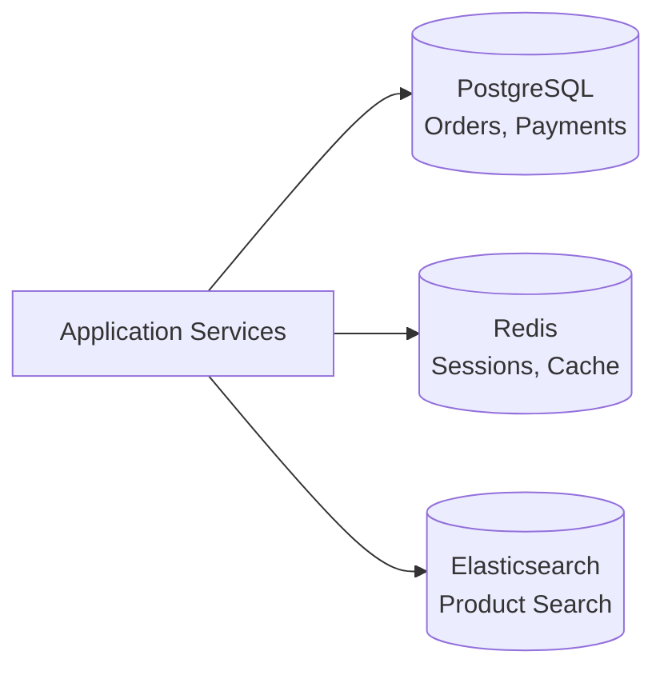
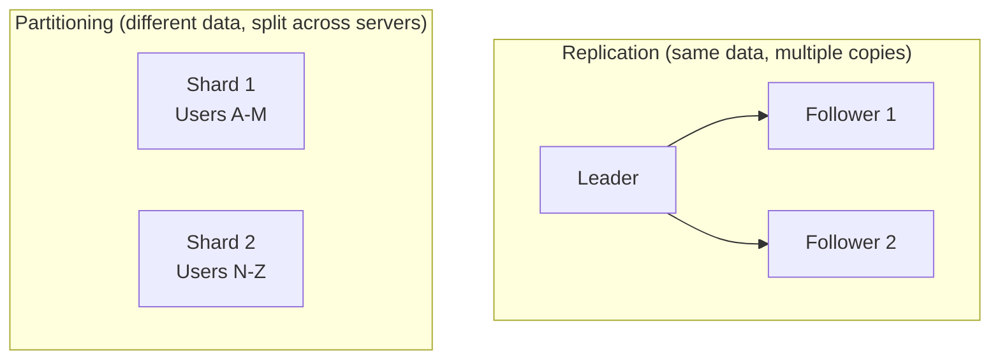
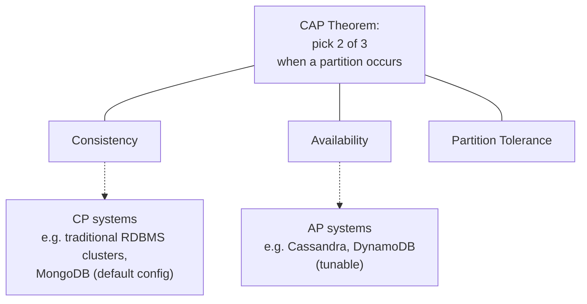
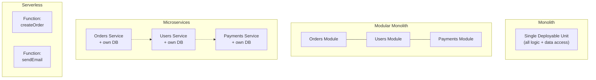
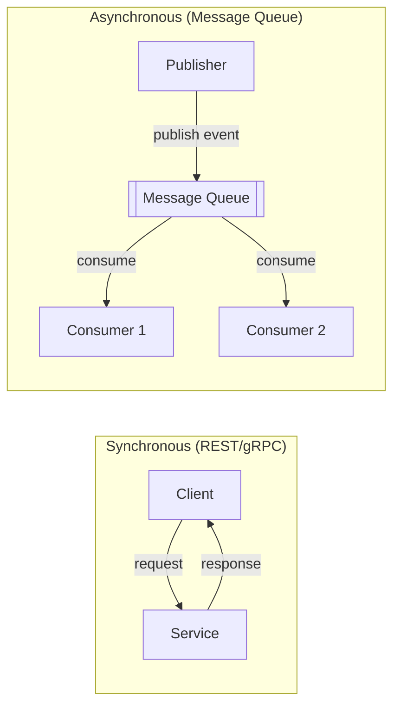
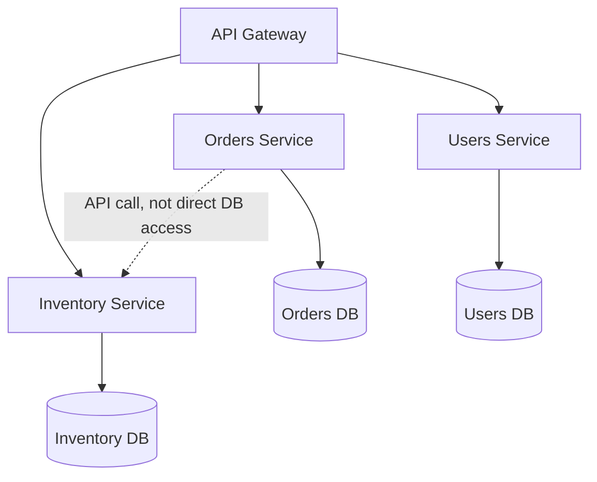

# Lecture 4: Data Layer and Microservices Architecture

Lecture 3 mapped out the business, infrastructure, and application layers of a full-stack
system. This lecture completes the picture with the **data layer** — where and how
information is stored — and then zooms out to the architectural question that shapes
everything else: should your application be one deployable unit, or many? You will learn to
reason about both with the same rigor: as trade-offs, not defaults.

## In This Lecture

- Design a data layer: data modelling, SQL vs. NoSQL, polyglot persistence, replication,
  partitioning, indexing, and the CAP theorem
- Compare monolithic, modular-monolith, microservices, and serverless architectures
- Apply microservices principles: service decomposition, bounded contexts, and service
  boundaries
- Understand inter-service communication: REST, gRPC, message queues, service discovery, API
  gateways, and the database-per-service pattern
- Evaluate the benefits, challenges, and anti-patterns of microservices, and recognize when a
  monolith is the better choice

## The Data Layer

The data layer is responsible for persisting the state your application cares about and
retrieving it efficiently and correctly. Decisions made here are among the hardest to reverse
in a running system — migrating a live database's schema or storage engine is far riskier
than refactoring application code, so they deserve careful, upfront reasoning.

### Data Modelling

**Data modelling** is the process of deciding how information is structured, related, and
constrained in storage. It happens before you pick a database technology: you first identify
the entities in your domain (from the business layer's requirements — Users, Orders,
Products), their attributes, and the relationships between them (a User *has many* Orders; an
Order *has many* line items referencing Products). Only after this conceptual model is clear
should you decide *how* to store it, because the shape of your data should drive technology
choice, not the other way around.

### SQL vs. NoSQL

**Relational (SQL) databases** (PostgreSQL, MySQL) store data in tables with fixed schemas and
enforce relationships through foreign keys and constraints. They provide strong consistency
guarantees and a powerful, standardized query language (SQL) capable of expressing complex
joins across tables.

**NoSQL databases** relax one or more of these properties in exchange for other advantages,
and come in several distinct families:

| Type | Data model | Example | Best suited for |
|---|---|---|---|
| Document | JSON-like documents | MongoDB | Flexible/evolving schemas, nested data |
| Key-value | Simple key → value pairs | Redis, DynamoDB | Caching, session storage, very high throughput |
| Column-family | Rows with dynamic columns, grouped by column family | Cassandra | Write-heavy, large-scale time-series/analytics data |
| Graph | Nodes and edges | Neo4j | Highly interconnected data (social graphs, recommendations) |

The decision between SQL and NoSQL is not "which is better" but "which properties does this
specific data need":

- Does the data have a stable, well-understood shape (favors SQL) or does it evolve rapidly
  and vary between records (favors document stores)?
- Do you need multi-record transactions with strict consistency (favors SQL), or is
  eventual consistency acceptable in exchange for higher write throughput (favors many
  NoSQL stores)?
- Are relationships between entities central to your queries (favors SQL's joins), or is
  data mostly accessed by a single key (favors key-value stores)?

!!! note "MongoDB from CSC336, revisited critically"
    You used MongoDB throughout CSC336 as the default data store. In this course, treat
    that as one option among several, not the default answer. A payments ledger, for
    instance, has strong consistency and transactional needs that make a relational
    database the better engineering choice, even within a MERN-flavored stack.

### Polyglot Persistence

**Polyglot persistence** is the practice of using multiple, different database technologies
within a single system, each chosen for the part of the workload it fits best — for example,
PostgreSQL for transactional order data, Redis for session caching, and Elasticsearch for
full-text product search, all within the same application. This follows directly from the
principle above: if no single database excels at every access pattern your application needs,
use several, each for what it does best.



The cost of polyglot persistence is operational: every additional database technology is
another system to deploy, monitor, back up, and for your team to know how to operate.
Polyglot persistence is a deliberate trade of operational simplicity for fitness-for-purpose,
and should be adopted incrementally as a specific access pattern demonstrably needs it — not
speculatively from day one.

### Replication and Partitioning

**Replication** is keeping copies of the same data on multiple servers. It serves two goals:
availability (if one server fails, replicas keep serving data) and read scalability (read
queries can be spread across replicas). Replication is typically **leader-based**: writes go
to a single leader (or "primary") node, which propagates changes to **follower** (or
"replica") nodes; reads can be served from any node depending on the consistency needs of the
query.

**Partitioning** (also called **sharding**) is splitting a single logical dataset across
multiple servers, where each server holds only a subset of the data (e.g., users A–M on one
shard, N–Z on another). Partitioning is how you scale storage and write throughput beyond
what a single machine can hold or handle — replication alone doesn't help once a dataset is
simply too large, or too write-heavy, for one machine.



Production systems commonly combine both: a dataset is partitioned into shards for scale, and
each shard is itself replicated for availability.

### Indexing

An **index** is a supplementary data structure (commonly a B-tree or hash table) that a
database maintains alongside your data to make specific lookups fast, at the cost of extra
storage and slower writes (since every index must also be updated on every write). Without an
index on a queried column, a database must perform a **full table scan** — checking every row
— which becomes prohibitively slow as data grows.

```sql
-- Without an index, this scans every row in `orders`
SELECT * FROM orders WHERE customer_id = 4821;

-- Creating an index makes lookups by customer_id fast
CREATE INDEX idx_orders_customer_id ON orders (customer_id);
```

!!! tip "Index what you query, not everything"
    Indexes are not free — each one adds write overhead and storage cost. The rule of
    thumb is to index columns used frequently in `WHERE` clauses, join conditions, or sort
    orders, and to periodically review which indexes are actually being used in production,
    removing ones that aren't.

### The CAP Theorem

The **CAP theorem** states that a distributed data store can provide at most two of the
following three guarantees simultaneously, in the presence of a network partition:

- **Consistency (C)** — every read receives the most recent write, or an error. All nodes see
  the same data at the same time.
- **Availability (A)** — every request receives a (non-error) response, without guaranteeing
  it contains the most recent write.
- **Partition tolerance (P)** — the system continues to operate despite network failures that
  prevent some nodes from communicating with others.



Because real distributed systems must tolerate network partitions (partitions *will* happen —
this isn't optional), the practical choice is between **CP** (consistent but may refuse
requests during a partition) and **AP** (available but may return stale data during a
partition). A banking ledger typically favors CP — it is better to briefly reject a
transaction than to show an inconsistent balance. A social media "like" counter typically
favors AP — showing a slightly stale count is far less harmful than the feature becoming
unavailable.

!!! warning "CAP applies during partitions, not always"
    A common misreading of CAP is that a system must sacrifice consistency or availability
    *at all times*. In reality, most systems provide both consistency and availability
    under normal conditions; CAP describes the trade-off you are forced into only *when a
    partition actually occurs*. Also note CAP says nothing about **latency** — a separate,
    equally important concern in practice (sometimes summarized by the related PACELC
    extension to CAP).

## Choosing an Application Architecture

With the data layer covered, we return to a decision that shapes the whole system: how many
deployable units should your application be split into?

### Monolith

A **monolithic architecture** deploys the entire application — UI-serving logic, business
logic, and data access — as a single unit. All code lives in one codebase, runs in one
process (or a set of identical processes behind a load balancer), and is deployed together.

### Modular Monolith

A **modular monolith** is still deployed as a single unit, but its *internal* code is
organized into well-defined, loosely coupled modules with explicit boundaries and APIs
between them — e.g., an `orders` module and a `users` module that only interact through
defined interfaces, never by reaching into each other's internal data structures. It captures
much of the organizational clarity of microservices without the operational cost of running
many separate services.

### Microservices

A **microservices architecture** splits the application into multiple independently
deployable services, each owning a specific piece of business capability and (per the
database-per-service pattern discussed below) typically its own data storage.

### Serverless

A **serverless architecture** runs application code as individual functions triggered by
events (an HTTP request, a message on a queue, a scheduled timer), managed by a cloud provider
that handles provisioning, scaling, and shutting resources down to zero when idle. You write
functions, not servers — hence the name (the servers still exist, but you never manage them).



| Architecture | Deployment unit | Scaling granularity | Operational complexity | Good fit for |
|---|---|---|---|---|
| Monolith | One | Whole application at once | Low | Small teams, early-stage products, simple domains |
| Modular monolith | One | Whole application at once | Low–Medium | Growing teams that want boundaries without ops overhead |
| Microservices | Many | Per service | High | Large teams, independently-scaling domains, org-wide autonomy |
| Serverless | Per function | Per function, automatic | Medium (different kind of complexity) | Spiky/unpredictable load, event-driven workloads |

!!! tip "Start simpler than you think you need"
    A very common and costly mistake is choosing microservices for a system with a small
    team and an unclear domain model. Microservices pay off when team size and domain
    complexity justify the operational cost of running many services — a cost that is easy
    to underestimate before you've paid it. Many successful systems (including some very
    large ones) run as a single, well-organized monolith for years before splitting.

## Microservices Principles

If you do choose microservices, three principles determine whether the split actually helps.

### Service Decomposition

**Service decomposition** is the process of deciding where to draw the lines between
services. Decomposing along technical layers (a "database service," a "business logic
service") is a common mistake — it creates services that must all change together for almost
any feature, defeating the purpose of splitting them apart. Effective decomposition instead
follows **business capabilities**: each service should correspond to something the business
recognizes as a coherent responsibility (Orders, Inventory, Payments, Notifications).

### Bounded Contexts

A **bounded context**, a concept from Domain-Driven Design, is an explicit boundary within
which a particular domain model applies consistently. The same real-world concept can mean
different things in different contexts — a "Product" in the Catalog context might have
descriptions, images, and categories, while the same "Product" in the Inventory context has
stock counts and warehouse locations. Rather than forcing one giant, shared "Product" model
across the whole system, each bounded context maintains its own model of Product, fit to its
own concerns, translating between them at the edges when needed. Bounded contexts are the
primary tool for deciding where microservice boundaries should fall — a well-chosen service
boundary usually coincides with a bounded context.

### Service Boundaries

A **service boundary** is the line that determines what is inside a service (implementation
details, free to change internally) versus outside it (the contract other services depend on
— its API). Good service boundaries exhibit **high cohesion** (everything inside the service
is closely related and changes together) and **loose coupling** (services depend on each
other's stable public contracts, not on each other's internals), so that a change inside one
service rarely forces a change in another.

## Inter-Service Communication

Once an application is split into services, they need to talk to each other. This
communication comes in synchronous and asynchronous flavors.

### REST

**REST** (Representational State Transfer, covered in depth starting Lecture 5) over HTTP is
the most common way for services to expose synchronous request/response APIs. It's simple,
widely understood, and easy to debug, but every call blocks the caller until a response
returns, and text-based JSON payloads carry more overhead than binary formats.

### gRPC

**gRPC** is a high-performance RPC (Remote Procedure Call) framework using HTTP/2 and Protocol
Buffers (a compact binary serialization format) instead of JSON over HTTP/1.1. It is
significantly faster and more bandwidth-efficient than REST/JSON, and generates strongly-typed
client code from a shared schema (a `.proto` file) — but it's less human-readable, harder to
call directly from a browser, and requires more tooling. gRPC is commonly chosen for
internal service-to-service communication, while REST remains common for public-facing APIs.

### Message Queues

A **message queue** (RabbitMQ, Apache Kafka, AWS SQS) enables **asynchronous** communication:
a service publishes a message and moves on immediately, without waiting for a response;
one or more consumer services process that message whenever they're ready. This decouples
services in time — the publisher doesn't need the consumer to be online at the moment of
publishing — and is well suited to events like "an order was placed" that multiple services
(inventory, notifications, analytics) may need to react to independently.



### Service Discovery

In a system with many service instances that are constantly starting, stopping, and scaling,
hardcoding IP addresses is unworkable. **Service discovery** is the mechanism by which
services locate one another dynamically — typically through a registry that services
register with on startup, which other services (or a load balancer) query to find current,
healthy instances.

### API Gateway (Revisited)

As introduced in Lecture 3, an **API gateway** becomes especially important in a microservices
system: it is the single external-facing entry point that hides the internal service topology
from clients, handling cross-cutting concerns (authentication, rate limiting) once rather than
duplicating them in every service.

### Database-per-Service Pattern

The **database-per-service pattern** dictates that each microservice owns its own data
storage exclusively — no other service is permitted to read or write it directly. Other
services obtain that data only via the owning service's API.



This pattern is what makes services genuinely independent: if service A could query service
B's database directly, the two would be tightly coupled at the schema level, and B could never
change its internal data model without risking breaking A. The cost is that operations
spanning multiple services (e.g., "place an order and decrement inventory") can no longer use
a single database transaction, which is why microservices architectures typically rely on
patterns like the **saga pattern** (a sequence of local transactions coordinated via events,
with compensating actions to undo prior steps if a later one fails) instead of traditional
distributed transactions.

!!! note "Data consistency becomes an application concern"
    In a monolith, a database transaction guarantees an all-or-nothing outcome across
    tables. In microservices, that guarantee disappears once data is split across services
    — consistency across services must be engineered explicitly (e.g., via sagas), rather
    than obtained for free from the database.

## Benefits, Challenges, and Anti-Patterns

### Benefits

- **Independent deployability** — each service can be built, tested, and deployed without
  coordinating a release of the entire system.
- **Independent scalability** — scale only the services under heavy load (e.g., a checkout
  service during a sale), rather than scaling the entire monolith.
- **Technology flexibility** — different services can use different languages, frameworks, or
  databases where that genuinely fits their workload.
- **Team autonomy** — teams can own a service end-to-end, reducing cross-team coordination
  overhead for day-to-day changes.
- **Fault isolation** — a failure in one service, if properly isolated (Lecture 3's fault
  tolerance principles), need not bring down the whole system.

### Challenges

- **Operational complexity** — many services means many deployments, many logs to aggregate,
  many things that can independently fail, and a need for strong observability tooling.
- **Distributed system difficulty** — network calls between services can fail or be slow in
  ways in-process function calls never do; you must design for partial failure everywhere.
- **Data consistency** — as discussed above, cross-service consistency requires deliberate
  patterns rather than being free.
- **Testing complexity** — testing an end-to-end flow now means standing up (or mocking)
  multiple services rather than testing one process.
- **Latency** — a single user action may fan out into many inter-service calls, each adding
  network latency.

### Anti-Patterns

- **Distributed monolith** — services that are deployed separately but so tightly coupled
  (through shared databases, synchronous call chains, or a shared library that all must
  upgrade together) that they must still be deployed in lockstep. This yields all of
  microservices' operational cost with none of its independence benefit.
- **Nanoservices** — decomposing services so finely (a service per database table, or per
  single function) that the network-call overhead and operational burden vastly outweigh any
  benefit from separation.
- **Shared database anti-pattern** — multiple services reading and writing the same database
  directly, violating database-per-service and recreating tight coupling at the schema level.
- **Chatty communication** — a user request that requires dozens of synchronous inter-service
  calls to complete, each adding latency and each a potential point of failure.

### When a Monolith Is the Better Choice

Choose a monolith (or modular monolith) when:

- Your team is small enough that coordination overhead across services would exceed the
  coordination overhead avoided by splitting.
- The domain model is still being discovered — it's difficult to draw correct service
  boundaries before you understand the domain well, and premature boundaries are expensive to
  redraw.
- Your scaling needs are uniform across the application (no single part needs to scale far
  beyond the rest), so independent scalability offers little benefit.
- You lack the operational maturity (monitoring, CI/CD automation, on-call practices) that
  running many services safely in production requires.

!!! warning "Microservices are an organizational decision as much as a technical one"
    The famous observation known as **Conway's Law** states that systems tend to mirror the
    communication structure of the organizations that build them. Microservices work best
    when your team structure already resembles the service boundaries you want — small,
    autonomous teams each owning a domain. Imposing microservices on a single small team
    changes the technology without changing the underlying coordination problem, and often
    just adds distributed-systems overhead to it.

## Try It Yourself

1. Take an application idea (e.g., a food-delivery platform) and identify three candidate
   bounded contexts (e.g., Ordering, Delivery Tracking, Payments). For each, list two
   attributes of a shared concept (like "Order") that would differ between contexts.
2. For the same application, decide: would you start with a monolith, a modular monolith, or
   microservices? Justify your answer using at least three of the factors discussed in this
   lecture (team size, domain clarity, scaling needs, operational maturity).

## Key Takeaways

- The **data layer** requires deliberate choices: data modelling drives technology choice, not
  the reverse; **SQL** favors strong consistency and relationships, **NoSQL** favors
  flexibility and scale; **polyglot persistence** combines multiple stores where justified.
- **Replication** improves availability and read scalability by copying data;
  **partitioning/sharding** splits data across servers to scale storage and writes; both are
  commonly combined in production.
- **Indexes** speed up specific queries at the cost of storage and write overhead — index what
  you actually query.
- The **CAP theorem** forces a choice between consistency and availability only when a network
  partition occurs — most systems are CP or AP depending on domain needs.
- **Monolith**, **modular monolith**, **microservices**, and **serverless** are points on a
  spectrum of deployment granularity, each with different operational costs — start as simple
  as the domain and team allow.
- Microservices should be decomposed along **business capabilities** and **bounded contexts**,
  not technical layers, with boundaries that are highly cohesive and loosely coupled.
- Services typically communicate via **REST** or **gRPC** (synchronous) or **message queues**
  (asynchronous), locate each other via **service discovery**, and each own their data under
  the **database-per-service** pattern.
- Watch for anti-patterns like the **distributed monolith** and **chatty communication** —
  microservices done wrong combine the costs of distribution with the coupling of a monolith.
