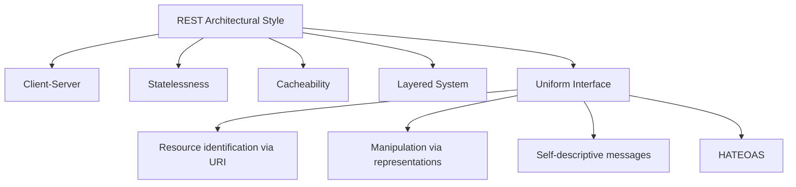
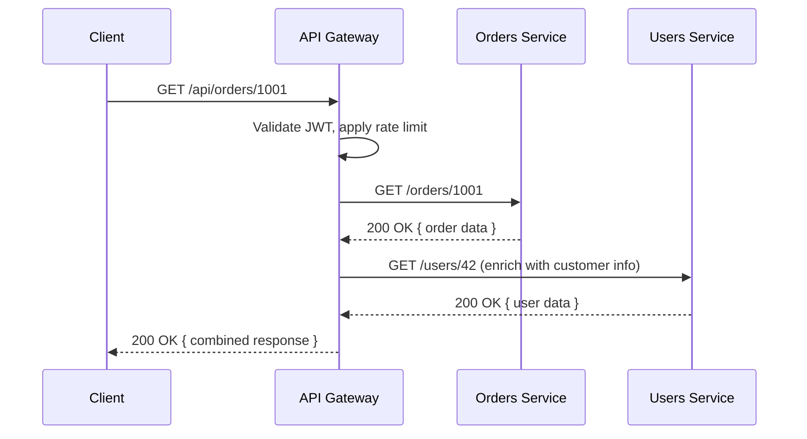

# Lecture 5: Professional API Design Practices

You already know how to stand up a REST endpoint in Express and return JSON. This lecture
is about the difference between an API that merely *works* and one that is safe to hand to
other teams, other companies, or a mobile app you'll still be supporting in three years.
You'll learn the design conventions, contracts, and evolution strategies that separate a
student project from a production API.

## In This Lecture

- Understand the architectural constraints that make an API "RESTful"
- Model resources and name URIs consistently; choose the right HTTP method for each action
- Distinguish idempotent and safe methods, and why that distinction matters for retries
- Return consistent status codes and error shapes; support pagination, filtering, sorting,
  and partial responses
- Compare API versioning strategies and understand HATEOAS
- Document APIs with OpenAPI/Swagger and understand what an API gateway does
- Tell breaking changes from non-breaking ones, and manage deprecation responsibly

## REST as a Set of Architectural Constraints

**REST** (Representational State Transfer) is not a protocol or a library — it's an
architectural style defined by a set of constraints. Roy Fielding described these in his
2000 doctoral dissertation, and an API that satisfies all of them is properly called
RESTful. Most APIs marketed as "REST APIs" actually honor only some of these constraints,
which is fine in practice — but you should understand what you're giving up.

**Client-server.** The client (browser, mobile app, another service) and the server are
separate, independently deployable systems that communicate only through requests and
responses. The client doesn't know how data is stored; the server doesn't know how the UI
renders it. This separation is why you can rebuild your entire React frontend without
touching your Express backend.

**Statelessness.** Every request must contain all the information the server needs to
process it — the server keeps no session state about "where the client is" between
requests. A user's authentication token, for example, travels with *every* request (in an
`Authorization` header) rather than being remembered server-side from a previous call.

!!! note
    Statelessness doesn't mean the *application data* is stateless — your database still
    stores user accounts and orders. It means the server holds no per-client conversational
    state between one HTTP request and the next.

**Cacheability.** Responses must explicitly, or implicitly, label themselves as cacheable
or not, using standard HTTP mechanisms (`Cache-Control`, `ETag`, `Last-Modified`). This lets
clients, proxies, and CDNs reuse responses instead of hitting your server every time.

**Layered system.** A client cannot tell (and shouldn't need to know) whether it is talking
directly to the origin server or to an intermediary — a load balancer, an API gateway, a
caching proxy. Each layer only knows about the layer immediately next to it.

**Uniform interface.** This is the constraint that gives REST its recognizable shape:
resources are identified by URIs, manipulated through a small, standard set of HTTP
methods, represented in a standard media type (usually JSON), and responses are
self-descriptive (a JSON body plus headers tells the client everything it needs, without
out-of-band documentation).



!!! tip
    There is a sixth, optional constraint: **code on demand** (a server can send executable
    code, like JavaScript, to extend client functionality). It's rarely used in modern APIs
    and won't come up on the job, but it completes Fielding's original list.

## Resource Modelling and URI Naming Conventions

Good REST design starts with identifying your **resources** — the nouns your system deals
in: `users`, `orders`, `products`, `reviews`. URIs should name *things*, never *actions*.

```text
GOOD:  GET  /api/orders
GOOD:  POST /api/orders
BAD:   GET  /api/getOrders
BAD:   POST /api/createOrder
```

The HTTP method already carries the verb (`GET`, `POST`, `PUT`, `DELETE`), so repeating the
verb in the path is redundant and inconsistent — different developers will invent different
verbs (`fetchOrders`, `getOrderList`, `listOrders`) for the same concept.

**Naming conventions** worth adopting as team standards:

- Use plural nouns for collections: `/products`, not `/product`.
- Use lowercase, hyphen-separated words for multi-word resources: `/order-items`, not
  `/orderItems` or `/order_items`.
- Nest resources to express ownership or containment, but stop nesting after one or two
  levels:

```text
GET /api/users/42/orders          # orders belonging to user 42
GET /api/users/42/orders/1001     # a specific order belonging to user 42
GET /api/users/42/orders/1001/items/3   # avoid — nesting is getting too deep
```

!!! warning
    Deep nesting (three or more levels) makes URIs brittle and hard to read. If a resource
    has a globally unique identifier, prefer addressing it directly —
    `GET /api/order-items/3` — and use query parameters or a top-level endpoint for
    filtered views instead of ever-deeper paths.

- Use query parameters for filtering, sorting, and pagination, not the path:
  `/api/products?category=shoes&sort=-price`, not `/api/products/category/shoes/sort/price`.

## HTTP Methods, Idempotency, and Safe Methods

Choosing the right HTTP method for each operation is part of the uniform interface. Two
properties matter beyond "what the method conventionally does": whether it is **safe** and
whether it is **idempotent**.

A method is **safe** if calling it never changes server state — the client is only asking
to read data. A method is **idempotent** if making the same request multiple times produces
the same result as making it once (the *response* may differ, but server state converges to
the same outcome).

| Method | Purpose | Safe? | Idempotent? | Typical success code |
|---|---|---|---|---|
| `GET` | Retrieve a resource or collection | Yes | Yes | 200 |
| `POST` | Create a new resource, or trigger a non-idempotent action | No | No | 201 |
| `PUT` | Replace a resource entirely | No | Yes | 200 / 204 |
| `PATCH` | Partially update a resource | No | No (usually) | 200 / 204 |
| `DELETE` | Remove a resource | No | Yes | 204 |

Why idempotency matters in practice: mobile networks drop connections. If a client sends a
`PUT /api/orders/1001` to update an order's shipping address and never receives the
response, it's safe to retry the exact same `PUT` — applying it twice produces the same
final state. Retrying a `POST /api/orders` blindly, however, could create two duplicate
orders, because `POST` is not idempotent by design.

!!! tip
    `PATCH` is technically allowed to be idempotent or not, depending on what the patch
    document says — but treat it as non-idempotent by default unless you've verified your
    implementation guarantees otherwise (e.g., "set status to shipped" is idempotent;
    "increment stock by 1" is not).

## Status Codes and Consistent Error Shapes

Clients should never have to parse your response body just to know whether a request
succeeded. HTTP status codes exist for exactly this, and using them consistently is one of
the highest-leverage things you can do for API usability.

| Range | Meaning | Common codes |
|---|---|---|
| 2xx | Success | 200 OK, 201 Created, 204 No Content |
| 3xx | Redirection | 301 Moved Permanently, 304 Not Modified |
| 4xx | Client error | 400 Bad Request, 401 Unauthorized, 403 Forbidden, 404 Not Found, 409 Conflict, 422 Unprocessable Entity, 429 Too Many Requests |
| 5xx | Server error | 500 Internal Server Error, 502 Bad Gateway, 503 Service Unavailable |

Just as important as picking the right code is returning errors in a **consistent shape**
across your entire API. A client shouldn't have to guess whether the error message is in
`error`, `message`, or `err.detail` depending on which endpoint failed.

```json
{
  "error": {
    "code": "VALIDATION_ERROR",
    "message": "The request body failed validation.",
    "details": [
      { "field": "email", "issue": "must be a valid email address" },
      { "field": "age", "issue": "must be a positive integer" }
    ],
    "requestId": "a3f9c2e1-8b4d-4e2a-9c1f-1234567890ab"
  }
}
```

A `requestId` (or `traceId`) is invaluable — it lets support staff and logs correlate a
specific failed request end to end, especially once you're running distributed services.

## Pagination, Filtering, Sorting, and Partial Responses

Returning an entire collection in one response doesn't scale. Professional APIs offer:

**Pagination** — limiting how many records come back per request:

```text
GET /api/products?page=2&limit=25
GET /api/products?cursor=eyJpZCI6MTAwfQ&limit=25
```

Offset-based pagination (`page`/`limit`) is simple but can skip or repeat rows if data
changes between requests. **Cursor-based pagination** (an opaque token pointing to "the
next item after this one") is more consistent under concurrent writes and is what most
large-scale APIs (GitHub, Stripe, Slack) actually use.

```json
{
  "data": [ { "id": 101, "name": "Trail Runner" }, { "id": 102, "name": "Road Runner" } ],
  "pagination": {
    "nextCursor": "eyJpZCI6MTAyfQ",
    "hasMore": true
  }
}
```

**Filtering and sorting** via query parameters:

```text
GET /api/products?category=shoes&minPrice=20&maxPrice=100&sort=-price,name
```

Here `-price` means descending by price, then ascending by name as a tiebreaker.

**Partial responses** (also called field selection or sparse fieldsets) let a client ask
for only the fields it needs, reducing payload size — especially valuable for mobile
clients on constrained networks:

```text
GET /api/products/101?fields=id,name,price
```

```json
{ "id": 101, "name": "Trail Runner", "price": 89.99 }
```

## API Versioning and HATEOAS

Your API *will* change. Versioning is how you change it without breaking every client that
depends on it today.

**URI versioning** (most common in practice):

```text
GET /api/v1/products
GET /api/v2/products
```

Simple, visible, easy to route — but it means the same logical resource has multiple URIs
over time.

**Header versioning** keeps the URI stable and puts the version in a custom header or the
`Accept` header:

```text
GET /api/products
Accept: application/vnd.myapp.v2+json
```

More "correct" from a pure REST standpoint (a resource should have one URI), but harder for
developers to discover and test casually in a browser.

!!! note
    Most real-world teams choose URI versioning for its simplicity and discoverability,
    reserving header/content-negotiation versioning for APIs with strict backward
    compatibility requirements (e.g., payment processors).

**HATEOAS** (Hypermedia As The Engine Of Application State) is the REST constraint that
responses should include links describing what the client can do next, so the client
doesn't need to hard-code URI structure.

```json
{
  "id": 1001,
  "status": "pending",
  "total": 149.99,
  "_links": {
    "self": { "href": "/api/orders/1001" },
    "cancel": { "href": "/api/orders/1001/cancel", "method": "POST" },
    "customer": { "href": "/api/users/42" }
  }
}
```

In theory, a HATEOAS-driven client discovers the entire API by following links from a
single root endpoint, the way a browser follows `<a>` tags. In practice, few production
APIs implement full HATEOAS — it adds complexity most teams don't need — but partial
HATEOAS (including `self` and action links in responses) is common and genuinely useful.

## Documenting APIs with OpenAPI/Swagger

**OpenAPI** (formerly called Swagger) is a specification format — usually a YAML or JSON
file — that describes every endpoint, parameter, request body, response shape, and status
code in your API in a machine-readable way.

```yaml
openapi: 3.0.3
info:
  title: Orders API
  version: 1.0.0
paths:
  /orders/{orderId}:
    get:
      summary: Retrieve an order by ID
      parameters:
        - name: orderId
          in: path
          required: true
          schema:
            type: integer
      responses:
        "200":
          description: The order was found
          content:
            application/json:
              schema:
                $ref: "#/components/schemas/Order"
        "404":
          description: No order with that ID exists
components:
  schemas:
    Order:
      type: object
      properties:
        id:
          type: integer
        status:
          type: string
          enum: [pending, shipped, delivered, cancelled]
        total:
          type: number
```

Tools like **Swagger UI** and **Redoc** turn this file into interactive documentation
where developers can browse endpoints and send test requests directly from the browser.
Because the spec is machine-readable, it also powers client SDK generation, request
validation middleware, and contract testing — you write the contract once and derive
documentation, validation, and tests from it.

!!! tip
    In an Express project, packages like `swagger-jsdoc` let you write the OpenAPI spec as
    comments above your route handlers, keeping documentation physically close to the code
    it describes.

## API Gateway Basics

As a system grows past a single Express server into multiple backend services, an **API
gateway** becomes the single entry point clients talk to. It sits in front of your
services and handles cross-cutting concerns so individual services don't each have to:

- **Routing** — forwarding `/orders/*` to the orders service, `/users/*` to the user
  service.
- **Authentication** — validating tokens once, at the edge, instead of in every service.
- **Rate limiting** — throttling clients who send too many requests.
- **Request/response transformation** — e.g., aggregating several backend calls into one
  client-facing response.
- **Observability** — centralized logging and metrics for every request that enters the
  system.



Popular examples include Kong, AWS API Gateway, and NGINX-based gateways — you won't build
one from scratch in this course, but you should recognize the role it plays in an
enterprise architecture.

## Breaking vs. Non-Breaking Changes and Deprecation

Not every API change requires a new version. Understanding the difference protects your
consumers from silent breakage.

**Non-breaking changes** (safe to ship without a version bump):

- Adding a new optional field to a response
- Adding a new endpoint
- Adding a new optional query parameter
- Relaxing a validation rule (accepting more input than before)

**Breaking changes** (require a new version or careful migration):

- Removing or renaming a field in a response
- Changing a field's data type (e.g., `id` from number to string)
- Making a previously optional request field required
- Changing the meaning of an existing status code
- Removing an endpoint

!!! warning
    Adding a *required* field to a request body is breaking, even though it feels like
    "just adding something" — every existing client that doesn't send that field will now
    fail.

When you must retire an old version, do it with a **deprecation policy** rather than
flipping a switch. Communicate the deprecation clearly, give consumers a real migration
window, and use the standard **`Deprecation`** and **`Sunset`** HTTP response headers so
automated tooling — not just human readers of a changelog — can detect it:

```text
HTTP/1.1 200 OK
Deprecation: true
Sunset: Sat, 31 Jan 2027 00:00:00 GMT
Link: <https://api.example.com/docs/migration-v2>; rel="deprecation"
```

Larger organizations formalize expectations between an API provider and its consumers with
**consumer-driven contract testing** (tools like Pact): each consuming team publishes a
"contract" describing exactly which fields and behaviors it relies on, and the provider's
CI pipeline runs those contracts against every proposed change. If a change would break a
real consumer's contract, the build fails *before* the change ships — turning "did we break
anyone?" from a guess into an automated check.

## Try It Yourself

1. Take an existing Express route from a past assignment (or write a small `GET
   /api/books` endpoint) and redesign its response to include consistent error shapes,
   cursor-based pagination, and a `_links.self` field. Sketch the OpenAPI YAML for just
   that one endpoint.
2. List three changes you might want to make to that endpoint in the future (e.g., renaming
   a field, adding a required parameter, changing a status code). For each, decide whether
   it is breaking or non-breaking, and write the `Deprecation`/`Sunset` headers you would
   add if you retired the old version six months from now.

## Key Takeaways

- REST is defined by five core constraints: client-server, statelessness, cacheability,
  layered system, and uniform interface — few real APIs satisfy every one perfectly.
- URIs should name resources (nouns), not actions (verbs); let HTTP methods carry the verb.
- Safe methods (`GET`) never change state; idempotent methods (`GET`, `PUT`, `DELETE`) can
  be safely retried — know which of your endpoints offer that guarantee.
- Consistent status codes and a shared error-response shape (with a `requestId`) make an
  API predictable to integrate against.
- Cursor-based pagination scales better than offset pagination under concurrent writes;
  support filtering, sorting, and partial responses via query parameters.
- URI versioning is the pragmatic default; HATEOAS lets responses describe their own
  possible next actions.
- OpenAPI/Swagger turns your API contract into machine-readable documentation, tests, and
  generated clients; an API gateway centralizes routing, auth, and rate limiting.
- Not every change is breaking — but when one is, use `Deprecation`/`Sunset` headers and a
  real migration window instead of removing functionality overnight.
