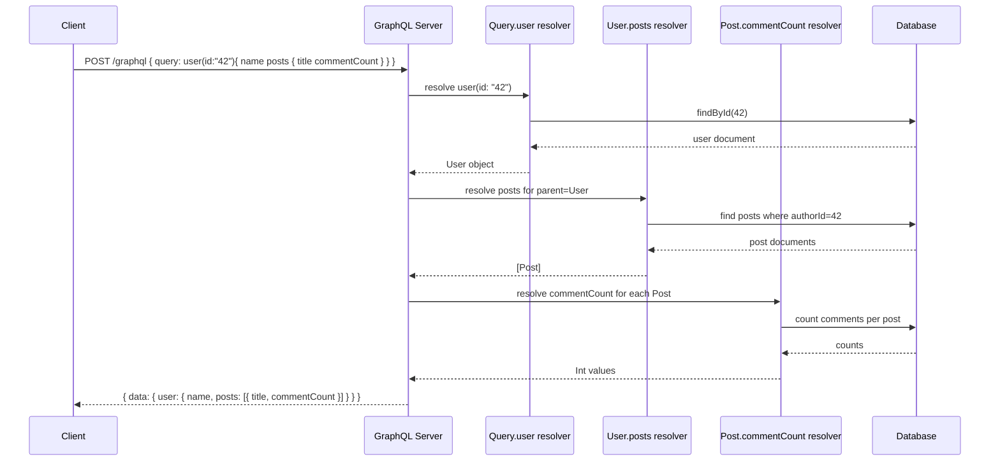

# Lecture 6: REST and GraphQL

REST solved a real problem — a uniform, cacheable way to expose resources over HTTP — but
it has sharp edges that show up once your API serves many different clients with different
data needs. This lecture looks at those edges through a design-quality lens, then
introduces **GraphQL**, an alternative query-oriented approach, and helps you reason about
when each one is the right tool.

## In This Lecture

- Revisit REST from a design-quality perspective and name its recurring pain points
- Understand over-fetching and under-fetching, and why they happen
- Learn GraphQL's type system and the Schema Definition Language (SDL)
- Write queries, mutations, and subscriptions, and understand how resolvers execute them
- Decide when GraphQL is a better fit than REST, and what it costs you in caching and
  query-complexity control

## REST Revisited: A Design-Quality Lens

You already know REST mechanically — GET a resource, POST to create one, PATCH to update
it. Now look at it from the perspective of someone building a **client** that consumes many
different REST endpoints, across many different screens of an application.

A resource-oriented API models the world as a fixed set of endpoints, each returning a
fixed shape of data:

```text
GET /api/users/42          -> full user object
GET /api/users/42/posts    -> full post objects
GET /api/posts/9/comments  -> full comment objects
```

This works cleanly when a client wants *exactly* what an endpoint returns. It works poorly
when a client wants a *combination* of data that no single endpoint provides, or only a
*sliver* of what an endpoint returns.

### Over-Fetching

**Over-fetching** happens when a response contains more data than the client actually
needs. Imagine a mobile app's "friends list" screen that only needs each friend's name and
avatar URL:

```json
GET /api/users/42/friends

[
  {
    "id": 7, "name": "Aisha Khan", "avatarUrl": "...",
    "email": "aisha@example.com", "phone": "+92-300-...",
    "address": { "street": "...", "city": "...", "postalCode": "..." },
    "createdAt": "2023-04-11T08:00:00Z", "lastLoginAt": "2026-08-30T19:22:00Z",
    "bio": "...", "preferences": { "theme": "dark", "notifications": true }
  }
]
```

The client discards almost all of this. On a slow mobile connection, that's wasted
bandwidth and battery multiplied across every friend, every screen load.

### Under-Fetching

**Under-fetching** is the opposite problem: a single response doesn't contain enough
related data, forcing the client to make several *additional* round trips to assemble what
it needs. A "user profile" screen showing the user, their 5 most recent posts, and each
post's comment count might require:

```text
GET /api/users/42
GET /api/users/42/posts?limit=5
GET /api/posts/101/comments/count
GET /api/posts/102/comments/count
GET /api/posts/103/comments/count
GET /api/posts/104/comments/count
GET /api/posts/105/comments/count
```

That's seven sequential or parallel requests for one screen — this pattern is sometimes
called the **N+1 request problem**, and it's especially costly on high-latency mobile
networks where each round trip can cost hundreds of milliseconds.

!!! note
    Some teams work around this with bespoke "aggregate" REST endpoints
    (`GET /api/users/42/profile-summary`) built specifically for one screen. This solves the
    immediate problem but creates a new one: your API accumulates dozens of narrow,
    single-purpose endpoints that are expensive to maintain and don't generalize to the next
    screen someone builds.

GraphQL was designed at Facebook specifically to address this tension: let the *client*
describe the exact shape of data it needs, in a single request, regardless of how that data
is organized on the server.

## GraphQL Schema, Types, and SDL

A GraphQL API is defined by a **schema** — a strongly typed description of every kind of
data the API can return and every operation a client can perform, written in the
**Schema Definition Language (SDL)**.

```graphql
type User {
  id: ID!
  name: String!
  email: String!
  posts: [Post!]!
}

type Post {
  id: ID!
  title: String!
  body: String!
  author: User!
  commentCount: Int!
}

type Query {
  user(id: ID!): User
  posts(limit: Int = 10): [Post!]!
}

type Mutation {
  createPost(title: String!, body: String!, authorId: ID!): Post!
}
```

A few conventions to note:

- `String`, `Int`, `Float`, `Boolean`, and `ID` are GraphQL's built-in **scalar types**.
- A `!` after a type means **non-nullable** — that field is guaranteed to have a value.
  `[Post!]!` means "a non-null list of non-null Posts."
- `type Query` and `type Mutation` are special root types — they define the entry points
  into your API, exactly like a REST API's set of routes, except expressed as fields on a
  type rather than as URIs.

The schema is a **contract**: both the client and server agree on it, and tools can
validate requests against it before they even reach your resolver code.

## Queries, Mutations, Subscriptions, and Resolvers

### Queries

A **query** reads data. The client specifies exactly which fields it wants, nested as deep
as the schema allows, and the server returns precisely that shape — nothing more, nothing
less. This directly solves both over-fetching and under-fetching from one round trip:

```graphql
query {
  user(id: "42") {
    name
    posts {
      title
      commentCount
    }
  }
}
```

```json
{
  "data": {
    "user": {
      "name": "Aisha Khan",
      "posts": [
        { "title": "Getting started with GraphQL", "commentCount": 4 },
        { "title": "REST vs GraphQL", "commentCount": 11 }
      ]
    }
  }
}
```

Compare this to the seven REST requests from the under-fetching example earlier — this is
a single HTTP request (almost always `POST /graphql`) that returns exactly the fields
requested, with related data nested inline.

### Mutations

A **mutation** is GraphQL's equivalent of `POST`/`PUT`/`PATCH`/`DELETE` — it changes server
state. By convention, a mutation also returns data, typically the object it just
created or modified, so the client doesn't need a follow-up query.

```graphql
mutation {
  createPost(title: "My first post", body: "Hello, GraphQL!", authorId: "42") {
    id
    title
    author {
      name
    }
  }
}
```

### Subscriptions

A **subscription** is a long-lived operation that pushes updates to the client whenever a
specified event occurs on the server — GraphQL's mechanism for real-time data, typically
implemented over WebSockets underneath.

```graphql
type Subscription {
  postCreated: Post!
}

subscription {
  postCreated {
    id
    title
    author {
      name
    }
  }
}
```

Once a client subscribes, the server pushes a new payload every time `postCreated` fires
elsewhere in the system — no polling required.

### Resolvers

A **resolver** is the function that actually fetches the data for one field in the schema.
Every field in `type Query`, `type Mutation`, and even nested object fields can have its
own resolver function.

```javascript
const resolvers = {
  Query: {
    user: async (parent, args, context) => {
      return context.db.users.findById(args.id);
    },
    posts: async (parent, args, context) => {
      return context.db.posts.find().limit(args.limit);
    },
  },
  User: {
    posts: async (parent, args, context) => {
      // parent is the User object already resolved above
      return context.db.posts.find({ authorId: parent.id });
    },
  },
  Post: {
    commentCount: async (parent, args, context) => {
      return context.db.comments.countDocuments({ postId: parent.id });
    },
  },
  Mutation: {
    createPost: async (parent, args, context) => {
      return context.db.posts.insert({
        title: args.title,
        body: args.body,
        authorId: args.authorId,
      });
    },
  },
};
```

The GraphQL execution engine walks the query the client sent, calling the matching
resolver for each requested field, passing the parent's resolved value down so nested
resolvers (like `User.posts` or `Post.commentCount`) can use it.



!!! tip
    Notice that `Post.commentCount` is resolved once **per post** in the list. If a query
    returns 100 posts, that's 100 separate database calls unless you batch them — this is
    the classic **N+1 problem re-appearing inside GraphQL resolvers**, usually solved with a
    batching/caching utility like **DataLoader**, which groups resolver calls that happen
    within the same tick into a single batched database query.

## When GraphQL Makes Sense vs. REST

GraphQL is not a universal replacement for REST — it's a different set of trade-offs, and
choosing between them is a real engineering decision, not a fashion choice.

**GraphQL tends to fit well when:**

- Multiple client types (web, iOS, Android, smart TV) each need different slices of the
  same underlying data, and you don't want to maintain a bespoke REST endpoint per screen.
- The data graph is genuinely relational/nested (users → posts → comments → likes), and
  clients frequently need to traverse those relationships in one request.
- Client requirements change frequently, and you want frontend teams to iterate on data
  needs without backend deploys for every new field combination.

**REST tends to fit well when:**

- The API is simple and resource-oriented (CRUD over a small number of entity types).
- You need to rely heavily on HTTP-level caching (CDNs, browser cache) — REST's per-URI
  cacheability is straightforward; GraphQL's single-endpoint model makes this much harder.
- Your consumers are other services or third parties who benefit from REST's ubiquity,
  simple tooling, and predictable status-code semantics.
- File uploads/downloads and simple, high-throughput public APIs where GraphQL's added
  complexity isn't paying for itself.

### Caching Concerns

REST's cacheability constraint works because each resource has its own URI, so an
intermediary (browser cache, CDN, reverse proxy) can cache `GET /api/products/101`
independently of any other request. GraphQL typically exposes a **single endpoint**
(`/graphql`) for every query, so standard HTTP caching by URL doesn't apply — a request for
`user(id: "42") { name }` and one for `user(id: "42") { name email }` hit the same URL with
different bodies. GraphQL clients (like Apollo Client or Relay) work around this with
**normalized client-side caches** that cache individual objects by ID rather than whole
responses, but this shifts caching complexity from infrastructure (CDNs, proxies) into
application code.

### Query-Complexity Concerns

Because GraphQL lets clients construct arbitrarily nested queries, a client (malicious or
just careless) can ask for something extremely expensive to compute:

```graphql
query {
  user(id: "42") {
    posts {
      comments {
        author {
          posts {
            comments {
              author {
                name
              }
            }
          }
        }
      }
    }
  }
}
```

Each level of nesting can multiply the number of resolver calls (and database queries)
needed. Production GraphQL servers defend against this with:

- **Query depth limiting** — reject queries nested beyond N levels.
- **Query complexity/cost analysis** — assign a "cost" to each field and reject queries
  whose total cost exceeds a budget, similar to rate limiting but computed per-query
  instead of per-request-count.
- **Timeouts and pagination** on list fields, so a single field can't return unbounded data.

!!! warning
    An unguarded GraphQL endpoint is far easier to accidentally (or maliciously) overload
    than a REST API, precisely because of this expressive power. Query-complexity limits
    are not optional in a production deployment — treat them as a required part of the
    server, not an afterthought.

## Try It Yourself

1. Take the under-fetching REST example from earlier (profile + 5 posts + comment counts,
   seven requests). Write a single GraphQL query that returns the same data, and sketch the
   SDL types (`User`, `Post`) it would need.
2. Design a resolver map (like the JavaScript example above) for a `Query.book(id: ID!)`
   field that also resolves a nested `author` field on `Book` and a nested `reviewCount`
   field on `Book`. Identify where an N+1 problem could appear if this query returned a list
   of 50 books instead of one.

## Key Takeaways

- Over-fetching (too much data) and under-fetching (too many round trips) are recurring
  pain points of fixed-shape, resource-oriented REST APIs.
- GraphQL's schema, written in SDL, is a strongly typed contract describing every type,
  query, mutation, and subscription an API supports.
- Queries let clients request exactly the fields they need, in one request, nested as deep
  as relationships allow — directly addressing over/under-fetching.
- Mutations change state and typically return the affected object; subscriptions push
  real-time updates to clients, usually over WebSockets.
- Resolvers are per-field functions that fetch data; nested fields can each have their own
  resolver, which reintroduces N+1 query risk unless you batch with something like
  DataLoader.
- REST's per-URI caching is simpler to scale with standard HTTP infrastructure; GraphQL
  typically pushes caching into normalized client-side caches instead.
- GraphQL's flexible queries require deliberate defenses — depth limiting and query-cost
  analysis — against expensive or malicious queries; this is not optional in production.
- Choosing REST vs. GraphQL is a trade-off decision based on client diversity, data shape,
  and caching/tooling needs — not a strict upgrade in either direction.
