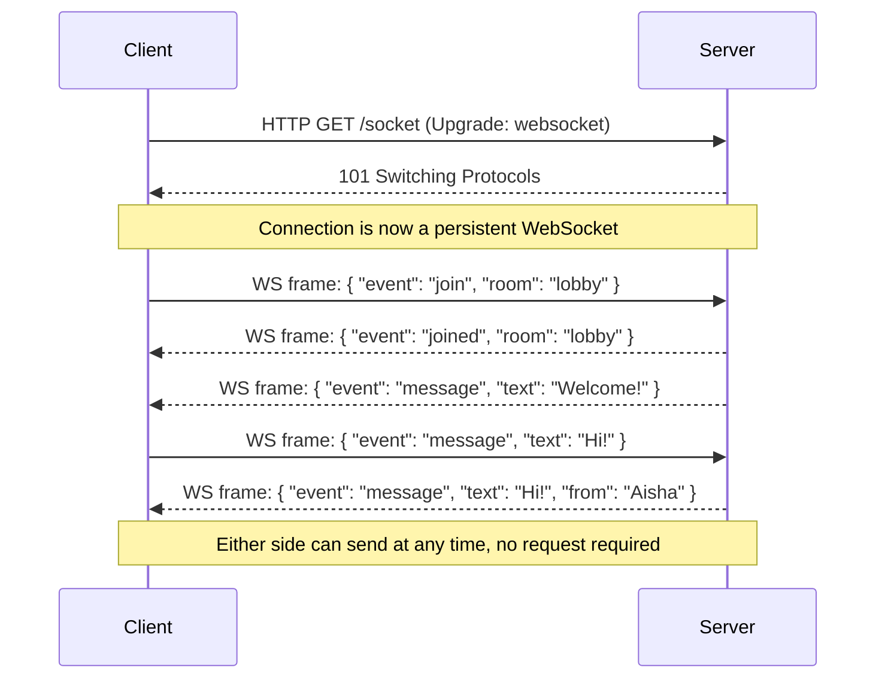
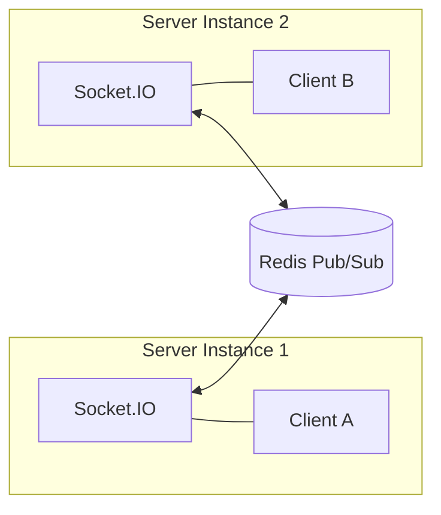

# Lecture 7: JSON-RPC and WebSockets

REST and GraphQL both assume a request/response world — the client asks, the server
answers, the connection closes. Many real applications need something different: calling a
named procedure directly, or keeping a connection open so the server can push data to the
client the instant something happens. This lecture covers **JSON-RPC**, a lightweight
procedure-call protocol, and **WebSockets**, the persistent, bidirectional transport that
underpins most real-time web features you've used — chat apps, live dashboards, multiplayer
games.

## In This Lecture

- Understand JSON-RPC's procedure-oriented message format, including batching and
  notifications
- Understand the WebSocket protocol and its HTTP-based handshake
- Build real-time features with Socket.IO: events, rooms, namespaces, and broadcasting
- Scale Socket.IO across multiple server instances with the Redis adapter
- Compare WebSockets with Server-Sent Events and long polling, and know which real-time
  use cases fit each

## JSON-RPC: Procedure-Oriented Communication

REST is **resource-oriented** — everything is a noun (`/orders/1001`) manipulated by a
small, fixed set of verbs (HTTP methods). **JSON-RPC** takes the opposite approach: it is
**procedure-oriented** — every request names a specific function to call, with arguments,
much like calling a local function except the call happens over the network.

This maps naturally onto operations that don't represent CRUD on a resource at all —
`calculateShipping`, `sendPasswordReset`, `runReport` — actions that would feel awkward
forced into REST's noun-based URI structure.

### Message Format

A JSON-RPC 2.0 request is a JSON object with four fields:

```json
{
  "jsonrpc": "2.0",
  "method": "getUser",
  "params": { "id": 42 },
  "id": 1
}
```

- `jsonrpc` — the protocol version, always `"2.0"`.
- `method` — the name of the procedure to invoke.
- `params` — arguments, as an object (named) or an array (positional).
- `id` — a value the client chooses so it can match the response back to this request.

A successful response echoes the same `id` and carries a `result`:

```json
{
  "jsonrpc": "2.0",
  "result": { "id": 42, "name": "Aisha Khan", "email": "aisha@example.com" },
  "id": 1
}
```

A failed call returns an `error` object instead of `result`, never both:

```json
{
  "jsonrpc": "2.0",
  "error": {
    "code": -32602,
    "message": "Invalid params",
    "data": { "field": "id", "issue": "must be a positive integer" }
  },
  "id": 1
}
```

JSON-RPC defines a small set of standard error codes (`-32700` parse error, `-32600`
invalid request, `-32601` method not found, `-32602` invalid params, `-32603` internal
error), so clients can handle protocol-level failures generically before even looking at
`data`.

### Batching

Multiple calls can be sent in a single HTTP request by wrapping them in a JSON array. The
server processes each independently and returns an array of responses (order not
guaranteed to match):

```json
[
  { "jsonrpc": "2.0", "method": "getUser", "params": { "id": 42 }, "id": 1 },
  { "jsonrpc": "2.0", "method": "getUser", "params": { "id": 7 }, "id": 2 },
  { "jsonrpc": "2.0", "method": "getPostCount", "params": { "userId": 42 }, "id": 3 }
]
```

This is JSON-RPC's answer to the N+1 request problem — batch several independent procedure
calls into one round trip, similar in spirit (though not mechanism) to how GraphQL lets a
single query request nested data.

### Notifications

A **notification** is a JSON-RPC request with no `id` field — it tells the server "do this,
but I don't need a response":

```json
{ "jsonrpc": "2.0", "method": "logClientEvent", "params": { "event": "page_view" } }
```

Because there's no `id`, the server must not reply at all, even on failure. This is useful
for fire-and-forget operations like analytics events, where the client has no interest in
waiting for or handling a response.

!!! note
    JSON-RPC doesn't mandate HTTP as its transport — the same message format works
    unmodified over WebSockets, raw TCP sockets, or even message queues. This is one of its
    advantages over REST, which is tightly coupled to HTTP semantics.

## The WebSocket Protocol and Handshake

HTTP was built around short-lived request/response exchanges: the client opens a
connection, sends one request, gets one response, and (usually) the connection closes or
sits idle. That model doesn't fit a chat application where the server needs to push a new
message to a client the instant it arrives, with no request from that client at all.

**WebSocket** (`ws://` or `wss://` for the encrypted version) is a protocol that upgrades a
single HTTP connection into a persistent, full-duplex (bidirectional) channel: once
established, either side can send messages to the other at any time, with very little
per-message overhead.

### The Handshake

A WebSocket connection begins as a perfectly normal HTTP request carrying special headers
that ask the server to **upgrade** the protocol:

```text
GET /socket HTTP/1.1
Host: example.com
Upgrade: websocket
Connection: Upgrade
Sec-WebSocket-Key: dGhlIHNhbXBsZSBub25jZQ==
Sec-WebSocket-Version: 13
```

If the server supports WebSockets on that endpoint, it responds with status `101 Switching
Protocols`, and from that point on, the underlying TCP connection is no longer HTTP — it
carries WebSocket frames in both directions until either side closes it.

```text
HTTP/1.1 101 Switching Protocols
Upgrade: websocket
Connection: Upgrade
Sec-WebSocket-Accept: s3pPLMBiTxaQ9kYGzzhZRbK+xOo=
```



`Sec-WebSocket-Key` and `Sec-WebSocket-Accept` exist to confirm both sides genuinely
understand the WebSocket protocol (and to prevent certain proxy-caching attacks) — the
server computes `Accept` deterministically from `Key` using a fixed algorithm defined in
the spec.

!!! note
    Once upgraded, WebSocket traffic is framed in a lightweight binary format, not repeated
    HTTP headers — this is why WebSockets have far less per-message overhead than, say,
    polling an HTTP endpoint every second.

## Real-Time Communication with Socket.IO

Raw WebSockets (via the browser's `WebSocket` API and Node's `ws` package) give you the
transport, but you still have to build reconnection logic, message routing, and fallbacks
yourself. **Socket.IO** is a library that wraps WebSockets (and falls back to HTTP long
polling when WebSockets aren't available) and adds a higher-level, event-based API on top.

### Server Setup

```javascript
const express = require("express");
const { createServer } = require("http");
const { Server } = require("socket.io");

const app = express();
const httpServer = createServer(app);
const io = new Server(httpServer, {
  cors: { origin: "https://myapp.com" },
});

io.on("connection", (socket) => {
  console.log(`Client connected: ${socket.id}`);

  socket.on("chat message", (msg) => {
    console.log("Received:", msg);
    io.emit("chat message", msg); // broadcast to everyone, including sender
  });

  socket.on("disconnect", () => {
    console.log(`Client disconnected: ${socket.id}`);
  });
});

httpServer.listen(3000);
```

### Client Setup

```javascript
import { io } from "socket.io-client";

const socket = io("https://myapp.com");

socket.on("connect", () => {
  console.log("Connected with id:", socket.id);
});

socket.emit("chat message", "Hello from the client!");

socket.on("chat message", (msg) => {
  console.log("New message:", msg);
});
```

### Events

Everything in Socket.IO is an **event** — a named message with an arbitrary JSON payload.
`socket.emit(eventName, data)` sends one; `socket.on(eventName, handler)` listens for one.
There's no fixed schema like GraphQL's SDL — event names and payload shapes are a
convention your team agrees on and documents.

### Rooms

A **room** is an arbitrary, server-side grouping of sockets that lets you broadcast to a
subset of connected clients instead of everyone. Rooms are entirely a server-side concept —
clients don't "see" room membership directly.

```javascript
io.on("connection", (socket) => {
  socket.on("join room", (roomName) => {
    socket.join(roomName);
    socket.to(roomName).emit("user joined", socket.id);
  });

  socket.on("room message", ({ room, text }) => {
    io.to(room).emit("room message", { from: socket.id, text });
  });
});
```

This is exactly how a chat app implements separate channels: each channel is a room, and a
message is broadcast only to sockets that joined it.

### Namespaces

A **namespace** partitions your Socket.IO server into separate communication channels at
the connection level (not just message routing like rooms) — useful for separating
unrelated features, like a `/chat` namespace and a `/notifications` namespace, each with
its own set of event handlers and its own connection lifecycle.

```javascript
const chatNamespace = io.of("/chat");
chatNamespace.on("connection", (socket) => {
  socket.on("message", (msg) => chatNamespace.emit("message", msg));
});

const notifNamespace = io.of("/notifications");
notifNamespace.on("connection", (socket) => {
  socket.on("subscribe", (topic) => socket.join(topic));
});
```

```javascript
// Client
const chatSocket = io("/chat");
const notifSocket = io("/notifications");
```

!!! tip
    Use **namespaces** to separate distinct features of your application (chat vs.
    notifications vs. live dashboard) and **rooms** to separate audiences *within* one
    feature (chat room A vs. chat room B). They solve different problems and are commonly
    used together.

### Broadcasting

Socket.IO gives you several precise targeting options:

```javascript
socket.emit("event", data);                  // to this socket only
socket.broadcast.emit("event", data);         // to everyone except this socket
io.emit("event", data);                       // to every connected socket
io.to("room-a").emit("event", data);          // to everyone in room-a
socket.to("room-a").emit("event", data);      // to everyone in room-a except sender
```

## Scaling Socket.IO with the Redis Adapter

A single Node.js process holds all its WebSocket connections in memory. The moment you run
**more than one server instance** (for load or reliability), a new problem appears: if
client A is connected to server instance 1 and client B is connected to server instance 2,
a plain `io.emit()` on instance 1 never reaches client B — each instance only knows about
its own sockets.

The **Redis adapter** solves this by using Redis's publish/subscribe (pub/sub) capability
as a message bus between server instances: when any instance broadcasts an event, it also
publishes it to Redis, and every instance (including itself) receives it and forwards it to
its own locally connected clients.

```javascript
const { createAdapter } = require("@socket.io/redis-adapter");
const { createClient } = require("redis");

const pubClient = createClient({ url: "redis://localhost:6379" });
const subClient = pubClient.duplicate();

await Promise.all([pubClient.connect(), subClient.connect()]);

io.adapter(createAdapter(pubClient, subClient));
```



With this in place, `io.to("room-a").emit(...)` correctly reaches every client in
`room-a`, regardless of which server instance each client is physically connected to. This
is a required piece of infrastructure the moment your real-time app needs to run behind a
load balancer with multiple instances — without it, broadcasts silently only reach a
fraction of your users.

!!! warning
    Load balancers must also be configured for **sticky sessions** (routing a given
    client's requests to the same server instance) when using WebSockets with HTTP long
    polling fallback, because a client may make several HTTP requests during the connection
    upgrade process that all need to land on the same instance.

## WebSockets vs. Server-Sent Events vs. Long Polling

| Approach | Direction | Transport | Reconnection | Best for |
|---|---|---|---|---|
| **Long polling** | Client-initiated (repeated) | Plain HTTP | Manual (client re-requests) | Simple, infrequent updates; maximum compatibility |
| **Server-Sent Events (SSE)** | Server → client only | Plain HTTP (`text/event-stream`) | Automatic, built into the browser `EventSource` API | One-way live feeds: notifications, live scores, log streams |
| **WebSockets** | Full bidirectional | Dedicated protocol (upgraded from HTTP) | Manual (library like Socket.IO handles it) | Chat, multiplayer, collaborative editing — anything needing client → server pushes too |

**Long polling** is the oldest technique: the client sends a request, the server holds it
open until it has something to say (or a timeout passes), responds, and the client
immediately opens a new request. It works everywhere but wastes connections and adds
latency compared to a persistent channel.

**Server-Sent Events** use a single long-lived HTTP response that the server keeps writing
to over time; the browser's built-in `EventSource` API consumes it and automatically
reconnects if the connection drops. SSE is simpler than WebSockets (it's just HTTP) but is
strictly **one-directional** — the server can push, but the client can't send messages back
over the same channel. For a live stock ticker or a "new notification" feed, that's all you
need.

```javascript
// Server (Express) — Server-Sent Events
app.get("/events", (req, res) => {
  res.set({
    "Content-Type": "text/event-stream",
    "Cache-Control": "no-cache",
    Connection: "keep-alive",
  });
  const interval = setInterval(() => {
    res.write(`data: ${JSON.stringify({ time: Date.now() })}\n\n`);
  }, 1000);
  req.on("close", () => clearInterval(interval));
});
```

```javascript
// Client
const events = new EventSource("/events");
events.onmessage = (e) => console.log(JSON.parse(e.data));
```

**WebSockets** (via Socket.IO or raw `ws`) are the right choice whenever the client also
needs to send data spontaneously, not just receive it — a chat message, a cursor position
in a collaborative editor, a game input.

!!! tip "Choosing among the three"
    Ask one question first: **does the client ever need to push data to the server outside
    of a normal request/response?** If no, SSE (or even long polling, for low-traffic cases)
    is simpler and sufficient. If yes — real bidirectional interaction — reach for
    WebSockets.

### Real-Time Use Cases

- **Chat applications** — WebSockets (bidirectional messages, typing indicators, presence).
- **Live notifications** — SSE is often sufficient (server pushes, client rarely responds
  over the same channel) unless notifications need acknowledgment in real time.
- **Live dashboards** (stock prices, monitoring metrics) — SSE for pure display; WebSockets
  if users can also send commands (e.g., adjusting alert thresholds live).
- **Collaborative editing** (multiple cursors, live document sync) — WebSockets, since both
  directions are constantly active.

## Try It Yourself

1. Write a JSON-RPC batch request containing three calls: `getUser` (id: 1), `getUser` (id:
   2), and a `logClientEvent` **notification** with no response expected. Then write the
   JSON-RPC response array the server should return, remembering that notifications never
   get a response entry.
2. Sketch a small Socket.IO chat feature with two rooms, `"general"` and `"random"`. Write
   the server-side `io.on("connection", ...)` handler that lets a client join a room and
   broadcast a message only to other members of that room (not the sender, not other
   rooms).

## Key Takeaways

- JSON-RPC is procedure-oriented: requests name a `method` and `params`, matched to
  responses by `id`; requests without an `id` are notifications that receive no response.
- JSON-RPC supports batching several calls into a single array request/response, and is
  transport-agnostic — it works over HTTP, WebSockets, or raw sockets.
- The WebSocket protocol begins as an HTTP request that **upgrades** to `101 Switching
  Protocols`, after which the connection is a persistent, full-duplex channel.
- Socket.IO adds events, rooms (audience grouping), namespaces (feature separation), and
  automatic reconnection/fallback on top of raw WebSockets.
- Scaling Socket.IO across multiple server instances requires the Redis adapter, which uses
  Redis pub/sub so broadcasts reach clients connected to any instance.
- Server-Sent Events are a simpler, one-directional alternative to WebSockets, well suited
  to pure server-to-client feeds like notifications or live dashboards.
- Long polling is the most compatible but least efficient real-time technique; reserve it
  for low-frequency updates or as a last-resort fallback.
- Choose based on directionality first: one-way pushes favor SSE, true bidirectional
  interaction favors WebSockets.
