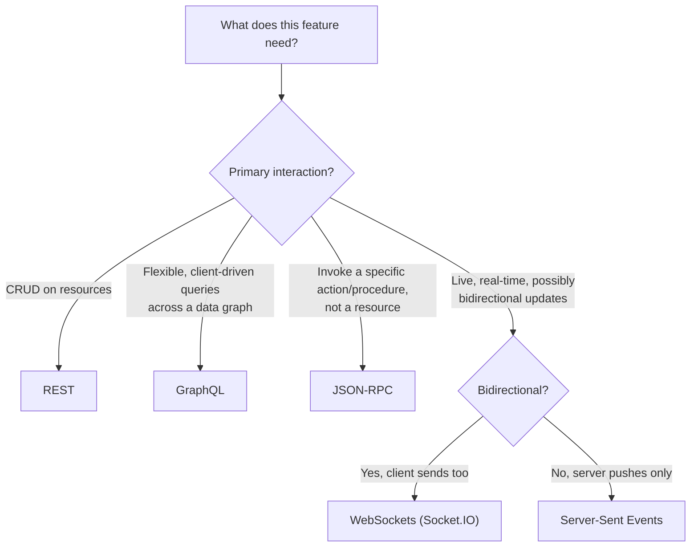
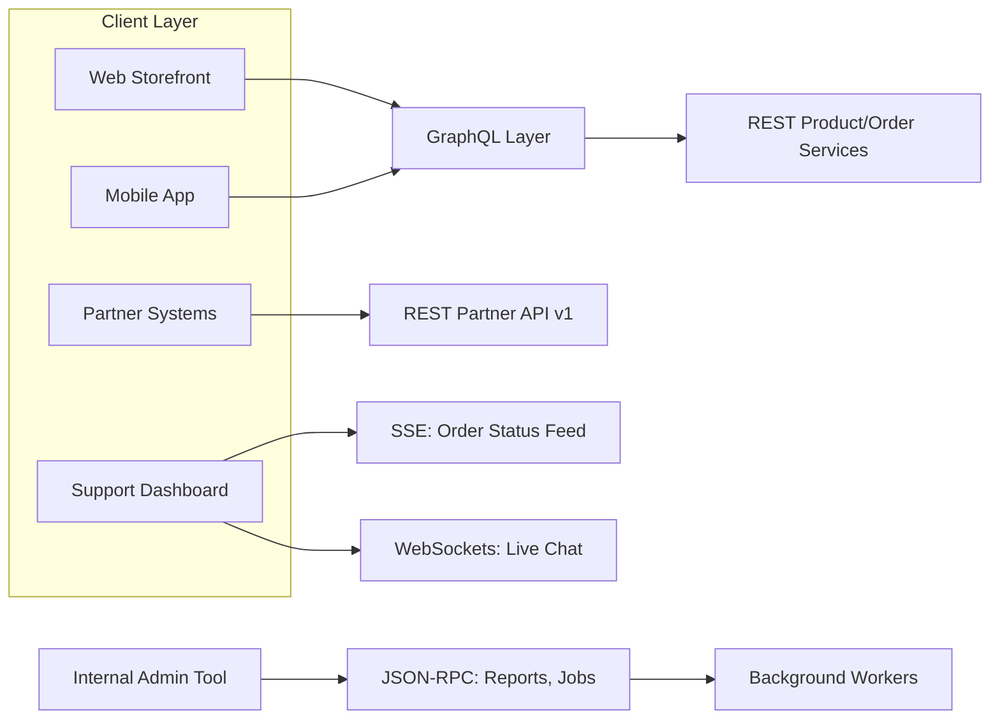

# Lecture 8: Selecting a Suitable Communication Approach

You now know four ways for a client and server to talk: REST, GraphQL, JSON-RPC, and
WebSockets (with SSE and long polling as supporting players). In practice, a single
production system almost always uses more than one of them, each for the part of the
system it fits best. This lecture is about developing the judgment to make that call —
and defending it — rather than defaulting to whichever one you learned first.

## In This Lecture

- Build a requirement-driven framework for choosing a communication approach
- Map common requirement patterns (CRUD, flexible queries, procedures, real-time) to the
  technology that fits each
- Weigh non-functional factors — caching, tooling, security, team expertise — that matter
  as much as the functional fit
- Walk through a realistic case study and justify a mixed-technology architecture

## A Requirement-Driven Decision Framework

The mistake to avoid is picking a communication technology because it's trendy, or because
it's the only one you know well. Instead, start from the **shape of the requirement** and
let that shape point you toward a technology. Ask, for each piece of functionality you're
building:

1. **What is the primary interaction pattern?** Reading/writing well-defined resources?
   Answering flexible, client-driven questions about a data graph? Invoking a specific
   action or computation? Pushing live updates?
2. **Who are the consumers, and how many kinds are there?** A single web frontend you
   control? Multiple client types (web, iOS, Android) with different data needs? Other
   companies integrating against a public API?
3. **How important is caching at the infrastructure level** (CDN, browser cache, reverse
   proxy)?
4. **What are the latency and freshness requirements?** Is "reload the page" acceptable, or
   does new data need to appear within milliseconds without user action?
5. **What does your team already know well**, and how much time do you have to learn
   something new?

!!! note
    This decision is rarely made once for an entire system. A well-designed enterprise
    application typically mixes several of these approaches, each scoped to the part of the
    system where it's the best fit — you'll see this in the case study below.

## Mapping Requirements to Technologies

### CRUD / Resource-Style API → REST

If the core of a feature is create/read/update/delete over well-defined entities — users,
products, orders, invoices — REST remains the right default. It's cacheable at the HTTP
level, universally understood by every client platform and third-party integrator, and
supported by mature tooling (OpenAPI, API gateways, monitoring) without any custom
infrastructure. Choose REST when:

- The data shape a client needs closely matches how the resource is naturally modeled.
- Consumers include external partners or the public — REST's ubiquity minimizes their
  integration cost.
- HTTP-level caching (CDN in front of `GET /api/products/101`) meaningfully reduces load.

### Flexible, Client-Driven Queries → GraphQL

If several different clients each need different, overlapping slices of a deeply
relational data graph — and especially if you don't want to keep hand-building bespoke
REST endpoints per screen — GraphQL earns its added complexity. Choose GraphQL when:

- You support multiple frontends (web, iOS, Android) with materially different data needs
  from the same backend.
- The data is graph-shaped (entities reference many related entities) and clients
  routinely need to traverse those relationships in one request.
- You can invest in the operational overhead: query-complexity limits, a resolver
  batching strategy (DataLoader), and a different caching story than REST's.

### Procedure-Oriented API → JSON-RPC

If a piece of functionality is fundamentally an **action**, not a resource — running a
report, triggering a computation, sending a one-off command to a service — forcing it into
REST's noun-based URIs produces awkward, unnatural endpoints
(`POST /api/reports/run`? `POST /api/report-runs`?). JSON-RPC lets you name the operation
directly (`runReport`) and is a natural fit for:

- Internal service-to-service calls where both sides are procedural, not resource-oriented
  (e.g., a background worker calling `resizeImage` or `sendEmail` on another service).
- Protocols and tooling built specifically around JSON-RPC, such as the Language Server
  Protocol or many blockchain node APIs — worth recognizing if you integrate with them.
- Batched, transport-agnostic RPC calls where you want the same message format to work
  over HTTP today and a message queue or WebSocket tomorrow.

### Real-Time, Bidirectional Needs → WebSockets

If the feature requires the server to push updates the instant they happen, and/or the
client needs to send data spontaneously outside of a normal request/response cycle,
WebSockets (via Socket.IO in a Node.js stack) are the right tool:

- Chat, presence, and typing indicators.
- Multiplayer or collaborative interactions (shared cursors, live document editing).
- Anywhere polling would introduce unacceptable latency or waste bandwidth re-requesting
  data that usually hasn't changed.

Recall from Lecture 7: if the interaction is genuinely **one-directional** (server pushes,
client doesn't need to talk back over the same channel), Server-Sent Events are simpler and
sufficient — reserve WebSockets for when bidirectionality is a real requirement, not a
default reach.

## Non-Functional Factors

Functional fit gets you most of the way, but production decisions also hinge on factors
that don't show up in a feature list.

**Caching.** REST's per-resource URIs are trivially cacheable by browsers, CDNs, and
reverse proxies with zero custom code. GraphQL and JSON-RPC typically funnel every
operation through one endpoint, so caching has to be built into the client (normalized
caches like Apollo Client) or the application layer instead. If your traffic is
read-heavy and infrastructure caching would meaningfully cut load or latency, weight this
factor heavily toward REST.

**Tooling and ecosystem maturity.** REST has the deepest, most universal tooling: every
HTTP client, every API gateway, every monitoring platform understands it out of the box.
GraphQL has excellent but more specialized tooling (Apollo, Relay, GraphiQL). JSON-RPC's
tooling is thinner and more domain-specific. WebSockets need explicit infrastructure
support (sticky sessions, the Redis adapter for horizontal scaling) that plain HTTP
doesn't.

**Security surface.** Each approach shifts risk differently. REST's attack surface is
well understood (injection, broken auth on individual endpoints, mass assignment). GraphQL
adds query-complexity/depth attacks as a new category you must defend against explicitly.
WebSockets keep long-lived connections open, which changes how you think about
authentication (validated once at connect time vs. per-request) and about resource
exhaustion (a slow client holding a connection open indefinitely).

**Team expertise.** A technically "ideal" choice your team has no experience with can cost
more in bugs, delays, and operational incidents than a "good enough" choice they know well.
Introducing GraphQL or a custom WebSocket layer is a real investment — training,
new debugging habits, new failure modes — and should be justified by a genuine requirement,
not novelty.

!!! warning
    Don't choose GraphQL (or any non-REST approach) purely because over-fetching is
    theoretically possible somewhere in your API. If it isn't causing a measurable problem
    for a real client today, the operational cost of a second technology stack usually
    isn't worth paying yet.

## Case Study: An E-Commerce Platform

Consider a mid-sized e-commerce platform: a public storefront (web + a native mobile app),
a partner-facing integration API, a seller dashboard, and customer support tooling that
needs to see order status update live. Walk through each feature and apply the framework.

**Product catalog and order management (storefront backend).** Products, carts, and orders
are classic, well-defined resources with predictable CRUD operations, consumed by both the
web frontend and the mobile app, and heavily read-cacheable (product pages don't change
every second). → **REST**, fronted by a CDN caching `GET /api/products/:id` aggressively.

**Storefront product page + mobile app home screen.** The web product page wants full
details, reviews, and related products; the mobile home screen wants a lightweight feed of
thumbnails, prices, and ratings only — two very different slices of the same underlying
product graph, from two different clients. Building two bespoke REST endpoints
(`/product-page-data`, `/mobile-home-feed`) works today but won't generalize as more screens
appear. → **GraphQL** layered in front of (or alongside) the REST product service, letting
each client shape its own response.

**Partner integration API.** Third-party sellers and logistics partners integrate against
this API using standard HTTP tooling, expect predictable status codes, and value stability
and documentation (OpenAPI) over query flexibility. → **REST**, versioned via the URI
(`/api/v1/...`), with a published OpenAPI spec and a deprecation policy for changes.

**Internal report generation.** An internal admin tool triggers a "generate quarterly sales
report" action, and a background worker later calls "resize product image" and "notify
seller of low stock" — none of these are resources, they're commands. → **JSON-RPC**
between internal services, since it names actions directly and works transport-agnostically
between the admin tool, the job queue, and worker processes.

**Live order-status updates for customer support.** When a customer's order status changes
(payment confirmed, shipped, delivered), the support dashboard needs to reflect that
instantly, without a human refreshing the page, and support agents don't send data back
over that same channel. → **Server-Sent Events**, since the requirement is strictly
one-directional server-to-client push.

**Live chat between customer and support agent.** Both sides send messages, typing
indicators, and read receipts in both directions, and latency must feel instant. →
**WebSockets via Socket.IO**, with a room per support conversation, scaled with the Redis
adapter since the support platform runs multiple server instances behind a load balancer.

Notice what this case study demonstrates: **no single technology was "the answer."** Each
was chosen because it fit the shape of a specific requirement, weighed against caching
needs, consumer diversity, and operational cost — exactly the framework from the start of
this lecture, applied feature by feature rather than decided once for the whole platform.

!!! tip "Defending your decision"
    In an interview or a design review, the strongest answer isn't "I'd use GraphQL because
    it's more flexible" — it's "I'd use GraphQL here specifically because we have three
    client types needing different slices of a relational data graph, and REST here for the
    partner API because external consumers value stability and off-the-shelf tooling more
    than query flexibility." Naming the *requirement* that drove the choice is what
    distinguishes an engineering decision from a preference.

## Try It Yourself

1. For a ride-sharing app (rider requests a trip, driver accepts, both parties see the
   car's live location, support handles disputes, and third-party mapping partners consume
   trip data via an API), assign one of REST/GraphQL/JSON-RPC/WebSockets/SSE to each of
   these four features, and write one sentence justifying each choice using the framework
   from this lecture: (a) trip history and receipts, (b) live driver location during an
   active trip, (c) a "cancel trip" action triggered by an internal fraud-detection job,
   (d) the public trip-data API for mapping partners.
2. Revisit the e-commerce case study's choice of GraphQL for the storefront/mobile product
   graph. Suppose leadership adds a hard requirement: "product listing pages must be
   servable from a CDN with sub-50ms cached response times, globally." Does this change
   your recommendation? Explain which non-functional factor from this lecture now
   dominates the decision.

## Key Takeaways

- Start from the requirement's interaction pattern, not familiarity or trend, when
  choosing a communication technology.
- CRUD over well-defined resources favors REST; flexible, multi-client, graph-shaped data
  needs favor GraphQL; named actions/procedures favor JSON-RPC; live bidirectional
  interaction favors WebSockets (one-directional live push favors SSE instead).
- Non-functional factors — HTTP-level caching, tooling maturity, security surface, and team
  expertise — often decide close calls as much as functional fit does.
- Production systems typically mix several of these technologies, each scoped to the part
  of the system it serves best, rather than standardizing on one for everything.
- Don't adopt a more complex technology (GraphQL, custom WebSocket infrastructure) without
  a genuine, current requirement driving it — operational cost is a real cost.
- A well-justified technology choice names the specific requirement that drove it, which is
  what distinguishes an engineering decision from a preference.
