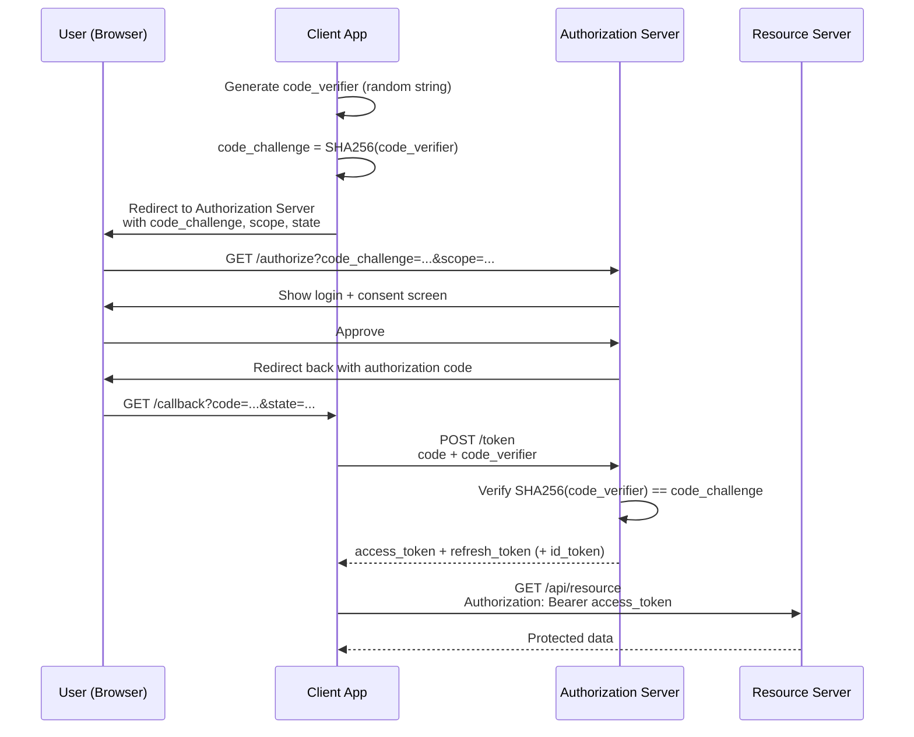

# Lecture 10: OAuth 2.0 and OpenID Connect

"Sign in with Google" is something you've used dozens of times as a user; this lecture
teaches you to build it. You'll learn OAuth 2.0 — the authorization framework behind
every "Sign in with..." button — in enough depth to implement the Authorization Code
flow with PKCE correctly, layer OpenID Connect on top for authentication, and avoid the
implementation mistakes that turn a convenience feature into a security hole.

## In This Lecture

- Understand OAuth 2.0 as an authorization framework and its four roles
- Implement the Authorization Code flow with PKCE, and know the other grant types
- Work with access tokens, refresh tokens, scopes, and user consent
- Understand OpenID Connect, the ID token, and social login
- Configure Passport.js strategies and avoid common OAuth implementation mistakes

## OAuth 2.0: An Authorization Framework, Not a Login Protocol

A common misconception is that OAuth 2.0 is a login system. It isn't — it's an
**authorization framework**: a standardized way for a user to grant one application
limited access to their data held by another application, *without* handing over their
password. When you click "Allow" on a screen that says "MyApp wants to access your
Google Calendar," you're watching OAuth 2.0 at work: MyApp never sees your Google
password, only a scoped, revocable token.

OAuth defines four distinct roles:

| Role | Description | Example |
|---|---|---|
| **Resource Owner** | The user who owns the data and can grant access to it | You |
| **Client** | The application requesting access on the resource owner's behalf | The third-party app ("MyApp") |
| **Authorization Server** | Issues tokens after authenticating the resource owner and obtaining consent | Google's OAuth server |
| **Resource Server** | Hosts the protected data and accepts access tokens to serve it | Google Calendar API |

!!! note
    The authorization server and resource server are often operated by the same
    provider (Google runs both), but they are logically separate roles — some large
    systems genuinely run them as different services.

Key vocabulary you'll see throughout this lecture: a **scope** is a permission string
requested by the client (e.g. `calendar.readonly`); **consent** is the resource owner's
explicit approval of the requested scopes; an **access token** is the credential the
client uses to call the resource server; a **refresh token** is a longer-lived
credential used to obtain new access tokens without re-prompting the user.

## The Authorization Code Flow with PKCE

The **Authorization Code flow** is the flow you should use for essentially every web
and mobile application today. Instead of the client receiving an access token directly
from the browser (which would expose it to anyone who can read the URL or browser
history), the client first receives a short-lived, single-use **authorization code**,
which it then exchanges for tokens through a secure, server-to-server request.

**PKCE (Proof Key for Code Exchange, pronounced "pixy")** is now recommended for *all*
clients, not just mobile/SPA clients as originally designed — it closes a vulnerability
where an attacker who intercepts the authorization code (e.g. via a malicious app
registering the same custom URL scheme) could exchange it for tokens themselves. PKCE
works by having the client prove it is the same party that started the flow.



Step by step:

1. The client generates a random **`code_verifier`** and derives a **`code_challenge`**
   from it (a SHA-256 hash, Base64URL-encoded).
2. The client redirects the browser to the authorization server's `/authorize`
   endpoint, including the `code_challenge`, the requested `scope`, a `redirect_uri`,
   and a random `state` value (to prevent CSRF on the callback).
3. The user authenticates with the authorization server and approves (or denies) the
   requested scopes on a consent screen.
4. The authorization server redirects back to the client's `redirect_uri` with a
   short-lived **authorization code** and the same `state` value.
5. The client verifies `state` matches what it sent, then exchanges the code for
   tokens by POSTing to the token endpoint — including the original `code_verifier`.
6. The authorization server re-derives the challenge from the verifier and compares it
   to the one stored with the code; if they match, it issues an access token (and
   usually a refresh token).

```javascript
const crypto = require("crypto");

function base64url(buffer) {
  return buffer
    .toString("base64")
    .replace(/\+/g, "-")
    .replace(/\//g, "_")
    .replace(/=/g, "");
}

// Step 1: generate PKCE values before redirecting the user
const codeVerifier = base64url(crypto.randomBytes(32));
const codeChallenge = base64url(
  crypto.createHash("sha256").update(codeVerifier).digest()
);
req.session.codeVerifier = codeVerifier; // stash for the callback

const authUrl = new URL("https://provider.example.com/authorize");
authUrl.searchParams.set("client_id", process.env.OAUTH_CLIENT_ID);
authUrl.searchParams.set("redirect_uri", "https://myapp.com/callback");
authUrl.searchParams.set("response_type", "code");
authUrl.searchParams.set("scope", "profile email");
authUrl.searchParams.set("code_challenge", codeChallenge);
authUrl.searchParams.set("code_challenge_method", "S256");
authUrl.searchParams.set("state", req.session.oauthState);
res.redirect(authUrl.toString());
```

!!! warning
    Always validate the `state` parameter on your callback route before doing anything
    else. Skipping it opens a **login CSRF** hole, where an attacker tricks a victim
    into completing an OAuth flow initiated by the attacker, potentially binding the
    victim's session to the attacker's third-party account.

### Other Grant Types (Overview)

- **Client Credentials** — used for machine-to-machine calls where there is no
  resource owner at all (a backend service authenticating as itself). No user
  interaction, no browser redirect.
- **Refresh Token** grant — exchanges a refresh token for a new access token once the
  original expires, without involving the user again.
- **Implicit flow** — an older flow that returned the access token directly in the URL
  fragment. It is now considered **deprecated/insecure** (tokens can leak via browser
  history, referrer headers, or logs) and should not be used in new applications;
  Authorization Code + PKCE replaces it even for single-page apps.
- **Resource Owner Password Credentials (ROPC)** — the client collects the user's
  username/password directly and trades them for a token. Also discouraged, since it
  defeats the entire point of OAuth (the client sees the password) — only acceptable
  for highly trusted first-party legacy migrations.

## Access Tokens, Refresh Tokens, Scopes, and Consent

**Scopes** let the resource owner grant *partial* access rather than all-or-nothing.
Requesting `calendar.readonly` instead of full account access follows the **principle
of least privilege** — the client only gets what it actually needs, limiting the blast
radius if the client itself is later compromised.

The **consent screen** is the user-facing moment where scopes become concrete and
reviewable ("MyApp wants to: view your email address, view your calendar"). Well-behaved
clients request the minimum scopes needed for their actual functionality — requesting
broad scopes "just in case" is both a poor user experience and a security anti-pattern,
since it makes the client a more valuable target.

Access tokens are deliberately short-lived (minutes to an hour); refresh tokens are
long-lived and must be stored with the same care as any other sensitive credential —
server-side, never exposed to client-side JavaScript.

## OpenID Connect and the ID Token

OAuth 2.0 tells you *what a client is allowed to access* — it was never designed to
answer *who the user is*. That gap is what **OpenID Connect (OIDC)** fills: a thin
identity layer built directly on top of OAuth 2.0. OIDC adds a third token, the **ID
token**, alongside the access and refresh tokens.

The **ID token** is a JWT (see Lecture 9) containing verified claims about the
authenticated user — `sub` (a stable unique user ID), `email`, `name`, `iss` (issuer),
`aud` (audience/client ID), and `exp`. Unlike an access token, whose contents are
opaque to the client and meant only for the resource server, the ID token is meant to
be *read and verified by the client itself* to establish who just logged in.

```javascript
const { OAuth2Client } = require("google-auth-library");
const client = new OAuth2Client(process.env.GOOGLE_CLIENT_ID);

async function verifyIdToken(idToken) {
  const ticket = await client.verifyIdToken({
    idToken,
    audience: process.env.GOOGLE_CLIENT_ID, // must match your client ID
  });
  const payload = ticket.getPayload();
  // payload.sub is the stable Google user ID — use this, not email, as your key
  return payload;
}
```

!!! tip
    Always key your local user records off the ID token's `sub` claim, not the email
    address. Emails can change or be reused across providers; `sub` is a stable,
    provider-scoped identifier.

This is exactly the mechanism behind **social login** — "Sign in with Google/GitHub/
Facebook" buttons. The third-party provider acts as the OpenID Connect **identity
provider (IdP)**; your application is the **relying party**, trusting the IdP's
verified identity instead of managing its own passwords for those users.

## Passport.js Strategies

**Passport.js** is the de facto standard authentication middleware for Express. It
doesn't implement any auth scheme itself — instead, it provides a common interface for
pluggable **strategies**, each of which implements one authentication method (local
username/password, Google OAuth, GitHub OAuth, JWT, and hundreds more).

```javascript
const passport = require("passport");
const GoogleStrategy = require("passport-google-oauth20").Strategy;

passport.use(
  new GoogleStrategy(
    {
      clientID: process.env.GOOGLE_CLIENT_ID,
      clientSecret: process.env.GOOGLE_CLIENT_SECRET,
      callbackURL: "/auth/google/callback",
    },
    async (accessToken, refreshToken, profile, done) => {
      // profile contains the verified identity from Google
      let user = await User.findOne({ googleId: profile.id });
      if (!user) {
        user = await User.create({
          googleId: profile.id,
          email: profile.emails[0].value,
          name: profile.displayName,
        });
      }
      return done(null, user); // attaches `user` to req.user
    }
  )
);

passport.serializeUser((user, done) => done(null, user.id));
passport.deserializeUser(async (id, done) => {
  const user = await User.findById(id);
  done(null, user);
});

app.get("/auth/google", passport.authenticate("google", { scope: ["profile", "email"] }));

app.get(
  "/auth/google/callback",
  passport.authenticate("google", { failureRedirect: "/login" }),
  (req, res) => res.redirect("/dashboard")
);
```

Passport handles the redirect dance and token exchange internally for OAuth-style
strategies, calling your **verify callback** with the resulting profile once
authentication succeeds — you decide how to map that profile onto your own user model.

## Common OAuth Implementation Mistakes

!!! danger "Skipping `state` validation"
    Without checking `state` on the callback, your app is vulnerable to login CSRF —
    an attacker can trick a victim into linking the attacker's account to the victim's
    session. Always generate a random `state`, store it server-side (or in a signed
    cookie), and verify it matches on callback.

!!! danger "Trusting the `redirect_uri` without an exact-match allowlist"
    Authorization servers should only redirect to `redirect_uri` values that were
    pre-registered *exactly*. If you (as the authorization server operator) allow
    wildcard or loosely matched redirect URIs, an attacker can redirect authorization
    codes to a server they control.

!!! danger "Storing tokens client-side without protection"
    Just like the JWTs from Lecture 9, OAuth access and refresh tokens should be kept
    server-side or in `httpOnly` cookies — never in `localStorage` where any XSS
    payload can steal them.

!!! danger "Confusing the access token with proof of identity"
    An access token proves the client may call an API on the user's behalf — it does
    **not** prove who the user is, and its contents are not guaranteed to be readable
    or meaningful to the client. Use the OIDC ID token (and verify its signature and
    `aud`/`iss` claims) to establish identity, never the access token.

!!! warning "Requesting more scopes than you need"
    Broad scope requests increase your liability if the client is compromised, and
    they scare away privacy-conscious users on the consent screen. Request the minimum
    scopes your feature set actually requires.

## Try It Yourself

1. Register an OAuth application with GitHub (Settings → Developer settings → OAuth
   Apps) and implement "Sign in with GitHub" in a small Express app using
   `passport-github2`. Confirm you can see `req.user` populated after a successful
   login.
2. Manually implement the Authorization Code + PKCE flow (without Passport) against a
   test OAuth provider of your choice: generate `code_verifier`/`code_challenge`,
   build the `/authorize` redirect URL, handle the callback, and exchange the code for
   tokens with a POST request. Log each intermediate value to confirm you understand
   every step of the sequence diagram above.

## Key Takeaways

- OAuth 2.0 is an authorization framework, not a login protocol — it governs delegated,
  scoped access to resources, involving four roles: resource owner, client,
  authorization server, resource server.
- The Authorization Code flow with PKCE is the recommended flow for essentially all web
  and mobile clients today; the Implicit flow is deprecated.
- Access tokens should be short-lived and scoped narrowly; refresh tokens are
  long-lived and must be stored and revoked carefully.
- OpenID Connect adds the ID token on top of OAuth 2.0, turning "authorization" into
  verifiable "authentication" — this is what powers social login.
- Always verify an ID token's signature, `iss`, and `aud` before trusting it, and key
  your user records on the stable `sub` claim.
- Passport.js provides a common strategy interface for dozens of auth methods, letting
  you plug in Google, GitHub, JWT, or local strategies with minimal boilerplate.
- Always validate `state` on OAuth callbacks and never store OAuth tokens in places
  readable by client-side JavaScript.
