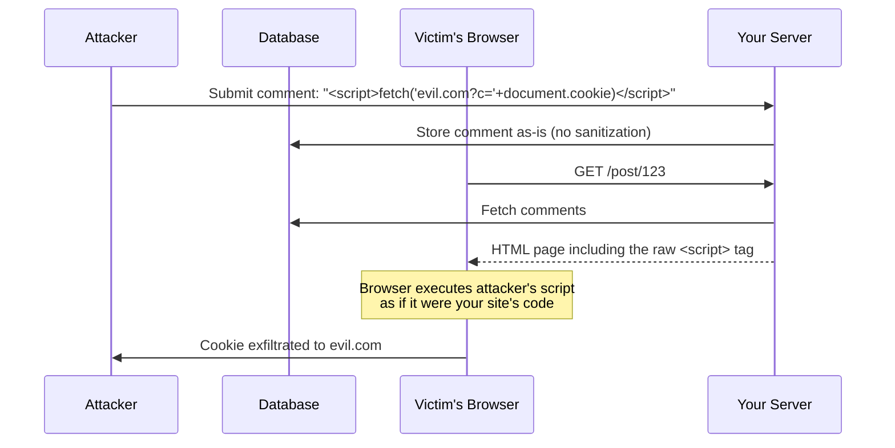
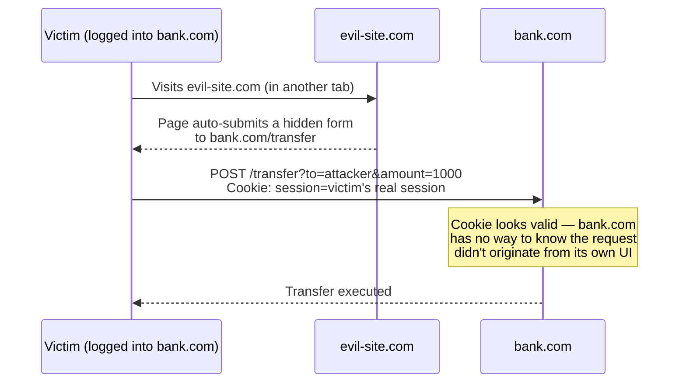

# Lecture 11: Web-Specific Security

This lecture is a tour of the attacks that exist specifically *because* your
application runs inside a browser and talks to a database over a network: script
injection, forged requests, misconfigured cross-origin rules, and data-layer injection.
You'll learn how each attack actually works and the specific, concrete defense for each
one — this is the material that separates "it works" from "it's safe to deploy."

## In This Lecture

- Identify stored, reflected, and DOM-based XSS, and defend with output encoding
- Understand CSRF, and defend with anti-CSRF tokens and `SameSite` cookies
- Configure CORS correctly, including preflight requests and response headers
- Prevent SQL/NoSQL injection through sanitization and parameterized queries
- Enforce HTTPS/TLS, secure cookies, and Content Security Policy (CSP)

## Cross-Site Scripting (XSS)

**Cross-Site Scripting (XSS)** is an attack where an attacker gets their own
JavaScript to execute in another user's browser, in the context of your trusted site —
meaning that script can read cookies (unless `httpOnly`), make authenticated requests,
modify the page, or steal form input, all while appearing to come from your legitimate
origin. XSS comes in three forms, distinguished by *where* the malicious script comes
from.



- **Stored XSS** — the malicious script is saved server-side (in a database, a comment
  field, a user profile) and served to *every* visitor who views that content. This is
  the most dangerous variant because it needs no per-victim interaction — the diagram
  above shows a stored XSS attack.
- **Reflected XSS** — the malicious script is part of the request itself (commonly a
  URL query parameter) and is echoed back unescaped in the response. The attacker must
  trick a specific victim into clicking a crafted link.
- **DOM-based XSS** — the vulnerability lives entirely in client-side JavaScript: the
  page takes some attacker-controlled input (e.g. `location.hash`) and writes it into
  the DOM via a dangerous sink (`innerHTML`, `document.write`) without ever touching
  the server.

```javascript
// VULNERABLE: reflected XSS
app.get("/search", (req, res) => {
  res.send(`<h1>Results for: ${req.query.q}</h1>`); // q is inserted raw
});
// A request to /search?q=<script>alert(document.cookie)</script> executes attacker JS

// VULNERABLE: DOM-based XSS (client-side)
document.getElementById("greeting").innerHTML = "Hello, " + location.hash.slice(1);
// A URL like # executes attacker JS in the browser
```

### Defense: Output Encoding

The core defense against all three forms is **output encoding** (also called escaping):
converting characters that have special meaning in HTML (`<`, `>`, `&`, `"`, `'`) into
their harmless entity equivalents (`&lt;`, `&gt;`, etc.) *at the point where untrusted
data is inserted into a page*, so the browser renders it as text, never as executable
markup.

```javascript
// FIXED: encode before inserting into HTML
const escapeHtml = (str) =>
  str.replace(/[&<>"']/g, (c) => ({
    "&": "&amp;", "<": "&lt;", ">": "&gt;", '"': "&quot;", "'": "&#39;",
  }[c]));

app.get("/search", (req, res) => {
  res.send(`<h1>Results for: ${escapeHtml(req.query.q)}</h1>`);
});
```

!!! tip
    Modern templating engines (EJS's `<%= %>`, Pug, Handlebars `{{ }}`) and frameworks
    like React auto-escape interpolated values by default — this is why raw
    `dangerouslySetInnerHTML` in React or `<%- %>` (unescaped) in EJS should always
    raise a red flag in code review.

!!! danger "Never build HTML by string concatenation with untrusted input"
    Whenever you find yourself hand-assembling HTML strings with user-controlled data,
    you are one missed escape away from XSS. Prefer a templating engine or framework
    that escapes by default, and treat any explicit "raw"/"unescaped" output function
    as a deliberate, reviewed exception — never the default.

## Cross-Site Request Forgery (CSRF)

**Cross-Site Request Forgery (CSRF)** exploits the fact that browsers automatically
attach cookies to requests, *regardless of which site initiated the request*. If a
victim is logged into `bank.com` (holding a valid session cookie) and then visits a
malicious page that silently submits a form or fires a request to `bank.com`, the
browser attaches the victim's real session cookie — and `bank.com` has no way to tell
the request wasn't intentional, because from the cookie's perspective it looks
authenticated.



### Defense: Anti-CSRF Tokens and SameSite Cookies

**Anti-CSRF tokens** (also called synchronizer tokens) work by requiring every
state-changing request to include a random, unpredictable token that the server issued
and that only your own page's JavaScript has access to. An attacker's page, running on
a different origin, cannot read or guess that token, so their forged request is
rejected.

```javascript
const csrf = require("csurf");
app.use(csrf({ cookie: true }));

app.get("/transfer-form", (req, res) => {
  res.render("transfer", { csrfToken: req.csrfToken() }); // embed in a hidden field
});

app.post("/transfer", (req, res) => {
  // csurf middleware automatically rejects the request with a 403
  // if req.body._csrf doesn't match the token issued for this session
  processTransfer(req.body);
  res.send("Transfer complete");
});
```

**`SameSite` cookies** are a browser-enforced, complementary defense: the `SameSite`
cookie attribute tells the browser *not* to send a cookie on cross-site requests at
all.

```javascript
res.cookie("session", sessionId, {
  httpOnly: true,
  secure: true,
  sameSite: "strict", // cookie never sent on cross-site requests
  // sameSite: "lax" is the practical default — allows top-level navigation
  // (e.g. clicking a link) but blocks cross-site POSTs/subresource requests
});
```

!!! note
    `SameSite=strict` is the strongest setting but can break legitimate cross-site
    flows (e.g. arriving at your site via a link from an email client, where you'd
    want the session cookie present). `SameSite=lax` is the modern browser default and
    a reasonable balance for most session cookies.

!!! warning
    `SameSite` cookies are a strong defense but not a complete substitute for
    anti-CSRF tokens in high-value applications — some legacy or misconfigured
    browsers, and non-cookie-based auth schemes, don't benefit from it. Defense in
    depth (both mechanisms together) is the safest approach for sensitive
    state-changing actions.

## CORS: Cross-Origin Resource Sharing

You met the `cors` middleware package in Lecture 21 of Web Technologies. Now go one
level deeper: **CORS (Cross-Origin Resource Sharing)** is the browser-enforced
mechanism that relaxes the same-origin policy in a controlled way, letting a server
explicitly declare which other origins may read its responses via browser-based
JavaScript.

For "simple" requests (basic GET/POST with standard content types), the browser sends
the request directly and simply hides the response from the calling script unless the
server's response includes the right CORS headers. For anything more sensitive — custom
headers, `PUT`/`DELETE`/`PATCH`, or `Content-Type: application/json` — the browser
first sends a **preflight request**: an `OPTIONS` request asking the server "would you
allow the actual request I'm about to make?" before sending the real one.

```mermaid
sequenceDiagram
    participant B as Browser (app on origin-a.com)
    participant S as API (origin-b.com)

    B->>S: OPTIONS /api/data (preflight)<br/>Origin: origin-a.com<br/>Access-Control-Request-Method: DELETE
    S-->>B: 204 No Content<br/>Access-Control-Allow-Origin: origin-a.com<br/>Access-Control-Allow-Methods: GET, DELETE
    Note over B: Browser checks headers;<br/>only proceeds if allowed
    B->>S: DELETE /api/data/42 (actual request)
    S-->>B: 200 OK
```

Key response headers:

| Header | Purpose |
|---|---|
| `Access-Control-Allow-Origin` | Which origin(s) may read the response |
| `Access-Control-Allow-Methods` | Which HTTP methods are permitted cross-origin |
| `Access-Control-Allow-Headers` | Which custom request headers are permitted |
| `Access-Control-Allow-Credentials` | Whether cookies/auth headers may be included |

```javascript
const cors = require("cors");

app.use(
  cors({
    origin: ["https://myapp.com", "https://admin.myapp.com"], // explicit allowlist
    credentials: true, // allow cookies to be sent cross-origin
    methods: ["GET", "POST", "PUT", "DELETE"],
  })
);
```

!!! danger "`Access-Control-Allow-Origin: *` combined with credentials"
    Never combine a wildcard origin with `credentials: true` — browsers actually
    forbid this combination outright, but the underlying risk it prevents is real: it
    would let *any* website make authenticated, cookie-bearing requests to your API on
    a logged-in user's behalf. Always use an explicit origin allowlist when credentials
    are involved.

## SQL/NoSQL Injection and Sanitization

**Injection** happens when untrusted input is concatenated directly into a query
string, letting an attacker change the query's *structure*, not just its data.

```javascript
// VULNERABLE: SQL injection
const query = `SELECT * FROM users WHERE email = '${req.body.email}' AND password = '${req.body.password}'`;
// Input email = "' OR '1'='1" turns the WHERE clause into an always-true condition,
// bypassing authentication entirely.
```

The fix for SQL is **parameterized queries** (prepared statements), where the query
structure is fixed in advance and user input is passed separately, so it can never be
interpreted as SQL syntax:

```javascript
// FIXED: parameterized query
const [rows] = await db.execute(
  "SELECT * FROM users WHERE email = ? AND password_hash = ?",
  [email, passwordHash]
);
```

NoSQL databases have their own injection risk. MongoDB queries are plain JavaScript
objects, so if you pass `req.body` straight into a query, an attacker can submit
**operators** instead of plain values:

```javascript
// VULNERABLE: NoSQL injection
// Attacker sends: { "email": "admin@site.com", "password": { "$ne": null } }
const user = await User.findOne({
  email: req.body.email,
  password: req.body.password, // becomes { $ne: null } — matches ANY password
});
```

```javascript
// FIXED: sanitize request input to strip Mongo operators
const mongoSanitize = require("express-mongo-sanitize");
app.use(mongoSanitize()); // strips keys starting with "$" or containing "."

// Also validate types explicitly (see Lecture 12) — reject non-string password fields
```

!!! danger "Never trust client input to be the type you expect"
    The NoSQL injection example above works precisely because the server assumed
    `req.body.password` would always be a string. Combining input sanitization with
    schema-based validation (Lecture 12) closes this class of bug at the door.

## HTTPS/TLS, Secure Cookies, and Content Security Policy

**TLS (Transport Layer Security)** encrypts traffic between the client and server,
preventing anyone on the network path — a coffee-shop Wi-Fi eavesdropper, a
man-in-the-middle — from reading or tampering with requests, including credentials and
session cookies. **HTTPS** is simply HTTP running over a TLS connection. In production,
HTTPS is non-negotiable: without it, every defense discussed in this lecture (secure
cookies, tokens, CSRF protections) can be undermined by someone simply watching the
wire.

```javascript
// Redirect all HTTP traffic to HTTPS, and instruct browsers to remember to use HTTPS
const helmet = require("helmet");
app.use(helmet.hsts({ maxAge: 31536000, includeSubDomains: true, preload: true }));
```

The **`Secure`** cookie attribute ensures a cookie is only ever sent over an HTTPS
connection, never plain HTTP — pair it with `httpOnly` (Lecture 9) and `SameSite`
(above) for a fully hardened session cookie:

```javascript
res.cookie("session", sessionId, {
  httpOnly: true,
  secure: true,      // HTTPS only
  sameSite: "lax",
  maxAge: 3600000,
});
```

**Content Security Policy (CSP)** is an HTTP response header that tells the browser
exactly which sources of scripts, styles, images, and other resources are allowed to
load on your page — a powerful *defense-in-depth* layer against XSS, because even if an
attacker manages to inject a `<script>` tag, a strict CSP can prevent the browser from
executing it (e.g. by disallowing inline scripts entirely).

```javascript
app.use(
  helmet.contentSecurityPolicy({
    directives: {
      defaultSrc: ["'self'"],
      scriptSrc: ["'self'", "https://trusted-cdn.com"], // no 'unsafe-inline'
      styleSrc: ["'self'", "'unsafe-inline'"],
      imgSrc: ["'self'", "data:", "https:"],
      objectSrc: ["'none'"],
    },
  })
);
```

!!! tip
    CSP is a *second* line of defense, not a replacement for output encoding. Treat
    it the way you'd treat a seatbelt in addition to careful driving — it limits the
    damage of a mistake, it doesn't excuse making one.

## Try It Yourself

1. Build a small Express + EJS app with a comment form that intentionally uses raw,
   unescaped output (`<%- comment %>`). Submit a `<script>` payload and observe it
   execute. Then switch to escaped output (`<%= comment %>`) and confirm the payload is
   rendered as inert text instead.
2. Add `csurf` and `SameSite=strict` session cookies to an Express app with a
   state-changing `POST /transfer` route. Write a separate static HTML file (simulating
   an attacker's page) that auto-submits a form to that route, and confirm the request
   is now rejected.

## Key Takeaways

- XSS lets attacker JavaScript run in your users' browsers under your origin; the core
  defense is output encoding at every point untrusted data reaches the DOM.
- CSRF abuses automatic cookie attachment to forge authenticated requests; defend with
  anti-CSRF tokens and `SameSite` cookies together.
- CORS is a browser-enforced relaxation of the same-origin policy — configure it with
  an explicit origin allowlist, and never combine a wildcard origin with credentials.
- SQL injection is defeated by parameterized queries; NoSQL injection is defeated by
  sanitizing operator-like keys and validating input types.
- HTTPS/TLS is a baseline requirement in production — it protects every other security
  mechanism discussed here from being undermined by network eavesdropping.
- Combine `httpOnly`, `secure`, and `SameSite` cookie attributes for a fully hardened
  session cookie.
- Content Security Policy is defense-in-depth against XSS, restricting what the
  browser will execute even if malicious markup gets injected.
