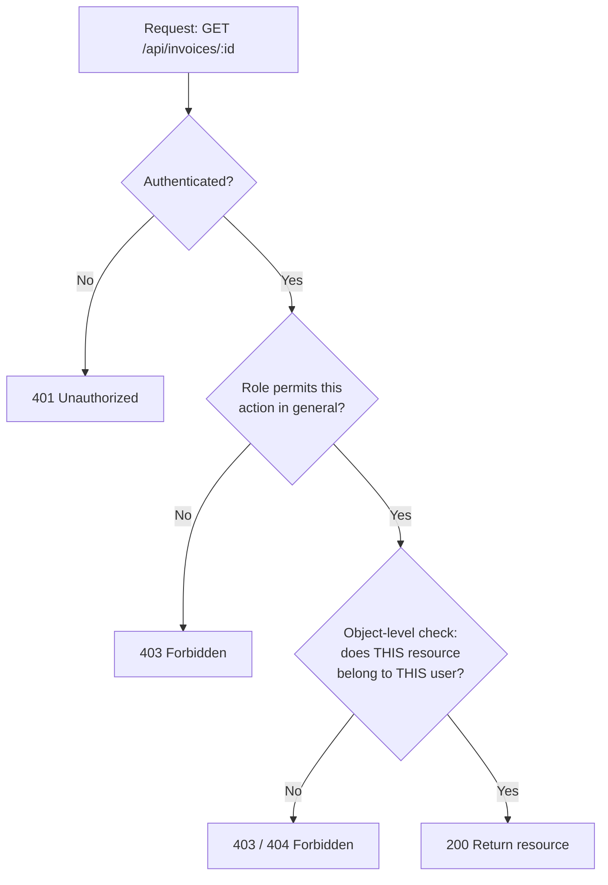

# Lecture 12: API Security

A REST API is a much bigger attack surface than a traditional server-rendered site —
every endpoint is a door, and it has to be defended individually, since a well-crafted
request can come from a browser, a script, or an attacker's tooling with no visual UI
in the way at all. This lecture covers the practical, layered defenses production APIs
need: strict input validation, abuse-resistant rate limiting, key and secret
management, and — the single most common real-world API vulnerability — proper
object-level authorization.

## In This Lecture

- Enforce input validation with schema-based libraries (express-validator, Joi, Zod)
- Apply rate limiting, throttling, and quotas; protect against HPP and injection-style
  payloads with mongo-sanitize and xss-clean
- Compare API keys, tokens, and mutual TLS; manage secrets and rotate keys
- Implement authorization at the API and resource level, preventing IDOR

## Input Validation and Schema-Based Request Validation

Every piece of data your API receives from a client — body, query string, URL params,
headers — is untrusted until proven otherwise. **Input validation** is the practice of
checking that incoming data matches the shape, type, and constraints your application
expects *before* any business logic touches it. Skipping this step is the root cause
behind a large share of the vulnerabilities in this and the previous lecture: NoSQL
injection, type-confusion bugs, and unexpected application states all start with
un-validated input.

Hand-rolled `if` checks scale badly and are easy to get subtly wrong. Production APIs
instead use **schema-based validation** — you declare the exact shape data must take,
and a library enforces it consistently everywhere.

=== "express-validator"

    ```javascript
    const { body, validationResult } = require("express-validator");

    app.post(
      "/api/users",
      body("email").isEmail().normalizeEmail(),
      body("password").isLength({ min: 12 }),
      body("age").optional().isInt({ min: 13, max: 120 }),
      (req, res) => {
        const errors = validationResult(req);
        if (!errors.isEmpty()) {
          return res.status(400).json({ errors: errors.array() });
        }
        createUser(req.body);
        res.status(201).json({ message: "Created" });
      }
    );
    ```

=== "Joi"

    ```javascript
    const Joi = require("joi");

    const userSchema = Joi.object({
      email: Joi.string().email().required(),
      password: Joi.string().min(12).required(),
      age: Joi.number().integer().min(13).max(120),
    });

    app.post("/api/users", (req, res) => {
      const { error, value } = userSchema.validate(req.body);
      if (error) return res.status(400).json({ error: error.details[0].message });
      createUser(value);
      res.status(201).json({ message: "Created" });
    });
    ```

=== "Zod"

    ```javascript
    const { z } = require("zod");

    const userSchema = z.object({
      email: z.string().email(),
      password: z.string().min(12),
      age: z.number().int().min(13).max(120).optional(),
    });

    app.post("/api/users", (req, res) => {
      const result = userSchema.safeParse(req.body);
      if (!result.success) {
        return res.status(400).json({ error: result.error.flatten() });
      }
      createUser(result.data);
      res.status(201).json({ message: "Created" });
    });
    ```

!!! tip
    All three libraries follow the same core idea: define an explicit schema, reject
    anything that doesn't match it, and only pass the *validated* data further down the
    pipeline. Zod is popular in TypeScript codebases because the schema also produces a
    static type; Joi is common in plain Node backends; express-validator integrates
    validation directly into the middleware chain.

!!! danger "Validate on the server, always"
    Client-side validation (in a React form, for example) is a UX nicety, not a
    security control — it is trivially bypassed by anyone calling your API directly
    with `curl` or Postman. Every security-relevant check must be re-enforced
    server-side.

## Rate Limiting, Throttling, Quotas, and Payload-Level Protections

### Rate Limiting and Throttling

**Rate limiting** caps how many requests a client (typically identified by IP address
or API key) may make in a given time window, protecting your API from brute-force login
attempts, credential-stuffing attacks, scraping, and simple denial-of-service abuse.
**Throttling** is closely related — rather than hard-rejecting excess requests, it
slows them down (e.g. adding delay) once a threshold is crossed. A **quota** is a
longer-window cap (e.g. "1,000 requests per day") often tied to a billing plan or API
key tier, distinct from short-window rate limiting.

```javascript
const rateLimit = require("express-rate-limit");

const loginLimiter = rateLimit({
  windowMs: 15 * 60 * 1000, // 15 minutes
  max: 5,                    // 5 attempts per window per IP
  message: { error: "Too many login attempts, try again later." },
  standardHeaders: true,     // return RateLimit-* headers
  legacyHeaders: false,
});

app.post("/api/login", loginLimiter, loginHandler);

// A looser, global limiter for the whole API
app.use(rateLimit({ windowMs: 60 * 1000, max: 100 }));
```

!!! warning
    Apply *stricter* limits to sensitive endpoints (login, password reset, MFA
    verification) than to general read-only endpoints — these are exactly the routes
    brute-force and credential-stuffing attacks target.

### HTTP Parameter Pollution (HPP)

**HTTP Parameter Pollution (HPP)** exploits how frameworks handle a query string or
body that repeats the same key multiple times (`?role=user&role=admin`). Depending on
how your framework parses this, `req.query.role` might silently become an array, or
resolve to the *last* value — either way, code that assumed a single string can behave
unexpectedly, sometimes bypassing validation entirely.

```javascript
const hpp = require("hpp");
app.use(hpp()); // picks the last value for duplicate parameters, protecting against
                 // arrays sneaking into fields that expect a single value
```

### mongo-sanitize and xss-clean

You met `express-mongo-sanitize` in Lecture 11 for stripping Mongo operator injection
(`$ne`, `$gt`, keys containing `.`) from request input. **`xss-clean`** applies a
similar idea for markup: it strips or escapes HTML/script-like content from incoming
request data before it ever reaches your route handlers, adding a defense-in-depth
layer against stored XSS payloads entering through the API.

```javascript
const mongoSanitize = require("express-mongo-sanitize");
const xssClean = require("xss-clean");

app.use(express.json());
app.use(mongoSanitize());
app.use(xssClean());
```

!!! note
    These sanitization middlewares are defense-in-depth, applied *in addition to*
    schema validation and output encoding — not a substitute for either. A schema
    should still reject payloads with unexpected structure; sanitization protects the
    fields that do reach the database or the page.

## API Keys, Tokens, and Mutual TLS

**API keys** are static, long-lived identifiers issued to a client application (not a
specific user) to identify and meter it — common for server-to-server integrations and
public APIs. They typically grant broad access tied to a project/account and are
usually sent in a header (`X-API-Key`). Because they're static and long-lived, a leaked
API key is a serious, standing exposure until it's rotated.

**Tokens** (as covered in Lectures 9–10) are scoped, time-limited, and usually tied to
a specific authenticated user or delegated grant — a better fit whenever you need
fine-grained, expiring, per-user authorization rather than blanket per-application
access.

| | API Key | Token (JWT/OAuth) |
|---|---|---|
| Identifies | An application/project | A specific user or delegated grant |
| Lifetime | Long-lived (until rotated) | Short-lived (minutes to hours), refreshable |
| Granularity | Usually broad | Scoped (specific permissions/claims) |
| Typical use | Server-to-server, metering, public APIs | User-facing auth, delegated access |

**Mutual TLS (mTLS)** goes a step further than standard HTTPS: normally only the
*server* presents a certificate the client verifies. With mTLS, the *client* also
presents a certificate, which the server verifies before accepting the connection at
all — both parties cryptographically prove their identity. This is common in
high-security service-to-service communication (internal microservices, payment
processors, government/financial integrations) where a stolen bearer token or API key
alone shouldn't be sufficient to impersonate a caller.

```javascript
const https = require("https");
const fs = require("fs");

const server = https.createServer(
  {
    key: fs.readFileSync("server-key.pem"),
    cert: fs.readFileSync("server-cert.pem"),
    ca: fs.readFileSync("client-ca.pem"), // CA that signs allowed client certs
    requestCert: true,
    rejectUnauthorized: true, // reject any connection without a valid client cert
  },
  app
);
```

### Secrets Management and Key Rotation

Never hardcode API keys, database credentials, or signing secrets in source code.
**Secrets management** is the practice of storing these values outside your codebase —
environment variables loaded from a `.env` file locally (excluded from version control
via `.gitignore`), and a dedicated secrets manager in production (AWS Secrets Manager,
HashiCorp Vault, Doppler).

```javascript
// .env (never committed)
// JWT_SECRET=... DB_PASSWORD=... STRIPE_API_KEY=...

require("dotenv").config();
const jwtSecret = process.env.JWT_SECRET;
```

**Key rotation** is the practice of periodically replacing secrets/keys, even without a
known compromise — limiting how long a leaked-but-undetected key remains useful to an
attacker. A rotation-friendly design supports *two* valid keys simultaneously during a
transition window (old key still verifies existing tokens/signatures while new tokens
are issued with the new key), so rotation doesn't require a synchronized, instant
cutover across every client.

!!! danger "A committed secret is a compromised secret"
    If a real secret is ever committed to Git — even briefly, even in a private repo —
    treat it as leaked and rotate it immediately. Git history retains it indefinitely,
    and simply deleting the file in a later commit does not remove it from history.

## Authorization at the API and Resource Level: Preventing IDOR

Lecture 9 covered role-based authorization — checking whether a user's *role* permits
an action in general. That's necessary but not sufficient. Many real-world breaches
happen because an API correctly checks "is this user logged in and a member?" but
never checks "does *this specific resource* belong to *this specific user*." This gap
is called **Insecure Direct Object Reference (IDOR)**.

```javascript
// VULNERABLE: any authenticated user can view ANY invoice by guessing/incrementing IDs
app.get("/api/invoices/:id", requireAuth, async (req, res) => {
  const invoice = await Invoice.findById(req.params.id);
  res.json(invoice); // no check that this invoice belongs to req.user
});
```

An attacker who is a legitimate, authenticated user of your system can simply change
`/api/invoices/1001` to `/api/invoices/1002` and read another customer's invoice —
authentication succeeded, role-based authorization (if any) succeeded, and the request
still leaked private data, because **object-level authorization** was never checked.

```javascript
// FIXED: verify ownership (object-level access check) before returning the resource
app.get("/api/invoices/:id", requireAuth, async (req, res) => {
  const invoice = await Invoice.findById(req.params.id);
  if (!invoice) return res.status(404).json({ error: "Not found" });
  if (invoice.ownerId.toString() !== req.user.sub) {
    return res.status(403).json({ error: "Forbidden" });
  }
  res.json(invoice);
});

// Better still: bake the ownership check into the query itself
app.get("/api/invoices/:id", requireAuth, async (req, res) => {
  const invoice = await Invoice.findOne({
    _id: req.params.id,
    ownerId: req.user.sub,
  });
  if (!invoice) return res.status(404).json({ error: "Not found" }); // don't leak existence
  res.json(invoice);
});
```



!!! danger "IDOR is consistently one of the most common real-world API vulnerabilities"
    It's easy to write, easy to miss in review (the code "looks" secure because
    `requireAuth` is right there), and devastating in effect — mass data exposure
    across every user of the system, not just one account. Every endpoint that accepts
    a resource ID must independently verify the requesting user is entitled to that
    *specific* resource — never assume authentication alone is enough.

!!! tip
    Prefer returning `404 Not Found` instead of `403 Forbidden` for objects a user
    doesn't own, when you don't want to confirm to an attacker that a given ID even
    exists. Which one to use is a judgment call based on how sensitive existence
    itself is for your resource.

## Try It Yourself

1. Add Zod (or Joi) request validation to a `POST /api/products` endpoint that requires
   `name` (string, 1–100 chars), `price` (positive number), and `category` (one of a
   fixed enum). Confirm invalid payloads are rejected with a clear `400` error listing
   what failed.
2. Build two users and a `notes` resource where each note has an `ownerId`. Implement
   `GET /api/notes/:id` two ways: first without an ownership check (confirm you can
   read another user's note by ID while logged in as someone else), then fix it with a
   proper object-level authorization check as shown above.

## Key Takeaways

- Validate every request server-side with a schema-based library (express-validator,
  Joi, or Zod) — client-side validation is a UX feature, not a security control.
- Rate limiting and throttling protect against brute-force and abuse; apply stricter
  limits to sensitive endpoints like login and password reset.
- HPP protection, `express-mongo-sanitize`, and `xss-clean` are defense-in-depth
  middlewares that guard against parameter pollution, NoSQL operator injection, and
  markup injection in request payloads.
- API keys identify applications and are typically long-lived and broad; tokens
  identify users/grants and are typically short-lived and scoped — choose based on
  what you're authenticating.
- Mutual TLS adds client-side certificate verification for the highest-assurance
  service-to-service integrations.
- Never commit secrets to source control; manage them via environment variables or a
  secrets manager, and rotate keys periodically.
- IDOR — missing object-level authorization — is one of the most common and damaging
  real-world API vulnerabilities. Every resource-scoped endpoint must verify ownership,
  not just authentication and role.
