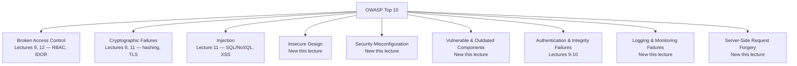

# Lecture 13: OWASP Top 10

You've now built up specific defenses against specific attacks — session hijacking,
XSS, CSRF, injection, IDOR. This lecture zooms out and organizes that knowledge against
the industry's standard risk framework: the OWASP Top 10. You'll learn what it actually
is (and isn't), work through the categories not yet covered in depth, and finish with a
concrete hardening checklist you can apply to any Express application today.

## In This Lecture

- Understand the purpose, structure, and correct use of the OWASP Top 10
- Explain broken access control, cryptographic failures, and injection
- Explain insecure design, security misconfiguration, and vulnerable/outdated components
- Explain authentication and integrity failures, logging/monitoring failures, and SSRF
- Apply a practical hardening checklist, including Helmet.js and other quick wins

## What the OWASP Top 10 Actually Is

**OWASP (the Open Worldwide Application Security Project)** is a nonprofit foundation
that produces freely available, community-driven application security resources. The
**OWASP Top 10** is a periodically updated report ranking the ten most critical web
application security risk *categories*, based on aggregated real-world vulnerability
data and an industry survey.

Two things it is explicitly **not**:

- It is **not a checklist you "complete"** and then declare your application secure.
  Each entry is a broad *category* of risk (e.g. "Injection"), not a single testable
  item — "we checked for injection" is meaningless without specifying which of dozens
  of possible injection points, in which layers, using which techniques.
- It is **not exhaustive**. Plenty of real vulnerabilities exist outside these ten
  categories; the list represents the most *impactful and common* risks industry-wide,
  not the complete universe of possible flaws.

!!! note "How to actually use it"
    Treat the OWASP Top 10 as a **risk-awareness and training framework** — a shared
    vocabulary for discussing application security, a structure for security training,
    and a starting point for threat modeling. Pair it with rigorous engineering
    practices (input validation, proper authz, testing) rather than treating "not on
    the Top 10" as a security guarantee.

Several categories map directly onto material from Lectures 9–12; this lecture connects
those dots and fills in the ones not yet covered: insecure design, security
misconfiguration, vulnerable and outdated components, and Server-Side Request Forgery.



## Broken Access Control, Cryptographic Failures, and Injection

**Broken Access Control** is consistently the single most prevalent category in
real-world findings. It covers any situation where the system fails to properly
restrict what an authenticated user can do or see — exactly the RBAC gaps from Lecture
9 and the IDOR vulnerabilities from Lecture 12. The common thread: authentication
succeeding is not the same as authorization being correctly enforced for the *specific*
action and *specific* resource in question.

**Cryptographic Failures** cover mishandling of sensitive data in transit or at rest —
transmitting data over plain HTTP instead of TLS (Lecture 11), storing passwords with
weak or missing hashing instead of bcrypt (Lecture 9), using outdated cryptographic
algorithms, or hardcoding encryption keys. The category was previously named
"Sensitive Data Exposure"; it was renamed to focus on the *root cause* — failures in
how cryptography is applied — rather than only the symptom of data being exposed.

**Injection** covers any case where untrusted data is interpreted as code or commands
by an interpreter — SQL/NoSQL injection and XSS from Lecture 11, but also command
injection (untrusted input passed to a shell command) and LDAP injection. The unifying
defense across all injection types is the same principle: never let untrusted data
change the *structure* of a command or query — separate data from code via
parameterization, validation, and escaping.

## Insecure Design, Security Misconfiguration, and Vulnerable Components

### Insecure Design

**Insecure design** is a category about missing or ineffective security *controls by
design* — flaws baked in from the architecture stage, which no amount of careful
coding can fully fix later. Examples include a password-reset flow with no rate
limiting on the "guess the reset code" step, an e-commerce checkout that trusts a
client-supplied price rather than looking it up server-side, or a multi-tenant system
with no data-isolation boundary designed in from the start.

!!! tip
    The fix for insecure design isn't a patch — it's **threat modeling** during the
    design phase: systematically asking "how could this feature be abused?" before
    writing the implementation, not after a penetration test finds it.

### Security Misconfiguration

**Security misconfiguration** covers insecure default settings, unnecessary features
left enabled, overly verbose error messages that leak stack traces or internal paths,
missing security headers, and default credentials never changed. It's one of the
easiest categories to introduce accidentally — frameworks and cloud services often ship
with permissive defaults meant to ease development, and those defaults quietly ship to
production unless someone deliberately hardens them.

```javascript
// VULNERABLE: leaks stack traces and internal details to any client
app.use((err, req, res, next) => {
  res.status(500).json({ error: err.stack }); // never expose this in production
});

// FIXED: generic message to the client, full detail only in server-side logs
app.use((err, req, res, next) => {
  console.error(err); // full detail goes to your logging/monitoring system
  res.status(500).json({ error: "Internal server error" });
});
```

### Vulnerable and Outdated Components

Modern applications are assembled from dozens or hundreds of third-party packages
(check any `package.json`). Each one is code you didn't write and may not have
reviewed, and each one can carry known vulnerabilities that are publicly documented —
meaning attackers can look up exactly which unpatched versions of popular packages are
exploitable.

```bash
npm audit                # scans installed packages against known-vulnerability databases
npm audit fix             # attempts to automatically upgrade to patched versions
npm outdated               # shows which packages have newer versions available
```

!!! warning
    Running `npm audit` once is not enough — dependencies accumulate new disclosed
    vulnerabilities over time even if your code never changes. Run it as a routine part
    of your CI pipeline, and keep dependencies reasonably current rather than pinning
    indefinitely.

## Authentication Failures, Logging Failures, and SSRF

### Authentication and Integrity Failures

This category (formerly "Broken Authentication," now broadened to also cover
"Software and Data Integrity Failures") covers weak password policies, missing MFA,
session-fixation bugs, predictable session IDs — all covered in Lecture 9 — plus a
newer concern: trusting data or code from sources whose integrity you haven't verified,
such as auto-updating software that pulls updates without checking a signature, or a
CI/CD pipeline that pulls dependencies without integrity checks.

### Security Logging and Monitoring Failures

An application can have every defense in this course correctly implemented and still
fail here: if a breach happens and nobody notices because login failures, access
control violations, and server errors are never logged or reviewed, the attacker has
effectively unlimited time to operate undetected. Insufficient logging and monitoring
turns a contained incident into a prolonged one.

```javascript
function logSecurityEvent(event, req) {
  console.log(
    JSON.stringify({
      timestamp: new Date().toISOString(),
      event,                       // e.g. "LOGIN_FAILURE", "ACCESS_DENIED"
      ip: req.ip,
      userId: req.user?.id ?? "anonymous",
      path: req.path,
    })
  );
  // In production, send this to a centralized logging/monitoring system
  // (e.g. an ELK stack, Datadog, or a SIEM) with alerting on suspicious patterns.
}

app.post("/login", async (req, res) => {
  const user = await verifyCredentials(req.body.email, req.body.password);
  if (!user) {
    logSecurityEvent("LOGIN_FAILURE", req);
    return res.status(401).json({ error: "Invalid credentials" });
  }
  logSecurityEvent("LOGIN_SUCCESS", req);
  // ...
});
```

!!! danger
    Never log sensitive data itself — passwords, full tokens, credit card numbers.
    Log the *event* (a login failed, access was denied) and enough context to
    investigate (user ID, IP, timestamp, path), not the secret involved.

### Server-Side Request Forgery (SSRF)

**SSRF** occurs when an application accepts a URL from user input and fetches it
server-side, without adequately restricting what that URL can point to. Because the
request originates *from your server*, it can reach internal systems that would
normally be unreachable from the public internet — internal admin panels, databases, or
cloud metadata endpoints that often expose credentials.

```javascript
// VULNERABLE: fetches whatever URL the client supplies, from the server
app.post("/api/fetch-preview", async (req, res) => {
  const response = await fetch(req.body.url); // no restriction on destination
  res.json({ content: await response.text() });
});
// Attacker submits: http://169.254.169.254/latest/meta-data/iam/security-credentials/
// — a cloud metadata endpoint only reachable from inside the server's own network —
// and the server obligingly fetches it and returns the (potentially sensitive) result.
```

```javascript
// FIXED: allowlist permitted destinations; reject internal/private-range targets
const ALLOWED_HOSTS = new Set(["images.example.com", "cdn.trusted-partner.com"]);

app.post("/api/fetch-preview", async (req, res) => {
  const target = new URL(req.body.url);
  if (!ALLOWED_HOSTS.has(target.hostname)) {
    return res.status(400).json({ error: "URL host not permitted" });
  }
  const response = await fetch(target.toString());
  res.json({ content: await response.text() });
});
```

!!! danger
    Any server-side "fetch a URL on the user's behalf" feature (image proxies, link
    previews, webhooks, PDF generators that load remote assets) is a potential SSRF
    vector. Always validate against an allowlist of permitted hosts, and explicitly
    block requests to private/internal IP ranges (`10.0.0.0/8`, `169.254.0.0/16`,
    `127.0.0.1`, etc.).

## A Practical Hardening Checklist

Beyond the category-specific fixes above, a handful of cheap, high-leverage steps
harden almost any Express application:

```javascript
const helmet = require("helmet");
const app = require("express")();

// Sets a broad set of protective HTTP headers in one call:
// X-Content-Type-Options, X-Frame-Options, Strict-Transport-Security, and more
app.use(helmet());

// Express sets "X-Powered-By: Express" by default, telling attackers exactly
// which framework (and therefore which known vulnerabilities) to try.
app.disable("x-powered-by"); // helmet() also does this automatically
```

| Quick win | Why it matters |
|---|---|
| `helmet()` | Bundles many protective response headers in one line |
| Disable `X-Powered-By` | Stops trivially fingerprinting your framework/version |
| Enforce HTTPS + HSTS | Prevents downgrade to unencrypted HTTP (Lecture 11) |
| `httpOnly`, `secure`, `SameSite` cookies | Hardens session/token cookies (Lectures 9, 11) |
| Rate limiting on auth routes | Slows brute-force and credential stuffing (Lecture 12) |
| Schema validation on every input | Closes injection and type-confusion bugs (Lecture 12) |
| `npm audit` in CI | Catches known-vulnerable dependencies before deploy |
| Generic error responses in production | Prevents stack-trace/internal-path leakage |
| Centralized security logging | Turns undetected breaches into detected, contained ones |
| Principle of least privilege everywhere | Limits blast radius of any single compromise |

!!! tip "Defense in depth"
    None of these controls is sufficient alone — that's the point. A layered set of
    independent defenses means a single missed check (a forgotten validation, an
    overlooked ownership check) doesn't automatically become a full breach. Build
    security as a stack of overlapping nets, not a single wall.

## Try It Yourself

1. Take an existing Express app (yours from an earlier lecture, or a fresh
   `express-generator` scaffold) and apply the hardening checklist: add `helmet()`,
   disable `X-Powered-By`, add a generic production error handler, and run
   `npm audit`. Document what each change actually altered (inspect response headers
   with your browser's dev tools before and after).
2. Implement a link-preview endpoint (`POST /api/preview { url }`) that fetches a
   remote URL server-side. First build it without any restriction and demonstrate it
   can reach `http://localhost:PORT/internal-secret` (an internal-only test route you
   add). Then fix it with a host allowlist and confirm the internal route is no longer
   reachable through it.

## Key Takeaways

- The OWASP Top 10 is a risk-awareness and training framework, not a compliance
  checklist — each entry is a broad category, not a single testable item.
- Broken access control, cryptographic failures, and injection map directly onto RBAC/
  IDOR, hashing/TLS, and SQL/NoSQL/XSS material from earlier lectures.
- Insecure design is a flaw baked in at the architecture stage — fix it with threat
  modeling before implementation, not patches after.
- Security misconfiguration and vulnerable/outdated components are often the easiest
  vulnerabilities to introduce by accident, and the cheapest to catch with routine
  scanning (`npm audit`) and hardened defaults.
- Authentication/integrity failures and logging/monitoring failures both extend
  Lecture 9's material — weak auth lets attackers in, and weak logging lets them stay
  undetected once they are.
- SSRF lets an attacker use your server as a proxy to reach internal systems; defend
  any server-side URL-fetching feature with a strict host allowlist.
- A short list of cheap steps — Helmet.js, disabling `X-Powered-By`, HTTPS/HSTS, rate
  limiting, and schema validation — meaningfully hardens almost any Express app.
- Security is a layered, defense-in-depth discipline: no single control is expected to
  be perfect, which is exactly why you stack several independent ones.
