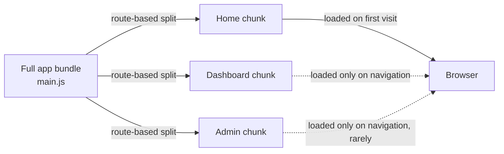

# Lecture 14: Frontend Performance

Everything you built in CSC336 and the security unit of this course *worked*. This unit
is about making it work **fast**, at scale, and under real-world network conditions. You'll
learn how browsers and Lighthouse measure "fast," how to keep static assets from being
re-downloaded unnecessarily, how to shrink what you send over the wire, and how to defer
work the user doesn't need yet.

## In This Lecture

- Measure user-perceived performance with the Core Web Vitals: LCP, CLS, and INP.
- Use Lighthouse and browser DevTools to audit a page and interpret the results.
- Understand HTTP and browser caching of static assets.
- Optimize images, fonts, and text payloads through compression and minification.
- Apply lazy loading, code splitting, and bundle analysis to reduce what ships on first load.

## Why Frontend Performance Is a Production Concern

In CSC336 you focused on correctness: does the page render, does the form submit, does the
API respond with the right JSON? In production, *how fast* those things happen is itself a
requirement. Studies from Google, Amazon, and others consistently show that slower pages
directly reduce conversion rates, search ranking, and user retention — a one-second delay
in load time can measurably reduce engagement. Google also uses page-speed signals (via the
Core Web Vitals) as a ranking factor in search results, which means performance is no
longer just a "nice to have"; it's a business and SEO requirement.

Frontend performance work generally falls into two buckets:

1. **Loading performance** — how quickly the page becomes visible and usable.
2. **Runtime performance** — how smoothly the page responds to user interaction after it
   has loaded (scrolling, clicking, typing).

The Core Web Vitals give you a standardized way to measure both.

## Core Web Vitals

The **Core Web Vitals** are a set of metrics defined by Google that quantify real-world
user experience, as opposed to purely technical metrics like "time to first byte." They
are measured both in the **lab** (a controlled, repeatable environment like Lighthouse) and
in the **field** (real user data collected via the Chrome User Experience Report, or
CrUX).

### LCP — Largest Contentful Paint

**LCP** measures how long it takes for the largest visible content element (usually a hero
image, a large block of text, or a background image) to render within the viewport. It
approximates "when did the main content the user came for actually appear?"

| Rating | Threshold |
|---|---|
| Good | ≤ 2.5s |
| Needs improvement | 2.5s – 4.0s |
| Poor | > 4.0s |

Common LCP culprits: slow server response time (high **TTFB**, or Time to First Byte),
render-blocking CSS/JavaScript, unoptimized images, and client-side rendering that delays
content until JavaScript executes.

### CLS — Cumulative Layout Shift

**CLS** measures visual stability — how much visible content unexpectedly shifts position
during the page's lifetime. It's calculated from the size of shifted elements and how far
they moved, summed across every unexpected shift. You've experienced bad CLS yourself: you
go to tap a button, and an ad or image loads above it a moment before, pushing the button
down so you tap the wrong thing.

| Rating | Threshold |
|---|---|
| Good | ≤ 0.1 |
| Needs improvement | 0.1 – 0.25 |
| Poor | > 0.25 |

Common causes: images and embeds without explicit `width`/`height` (so the browser can't
reserve space before the asset loads), web fonts that swap in and reflow text (**FOIT/FOUT**
— Flash of Invisible/Unstyled Text), and content injected above existing content (banners,
cookie notices) without reserved space.

!!! tip "Reserve space before content arrives"
    Always set explicit `width` and `height` attributes (or an `aspect-ratio` in CSS) on
    images, videos, and embeds. The browser uses these to reserve layout space immediately,
    even before the asset downloads, which eliminates the shift entirely.

### INP — Interaction to Next Paint

**INP** replaced the older "First Input Delay" (FID) metric as an official Core Web Vital
in March 2024. It measures the latency of *all* interactions during a page visit (clicks,
taps, key presses) and reports a representative worst-case value — how long the browser
takes to visually respond after the user interacts.

| Rating | Threshold |
|---|---|
| Good | ≤ 200ms |
| Needs improvement | 200ms – 500ms |
| Poor | > 500ms |

High INP is usually caused by long-running JavaScript blocking the main thread — heavy
event handlers, large synchronous computations, or excessive re-renders in a framework
like React.

### Measuring with Lighthouse

**Lighthouse** is an open-source, automated auditing tool built into Chrome DevTools (also
available as a CLI and a Node module) that scores a page across Performance, Accessibility,
Best Practices, and SEO, and reports lab values for LCP, CLS, and a lab proxy for
interactivity called **Total Blocking Time (TBT)**.

```bash
# Run Lighthouse from the command line against a URL
npx lighthouse https://example.com --view --output=html --output-path=./report.html

# Run only the performance category, in mobile emulation (the default)
npx lighthouse https://example.com --only-categories=performance
```

!!! note "Lab data vs. field data"
    Lighthouse gives you **lab data**: a single run, on a simulated device and network,
    which is great for debugging and CI gates. It will not always match **field data** —
    real measurements from actual visitors, available via the Chrome UX Report or your own
    Real User Monitoring (RUM) — because real users have different devices, connections,
    and browser extensions. Use lab data to catch regressions early; use field data to know
    what your users actually experience.

## HTTP and Browser Caching of Static Assets

Every asset a browser doesn't have to re-download is time saved. Browsers maintain an
on-disk **HTTP cache** keyed primarily by URL, and servers control how long an asset can be
reused via response headers — this is a preview of what Lecture 15 covers in depth for
dynamic/server-side caching, but for static assets (JS, CSS, images, fonts) the basics
matter here too:

```
Cache-Control: public, max-age=31536000, immutable
```

This tells the browser: this response can be cached by any cache (`public`), it's valid
for a year (`max-age`, in seconds), and it will never change (`immutable`) — so don't even
bother re-validating it before the max-age expires.

!!! warning "Cache busting with content hashes"
    You can only safely set a far-future `max-age` if the **filename changes whenever the
    content changes**. This is why production bundlers emit filenames like
    `main.a3f9c1.js` instead of `main.js` — the hash is derived from the file's content, so
    a new deploy produces a new filename, and the old cached file is simply never requested
    again. Never cache-bust `index.html` itself this way; it should generally use
    `Cache-Control: no-cache` so the browser always re-validates it and picks up the latest
    asset hashes.

## Asset Optimization

### Images

Images are typically the largest contributor to page weight. Key techniques:

- **Modern formats**: serve **WebP** or **AVIF** instead of JPEG/PNG where supported —
  both offer significantly smaller file sizes at equivalent visual quality.
- **Responsive images**: use `srcset` and `sizes` so the browser downloads an
  appropriately sized image for the viewport, instead of a single oversized file for every
  device.
- **Compression**: lossy compression (accepting a small quality loss for a large size
  reduction) is usually the right tradeoff for photographs; lossless compression suits
  logos, icons, and screenshots with text.

```html

```

### Fonts

Web fonts block text rendering by default, which directly hurts LCP and can cause layout
shift when the font swaps in. Mitigations:

- Use `font-display: swap` (or `optional`) so text renders in a fallback font immediately,
  rather than staying invisible while the custom font downloads.
- **Preload** your critical font file so the browser fetches it earlier than it would
  discover it from the CSS: `<link rel="preload" href="/fonts/inter.woff2" as="font" type="font/woff2" crossorigin>`.
- Prefer **WOFF2**, the most compressed widely-supported font format, and subset fonts to
  only the character sets/weights you actually use.

### Compression and Minification

**Compression** reduces the number of bytes sent over the network for a given response;
**minification** reduces the size of the source file itself by stripping whitespace,
comments, and shortening identifiers — the two are complementary and both matter.

- **Gzip** is universally supported and gives strong compression ratios for text
  (HTML/CSS/JS/JSON).
- **Brotli** (`br`) generally compresses 15–20% smaller than gzip for text assets and is
  supported by all modern browsers; prefer it when your server/CDN supports it, with gzip
  as a fallback via content negotiation (`Accept-Encoding`).
- **Minification** is normally handled automatically by your bundler (Terser for
  JavaScript, cssnano for CSS) as part of a production build — you should rarely need to
  invoke it manually.

```bash
# Nginx: enable gzip compression for text-based MIME types
gzip on;
gzip_types text/plain text/css application/javascript application/json image/svg+xml;
gzip_min_length 256;
```

## Lazy Loading, Code Splitting, and Bundle Analysis

### Lazy Loading

**Lazy loading** defers loading a resource until it's actually needed — typically, until
it's about to scroll into view. For images and iframes, the browser supports this natively:

```html

<iframe src="https://example.com/embed" loading="lazy"></iframe>
```

!!! warning "Don't lazy-load your LCP image"
    Never apply `loading="lazy"` to the image most likely to be your Largest Contentful
    Paint element (typically the hero image above the fold). Lazy loading delays its
    download until layout confirms it's near the viewport, which directly *increases* LCP.
    For that one image, use `loading="eager"` (the default) and consider `fetchpriority="high"`.

### Code Splitting

**Code splitting** breaks a single large JavaScript bundle into smaller chunks that load
on demand, rather than shipping your entire application's code on the very first page
view. Modern bundlers (Webpack, Vite, Rollup) support this via dynamic `import()`:

```javascript
// Instead of a static import that ends up in the main bundle:
// import AdminPanel from './AdminPanel';

// Load it only when the route/feature is actually used:
button.addEventListener('click', async () => {
  const { default: AdminPanel } = await import('./AdminPanel.js');
  AdminPanel.render();
});
```

In a framework like React, this pattern underlies `React.lazy()` combined with
`<Suspense>` for route-based or component-based splitting — a common and highly effective
strategy is **route-based splitting**, where each page/route gets its own chunk, so a
visitor to `/login` never downloads the code for `/admin/reports`.

### Bundle Analysis

You cannot optimize what you haven't measured. A **bundle analyzer** visualizes what's
actually inside your production JavaScript bundle, usually as a treemap, so you can spot an
accidentally-included large dependency (a full date library imported for one function, a
duplicate copy of a package at two versions, and so on).

```bash
# Example: webpack-bundle-analyzer, run against a production build
npm install --save-dev webpack-bundle-analyzer
npx webpack --profile --json > stats.json
npx webpack-bundle-analyzer stats.json
```



!!! tip "Set a performance budget"
    Many teams set a **performance budget** — e.g., "the initial JS bundle must stay under
    170KB gzipped" — and fail CI if a pull request exceeds it. This turns bundle size from
    something you check occasionally into something that can't silently regress.

## Try It Yourself

1. Run `npx lighthouse` (or Chrome DevTools' Lighthouse panel) against a live site of your
   choice. Identify its LCP element, its CLS score, and one specific recommendation
   Lighthouse gives for improving each. Would fixing it require a code change, a build
   change, or a server/CDN configuration change?
2. Take a small React or plain-JS project you've built previously. Add `loading="lazy"` to
   below-the-fold images, convert one heavy, rarely-used component to a dynamic `import()`,
   and re-run a bundle analyzer before and after to measure the difference in initial
   bundle size.

## Key Takeaways

- The Core Web Vitals — **LCP** (loading), **CLS** (visual stability), and **INP**
  (responsiveness) — quantify real user experience, not just raw load time.
- Lighthouse gives repeatable **lab data** for debugging and CI gates; real user monitoring
  gives **field data** for what visitors actually experience — you need both.
- Long `Cache-Control` lifetimes are only safe for assets whose filenames change with their
  content (content-hashed filenames), so browsers can cache aggressively without ever
  serving stale content.
- Image and font optimization (modern formats, responsive `srcset`, subsetting, `font-display`)
  and payload compression (Brotli/gzip plus minification) are the highest-leverage wins for
  most sites.
- Lazy loading and code splitting reduce what ships on first load — but never lazy-load
  your LCP element.
- A bundle analyzer turns "the bundle feels big" into a specific, actionable breakdown of
  what's actually inside it.
