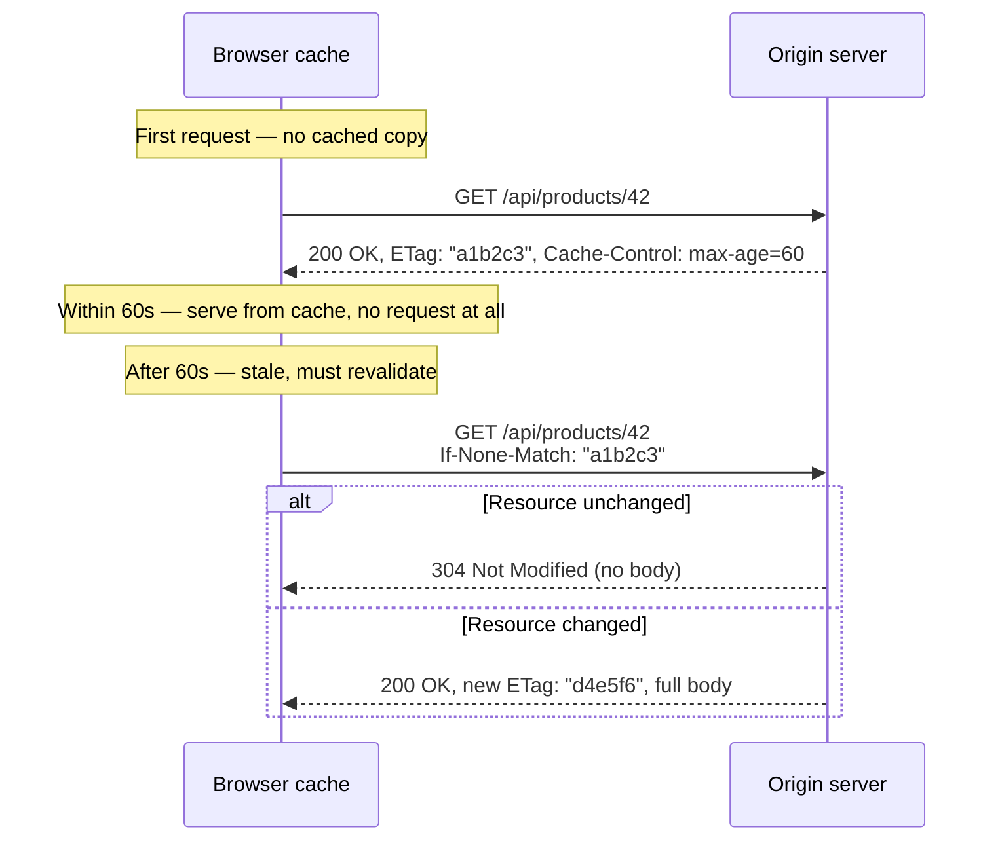
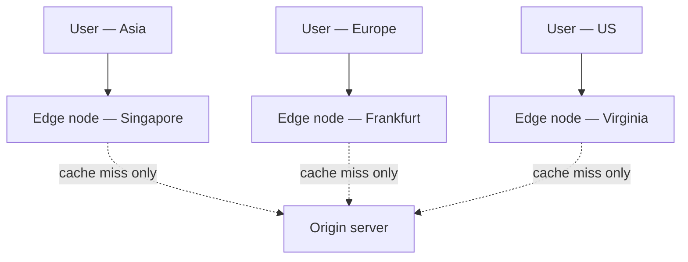

# Lecture 15: Web / Server Caching

Lecture 14 covered caching static assets in the browser. This lecture goes deeper into how
HTTP caching actually works under the hood, who else besides the browser is allowed to
cache your responses, and how to put a cache in front of your entire application — at the
edge, with a CDN, or on your own infrastructure, with a reverse proxy.

## In This Lecture

- Control caching precisely with `Cache-Control`, `ETag`, `Last-Modified`, and validation.
- Distinguish private (browser) caches from shared caches, and understand why that
  distinction matters for correctness and privacy.
- Use CDNs and edge caching, and set up reverse-proxy caching with Nginx or Varnish.
- Design cache keys and choose an invalidation/purging strategy that won't serve stale data.

## HTTP Caching Headers

HTTP caching is governed by response headers the server sends alongside the content. There
are two separate concerns: **how long** a response is fresh for, and **how to check** if a
no-longer-fresh response is still valid.

### Cache-Control

`Cache-Control` is the primary directive header, replacing the older, less flexible
`Expires` header. Common directives:

| Directive | Meaning |
|---|---|
| `public` | Any cache (browser, CDN, proxy) may store this response. |
| `private` | Only the end user's browser may cache it — shared caches must not. |
| `no-cache` | Caches *may* store it, but must revalidate with the origin before reusing it. (Despite the name, this does not mean "don't cache.") |
| `no-store` | Never cache this response anywhere, full stop — for genuinely sensitive data. |
| `max-age=<seconds>` | How long the response is considered fresh, from the time it was generated. |
| `s-maxage=<seconds>` | Like `max-age`, but applies only to shared caches (CDNs/proxies), letting you set a different lifetime for them than for browsers. |
| `must-revalidate` | Once stale, the cache must not serve this response without revalidating — even if the origin is unreachable. |
| `immutable` | This exact response will never change; skip revalidation even on a hard refresh. |

```
Cache-Control: public, max-age=300, s-maxage=3600
```

This says: browsers may cache this for 5 minutes, but your CDN may hold it for a full
hour — a common pattern for content that changes occasionally but doesn't need to be
identical to the second across every visitor.

!!! warning "no-cache is not no-store"
    This is one of the most common misunderstandings in web development. `no-cache` means
    "you may store this, but you must ask the origin whether it's still valid before using
    it" (a **conditional request**, covered next). `no-store` means "do not keep a copy of
    this anywhere." If a response contains authentication tokens, payment details, or other
    sensitive data that must never persist on disk, use `no-store`.

### ETag and Last-Modified: Cache Validation

Once a cached response's `max-age` expires, it becomes **stale** — but stale doesn't mean
useless. Instead of re-downloading the full response, the cache can send a **conditional
request** asking the origin "has this changed since I last saw it?" If nothing changed, the
origin replies with a tiny `304 Not Modified` and no body, saving bandwidth while still
guaranteeing freshness. This is called **cache validation** (or **revalidation**).

Two headers make this possible:

- **`Last-Modified`** — a timestamp of when the resource last changed. The cache re-sends
  it as an `If-Modified-Since` request header; the server compares it to the file's actual
  modification time.
- **`ETag`** (Entity Tag) — an opaque identifier (often a hash of the content) that changes
  whenever the resource changes. The cache re-sends it as `If-None-Match`; the server
  compares it exactly. ETags are more precise than timestamps (a file can change without
  its modification time changing cleanly across replicated servers) and are the preferred
  mechanism in modern APIs.



```bash
# Example validation response headers set by an Express route
curl -I https://api.example.com/products/42
# HTTP/1.1 200 OK
# ETag: "a1b2c3d4"
# Cache-Control: public, max-age=60, must-revalidate
# Last-Modified: Wed, 03 Sep 2025 10:12:00 GMT
```

!!! tip "304 responses still cost a round trip"
    A `304 Not Modified` is far cheaper than re-sending the full body, but it still costs a
    network round trip and a bit of server work. For content you know is effectively
    immutable (a versioned, content-hashed asset), a long `max-age` with `immutable` avoids
    the round trip entirely — validation is for content that changes unpredictably.

## Private Browser Cache vs. Shared Caches

It's important to distinguish **who** is doing the caching:

- A **private cache** belongs to a single user — typically the browser's own HTTP cache.
  It's appropriate to cache personalized or user-specific responses here (an authenticated
  user's dashboard data), because no one else will ever read from that cache.
- A **shared cache** sits between many users and the origin — a CDN edge node, a corporate
  proxy, a reverse proxy like Nginx or Varnish. If a response containing **User A's** private
  data is mistakenly marked `public` and cached by a shared cache, **User B** could receive
  User A's cached response on a subsequent request. This is a real and recurring class of
  security incident.

!!! warning "The classic shared-cache leak"
    A response that varies per user (an account page, a personalized API response) must
    never be marked `public` if it will pass through a shared cache. Use `private` (browser
    only) or `no-store` (nowhere), and if the response does vary by some request property
    other than cookies (like a locale header), use the `Vary` header (e.g.
    `Vary: Accept-Language`) so shared caches store a separate copy per distinct value
    rather than serving the wrong variant to the wrong user.

## CDN and Edge Caching

A **CDN** (Content Delivery Network) is a globally distributed network of servers — **edge
nodes** — that cache and serve your content from a location physically close to each user,
reducing latency and offloading traffic from your origin server. When a user in Singapore
requests an asset cached at a Singapore edge node, the response never has to travel to your
origin server in, say, Virginia.

**Edge caching** is the general practice of caching at these edge locations rather than
only at the origin. Modern CDNs (Cloudflare, Fastly, Akamai, AWS CloudFront) go further
than static-asset caching — they can cache full API responses, and some support **edge
computing** (running small pieces of application logic directly at the edge node, closer to
the user, via platforms like Cloudflare Workers).



## Reverse-Proxy Caching with Nginx and Varnish

You don't need a third-party CDN to get shared-cache benefits — you can run your own
caching layer directly in front of your application servers using a **reverse proxy**: a
server that sits between clients and your backend, forwarding requests and, when
configured, caching the responses.

=== "Nginx"

    ```nginx
    # nginx.conf
    proxy_cache_path /var/cache/nginx levels=1:2 keys_zone=my_cache:10m max_size=1g inactive=60m;

    server {
        listen 80;

        location /api/ {
            proxy_pass http://app_backend;
            proxy_cache my_cache;
            proxy_cache_valid 200 5m;
            proxy_cache_valid 404 1m;
            proxy_cache_key "$scheme$request_method$host$request_uri";
            add_header X-Cache-Status $upstream_cache_status;
        }
    }
    ```

    The `X-Cache-Status` header (`HIT`, `MISS`, `BYPASS`, `EXPIRED`) is invaluable for
    debugging — you can see, per request, whether Nginx actually served from cache.

=== "Varnish"

    **Varnish** is a caching HTTP reverse proxy purpose-built for this job, configured with
    its own domain-specific language, **VCL** (Varnish Configuration Language):

    ```vcl
    vcl 4.1;

    backend default {
        .host = "127.0.0.1";
        .port = "3000";
    }

    sub vcl_backend_response {
        if (bereq.url ~ "^/api/products") {
            set beresp.ttl = 5m;
        }
    }
    ```

    Varnish is widely used because it's extremely fast (it caches almost entirely in
    memory) and its VCL gives fine-grained control over caching rules per route.

!!! note "Reverse-proxy cache vs. CDN"
    A self-hosted reverse-proxy cache (Nginx/Varnish) typically runs in the same data
    center as your application — it reduces load on your app servers and database, but it
    does not reduce network latency for geographically distant users the way a true CDN's
    distributed edge nodes do. Many production systems use both: a CDN at the edge, and a
    reverse-proxy cache in front of the origin for anything the CDN doesn't serve directly.

## Cache Keys, Invalidation, and Purging

### Cache Keys

A **cache key** is what a cache uses to decide whether two requests are "the same" and can
share a cached response — usually derived from the method, host, and path, but it must
account for anything that changes the response. If your API returns different data for
`Accept-Language: en` vs. `Accept-Language: ur`, and your cache key ignores that header,
every user might receive whichever language happened to be cached first. This is exactly
what the `Vary` header (mentioned above) solves — it tells caches to fold a specific request
header into the cache key.

### Invalidation

"There are only two hard things in computer science: cache invalidation and naming things."
**Cache invalidation** is the problem of making sure a cache stops serving a response once
the underlying data has changed. Three broad strategies:

1. **TTL expiration** (time-based) — simplest, but there's always a window where stale data
   can be served, up to the TTL.
2. **Explicit purge** — proactively tell the cache "this specific key is now invalid" the
   moment the underlying data changes (e.g., right after a product's price is updated).
3. **Versioned/content-hashed keys** — instead of invalidating, make the key itself change
   whenever the content changes (this is exactly the static-asset strategy from Lecture 14).
   Old cached entries simply become unreachable and eventually evict.

### Purging

**Purging** is the act of explicitly removing one or more entries from a cache before their
TTL expires — necessary when data changes unpredictably (an admin edits a blog post) rather
than on a predictable schedule.

```bash
# Purge a specific URL from an Nginx cache (using the ngx_cache_purge module)
curl -X PURGE https://example.com/api/products/42

# Purge everything under a path on a CDN (conceptual — exact API varies by provider)
curl -X POST "https://api.cdn-provider.com/v1/zones/{zone}/purge" \
  -H "Authorization: Bearer $API_TOKEN" \
  -d '{"prefix": "/api/products/"}'
```

!!! tip "Prefer targeted purges over full flushes"
    Purging your entire cache after every write is simple but expensive — it causes a
    sudden flood of cache misses (sometimes called a "thundering herd," which we'll revisit
    with Redis in Lecture 16) hitting your origin all at once. Purge only the specific keys
    affected by a change whenever you can identify them.

## Try It Yourself

1. Using `curl -I`, inspect the response headers of three real websites of your choice.
   For each, identify the `Cache-Control` directive, whether it uses `ETag` or
   `Last-Modified` (or both), and classify the response as suitable for a private cache
   only, or safe for a shared cache too.
2. Set up a local Nginx reverse proxy (or use an online VCL playground for Varnish) in front
   of a small Express app. Configure it to cache `GET /api/time` for 10 seconds, and verify
   with the `X-Cache-Status` header that repeated requests within that window are served as
   `HIT` without reaching your Express server.

## Key Takeaways

- `Cache-Control` directives (`public`/`private`, `max-age`/`s-maxage`, `no-cache`/
  `no-store`) control both *whether* and *for how long* a response may be cached, and by
  whom.
- `ETag` and `Last-Modified` enable **conditional requests**, letting a stale cache
  revalidate cheaply via `304 Not Modified` instead of re-downloading the full response.
- Never mark personalized or sensitive responses `public` — a shared cache serving one
  user's cached data to another user is a serious, real-world class of security bug.
- CDNs cache at geographically distributed edge nodes to cut latency for users far from
  your origin; reverse proxies like Nginx and Varnish give you the same shared-cache
  benefits under your own control, closer to your origin.
- A correct cache key must reflect everything that changes the response (via `Vary`);
  invalidation is best handled with a mix of TTLs, targeted purges, and content-hashed keys
  rather than one strategy alone.
