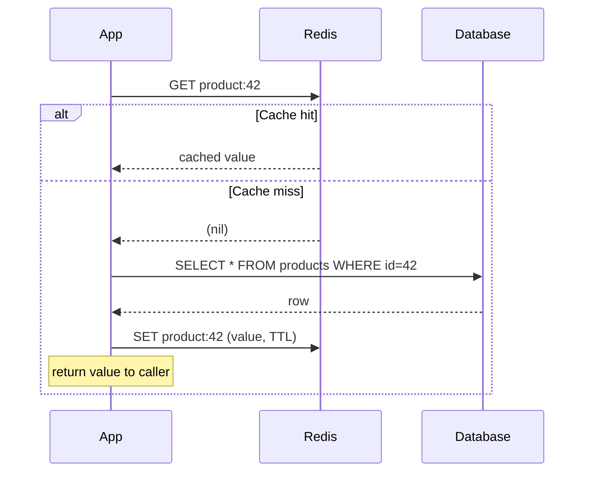

# Lecture 16: Application Caching with Redis

HTTP caching (Lecture 15) protects your server from repeated *identical* requests. But most
real applications need to cache things HTTP caching can't touch: the result of an expensive
database aggregation, a user's session, a rate-limit counter, a leaderboard. This lecture
introduces **Redis**, the tool most production systems reach for to solve exactly these
problems, and the patterns for using it correctly.

## In This Lecture

- Understand Redis as an in-memory data store and its core data structures.
- Apply the cache-aside, read-through, and write-through/write-behind caching patterns.
- Manage cache invalidation, TTLs, eviction policies, and stampede protection.
- Use Redis for API response caching, session storage, rate limiting, and leaderboards.

## What Is Redis?

**Redis** (REmote DIctionary Server) is an open-source, **in-memory data store** — it keeps
its dataset in RAM rather than on disk, which makes reads and writes extremely fast
(typically sub-millisecond), at the cost of needing enough memory to hold your working set.
Unlike a plain key-value cache, Redis supports several **rich data structures** natively,
which is what makes it useful for far more than "store this value under this key."

| Data structure | What it is | Typical use |
|---|---|---|
| **String** | A binary-safe sequence of bytes (text, JSON, a counter) | Cached values, counters, flags |
| **Hash** | A field-value map, like a small object | A user profile or session, without needing multiple keys |
| **List** | An ordered collection, efficient at both ends | Queues, recent-activity feeds |
| **Set** | An unordered collection of unique values | Tags, unique visitor tracking, set operations (union/intersect) |
| **Sorted Set (ZSet)** | A set where every member has a numeric score, kept in order | Leaderboards, rate limiting, priority queues |

```bash
# A quick tour of the core data structures, using redis-cli
SET user:42:name "Ayesha"          # String
GET user:42:name

HSET user:42 name "Ayesha" plan "pro"   # Hash
HGET user:42 plan

LPUSH recent:views "product:101"   # List (push to the left/front)
LRANGE recent:views 0 9            # Get the 10 most recent

SADD tags:post:7 "redis" "caching" "backend"   # Set
SISMEMBER tags:post:7 "redis"

ZADD leaderboard 1500 "playerA"    # Sorted set (score, member)
ZADD leaderboard 2100 "playerB"
ZREVRANGE leaderboard 0 2 WITHSCORES   # Top 3, highest score first
```

!!! note "Redis is single-threaded for command execution"
    Redis processes commands one at a time on a single main thread, which sounds
    counter-intuitive for a high-performance system — but because everything lives in RAM
    and operations are simple, this avoids locking overhead entirely and Redis still
    handles hundreds of thousands of operations per second. It also means a single slow
    command (like an unbounded `KEYS *` scan on a huge dataset) can briefly block every
    other client — prefer `SCAN` for iterating keys in production.

## Caching Patterns

There are three well-established patterns for keeping a cache and a source of truth (a
database) in sync. Which one you choose affects read latency, write latency, and how
tolerant your system is of stale data.

### Cache-Aside (Lazy Loading)

**Cache-aside** (also called lazy loading) is the most common pattern: the application code
is responsible for checking the cache first, and only falling back to the database — then
populating the cache — on a miss.



```javascript
async function getProduct(id) {
  const cacheKey = `product:${id}`;
  const cached = await redis.get(cacheKey);
  if (cached) return JSON.parse(cached);

  const product = await db.products.findById(id);
  // Cache for 5 minutes; JSON.stringify because Redis strings are text/bytes.
  await redis.set(cacheKey, JSON.stringify(product), 'EX', 300);
  return product;
}
```

Cache-aside is simple and resilient — if Redis goes down entirely, the app still works
(just slower, hitting the database for everything), because the application code guards
every access. Its main drawback is the first request after an expiry always pays the full
database cost.

### Read-Through

In a **read-through** cache, the *caching layer itself* (not your application code) is
responsible for loading from the database on a miss — the application only ever talks to
the cache, which transparently proxies to the database when needed. This centralizes the
loading logic (often via a caching library or a dedicated caching service) instead of
repeating it at every call site, but it requires the cache to know how to reach your data
source. With plain Redis, this pattern is usually implemented via a thin wrapper/library
rather than a Redis feature itself.

### Write-Through and Write-Behind

- **Write-through**: every write goes to the cache *and* the database synchronously, as
  part of the same operation, so the cache is never stale after a write. Simpler to reason
  about, but every write pays the latency of both systems.
- **Write-behind (write-back)**: the write goes to the cache immediately, and is persisted
  to the database asynchronously (batched, on a delay). This is faster for the caller, but
  risks data loss if the cache crashes before the write is flushed to the database — use it
  only when that risk is acceptable (e.g., high-frequency metrics) and not for critical
  transactional data.

| Pattern | Read path | Write path | Risk |
|---|---|---|---|
| Cache-aside | App checks cache, then DB on miss | App writes DB, then invalidates/updates cache | Brief staleness after write if not handled carefully |
| Read-through | App only talks to cache; cache loads DB on miss | Usually paired with write-through | Adds a layer between app and DB |
| Write-through | — | App writes to cache and DB together, synchronously | Higher write latency |
| Write-behind | — | App writes to cache; DB updated asynchronously | Possible data loss on cache failure |

## Cache Invalidation, TTL, and Eviction Policies

### TTL (Time to Live)

A **TTL** is the number of seconds a key is allowed to live before Redis automatically
expires (deletes) it. Nearly every cached value should have one — an unbounded cache is a
memory leak waiting to happen.

```javascript
await redis.set('session:abc123', sessionData, 'EX', 3600); // expires in 1 hour
await redis.expire('product:42', 300);                       // set/refresh TTL on existing key
await redis.ttl('product:42');                               // check remaining seconds
```

### Eviction Policies

Redis has a configurable **maxmemory** limit, and when it's reached, an **eviction policy**
decides which keys to remove to make room for new writes:

| Policy | Behavior |
|---|---|
| `noeviction` | Reject new writes with an error once memory is full — no data is silently lost. |
| `allkeys-lru` | Evict the **L**east **R**ecently **U**sed key, across all keys. Most common choice for a pure cache. |
| `volatile-lru` | LRU eviction, but only among keys that have a TTL set — keys without a TTL are treated as permanent and never evicted this way. |
| `allkeys-lfu` | Evict the **L**east **F**requently **U**sed key — better than LRU when some keys are accessed rarely but recently. |
| `volatile-ttl` | Evict the key with the shortest remaining TTL first. |

!!! tip "Choosing a policy"
    For a cache-only Redis instance (nothing stored that you can't regenerate from the
    database), `allkeys-lru` is a safe, common default. If the same Redis instance also
    holds data with no natural source of truth (like session data with no TTL you'd be sad
    to lose), use `volatile-lru` so those permanent keys are protected from eviction.

### Cache Stampede Protection

A **cache stampede** (also called a "dog-pile" or "thundering herd") happens when a
popular, expensive-to-compute key expires, and a burst of concurrent requests all miss the
cache simultaneously — sending a flood of identical, expensive queries to the database at
once, sometimes taking it down entirely.

Two common mitigations:

1. **Locking/single-flight**: the first request to miss acquires a short-lived lock and
   recomputes the value; concurrent requests wait briefly (or serve a stale value) instead
   of all hitting the database independently.
2. **Early/probabilistic expiration**: recompute the value slightly *before* it actually
   expires, with a small random jitter per key, so many keys with the same nominal TTL
   don't all expire at the exact same instant.

```javascript
async function getWithStampedeProtection(key, loader, ttlSeconds) {
  const cached = await redis.get(key);
  if (cached) return JSON.parse(cached);

  // NX = only set if not already set; acts as a short-lived lock so only one
  // process recomputes the value while others can retry or serve stale data.
  const lockAcquired = await redis.set(`lock:${key}`, '1', 'EX', 10, 'NX');
  if (!lockAcquired) {
    await new Promise((r) => setTimeout(r, 50));
    return getWithStampedeProtection(key, loader, ttlSeconds); // brief retry
  }

  try {
    const value = await loader();
    await redis.set(key, JSON.stringify(value), 'EX', ttlSeconds);
    return value;
  } finally {
    await redis.del(`lock:${key}`);
  }
}
```

## Real-World Uses of Redis

### API Response Caching

Applying cache-aside to a whole API response (not just a single database row) can turn an
expensive, multi-query endpoint into a single fast lookup for repeat requests:

```javascript
app.get('/api/dashboard-stats', async (req, res) => {
  const cacheKey = 'dashboard-stats';
  const cached = await redis.get(cacheKey);
  if (cached) return res.json(JSON.parse(cached));

  const stats = await computeExpensiveDashboardStats(); // several joins/aggregations
  await redis.set(cacheKey, JSON.stringify(stats), 'EX', 60);
  res.json(stats);
});
```

### Session Storage

Storing sessions in Redis (instead of in-process memory) is essential once you run more
than one server instance — an in-memory session on Server A is invisible to Server B, so a
user whose next request lands on a different server would appear logged out.

```javascript
import session from 'express-session';
import RedisStore from 'connect-redis';

app.use(session({
  store: new RedisStore({ client: redis }),
  secret: process.env.SESSION_SECRET,
  resave: false,
  saveUninitialized: false,
  cookie: { maxAge: 3600000 }, // 1 hour, in milliseconds
}));
```

### Rate Limiting

A sliding or fixed-window rate limiter needs a fast, shared counter — exactly what Redis
strings (with `INCR`) or sorted sets are built for:

```javascript
async function isRateLimited(userId, limit = 100, windowSeconds = 60) {
  const key = `rate:${userId}`;
  const count = await redis.incr(key);
  if (count === 1) {
    await redis.expire(key, windowSeconds); // start the window on the first hit
  }
  return count > limit;
}
```

### Leaderboards

Sorted sets are a natural fit for leaderboards: Redis keeps members ordered by score
automatically, so ranking queries are fast without you re-sorting anything yourself.

```javascript
await redis.zadd('game:leaderboard', 4820, 'user:17');
const top10 = await redis.zrevrange('game:leaderboard', 0, 9, 'WITHSCORES');
const myRank = await redis.zrevrank('game:leaderboard', 'user:17'); // 0-indexed
```

## Try It Yourself

1. Implement a cache-aside function for a `GET /api/users/:id` endpoint against any
   database you've used before (or a mock async function standing in for one). Add a TTL,
   then deliberately update the underlying record and observe how long the API keeps
   returning stale data until the TTL expires.
2. Using `redis-cli` (or a script), build a small sorted-set leaderboard: add at least five
   members with scores, retrieve the top 3, and retrieve one specific member's rank.

## Key Takeaways

- Redis is an **in-memory data store** with rich data structures — strings, hashes, lists,
  sets, and sorted sets — not just a flat key-value cache.
- **Cache-aside** is the most common and resilient pattern; **write-through** keeps the
  cache always consistent at the cost of write latency; **write-behind** is fastest but
  risks data loss.
- Every cached value should have a **TTL**, and your **eviction policy** determines what
  happens when Redis runs out of memory — `allkeys-lru` is a common default for pure
  caches.
- A **cache stampede** can take down your database when a popular key expires under load;
  locking and jittered early expiration both mitigate it.
- Beyond simple caching, Redis is the standard tool for shared session storage across
  multiple server instances, rate limiting (via `INCR` or sorted sets), and real-time
  leaderboards.
