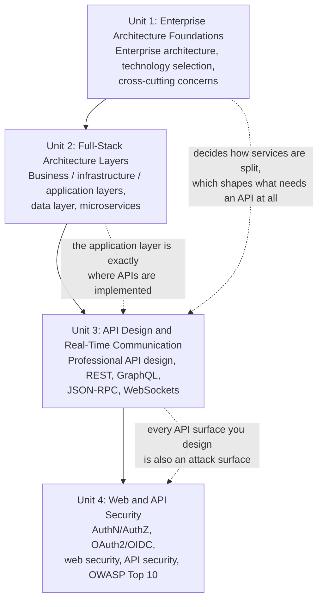

# Lecture 17: Midterm Review

This week is midterm exam week — there is no new topic to learn today. Instead, treat this
chapter as a **checkpoint**: a consolidated review of the four units you've covered since
this course picked up where CSC336 left off — enterprise architecture, full-stack
architecture layers, API design and real-time communication, and web/API security. It won't
re-teach every detail (go back to the individual lectures for that), but it will remind you
of the big ideas, show you how they connect, and give you questions to test yourself with
before the exam.

## Concept Map

These four units are not four separate topics — they're four layers of the same decision:
*how do you architect and expose an application that's safe and maintainable in
production?* Unit 1 gives you the vocabulary for architecture at a system level; Unit 2
zooms into the layers of a single application; Unit 3 is about how those layers, and other
systems, actually talk to each other; and Unit 4 is about making sure that communication —
and the data behind it — can't be abused.

Notice the thread: Unit 1 decides *what pieces your system is made of* (a monolith? services?
which cross-cutting concerns — logging, config, auth — need to be handled consistently
everywhere?). Unit 2 zooms into *how a single application is layered internally*, including
where microservices fit and how they talk to a data layer. Unit 3 is about *how those pieces
communicate* — with each other and with clients — over REST, GraphQL, JSON-RPC, or
WebSockets. And Unit 4 asks the question that must follow immediately after you expose any
communication surface: *how do you keep it from being abused?*

## Unit 1 Recap — Enterprise Architecture Foundations

- **Enterprise architecture** is the discipline of designing how an organization's systems,
  data, and processes fit together — not just one application, but how many applications
  and services coexist, integrate, and evolve together.
- Choosing technology is not just "what's popular" — **technology selection** should weigh
  team expertise, ecosystem maturity, licensing, long-term maintainability, and how well a
  choice fits the problem, not just benchmarks.
- **Cross-cutting concerns** are responsibilities that apply across many/most parts of a
  system rather than belonging to one feature — logging, authentication, error handling,
  configuration management, monitoring. Handling these consistently (often via middleware
  or shared infrastructure) rather than reimplementing them per-feature is a hallmark of
  production-grade design.
- CSC337 as a whole moves you from "build something that works" (CSC336) to "build
  something that's designed to survive contact with real users, real scale, and real
  attackers."

!!! warning "Common gotcha"
    Students sometimes treat "architecture" as an abstract diagram exercise disconnected
    from code. On the exam, be ready to justify an architectural choice with a concrete
    consequence — e.g., "a shared cross-cutting logging concern means an incident can be
    traced across every service using the same correlation ID," not just "it's good
    practice."

## Unit 2 Recap — Full-Stack Architecture Layers

- A production application separates concerns into layers: commonly a **presentation
  layer** (UI), an **application layer** (business logic, orchestration), an
  **infrastructure layer** (cross-cutting technical concerns — logging, caching, messaging),
  and a **data layer** (persistence). This is a deeper refinement of the tiered
  architecture you saw in CSC336.
- The **data layer** is more than "the database" — it includes data access patterns (e.g.,
  repositories, ORMs), consistency guarantees, and how data is partitioned or replicated.
- **Microservices** split a system into small, independently deployable services, each
  owning its own data and responsibility, communicating over the network (often via the
  API styles covered in Unit 3). Contrast this with a **monolith**, where all functionality
  ships and deploys as one unit.
- Microservices trade simplicity (a monolith is easier to develop and reason about early
  on) for independent scalability, deployability, and fault isolation — at the cost of
  operational complexity: network calls replace function calls, and distributed failure
  modes (partial outages, network latency, data consistency across services) become real
  concerns.

!!! warning "Common gotcha"
    Microservices are not automatically "better" — they solve organizational and scaling
    problems at the cost of new complexity (network reliability, distributed transactions,
    versioning across services). Be ready to argue *both* directions: when a monolith is
    the right call, and when it isn't.

## Unit 3 Recap — API Design and Real-Time Communication

- **Professional API design** means consistent, predictable, well-documented contracts:
  sensible resource naming, versioning strategy, meaningful error responses, and pagination
  for large collections — designed for the consumers of your API, not just for what's
  convenient to implement.
- **REST** (Representational State Transfer) models a system as resources manipulated via
  standard HTTP methods (GET/POST/PUT/PATCH/DELETE) and status codes; it's simple,
  cacheable (tying back to Lecture 15's caching headers), and widely understood.
- **GraphQL** exposes a single endpoint with a typed schema, letting clients request
  exactly the fields they need in one request — avoiding REST's common problems of
  **over-fetching** (getting fields you don't need) and **under-fetching** (needing
  multiple round trips to assemble one view), at the cost of more complex server-side
  query resolution and caching.
- **JSON-RPC** is a lightweight remote-procedure-call protocol: the client names a method
  and parameters, and the server executes it — simpler than REST's resource model, useful
  when the interaction is naturally "call this function" rather than "manipulate this
  resource."
- **WebSockets** provide a persistent, full-duplex connection between client and server —
  necessary for real-time, low-latency, bidirectional communication (chat, live
  dashboards, collaborative editing) that request/response HTTP can't do efficiently.
- Choosing among these isn't about which is "best" — it's about matching the communication
  pattern (request/response vs. flexible querying vs. RPC-style calls vs. persistent
  real-time streams) to what the application actually needs.

!!! warning "Common gotcha"
    Don't describe GraphQL as "a replacement for REST" or WebSockets as "just a faster
    HTTP" — each solves a different communication problem. Be ready to state, for a given
    scenario, *which* approach fits and *why*, referencing over/under-fetching, caching
    behavior, and connection lifecycle.

## Unit 4 Recap — Web and API Security

- **Authentication** (proving who you are) is distinct from **authorization** (what you're
  allowed to do). Confusing the two is one of the most common real-world security bugs —
  e.g., checking that a user is logged in, but never checking that they own the specific
  resource they're requesting.
- **OAuth 2.0** is an authorization framework that lets a user grant a third-party
  application limited access to their resources without sharing their password; **OpenID
  Connect (OIDC)** builds an identity/authentication layer on top of OAuth2, which is
  purely about authorization on its own.
- **Web-specific security** covers browser-side attack classes: **XSS** (Cross-Site
  Scripting — injecting malicious script into pages viewed by other users), **CSRF**
  (Cross-Site Request Forgery — tricking a logged-in user's browser into making an unwanted
  request), and related mitigations like output encoding, Content Security Policy, and
  anti-CSRF tokens or `SameSite` cookies.
- **API security** extends these concerns to programmatic clients: strong authentication on
  every endpoint, input validation, rate limiting (which you'll use Redis for in Lecture
  16), and never trusting data from the client — including data that "should" only come
  from your own frontend.
- The **OWASP Top 10** is a regularly updated, industry-standard list of the most critical
  web application security risks (e.g., broken access control, injection, security
  misconfiguration, vulnerable/outdated components) — it's a checklist every production
  system should be evaluated against, not a one-time read.

!!! warning "Common gotcha"
    "We use HTTPS, so we're secure" is a very common but incorrect exam answer. HTTPS
    protects data *in transit* between client and server — it does nothing about broken
    access control, injection, XSS, or a leaked API key. Be precise about which threat each
    control actually addresses.

## Self-Check Questions

Try answering these from memory before checking your notes. No answers are provided here on
purpose — that's the point of a self-check.

1. Explain the difference between a monolithic architecture and a microservices
   architecture. Name one scenario where each is the better choice.
2. What is a "cross-cutting concern"? Give two examples and explain why handling them
   inconsistently across a codebase causes problems.
3. Where does the data layer sit in a layered architecture, and what responsibilities does
   it typically own beyond "running SQL queries"?
4. A client needs to display a user's profile with only their name and avatar, but your
   REST API's `/users/:id` endpoint returns 20 fields. Name this problem and explain how
   GraphQL would address it.
5. Describe a real scenario where WebSockets are clearly the right choice over a
   REST API, and explain why plain HTTP request/response would be a poor fit.
6. What is the core difference between JSON-RPC and REST in how they model an interaction?
7. Explain, with an example, the difference between authentication and authorization. Can a
   system have one without the other and still be broken?
8. What problem does OAuth 2.0 solve that plain username/password sharing does not? Where
   does OpenID Connect fit relative to OAuth2?
9. Describe how a CSRF attack works, and name one mitigation. Then describe how an XSS
   attack works, and explain why it is a fundamentally different threat.
10. Pick any one item from the OWASP Top 10 and explain, concretely, how you would detect
    and fix it in an Express.js API.
11. A junior developer says, "Our site uses HTTPS everywhere, so it's secure." Identify two
    specific vulnerability classes this claim does nothing to prevent.
12. Trace a single request end to end through a hypothetical microservices system: an API
    gateway receives a REST request, authenticates the user via a token issued through
    OAuth2, and the request is authorized and routed to the correct service. At which
    points could this flow fail or be attacked?

!!! tip "Study Tips"
    - Don't just re-read the lectures passively — close your notes and try to explain each
      concept above out loud, or write it from memory, then check yourself against the
      lecture.
    - For Unit 3, practice sketching a small system and deciding, out loud, which
      communication style (REST/GraphQL/JSON-RPC/WebSockets) fits each interaction in it —
      the exam is more likely to test judgment than memorized definitions.
    - For Unit 4, for every control you study, force yourself to name the *specific* attack
      it prevents. A control you can't tie to a concrete threat is one you don't fully
      understand yet.
    - Focus extra time on the "Common gotcha" boxes above — they call out the mistakes
      students make most often, which is exactly what exams tend to probe.
    - Group your review by "layer of the stack" (architecture decisions → internal layers →
      communication → security) rather than by lecture number — the exam is more likely to
      ask you to connect ideas across lectures than to recall one in isolation.
