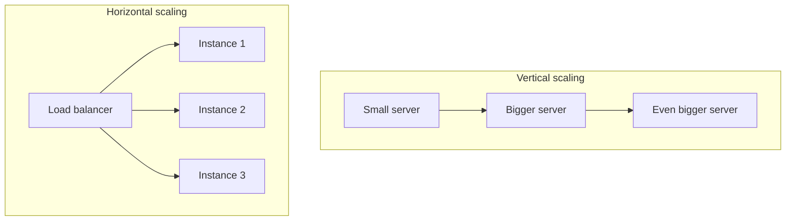

# Lecture 18: Database Monitoring, Optimization and Serverless Scalability

Caching (Lectures 15–16) reduces how often you hit your database and origin servers — but
you still need those systems to be fast and to scale when a request does get through. This
lecture covers how to find and fix slow database queries, how serverless functions change
the execution model you design for, and the fundamentals of scaling a system horizontally
versus vertically.

## In This Lecture

- Design effective indexes and read query plans with `EXPLAIN`/`EXPLAIN ANALYZE`.
- Recognize and fix common performance problems: the N+1 problem, connection exhaustion,
  and slow, unmonitored queries.
- Understand the serverless execution model, cold starts, statelessness, and platform
  limits.
- Compare horizontal and vertical scaling, use load balancing, and identify bottlenecks.

## Indexing Strategies and Reading Query Plans

### Why Indexes Matter

Without an index, a database must perform a **full table scan** — reading every row to find
the ones that match your query — which gets slower as the table grows. An **index** is a
separate, sorted data structure (commonly a B-tree) that lets the database jump directly to
matching rows, similar to a book's index letting you find a topic without reading every
page.

```sql
-- Without an index on email, this scans every row in a large users table
SELECT * FROM users WHERE email = 'ayesha@example.com';

-- Create an index to make that lookup fast
CREATE INDEX idx_users_email ON users(email);
```

!!! tip "Index what you filter, sort, and join on"
    As a starting heuristic, index columns used in `WHERE` clauses, `JOIN` conditions, and
    `ORDER BY` clauses — especially on large tables. Don't index everything: every index
    speeds up reads but slows down writes (the index must be updated on every insert/update/
    delete) and consumes storage, so indexing is a tradeoff, not a free win.

A **composite index** covers multiple columns together, and column order matters — an
index on `(status, created_at)` efficiently serves a query that filters on `status` alone
or on `status` and `created_at` together, but not one that filters on `created_at` alone.

### Reading Query Plans

`EXPLAIN` shows the **query plan** — the strategy the database's query optimizer chose to
execute your query, without running it. `EXPLAIN ANALYZE` actually runs the query and
reports real timing alongside the plan, which is far more useful for diagnosing an actually
slow query.

```sql
EXPLAIN ANALYZE
SELECT * FROM orders WHERE customer_id = 501 ORDER BY created_at DESC LIMIT 10;
```

```
Limit  (cost=0.42..8.86 rows=10 width=97) (actual time=0.031..0.045 rows=10 loops=1)
  ->  Index Scan Backward using idx_orders_customer_created on orders
        (cost=0.42..847.15 rows=1002 width=97) (actual time=0.030..0.041 rows=10 loops=1)
        Index Cond: (customer_id = 501)
Planning Time: 0.112 ms
Execution Time: 0.061 ms
```

The key things to look for:

- **Seq Scan** (sequential/full table scan) on a large table is usually a red flag — it
  often means a missing or unused index.
- **Index Scan** / **Index Only Scan** means the database used an index — generally a good
  sign, and an Index Only Scan (which never touches the actual table rows) is even faster.
- Compare the **estimated** row count to the **actual** row count — a large mismatch tells
  you the query planner's statistics are stale (many databases fix this with an `ANALYZE`
  command that refreshes table statistics) and it may be choosing a poor plan as a result.

!!! note "MongoDB has an equivalent"
    If you're using MongoDB rather than a SQL database, `db.collection.find(...).explain("executionStats")`
    serves the same purpose — showing whether a query used an index (`IXSCAN`) or a full
    collection scan (`COLLSCAN`), and how many documents were examined versus returned.

## Query Optimization, the N+1 Problem, and Connection Pooling

### The N+1 Problem

The **N+1 problem** is one of the most common real-world performance bugs, especially with
ORMs. It happens when code fetches a list of N items with one query, then loops over them
and issues one additional query *per item* to fetch related data — N+1 queries total,
instead of 2.

```javascript
// N+1 problem: 1 query for posts, then N queries — one per post — for its author
const posts = await Post.findAll(); // 1 query
for (const post of posts) {
  post.author = await User.findById(post.authorId); // N queries, one per post
}
```

```javascript
// Fixed: a single query that eagerly loads the related data (JOIN under the hood)
const posts = await Post.findAll({ include: [{ model: User, as: 'author' }] }); // 1 query
```

!!! warning "ORMs make N+1 easy to write accidentally"
    Because ORMs let you access related data with a simple property access
    (`post.author.name`), it's easy to trigger a hidden extra query without realizing it —
    especially inside a loop. Most ORMs provide query-logging in development specifically
    so you can catch this: if you see the same query shape repeated N times in your logs,
    you likely have an N+1.

### Connection Pooling

Opening a new database connection per request is expensive (TCP handshake, authentication,
session setup) and databases have a hard limit on concurrent connections. A **connection
pool** maintains a set of already-open, reusable connections that requests borrow and
return, rather than opening a fresh one each time.

```javascript
// Example: configuring a connection pool (node-postgres)
import { Pool } from 'pg';

const pool = new Pool({
  host: 'db.example.com',
  max: 20,          // maximum simultaneous connections in the pool
  idleTimeoutMillis: 30000,
  connectionTimeoutMillis: 5000,
});

const { rows } = await pool.query('SELECT * FROM orders WHERE id = $1', [42]);
```

!!! warning "Serverless and connection pools don't mix well by default"
    A traditional connection pool assumes a long-lived server process. Serverless functions
    (covered next) can spin up many concurrent instances, each potentially opening its own
    pool — quickly exhausting your database's connection limit. Production serverless
    architectures typically use an external connection pooler (like PgBouncer, or a managed
    pooling service) positioned between the functions and the database.

### Slow-Query Monitoring

You cannot fix what you don't know is slow. Production databases should have **slow-query
logging** enabled — recording any query exceeding a threshold (e.g., 200ms) along with its
execution time, so you can find real offenders instead of guessing.

```sql
-- PostgreSQL: log any query taking longer than 200ms
ALTER SYSTEM SET log_min_duration_statement = 200;
```

Application Performance Monitoring (APM) tools (e.g., Datadog, New Relic) and database-
native tools (PostgreSQL's `pg_stat_statements`, MongoDB's slow query log/`db.currentOp()`)
build on this to give you dashboards of your worst-performing queries over time.

## Serverless Functions

**Serverless computing** lets you deploy individual functions that a cloud provider runs on
demand, without you provisioning or managing a server process yourself — you write a
handler function, and the platform (AWS Lambda, Vercel Functions, Google Cloud Functions,
Azure Functions) takes care of running it, scaling it, and billing you per invocation.

### Execution Model

```javascript
// A minimal serverless function (AWS Lambda handler style)
export const handler = async (event) => {
  const { id } = event.pathParameters;
  const product = await getProduct(id); // e.g., via cache-aside from Lecture 16
  return {
    statusCode: 200,
    body: JSON.stringify(product),
  };
};
```

Each invocation is conceptually independent: the platform routes an incoming
event (an HTTP request, a queue message, a scheduled trigger) to a function instance,
runs your handler, and returns the result.

### Cold Starts

A **cold start** happens when the platform has to initialize a brand-new execution
environment for your function — loading the runtime, your code, and any dependencies —
before it can handle the first request, adding noticeable latency (anywhere from tens of
milliseconds to a few seconds, depending on runtime and package size). Once "warm," an
instance can be reused for subsequent requests with none of that overhead, until it's
eventually recycled after a period of inactivity.

!!! tip "Reducing cold-start impact"
    Keep function bundles small (fewer dependencies to load), avoid heavy work at module
    load time, and where the platform supports it, use "provisioned concurrency" or
    equivalent warm-instance features for latency-sensitive endpoints.

### Statelessness

Serverless functions must be treated as **stateless**: you cannot rely on anything stored
in memory (a variable, an in-process cache, a database connection) persisting reliably
between invocations, because the platform may run your function on a fresh instance at any
time, or run many instances concurrently with no shared memory between them. Any state that
needs to persist — sessions, cached values, uploaded files — must live in an external
system (a database, Redis, object storage), exactly the pattern you learned in Lecture 16
for shared session storage.

### Limits

Serverless platforms impose hard limits you must design around: a maximum execution
duration per invocation (e.g., 15 minutes on AWS Lambda by default configuration, often much
shorter on other platforms), memory limits, payload size limits, and limits on how many
instances can run concurrently. A workload requiring a long-running process (a persistent
WebSocket server, from Unit 3, is a classic example) generally does not fit the serverless
model well and needs a traditional always-on server instead.

## Horizontal vs. Vertical Scaling, Load Balancing, and Bottleneck Identification

### Vertical vs. Horizontal Scaling

- **Vertical scaling** ("scaling up") means giving a single server more resources — more
  CPU, more RAM, faster disks. It's simple (no architecture changes needed) but has a hard
  ceiling (the biggest machine you can buy or rent) and a single point of failure.
- **Horizontal scaling** ("scaling out") means adding more server instances and
  distributing load across them. It has no practical ceiling and improves fault tolerance
  (one instance failing doesn't take down the whole system), but requires your application
  to be designed for it — notably, **statelessness** at the application layer, so any
  instance can handle any request.



### Load Balancing

A **load balancer** sits in front of multiple server instances and distributes incoming
requests across them, according to an algorithm (round-robin, least-connections, or based
on server load) — enabling horizontal scaling and improving availability, since it can stop
routing to an instance that fails a health check.

```nginx
# Nginx as a simple load balancer across three app instances
upstream app_servers {
    least_conn;
    server 10.0.0.1:3000;
    server 10.0.0.2:3000;
    server 10.0.0.3:3000;
}

server {
    listen 80;
    location / {
        proxy_pass http://app_servers;
    }
}
```

### Bottleneck Identification

A **bottleneck** is the single component limiting your entire system's throughput — scaling
anything *other* than the bottleneck won't help. Common real-world bottlenecks, roughly in
order of frequency: the database (often the true limit, since it's harder to scale
horizontally than a stateless app server), a slow external API dependency, an
under-provisioned connection pool, and CPU-bound work blocking a single-threaded runtime
like Node.js's event loop.

!!! tip "Find the bottleneck before you scale"
    Adding more application server instances in front of a database that's already at its
    connection or query capacity won't help — it just sends the same overload from more
    directions. Use monitoring (query timing, CPU/memory metrics per component, request
    tracing) to identify *which* layer is actually saturated before deciding what to scale.

## Try It Yourself

1. Using a database you have access to (PostgreSQL, MySQL, or MongoDB), create a table/
   collection with a few thousand rows, run a query filtering on an unindexed column with
   `EXPLAIN ANALYZE`, note the execution time and plan, then add an index and re-run the
   same query. Record the difference.
2. Take a small Express + ORM project (or write a short example) that has an N+1 query bug
   in a loop. Log or count the number of queries issued, fix it using eager loading (a
   `JOIN` or the ORM's `include`), and confirm the query count drops from N+1 to a small
   constant.

## Key Takeaways

- Indexes make lookups fast at the cost of slower writes and extra storage — index what you
  filter, sort, and join on, not everything.
- `EXPLAIN ANALYZE` (or MongoDB's `explain()`) reveals whether a query is using an index and
  whether the planner's row estimates match reality — your primary diagnostic tool for slow
  queries.
- The **N+1 problem** silently turns one query into N+1 through per-row lookups in a loop;
  eager loading fixes it. **Connection pooling** avoids the cost of opening a fresh database
  connection per request, and needs special handling under serverless.
- Serverless functions run on-demand with a per-invocation execution model, incur **cold
  starts**, must be treated as fully **stateless**, and operate under hard duration/memory/
  concurrency limits.
- **Vertical scaling** (a bigger machine) is simple but capped; **horizontal scaling** (more
  machines behind a load balancer) scales further but requires a stateless application
  design.
- Always scale the actual **bottleneck** — scaling the wrong layer doesn't improve overall
  throughput.
