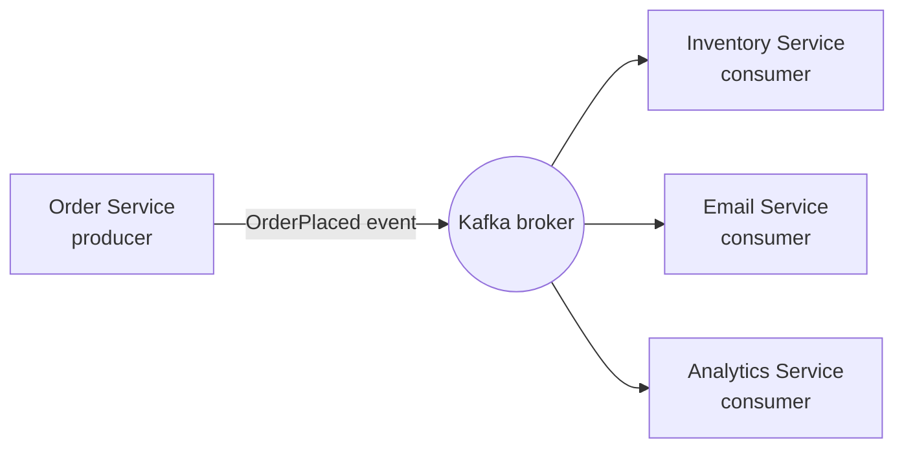
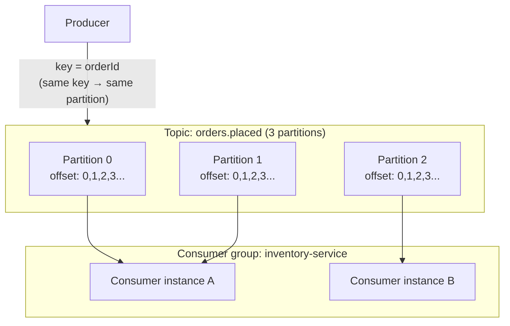
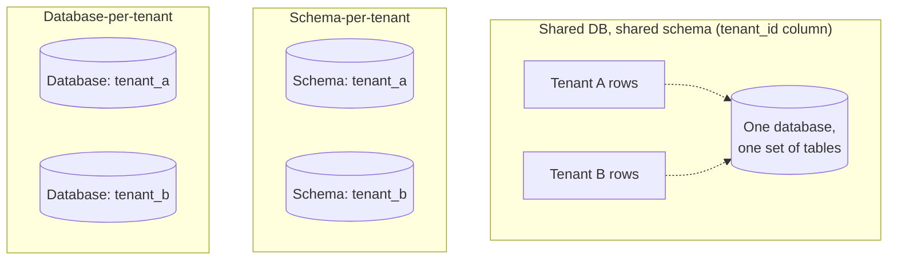

# Lecture 19: Event-Driven Scalability with Kafka and Multi-Tenancy SaaS Products

This lecture closes out the performance and scalability unit with two topics that shape how
large-scale, multi-customer systems are actually built: **event-driven architecture** —
using Kafka as the backbone for decoupled, high-throughput communication between services —
and **multi-tenancy**, the architectural foundation of nearly every SaaS (Software as a
Service) product you'll build or work on professionally.

## In This Lecture

- Understand event-driven architecture: events, commands, producers, and consumers.
- Learn Kafka's core concepts: topics, partitions, offsets, brokers, and replication.
- Compare delivery semantics, ordering, and retention, and integrate Kafka with Node.js.
- Understand SaaS business models and single- vs. multi-tenant architecture.
- Compare tenancy models, tenant routing, data isolation, and subscription/billing basics.

## Event-Driven Architecture

In the request/response model from Unit 3 (Lecture 5–8), a client asks and a server
answers, directly and synchronously. **Event-driven architecture (EDA)** takes a different
approach: services communicate by producing and reacting to **events** — facts about
something that already happened (`OrderPlaced`, `PaymentFailed`, `UserRegistered`) —
without the producer knowing or caring who, if anyone, is listening.

It's important to distinguish an **event** from a **command**:

- A **command** is an instruction: "do this" (e.g., `ChargeCustomer`). It's directed at a
  specific handler and typically expects to succeed or fail.
- An **event** is a statement of fact: "this happened" (e.g., `CustomerCharged`). It's
  broadcast, not directed, and any number of interested parties (zero, one, or many) may
  react to it.

The components involved:

- A **producer** publishes events (or commands) without needing to know who will consume
  them.
- A **consumer** subscribes to and processes events it's interested in.
- A **broker** (Kafka being the most widely used) sits between them, receiving, storing, and
  delivering events reliably.



!!! note "Why decouple at all?"
    In a direct request/response call, the Order Service would need to know about, call,
    and handle failures from Inventory, Email, and Analytics services directly — tightly
    coupling them, and making the Order Service's own reliability depend on all three.
    With events, the Order Service publishes one event and moves on; each consumer can be
    added, removed, or fail independently without the producer ever knowing.

## Kafka Core Concepts

**Apache Kafka** is a distributed event-streaming platform, and today's dominant choice for
building event-driven systems at scale, originally built at LinkedIn specifically to handle
very high-throughput event pipelines.

| Concept | Meaning |
|---|---|
| **Topic** | A named, durable log of events — similar to a table or a channel, e.g. `orders.placed`. Producers publish to topics; consumers subscribe to them. |
| **Partition** | A topic is split into one or more partitions — ordered, append-only logs. Partitioning is what lets Kafka parallelize both writes and reads across a topic. |
| **Offset** | Each event's position within its partition, an ever-increasing integer. Consumers track their own offset to know what they've already processed. |
| **Broker** | A single Kafka server. A **cluster** is made up of multiple brokers working together. |
| **Replication** | Each partition is copied across multiple brokers (a configurable **replication factor**) so the topic survives a broker failure without data loss. |



A **consumer group** lets multiple consumer instances share the work of reading a topic —
Kafka assigns each partition to exactly one consumer within the group, so adding more
consumer instances (up to the number of partitions) increases throughput. This is Kafka's
primary mechanism for horizontal scaling of event processing, directly connecting to the
horizontal scaling concept from Lecture 18.

!!! tip "Choosing a message key matters"
    Kafka guarantees ordering *within a partition*, not across an entire topic. Producers
    typically assign a **key** to each message (e.g., an order ID), and Kafka routes all
    messages with the same key to the same partition — guaranteeing that events for the
    same entity (e.g., all events about one specific order) are processed in order, even
    though the topic as a whole is processed in parallel.

## Delivery Semantics, Ordering, and Retention

### Delivery Semantics

When a consumer processes an event and then fails before recording that it did so, Kafka
must decide what happens on restart. This is governed by **delivery semantics**:

| Semantic | Guarantee | Risk |
|---|---|---|
| **At-most-once** | Each event is delivered zero or one times. | Events can be silently lost if a failure happens after commit but before processing completes. |
| **At-least-once** | Each event is delivered one or more times. | No events are lost, but duplicates are possible — consumers must be **idempotent** (safe to process the same event twice) if this matters. |
| **Exactly-once** | Each event has an effect exactly once, even across failures. | The strongest and most complex guarantee; Kafka supports it via idempotent producers and transactional APIs, but it adds overhead and constraints. |

!!! warning "Exactly-once is expensive — design for idempotency instead"
    In practice, most production systems use **at-least-once** delivery combined with
    **idempotent consumers** (e.g., using the event's unique ID to detect and skip a
    duplicate you've already processed) rather than paying the full cost and complexity of
    Kafka's exactly-once semantics. Ask yourself: "if this event arrives twice, does
    anything break?" — if the answer is no, at-least-once is simpler and sufficient.

### Ordering

As covered above, Kafka only guarantees order within a single partition. If strict
cross-entity ordering isn't required (usually it isn't — you care that events about *one*
order arrive in order, not that they're globally ordered against events about a completely
different order), partitioning by key gives you exactly the ordering guarantee you need
while still scaling horizontally.

### Retention

Unlike a traditional message queue, where a message is typically deleted once consumed,
Kafka retains events for a configurable **retention period** (e.g., 7 days) or up to a size
limit, regardless of whether they've been consumed. This means multiple independent
consumers can read the same topic at their own pace, and even replay historical events —
useful for reprocessing after a bug fix, or onboarding a brand-new consumer that needs
history.

## Integrating Kafka with Node.js (KafkaJS)

**KafkaJS** is a popular, modern Kafka client library for Node.js.

```javascript
// producer.js
import { Kafka } from 'kafkajs';

const kafka = new Kafka({ clientId: 'order-service', brokers: ['localhost:9092'] });
const producer = kafka.producer();

async function publishOrderPlaced(order) {
  await producer.connect();
  await producer.send({
    topic: 'orders.placed',
    messages: [
      {
        key: String(order.id),          // ensures per-order ordering
        value: JSON.stringify(order),
      },
    ],
  });
}
```

```javascript
// consumer.js
import { Kafka } from 'kafkajs';

const kafka = new Kafka({ clientId: 'inventory-service', brokers: ['localhost:9092'] });
const consumer = kafka.consumer({ groupId: 'inventory-service' });

async function run() {
  await consumer.connect();
  await consumer.subscribe({ topic: 'orders.placed', fromBeginning: false });

  await consumer.run({
    eachMessage: async ({ message }) => {
      const order = JSON.parse(message.value.toString());
      await reserveInventory(order); // must be idempotent — see at-least-once above
    },
  });
}

run().catch(console.error);
```

## Software as a Service (SaaS)

**Software as a Service (SaaS)** is a software delivery model where customers access an
application over the internet (typically via a browser) on a subscription basis, rather
than installing and managing software themselves. The provider hosts, maintains, secures,
and upgrades the application for every customer centrally — customers never handle
infrastructure, patching, or backups themselves.

### Single-Tenant vs. Multi-Tenant

- **Single-tenant**: each customer gets their own fully separate instance of the
  application (and often its own database). Strong isolation, simple to reason about
  per-customer, but expensive to operate at scale — N customers means N sets of
  infrastructure to run, monitor, and upgrade.
- **Multi-tenant**: a single running application (and often a single database) serves
  *many* customers — called **tenants** — simultaneously, with the application responsible
  for keeping each tenant's data and experience separate. This is the model that lets a
  SaaS company serve thousands of customers efficiently from shared infrastructure, and is
  the architecture underlying almost every modern SaaS product.

### Business Model Overview

SaaS revenue is typically subscription-based (monthly/annual recurring revenue), often
tiered by usage, feature access, or number of seats. Because the same application serves
every customer, product improvements ship to all tenants simultaneously — a major
operational advantage over single-tenant deployments, where every customer would need a
separate upgrade.

## Tenancy Models

There are three common ways to implement multi-tenancy at the data layer, trading off
isolation, operational simplicity, and cost differently.



| Model | Isolation | Operational cost | Notes |
|---|---|---|---|
| **Shared DB, shared schema (tenant ID column)** | Lowest — enforced entirely in application/query logic | Lowest — one schema to migrate and maintain | Every query must filter by `tenant_id`; a missing filter is a serious data-leak bug |
| **Schema-per-tenant** | Medium — database enforces separation between schemas | Medium — one migration run per schema | A middle ground; still one database server to operate |
| **Database-per-tenant** | Highest — fully separate databases | Highest — N databases to provision, back up, and migrate | Closest to single-tenant isolation, hardest to scale to many tenants |

```sql
-- Shared-schema model: every table carries a tenant_id, and every query must include it
SELECT * FROM invoices WHERE tenant_id = 'acme-corp' AND id = 501;

-- Enforcing it in application code (Express + an ORM), not just remembering to add it:
app.get('/invoices/:id', async (req, res) => {
  const invoice = await Invoice.findOne({
    where: { id: req.params.id, tenantId: req.user.tenantId }, // always scoped
  });
  if (!invoice) return res.status(404).end();
  res.json(invoice);
});
```

!!! warning "The most common multi-tenant bug: a missing tenant filter"
    In the shared-schema model, forgetting the `tenant_id` condition on even one query
    means one tenant can read (or worse, modify) another tenant's data — this is a
    **broken access control** vulnerability (straight out of the OWASP Top 10 from Lecture
    13), specific to multi-tenant systems. Many teams mitigate this structurally: a
    query-building layer that automatically injects the tenant filter, or database-level
    **row-level security** so isolation doesn't depend on every developer remembering it in
    every query.

### Tenant Routing and Data Isolation

**Tenant routing** is how an incoming request is identified as belonging to a specific
tenant — commonly via a subdomain (`acme.myapp.com`), a custom domain, a path prefix
(`/t/acme/...`), or a claim inside an authenticated user's token. Once identified, that
tenant ID must flow through every layer of the request — the application logic, every
database query, and any background job — to maintain **data isolation**, the guarantee
that one tenant can never see or affect another tenant's data.

### Subscription and Billing Basics

Multi-tenant SaaS systems typically track, per tenant: their subscription **plan/tier**,
**billing cycle** and payment status, **usage** against any metered limits (API calls,
storage, seats), and **feature flags** determining which capabilities that plan unlocks.
This billing state is usually itself stored per-tenant (following whichever tenancy model
the rest of the system uses) and checked at the application layer to gate access to
paid features — entirely separate from authentication/authorization, but working alongside
it: a user can be perfectly authenticated and still be denied a feature because their
tenant's plan doesn't include it.

## Try It Yourself

1. Design (on paper or in a short document) the Kafka topics, an example event payload, and
   the consumer groups you'd need for an e-commerce checkout flow that must update
   inventory, send a confirmation email, and record analytics — all triggered by a single
   `OrderPlaced` event.
2. Take a small Express API with one resource (e.g., `notes`). Add a `tenantId` field to
   the resource, extract the tenant from a header or token, and update every route so a
   request can only ever read or modify notes belonging to its own tenant. Then write one
   test that confirms a request cannot access another tenant's data.

## Key Takeaways

- Event-driven architecture decouples producers from consumers by communicating through
  **events** (facts) rather than direct **commands** (instructions), letting services
  evolve and fail independently.
- Kafka organizes events into **topics**, splits each topic into ordered **partitions** for
  parallelism, tracks position via **offsets**, and replicates partitions across **brokers**
  for durability; **consumer groups** scale processing horizontally.
- Choose delivery semantics deliberately: **at-least-once** with **idempotent consumers**
  is the practical default for most systems, avoiding the cost of true exactly-once
  processing.
- SaaS delivers software centrally over a subscription model; **multi-tenancy** — many
  customers sharing one running application — is what makes that efficient at scale.
- The shared-schema, schema-per-tenant, and database-per-tenant models trade isolation
  against operational cost; in the shared-schema model, a missing `tenant_id` filter is a
  serious and common security bug.
- Tenant identity must be established at request routing and then propagated consistently
  through every layer — application logic, queries, and background jobs — to guarantee data
  isolation.
