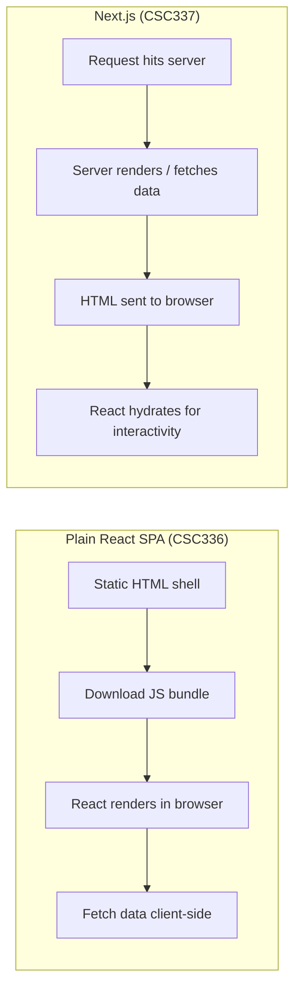
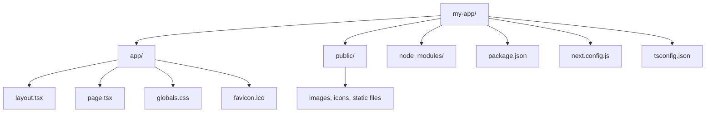

# Lecture 20: Next.js Architecture and Project Setup

This lecture opens Unit 6, where you move from plain client-side React to **Next.js**, a
production-grade React framework. You will learn why frameworks like Next.js exist, what
rendering strategies they offer, and how to scaffold and configure a real project using the
modern App Router.

## In This Lecture

- A recap of React fundamentals and the limitations of client-side-only React
- What Next.js adds on top of React: hybrid rendering, routing, optimization, full-stack
- Rendering strategies: CSR, SSR, SSG, and ISR, and the trade-offs between them
- Setting up a project with `create-next-app`, its folder structure and configuration files
- App Router vs. Pages Router

## Recap: React Fundamentals and the Limits of Client-Side React

In CSC336 you built applications with plain React: **components** (reusable functions
returning JSX), **props** (one-way data passed from parent to child), **state** (data a
component owns and can update, via `useState`), and **hooks** (functions like `useState`,
`useEffect`, and `useContext` that let function components tap into React's rendering and
lifecycle machinery). A typical CSC336 project was a **single-page application (SPA)**: one
HTML file, one large JavaScript bundle, and React taking over the entire page once that
bundle loads and runs in the browser. This approach is called **client-side rendering
(CSR)** — every render happens on the user's device, not on the server.

CSR is simple to reason about, but it has two structural weaknesses that matter a great deal
in production:

- **SEO (search engine optimization).** When a search engine crawler requests a CSR page, it
  often receives a nearly empty `<div id="root"></div>` — the real content only appears
  after JavaScript executes. Some crawlers execute JavaScript, but not reliably, not
  instantly, and never for every crawler (social media link previews, for instance, usually
  do not run JavaScript at all).
- **Initial load performance.** The browser must download the HTML shell, then the full
  JavaScript bundle, then execute React, then fetch data, before the user sees anything
  meaningful. On a slow connection or an underpowered device, this produces a long blank
  screen — a poor **Largest Contentful Paint (LCP)**, one of the Core Web Vitals metrics
  search engines and users both care about.

!!! note "This is not a flaw in React"
    React itself is rendering-strategy-agnostic — it can run on a server just as well as in
    a browser. CSR is simply what you get when you ship a React app with nothing but a
    bundler and a static HTML shell, which is exactly what tools like Create React App did.
    Next.js exists to give React a place to run *before* it reaches the browser.

## What Next.js Adds

**Next.js** is a **React framework**: a layer built on top of React that supplies the
infrastructure every serious production application needs, so you don't have to hand-build
it yourself. Its core additions are:

- **Hybrid rendering.** Next.js lets you choose, per route or even per component, whether
  content is generated on the server ahead of time, on the server per request, or in the
  browser — instead of forcing one strategy on the whole application.
- **File-system routing.** The folder structure inside your `app` directory *is* your
  application's route structure — there is no separate router configuration file or route
  table to maintain (you will study this in depth in Lecture 21).
- **Built-in optimizations.** Automatic code splitting per route, an optimized `<Image>`
  component, font optimization, script loading control, and production bundling tuned by the
  Next.js team (covered in Lecture 23).
- **Full-stack capability.** Next.js can run server-side code — reading a database, calling
  a secret-protected API, validating input — directly alongside your UI code, using **Route
  Handlers** and **Server Actions** (Lecture 22). You can build an entire application, front
  end and back end, in one Next.js project.



## Rendering Strategies: CSR, SSR, SSG, and ISR

A **rendering strategy** determines *when* and *where* the HTML for a page is generated.
Next.js supports four conceptual strategies, and understanding the trade-offs between them
is essential before you write a single route.

**Client-Side Rendering (CSR)** — the browser downloads a minimal HTML shell and JavaScript,
then React builds the page in the browser. Data fetching also happens in the browser, often
after the initial paint.

**Server-Side Rendering (SSR)** — the server renders full HTML for a page **on every
request**, fetching any data it needs first, and sends complete, populated HTML to the
browser. React then **hydrates** it (attaches event listeners and internal state to the
existing markup) so it becomes interactive.

**Static Site Generation (SSG)** — the HTML for a page is rendered **once, at build time**,
and the same pre-built HTML file is served to every visitor from a CDN (content delivery
network) — extremely fast, but the content is only as fresh as the last build.

**Incremental Static Regeneration (ISR)** — a hybrid of SSG and SSR: pages are generated
statically, but Next.js can **regenerate a specific page in the background** after a time
interval or an on-demand trigger, without rebuilding the entire site. Visitors keep getting
fast, cached HTML while the content quietly stays up to date.

| Strategy | Rendered when | Freshness | Speed to first byte | Good for |
|---|---|---|---|---|
| CSR | In the browser, per visit | Always current (client fetch) | Slow (blank until JS runs) | Highly interactive, logged-in-only UI (dashboards) |
| SSR | On the server, per request | Always current | Medium (server work per request) | Personalized or frequently changing pages (feeds, search results) |
| SSG | At build time, once | Stale until next build/deploy | Fastest (pre-built, CDN-served) | Marketing pages, docs, blog posts |
| ISR | At build time, then periodically/on demand | Fresh within a set interval | Fastest (served from cache) | Product catalogs, articles that update occasionally |

!!! tip "You choose per route, not per app"
    A single Next.js application routinely mixes all four strategies: a static marketing
    homepage (SSG), a product catalog that revalidates every hour (ISR), a personalized
    account dashboard (SSR or CSR for client-only widgets), and an interactive settings
    panel (CSR components inside an otherwise server-rendered page). You will practice
    exactly this mixing in Lecture 22.

## Project Setup with `create-next-app`

You scaffold a new Next.js project with the official generator, run through `npx` so you
always get the latest version without installing it globally:

```bash
npx create-next-app@latest my-app
```

The CLI asks a series of setup questions:

```text
Would you like to use TypeScript?  Yes
Would you like to use ESLint?      Yes
Would you like to use Tailwind CSS? Yes
Would you like to use `src/` directory? No
Would you like to use App Router? (recommended) Yes
Would you like to customize the default import alias (@/*)? No
```

After it finishes, you get a runnable project:

```bash
cd my-app
npm run dev
```

`npm run dev` starts the **Next.js development server**, typically at
`http://localhost:3000`, with **Fast Refresh** — edits to your components appear in the
browser almost instantly without losing component state.

### Folder Structure

A freshly generated App Router project looks roughly like this:



- **`app/`** — the App Router's root. Every folder inside it can define a route; special
  files like `page.tsx` and `layout.tsx` control what renders (full detail in Lecture 21).
- **`public/`** — static assets (images, fonts, `robots.txt`) served as-is from the site
  root, e.g. `public/logo.png` is reachable at `/logo.png`.
- **`package.json`** — dependencies and npm scripts (`dev`, `build`, `start`, `lint`).
- **`next.config.js`** — Next.js's own configuration file.
- **`tsconfig.json`** — TypeScript compiler configuration (present because we selected
  TypeScript).

### `next.config.js`

This file customizes how Next.js builds and serves your application — image domains,
redirects at the framework level, environment-specific behavior, and more:

```javascript
/** @type {import('next').NextConfig} */
const nextConfig = {
  reactStrictMode: true,
  images: {
    remotePatterns: [
      { protocol: "https", hostname: "images.unsplash.com" },
    ],
  },
};

module.exports = nextConfig;
```

`reactStrictMode` enables extra development-time checks for unsafe patterns; the `images`
option allow-lists external hosts that `next/image` (Lecture 23) is permitted to optimize
and serve images from.

## App Router vs. Pages Router

Next.js currently ships **two routing systems**. You need to recognize both, because a lot
of existing production code and tutorials still use the older one.

- **Pages Router** (`pages/` directory) — the original Next.js router. Every file in `pages/`
  is a route; data fetching uses functions like `getServerSideProps` and
  `getStaticProps` exported from the page file. It only supports Client and (effectively)
  page-level server rendering — there is no fine-grained Server/Client Component split.
- **App Router** (`app/` directory) — introduced in Next.js 13 and the **default and
  recommended router since Next.js 13.4**. It is built on **React Server Components**
  (Lecture 22), supports nested layouts, streaming, and colocated loading/error states, and
  is where the Next.js team focuses new development.

!!! warning "Don't mix conventions"
    A project can technically contain both `app/` and `pages/` directories during a gradual
    migration, but for everything you build in this course, use the **App Router**
    exclusively. Every code example from here through Lecture 28 assumes `app/`.

| Aspect | Pages Router | App Router |
|---|---|---|
| Root folder | `pages/` | `app/` |
| Routing unit | Any file in `pages/` | `page.tsx` inside a folder |
| Data fetching | `getServerSideProps`, `getStaticProps` | `async` Server Components, `fetch` caching |
| Component model | Client Components only | Server Components by default, opt-in Client Components |
| Layouts | Manual, via `_app.tsx` | Native, nested `layout.tsx` files |
| Status | Maintained, legacy | Default, actively developed |

## Try It Yourself

1. Scaffold a new project with `npx create-next-app@latest recap-app` (TypeScript, App
   Router, Tailwind — your choice on the rest), run `npm run dev`, and confirm it loads at
   `http://localhost:3000`. Edit the text in `app/page.tsx` and observe Fast Refresh update
   the browser without a full reload.
2. In `next.config.js`, add a `remotePatterns` entry for a domain of your choice (e.g. a
   free stock-photo host), and write one sentence explaining, in your own words, why this
   allow-list exists rather than Next.js optimizing images from any URL by default.

## Key Takeaways

- Plain client-side React (CSR) renders everything in the browser, which weakens SEO and
  initial load performance because the page starts empty until JavaScript runs.
- Next.js is a React framework adding hybrid rendering, file-system routing, built-in
  optimizations, and full-stack capability on top of the React you already know.
- The four rendering strategies — **CSR, SSR, SSG, ISR** — trade off freshness against
  speed, and a single app typically uses several of them across different routes.
- `create-next-app` scaffolds a project with a conventional folder structure; `app/` holds
  your routes, `public/` holds static assets, and `next.config.js` configures the framework.
- The **App Router** (`app/`, Server Components, nested layouts) is the modern default,
  superseding the older **Pages Router** (`pages/`, `getServerSideProps`/`getStaticProps`).
