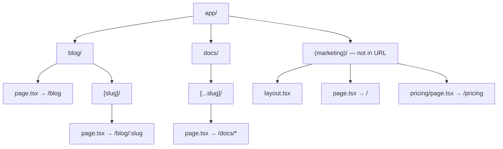

# Lecture 21: Routing and Layout Management

Now that your project is scaffolded, this lecture teaches you how the App Router turns
folders into URLs, how special files control what renders at each route, and how to
navigate between pages the Next.js way instead of relying on full page reloads.

## In This Lecture

- File-based routing conventions and the special files: `page`, `layout`, `loading`,
  `error`, `not-found`
- Nested routes, route groups, and dynamic segments (`[slug]`, `[...slug]`, `[[...slug]]`)
- Layouts, templates, and sharing UI across routes
- Navigation: `Link`, `useRouter`, `usePathname`, redirects, and rewrites

## File-Based Routing and Special Files

In the App Router, **every folder inside `app/` is a route segment**, and a folder becomes
an actual, visitable URL only when it contains a `page.tsx` (or `.jsx`) file. This is a
deliberate design choice: you can keep components, tests, and utility files alongside a
route's folder without accidentally exposing them as pages, because only `page.tsx` is
routable.

```text
app/
├── page.tsx              → /
├── about/
│   └── page.tsx           → /about
└── blog/
    ├── page.tsx            → /blog
    └── [slug]/
        └── page.tsx         → /blog/:slug
```

```jsx
// app/about/page.tsx
export default function AboutPage() {
  return <h1>About Us</h1>;
}
```

Beyond `page.tsx`, the App Router recognizes several other **special files**, each with a
reserved name and a specific job. Next.js automatically wires them together — you never
import or register them manually.

| File | Purpose |
|---|---|
| `page.tsx` | The unique UI for a route; makes the segment publicly reachable |
| `layout.tsx` | Shared UI wrapping this segment and all of its children; preserves state across navigation |
| `loading.tsx` | An automatic loading UI shown via React Suspense while the segment's data loads |
| `error.tsx` | An automatic error boundary catching runtime errors in the segment |
| `not-found.tsx` | UI shown when a route (or a manually thrown "not found" case) doesn't resolve |

```jsx
// app/blog/loading.tsx
export default function Loading() {
  return <p>Loading posts...</p>;
}
```

```jsx
// app/blog/error.tsx
"use client"; // error components must be Client Components

export default function Error({ error, reset }) {
  return (
    <div>
      <p>Something went wrong: {error.message}</p>
      <button onClick={() => reset()}>Try again</button>
    </div>
  );
}
```

!!! note "`error.tsx` must be a Client Component"
    Error boundaries rely on React state and event handlers (the retry button calling
    `reset()`), which only Client Components can use. You will study the Server/Client
    Component split in full in Lecture 22 — for now, just remember `error.tsx` always needs
    `"use client"` at the top.

```jsx
// app/blog/[slug]/not-found.tsx
export default function NotFound() {
  return <h2>Post not found.</h2>;
}
```

## Nested Routes, Route Groups, and Dynamic Segments

### Nested Routes

Folders nest exactly the way URLs nest. A `page.tsx` deep inside several folders simply
produces a longer path:

```text
app/dashboard/settings/billing/page.tsx  →  /dashboard/settings/billing
```

### Route Groups `(group)`

A folder name wrapped in parentheses, like `(marketing)`, is a **route group**: it organizes
files and lets you apply a shared layout to a set of routes, but it is **omitted from the
URL entirely**.

```text
app/
├── (marketing)/
│   ├── layout.tsx        → shared layout for marketing pages
│   ├── page.tsx           → /
│   └── pricing/page.tsx    → /pricing
└── (app)/
    ├── layout.tsx        → different shared layout for the app itself
    └── dashboard/page.tsx  → /dashboard
```

This lets `/` and `/pricing` share a marketing-site layout (header, footer, hero styling)
while `/dashboard` uses a completely different app-shell layout, without either group name
appearing in the URL.

### Dynamic Segments `[slug]`

A folder name in square brackets captures a single dynamic URL segment as a parameter,
delivered to the page as `params`:

```jsx
// app/blog/[slug]/page.tsx
export default async function BlogPost({ params }) {
  const { slug } = await params;
  return <h1>Post: {slug}</h1>;
}
```

Visiting `/blog/hello-world` renders this page with `slug === "hello-world"`.

### Catch-All Segments `[...slug]`

Square brackets with three dots capture **any number of remaining segments** as an array —
useful for things like nested documentation paths or a CMS-driven URL tree:

```jsx
// app/docs/[...slug]/page.tsx
export default async function DocsPage({ params }) {
  const { slug } = await params; // e.g. ["guides", "routing", "dynamic"]
  return <p>Path: {slug.join("/")}</p>;
}
```

`/docs/guides/routing/dynamic` matches this route with `slug = ["guides", "routing",
"dynamic"]`. Note that a plain `[...slug]` does **not** match `/docs` itself (zero segments)
— only one or more.

### Optional Catch-All Segments `[[...slug]]`

Doubling the outer brackets makes the catch-all **optional**, so the route also matches the
parent path with zero extra segments:

```text
app/shop/[[...slug]]/page.tsx
  matches:  /shop            (slug is undefined)
  matches:  /shop/shoes       (slug = ["shoes"])
  matches:  /shop/shoes/nike   (slug = ["shoes", "nike"])
```

!!! tip "Choosing between the three"
    Use `[slug]` when you need exactly one value (a single blog post or user id). Use
    `[...slug]` when you need a variable-depth path but a base "empty" version of the route
    genuinely shouldn't exist. Use `[[...slug]]` when the base route *and* deeper paths
    should both be handled by the same page component — a common pattern for a storefront
    with optional category/subcategory filtering.



## Layouts, Templates, and Shared UI

A **layout** is UI shared between multiple pages, defined in `layout.tsx`. Layouts **wrap**
their segment's `page.tsx` (and any nested layouts/pages below them) and — critically —
**preserve React state and do not re-render** when navigating between sibling pages inside
them. Every layout must render a `children` prop, which Next.js fills in with whatever
should appear inside it.

```jsx
// app/dashboard/layout.tsx
export default function DashboardLayout({ children }) {
  return (
    <div className="dashboard-shell">
      <Sidebar />
      <main>{children}</main>
    </div>
  );
}
```

Layouts **nest**: the root `app/layout.tsx` is required in every App Router project (it must
render `<html>` and `<body>`), and any deeper `layout.tsx` wraps only its own subtree.

```jsx
// app/layout.tsx (root layout — required)
export default function RootLayout({ children }) {
  return (
    <html lang="en">
      <body>{children}</body>
    </html>
  );
}
```

A **template**, defined in `template.tsx`, looks similar to a layout but behaves
differently: Next.js creates a **new instance** of a template — and its state — on every
navigation, rather than preserving it. Use a template instead of a layout when you
specifically want an enter/exit animation to replay, or a `useEffect` to re-run, on every
page change within that segment.

!!! warning "Layouts don't re-run on sibling navigation — templates do"
    If you put a `console.log` in a layout and navigate between two pages that share it,
    it only logs once. The same log in a `template.tsx` logs on every navigation. Reach for
    a template only when you need that reset behavior; for ordinary shared chrome (nav bars,
    sidebars), a layout is what you want, and it's also more efficient.

## Navigation: `Link`, `useRouter`, `usePathname`, Redirects, and Rewrites

### The `Link` Component

Use `next/link` instead of a plain `<a>` tag for internal navigation. `Link` performs
**client-side navigation** — it does not trigger a full page reload — and Next.js
automatically **prefetches** the linked route's code in the background when the link scrolls
into the viewport, making the eventual navigation feel instant.

```jsx
import Link from "next/link";

export default function Nav() {
  return (
    <nav>
      <Link href="/">Home</Link>
      <Link href="/blog">Blog</Link>
      <Link href={`/blog/${post.slug}`}>{post.title}</Link>
    </nav>
  );
}
```

### `useRouter` and Programmatic Navigation

For navigation triggered by code rather than a click — after a successful form submission,
for example — use the `useRouter` hook from `next/navigation` inside a **Client Component**:

```jsx
"use client";

import { useRouter } from "next/navigation";

export default function LoginForm() {
  const router = useRouter();

  async function handleSubmit(e) {
    e.preventDefault();
    const ok = await submitLogin();
    if (ok) {
      router.push("/dashboard");   // navigate, adds a history entry
      // router.replace("/dashboard"); // navigate without adding a history entry
    }
  }

  return <form onSubmit={handleSubmit}>{/* fields */}</form>;
}
```

!!! warning "`next/navigation`, not `next/router`"
    `useRouter` in the App Router comes from **`next/navigation`**. The similarly named hook
    from `next/router` belongs to the older Pages Router and returns a different API — mixing
    the two up is one of the most common App Router migration mistakes.

### `usePathname`

`usePathname` returns the current URL's path as a plain string — handy for highlighting the
active link in a navigation bar:

```jsx
"use client";

import { usePathname } from "next/navigation";
import Link from "next/link";

export default function NavLink({ href, children }) {
  const pathname = usePathname();
  const isActive = pathname === href;

  return (
    <Link href={href} className={isActive ? "active" : ""}>
      {children}
    </Link>
  );
}
```

### Redirects and Rewrites

A **redirect** sends the browser to a different URL, changing what the address bar shows.
Inside a Server Component or Server Action, call the `redirect` function from
`next/navigation`:

```jsx
import { redirect } from "next/navigation";

export default async function ProfilePage() {
  const user = await getCurrentUser();
  if (!user) {
    redirect("/login");
  }
  return <h1>Welcome, {user.name}</h1>;
}
```

A **rewrite** serves content from a different internal path while leaving the URL the user
sees unchanged — useful for proxying to an external API path or quietly renaming an internal
route without breaking bookmarks. Configure both at the framework level in
`next.config.js`:

```javascript
/** @type {import('next').NextConfig} */
const nextConfig = {
  async redirects() {
    return [
      { source: "/old-blog/:slug", destination: "/blog/:slug", permanent: true },
    ];
  },
  async rewrites() {
    return [
      { source: "/api/external/:path*", destination: "https://api.example.com/:path*" },
    ];
  },
};

module.exports = nextConfig;
```

## Try It Yourself

1. Build a small route tree: `app/(marketing)/page.tsx` and `app/(marketing)/about/page.tsx`
   sharing `app/(marketing)/layout.tsx` with a common header; and a separate
   `app/dashboard/layout.tsx` wrapping `app/dashboard/page.tsx`. Confirm the group name never
   appears in either URL.
2. Add `app/products/[slug]/page.tsx` that reads `params.slug` and displays it, plus a
   sibling `not-found.tsx`. Then build a client-side `<NavLink>` component using
   `usePathname` that visually marks the active link between `/` and `/products/anything`.

## Key Takeaways

- Only a folder containing `page.tsx` is a reachable route; `layout`, `loading`, `error`, and
  `not-found` are special files Next.js wires in automatically around it.
- Route groups `(name)` organize files and share layouts without affecting the URL;
  `[slug]`, `[...slug]`, and `[[...slug]]` capture one, one-or-more, and zero-or-more dynamic
  URL segments respectively.
- Layouts wrap nested routes, persist state across sibling navigation, and must render
  `children`; templates look similar but remount on every navigation.
- Use `next/link` for standard navigation (it prefetches automatically); use `useRouter`
  from `next/navigation` for programmatic navigation and `usePathname` to read the current
  path.
- `redirect()` sends the user to a new URL; a rewrite in `next.config.js` serves different
  content while keeping the visible URL unchanged.
