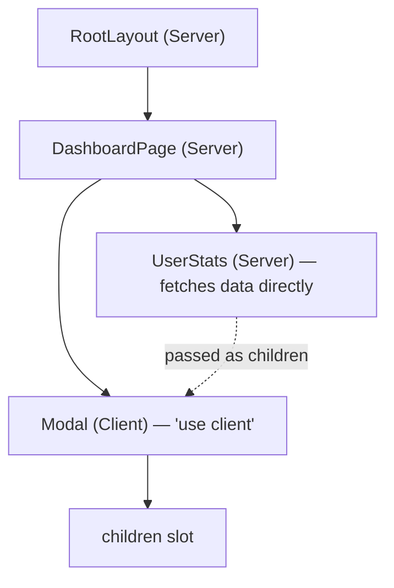
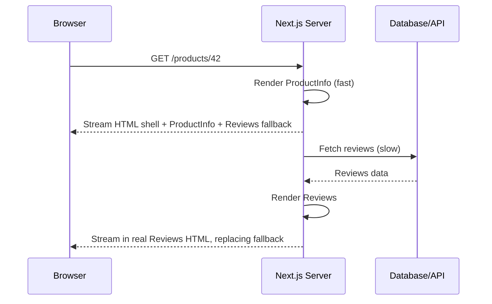

# Lecture 22: Rendering Strategies and Server-Side Capabilities

This lecture goes underneath the App Router's routing conventions into the mechanism that
makes Next.js a full-stack framework: **React Server Components**. You will learn where code
runs, how Next.js caches and revalidates data, how streaming delivers a page piece by piece,
and how to write server-side logic directly inside your frontend project.

## In This Lecture

- Server Components vs. Client Components, the `"use client"` directive, and composition rules
- Server-side data fetching, request memoization, caching, and revalidation
- Streaming and Suspense for progressive rendering
- Route Handlers, Server Actions, and Next.js middleware

## Server Components vs. Client Components

The single biggest conceptual shift from CSC336 React to Next.js is this: **every component
in the App Router is a Server Component by default.** A **Server Component** renders
entirely on the server — it can read files, query a database, or call a private API with a
secret key directly in its body — and it sends only the resulting HTML (plus a compact
description of the UI) to the browser. Its own JavaScript is **never sent to the client at
all**, which keeps the browser bundle smaller.

```jsx
// app/products/page.tsx — a Server Component (no directive needed)
import { db } from "@/lib/db";

export default async function ProductsPage() {
  const products = await db.product.findMany(); // runs only on the server
  return (
    <ul>
      {products.map((p) => (
        <li key={p.id}>{p.name}</li>
      ))}
    </ul>
  );
}
```

Notice this component is `async` and awaits data directly in its body — something a plain
React component could never do. That is only possible because it runs on the server.

A **Client Component** is the kind of component you already know from CSC336: it renders in
the browser (after an initial server-rendered pass, then **hydrates**), and it is the only
kind of component allowed to use state, effects, browser-only APIs, or event handlers. You
opt into one with the `"use client"` directive at the very top of the file:

```jsx
// app/components/Counter.tsx
"use client";

import { useState } from "react";

export default function Counter() {
  const [count, setCount] = useState(0);
  return <button onClick={() => setCount(count + 1)}>Clicked {count} times</button>;
}
```

| Capability | Server Component | Client Component |
|---|---|---|
| `useState`, `useEffect`, other hooks | No | Yes |
| Event handlers (`onClick`, etc.) | No | Yes |
| Direct database/file-system access | Yes | No |
| Access secrets / private API keys safely | Yes | No |
| Ships JavaScript to the browser | No | Yes |
| Browser-only APIs (`window`, `localStorage`) | No | Yes |

### Composition Rules

You cannot import a Server Component *into* a Client Component's module and expect it to
stay a Server Component — once you cross into `"use client"` territory, everything imported
beneath it in that import chain is treated as client code. The rule that actually works, and
that you should default to, is: **pass Server Components down as `children` (or other props)
into Client Components**, rather than importing them from inside client code.

```jsx
// app/dashboard/page.tsx — Server Component
import Modal from "@/components/Modal";       // Client Component
import UserStats from "@/components/UserStats"; // Server Component

export default function DashboardPage() {
  return (
    <Modal>
      <UserStats /> {/* still rendered on the server, then slotted in */}
    </Modal>
  );
}
```

```jsx
// components/Modal.tsx
"use client";

export default function Modal({ children }) {
  const [open, setOpen] = useState(false);
  return open ? <div className="modal">{children}</div> : null;
}
```

!!! tip "Push `"use client"` as far down the tree as possible"
    Mark only the components that truly need interactivity (a button, a form, a dropdown) as
    Client Components, and keep everything around them — layouts, data-fetching wrappers,
    static content — as Server Components. This minimizes the JavaScript shipped to the
    browser, which is one of the main performance wins Next.js offers over a pure CSR app.



## Server-Side Data Fetching, Caching, and Revalidation

Server Components fetch data with the standard `fetch` API, but Next.js extends `fetch` with
its own caching layer.

```jsx
async function getPosts() {
  const res = await fetch("https://api.example.com/posts", {
    next: { revalidate: 3600 }, // ISR: revalidate this data at most once per hour
  });
  return res.json();
}
```

The `next` option on `fetch` controls Next.js's **Data Cache**:

- `{ cache: "force-cache" }` (the default for `fetch` in most cases) — cache the response
  indefinitely, similar in spirit to SSG.
- `{ cache: "no-store" }` — never cache; fetch fresh data on every request, similar to SSR.
- `{ next: { revalidate: N } }` — cache the response but treat it as stale after `N`
  seconds, triggering a background refresh on the next request after that — this is
  **time-based ISR** applied at the data level, not just the whole-page level.

**Request memoization** is a separate, automatic optimization: if multiple components in the
*same render pass* call `fetch` with identical URL and options, Next.js only performs the
network request **once** and shares the result — even though `getPosts()` might be called
from three different unrelated components rendering the same page.

**On-demand revalidation** lets you invalidate cached data the moment it actually changes,
rather than waiting for a timer — typically called from a Server Action or Route Handler
right after a write:

```javascript
import { revalidatePath, revalidateTag } from "next/cache";

async function publishPost(id) {
  await db.post.update({ where: { id }, data: { published: true } });
  revalidatePath("/blog");        // re-render this path's cache on next visit
  revalidateTag("posts");         // or invalidate every fetch tagged "posts"
}
```

To tag a fetch for `revalidateTag`, add a `tags` array alongside `revalidate`:

```javascript
fetch("https://api.example.com/posts", { next: { tags: ["posts"] } });
```

!!! note "Time-based vs. on-demand ISR"
    Time-based ISR (`revalidate: N`) is "eventually fresh" — good for content that changes
    occasionally and where a short staleness window is acceptable. On-demand ISR
    (`revalidatePath`/`revalidateTag`) is "fresh the instant it changes" — the right choice
    right after a mutation, such as an admin publishing a new article.

## Streaming and Suspense

**Streaming** lets the server send a page to the browser in **pieces**, as each piece
becomes ready, instead of waiting for every single data-fetching component to finish before
sending anything. Next.js implements this using React's `<Suspense>` boundary: wrap a slow
component in `<Suspense>` with a `fallback`, and Next.js sends the rest of the page
immediately, streaming in the slow part — along with the real content replacing the
fallback — the moment it resolves.

```jsx
import { Suspense } from "react";
import Reviews from "@/components/Reviews";
import ProductInfo from "@/components/ProductInfo";

export default function ProductPage({ params }) {
  return (
    <div>
      <ProductInfo params={params} />
      <Suspense fallback={<ReviewsSkeleton />}>
        <Reviews params={params} /> {/* slow fetch, streamed in separately */}
      </Suspense>
    </div>
  );
}

function ReviewsSkeleton() {
  return <div className="skeleton-block">Loading reviews...</div>;
}
```

Recall from Lecture 21 that `loading.tsx` is Next.js automatically wrapping an entire route
segment in a `Suspense` boundary for you; nesting your own `<Suspense>` boundaries inside a
page gives you finer control — streaming just one slow widget rather than delaying (or
blanking) the whole page.



## Route Handlers, Server Actions, and Middleware

### Route Handlers

A **Route Handler**, defined in a `route.ts` file, turns a segment into a backend API
endpoint instead of a page — this is how you build REST-style endpoints directly inside a
Next.js project.

```javascript
// app/api/posts/route.ts
import { NextResponse } from "next/server";

export async function GET() {
  const posts = await db.post.findMany();
  return NextResponse.json(posts);
}

export async function POST(request) {
  const body = await request.json();
  const post = await db.post.create({ data: body });
  return NextResponse.json(post, { status: 201 });
}
```

A folder cannot contain both `page.tsx` and `route.ts` at the same path segment — a segment
is either a page or an API route, not both.

### Server Actions

A **Server Action** is a function that runs on the server but can be called directly from a
form or a Client Component, without you manually building a fetch call and an API route for
every single mutation. Mark it with the `"use server"` directive.

```jsx
// app/actions.ts
"use server";

export async function createTodo(formData) {
  const title = formData.get("title");
  await db.todo.create({ data: { title } });
  revalidatePath("/todos");
}
```

```jsx
// app/todos/page.tsx
import { createTodo } from "@/app/actions";

export default function TodosPage() {
  return (
    <form action={createTodo}>
      <input name="title" />
      <button type="submit">Add</button>
    </form>
  );
}
```

Next.js handles the network round trip for you; from the form's perspective it is calling a
local function, but the code inside `createTodo` truly executes on the server.

!!! warning "Server Actions still need validation"
    Because a Server Action is reachable over the network (it compiles down to an HTTP
    endpoint under the hood), you must validate and authorize its input exactly as carefully
    as you would a Route Handler or REST endpoint — never trust `formData` blindly just
    because it "looks like" a local function call.

### Middleware

**Middleware** runs code **before a request completes**, at the edge, ahead of the route
that would normally handle it — useful for authentication gates, redirects, and header
manipulation that should apply broadly. Define it in a single `middleware.ts` file at your
project root.

```javascript
// middleware.ts
import { NextResponse } from "next/server";

export function middleware(request) {
  const isLoggedIn = request.cookies.has("session");
  if (!isLoggedIn && request.nextUrl.pathname.startsWith("/dashboard")) {
    return NextResponse.redirect(new URL("/login", request.url));
  }
  return NextResponse.next();
}

export const config = {
  matcher: "/dashboard/:path*",
};
```

The `matcher` config restricts which paths run through this middleware, so you avoid paying
its cost on every single request in the application.

## Try It Yourself

1. Build a Server Component page that fetches a list from a public API using
   `next: { revalidate: 60 }`, and a sibling Client Component `"like"` button using
   `useState` for a local counter. Confirm (via view-source or the Network tab) that the
   list's HTML is present in the initial response while the button's interactivity only
   works after hydration.
2. Add a `Suspense` boundary around one slow-fetching section of a page with a skeleton
   fallback, and a Route Handler at `app/api/health/route.ts` that returns
   `{ status: "ok" }` as JSON.

## Key Takeaways

- Components are **Server Components by default**; add `"use client"` only where you need
  state, effects, or event handlers, and prefer passing Server Components in as `children`
  rather than importing them into client code.
- Next.js extends `fetch` with a Data Cache controlled via `cache` and `next.revalidate`, and
  automatically memoizes identical requests within one render pass.
- **Time-based revalidation** (`revalidate: N`) refreshes data on a timer; **on-demand
  revalidation** (`revalidatePath`/`revalidateTag`) refreshes it immediately after a change.
- **Streaming** with `<Suspense>` sends a page in pieces, so slow data doesn't block fast
  content from reaching the browser — `loading.tsx` does this automatically per route.
- **Route Handlers** (`route.ts`) build API endpoints inside your Next.js project; **Server
  Actions** (`"use server"`) let forms and client code call server-side functions directly;
  **middleware** runs logic before a request reaches its route, commonly for auth gating.
