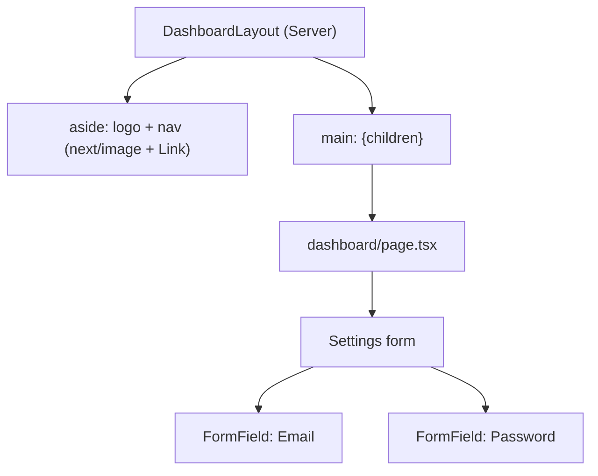

# Lecture 23: Components, Layouts and Styling

With routing and rendering covered, this lecture focuses on what your pages actually look
like: how Next.js helps with SEO metadata and asset optimization, how to choose a styling
approach, how component libraries speed up UI work, and how to assemble it all into a real
application shell.

## In This Lecture

- Special-file behavior recap and the Metadata API for SEO
- Built-in optimizations: `next/image`, `next/font`, `next/script`
- Styling options: global CSS, CSS Modules, Tailwind CSS, and CSS-in-JS
- Component libraries, design systems, responsive design, dark mode, and accessibility
- Building an application shell: navigation, sidebar, forms, and reusable UI components

## Special Files and the Metadata API

Recall from Lecture 21 that `page.tsx` and `layout.tsx` are the special files that define
what renders. Next.js also lets either of them export **metadata** — the information a
browser tab, a search engine, or a social media preview card uses to describe your page —
without you hand-writing `<meta>` tags into a `<head>` yourself.

```jsx
// app/blog/page.tsx
export const metadata = {
  title: "Blog | My Site",
  description: "Articles about web development and Next.js.",
  openGraph: {
    title: "Blog | My Site",
    description: "Articles about web development and Next.js.",
    images: ["/og-blog.png"],
  },
};

export default function BlogPage() {
  return <h1>Blog</h1>;
}
```

For a dynamic route, export a `generateMetadata` function instead of a static object, so the
title can depend on fetched data:

```jsx
// app/blog/[slug]/page.tsx
export async function generateMetadata({ params }) {
  const { slug } = await params;
  const post = await getPost(slug);
  return {
    title: post.title,
    description: post.excerpt,
  };
}

export default async function PostPage({ params }) {
  const { slug } = await params;
  const post = await getPost(slug);
  return <article>{post.body}</article>;
}
```

Metadata **merges down the layout tree**: a title set in the root layout acts as a default,
and a page can override or extend it (for example, using a `title.template` in the layout
so every page title automatically gets a `"%s | My Site"` suffix).

!!! note "Why this matters for SEO"
    This directly addresses the SEO weakness of CSR you learned about in Lecture 20: because
    metadata is resolved on the server before the response is sent, crawlers and link-preview
    bots see a fully formed `<title>` and `<meta>` tags immediately, with no JavaScript
    execution required.

## Built-In Optimizations

Next.js ships components that wrap ordinary HTML tags with automatic performance work.

**`next/image`** replaces ``. It automatically serves correctly sized images for the
viewport, lazy-loads offscreen images, and prevents layout shift by reserving space upfront:

```jsx
import Image from "next/image";

export default function Avatar() {
  return (
    <Image
      src="/profile.jpg"
      alt="User profile photo"
      width={96}
      height={96}
      priority // opt out of lazy-loading for above-the-fold images
    />
  );
}
```

Remote images require their host to be allow-listed in `next.config.js`, exactly as you
configured in Lecture 20's `remotePatterns` example.

**`next/font`** self-hosts and optimizes web fonts (including Google Fonts) at build time,
eliminating an extra round trip to a third-party font server and avoiding layout shift from
late-loading fonts:

```jsx
// app/layout.tsx
import { Inter } from "next/font/google";

const inter = Inter({ subsets: ["latin"] });

export default function RootLayout({ children }) {
  return (
    <html lang="en" className={inter.className}>
      <body>{children}</body>
    </html>
  );
}
```

**`next/script`** gives you control over *when* a third-party script (analytics, chat
widgets) loads relative to page rendering, via a `strategy` prop:

```jsx
import Script from "next/script";

export default function RootLayout({ children }) {
  return (
    <html lang="en">
      <body>
        {children}
        <Script src="https://analytics.example.com/script.js" strategy="afterInteractive" />
      </body>
    </html>
  );
}
```

`strategy="afterInteractive"` (load soon after the page becomes interactive) is typical for
analytics; `strategy="lazyOnload"` defers a script until the browser is idle, and
`strategy="beforeInteractive"` is reserved for scripts a page cannot function without.

## Styling Options

Next.js does not force one styling approach — you choose per project, and larger codebases
sometimes combine two of these deliberately.

**Global CSS** — a single stylesheet imported once, typically in the root layout, for
resets and base element styles:

```css
/* app/globals.css */
:root { --color-primary: #2563eb; }
body { margin: 0; font-family: system-ui, sans-serif; }
```

```jsx
// app/layout.tsx
import "./globals.css";
```

**CSS Modules** — a `.module.css` file scoped automatically to the component that imports
it, so class names never collide across your codebase:

```css
/* components/Card.module.css */
.card { border-radius: 8px; padding: 1rem; box-shadow: 0 1px 3px rgba(0,0,0,0.1); }
```

```jsx
import styles from "./Card.module.css";

export default function Card({ children }) {
  return <div className={styles.card}>{children}</div>;
}
```

**Tailwind CSS** — a utility-first framework where you compose small, single-purpose classes
directly in JSX instead of writing separate CSS files. Next.js's official setup wizard can
configure it for you at project creation (Lecture 20):

```jsx
export default function Card({ children }) {
  return <div className="rounded-lg p-4 shadow-sm bg-white">{children}</div>;
}
```

**CSS-in-JS** — styles written in JavaScript/TypeScript, colocated with the component (e.g.
styled-components, Emotion). Note that many CSS-in-JS libraries were built assuming a
client-rendered React tree, so using them with Server Components requires checking that
library's specific App Router support before adopting it on a new project.

| Approach | Scoping | Learning curve | Notes for App Router |
|---|---|---|---|
| Global CSS | None (global) | Low | Fine for resets/base styles; avoid for components |
| CSS Modules | Per-file, automatic | Low | Works in both Server and Client Components |
| Tailwind CSS | Utility classes, no naming needed | Medium | Very fast iteration; works in both component types |
| CSS-in-JS | Per-component, runtime or build-time | Medium–High | Verify Server Component compatibility per library |

!!! tip "What most production Next.js projects choose"
    Tailwind CSS for everyday component styling plus a small `globals.css` for resets and
    CSS variables is currently the most common combination in the Next.js ecosystem, largely
    because it avoids the runtime cost and Server Component friction that some CSS-in-JS
    libraries carry.

## Component Libraries and Design Systems

Rather than styling every element from scratch, most production teams build on a **component
library** — a collection of pre-built, tested UI components.

- **shadcn/ui** — not an installed dependency but a CLI that **copies** component source
  code (built on Tailwind CSS and Radix primitives) directly into your project, so you own
  and can freely edit the code rather than depending on an external package's API surface.
- **MUI (Material UI)** — a traditional, installable component library implementing
  Google's Material Design system, with its own theming API and CSS-in-JS engine.

A **design system** is the broader set of design decisions — a color palette, spacing scale,
typography rules, and component conventions — that keeps an application visually and
behaviorally consistent as many people build many features over time. A component library is
one practical way to *implement* a design system; you can also build a lightweight one
yourself with Tailwind config tokens and a handful of shared components.

### Responsive Design, Dark Mode, and Accessibility

These three concerns apply regardless of which styling approach you pick:

- **Responsive design** — using relative units and breakpoints so layouts adapt across
  screen sizes; Tailwind expresses this with responsive prefixes like `md:flex-row`.
- **Dark mode** — typically implemented by toggling a `class="dark"` on `<html>` and
  defining dark-variant styles (Tailwind: `dark:bg-gray-900`), often combined with reading
  the user's `prefers-color-scheme` and persisting an explicit override.
- **Accessibility (a11y)** — using semantic HTML elements, meaningful `alt` text, sufficient
  color contrast, visible focus states, and correct ARIA attributes only where semantic HTML
  isn't enough — component libraries like shadcn/ui (via Radix) and MUI bake much of this in
  for you, which is a real practical reason to prefer them over ad hoc custom widgets for
  complex interactive elements like dialogs, dropdowns, and comboboxes.

!!! warning "A component library doesn't guarantee accessibility automatically"
    Using an accessible primitive (like a Radix dialog) gets you correct keyboard trapping
    and ARIA roles for free, but you are still responsible for accessible content: real
    `alt` text, a logical heading order, and labels associated with every form input.

## Building an Application Shell

An **application shell** is the persistent chrome — navigation, sidebar, header — around
your changing page content. This is a natural place to apply everything from this lecture at
once: a layout, `next/image`, Tailwind classes, and a reusable component.

```jsx
// app/dashboard/layout.tsx
import Link from "next/link";
import Image from "next/image";

export default function DashboardLayout({ children }) {
  return (
    <div className="flex min-h-screen">
      <aside className="w-64 shrink-0 border-r bg-white dark:bg-gray-900 dark:border-gray-800">
        <div className="flex items-center gap-2 p-4">
          <Image src="/logo.svg" alt="Company logo" width={32} height={32} />
          <span className="font-semibold">My App</span>
        </div>
        <nav className="flex flex-col gap-1 p-2">
          <Link href="/dashboard" className="rounded px-3 py-2 hover:bg-gray-100 dark:hover:bg-gray-800">
            Overview
          </Link>
          <Link href="/dashboard/settings" className="rounded px-3 py-2 hover:bg-gray-100 dark:hover:bg-gray-800">
            Settings
          </Link>
        </nav>
      </aside>
      <main className="flex-1 p-6">{children}</main>
    </div>
  );
}
```

A reusable form field component, built once and reused everywhere, keeps forms visually
consistent and cuts down repeated markup:

```jsx
// components/FormField.tsx
export default function FormField({ label, id, ...inputProps }) {
  return (
    <div className="mb-4">
      <label htmlFor={id} className="mb-1 block text-sm font-medium">
        {label}
      </label>
      <input
        id={id}
        className="w-full rounded border px-3 py-2 focus:outline-none focus:ring-2 focus:ring-blue-500"
        {...inputProps}
      />
    </div>
  );
}
```

```jsx
// Usage inside a form
<FormField label="Email" id="email" name="email" type="email" required />
<FormField label="Password" id="password" name="password" type="password" required />
```



## Try It Yourself

1. Add `generateMetadata` to a dynamic route so its `<title>` reflects fetched data, and
   confirm (via view-source) that the title is present in the raw HTML before any JavaScript
   runs.
2. Build a two-column application shell (sidebar + main content) using Tailwind CSS,
   `next/image` for a logo, and a reusable `FormField` component used at least twice inside
   a settings form. Add a `dark:` variant to at least one element and verify it responds to
   `prefers-color-scheme`.

## Key Takeaways

- `metadata`/`generateMetadata` exported from `page.tsx` or `layout.tsx` produce
  server-rendered SEO tags, directly solving the CSR SEO weakness from Lecture 20.
- `next/image`, `next/font`, and `next/script` wrap ordinary tags with automatic sizing,
  lazy-loading, self-hosted fonts, and controllable third-party script timing.
- Global CSS, CSS Modules, Tailwind CSS, and CSS-in-JS each trade off scoping and ergonomics
  differently; Tailwind plus a small global stylesheet is the common modern default.
- Component libraries like shadcn/ui (copy-in source) and MUI (installed package) implement
  design-system consistency and accessible primitives faster than building from scratch.
- Responsive design, dark mode, and accessibility are cross-cutting concerns that apply no
  matter which styling approach you choose.
- An application shell composes a layout, navigation, optimized assets, and reusable form
  components into the persistent structure most pages in an app share.
