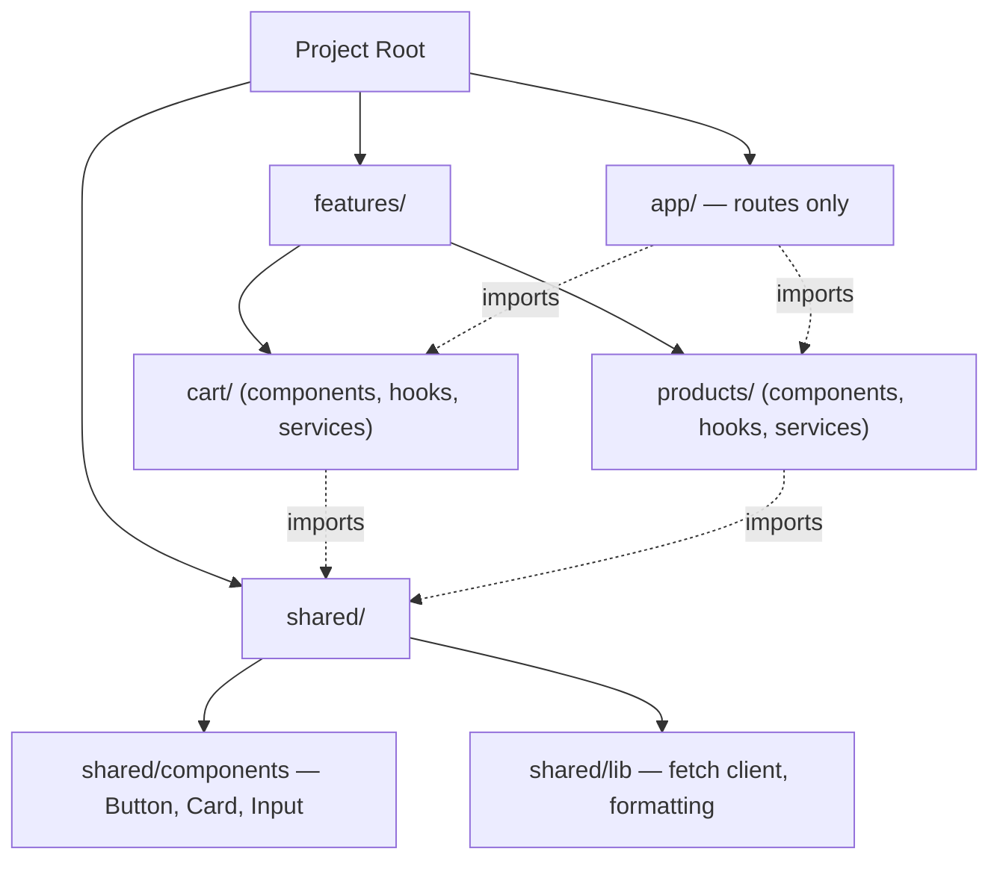
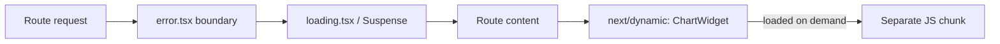

# Lecture 24: Frontend Architecture

This closes out the core Next.js unit by zooming out from individual features to how a
*whole* frontend codebase should be organized as it grows past a handful of pages. You will
learn how to structure folders at scale, categorize state correctly, build a proper
data-access layer, validate forms, and keep an application resilient and fast.

## In This Lecture

- Component organization and folder conventions at scale: feature-based vs. type-based
- The three categories of frontend state — local UI, server, and URL — and where each belongs
- Building an API/service layer and a data-access abstraction
- Form handling and schema validation
- Error boundaries, loading skeletons, and code splitting

## Component Organization at Scale

As an application grows beyond a few routes, how you arrange files stops being a matter of
taste and starts materially affecting how fast a team can find and safely change code. Two
common conventions dominate:

**Type-based organization** groups files by *what they are*:

```text
components/
  Button.tsx
  Card.tsx
  UserAvatar.tsx
  ProductCard.tsx
hooks/
  useUser.ts
  useCart.ts
services/
  userService.ts
  productService.ts
```

**Feature-based organization** groups files by *what they belong to* — every file related to
one feature (its components, hooks, and service calls) lives together, and only truly
cross-cutting building blocks stay in a shared top-level folder:

```text
app/
  dashboard/
    page.tsx
features/
  cart/
    components/CartSummary.tsx
    hooks/useCart.ts
    services/cartService.ts
  products/
    components/ProductCard.tsx
    hooks/useProducts.ts
    services/productService.ts
shared/
  components/Button.tsx
  components/Card.tsx
```

| Aspect | Type-based | Feature-based |
|---|---|---|
| Good for | Small apps, a handful of screens | Medium-to-large apps, multiple teams |
| Finding related code | Jump between several top-level folders | Usually one folder per feature |
| Coupling | Easy to accidentally couple unrelated features | Naturally isolates features from each other |
| Deleting a feature | Files scattered across the codebase | Usually just delete one folder |
| Downside | Scales poorly past a few dozen components | Some genuinely shared code needs a judgment call |

!!! tip "Feature-based scales, but don't over-engineer a small project"
    For a small course project or prototype, `components/`, `app/`, and a couple of hook
    files are perfectly fine. Reach for feature-based organization once you notice multiple
    unrelated features accumulating in the same flat folder, or once more than one person is
    regularly working in the same directory and stepping on each other's changes.



## Three Categories of Frontend State

A very common source of frontend bugs and unnecessary complexity is treating all state the
same way. It helps to explicitly separate state into three categories and pick the right
tool for each.

**Local UI state** — state relevant only to one component or a small cluster of them: is a
dropdown open, which tab is active, the current value of an uncontrolled animation. This
belongs in `useState`/`useReducer`, exactly as you learned in CSC336. It should never be
lifted higher than the components that actually need it.

**Server state** — data that actually lives on a server (or database) and that your frontend
is merely a cached, possibly-stale view of: a list of products, the logged-in user's profile,
comments on a post. Server state is fundamentally different from local state because it can
go stale, needs to be re-fetched or revalidated, and is often needed by several unrelated
components at once. In the App Router, you get a large share of this "for free" by fetching
it directly in Server Components (Lecture 22) with Next.js's Data Cache; for state that
originates from client-side interaction (e.g. mutations, optimistic updates, polling), a
dedicated library like **TanStack Query** is the common industry choice over plain
`useEffect` + `useState`, since it already handles caching, retries, and deduplication.

**URL state** — state that should live in the URL itself, because a user expects it to
survive a page refresh, be bookmarkable, and be shareable via a link: the current search
query, an active filter, a pagination page number, a selected tab in some cases. In the App
Router you read it with `useSearchParams` and write it by navigating with `useRouter` or
`Link`, rather than duplicating it into `useState`.

```jsx
"use client";

import { useRouter, useSearchParams, usePathname } from "next/navigation";

export default function CategoryFilter({ categories }) {
  const router = useRouter();
  const pathname = usePathname();
  const searchParams = useSearchParams();
  const active = searchParams.get("category") ?? "all";

  function setCategory(category) {
    const params = new URLSearchParams(searchParams);
    params.set("category", category);
    router.push(`${pathname}?${params.toString()}`);
  }

  return (
    <select value={active} onChange={(e) => setCategory(e.target.value)}>
      {categories.map((c) => (
        <option key={c} value={c}>{c}</option>
      ))}
    </select>
  );
}
```

| State category | Example | Where it lives | Typical tool |
|---|---|---|---|
| Local UI state | Is this modal open? | One component/subtree | `useState`, `useReducer` |
| Server state | List of products from the database | Server, cached on client | Server Component fetch, TanStack Query |
| URL state | Active filter, search query, page number | The URL itself | `useSearchParams`, `useRouter` |

!!! warning "The most common mistake: mirroring server or URL state into `useState`"
    Copying fetched data or a URL parameter into `useState` "just to have it locally" creates
    two sources of truth that can silently drift out of sync — the state stops updating when
    the underlying data or URL changes elsewhere. Read server state through your data layer
    and URL state through `useSearchParams` directly; only store genuinely local, ephemeral
    values in `useState`.

## API/Service Layer and Data-Access Abstraction

A **service layer** (or data-access layer) centralizes how your frontend talks to a backend,
instead of scattering raw `fetch` calls with duplicated URLs, headers, and error handling
across dozens of components.

```typescript
// shared/lib/apiClient.ts
const BASE_URL = process.env.NEXT_PUBLIC_API_URL;

export async function apiFetch(path, options = {}) {
  const res = await fetch(`${BASE_URL}${path}`, {
    ...options,
    headers: { "Content-Type": "application/json", ...options.headers },
  });
  if (!res.ok) {
    throw new Error(`API error ${res.status}: ${await res.text()}`);
  }
  return res.json();
}
```

```typescript
// features/products/services/productService.ts
import { apiFetch } from "@/shared/lib/apiClient";

export function getProducts() {
  return apiFetch("/products", { next: { revalidate: 60, tags: ["products"] } });
}

export function getProduct(id) {
  return apiFetch(`/products/${id}`);
}

export function createProduct(data) {
  return apiFetch("/products", { method: "POST", body: JSON.stringify(data) });
}
```

Components and Server Components now depend on `productService`, never on raw `fetch` calls
or a hardcoded URL — so if the backend URL, an auth header, or the error-handling convention
changes, you update it in exactly one place.

```jsx
// app/products/page.tsx
import { getProducts } from "@/features/products/services/productService";

export default async function ProductsPage() {
  const products = await getProducts();
  return (
    <ul>
      {products.map((p) => <li key={p.id}>{p.name}</li>)}
    </ul>
  );
}
```

## Form Handling and Schema Validation

Rather than hand-writing ad hoc `if` checks for every field, production forms typically pair
a form library with a **schema validation** library that declares the shape and rules data
must satisfy in one place, and can validate both client-side (fast feedback) and server-side
(never trust the client) using the exact same schema.

```typescript
// features/products/schema.ts
import { z } from "zod";

export const productSchema = z.object({
  name: z.string().min(1, "Name is required"),
  price: z.number().positive("Price must be positive"),
});
```

```jsx
// A Server Action reusing the same schema (see Lecture 22 for Server Actions)
"use server";

import { productSchema } from "@/features/products/schema";

export async function createProductAction(formData) {
  const result = productSchema.safeParse({
    name: formData.get("name"),
    price: Number(formData.get("price")),
  });

  if (!result.success) {
    return { errors: result.error.flatten().fieldErrors };
  }

  await createProduct(result.data);
  return { success: true };
}
```

!!! note "Validate twice, on purpose"
    Client-side validation (often via a library like React Hook Form paired with the same
    Zod schema) gives instant feedback and a better user experience. Server-side validation,
    on the exact same schema, is what actually protects your data — a malicious or buggy
    client can always bypass client-side checks, but it cannot bypass validation that runs on
    your server.

## Error Boundaries, Loading Skeletons, and Code Splitting

You already met the App Router's automatic tools for two of these in Lecture 21:
**`error.tsx`** gives every route segment an error boundary for free, and **`loading.tsx`**
gives every segment an automatic Suspense fallback. A **loading skeleton** — a gray
placeholder shape mimicking the eventual layout — is generally preferred over a bare spinner
because it reduces perceived layout shift and gives the user a sense of *what* is loading:

```jsx
// app/products/loading.tsx
export default function Loading() {
  return (
    <ul>
      {Array.from({ length: 6 }).map((_, i) => (
        <li key={i} className="h-16 animate-pulse rounded bg-gray-200" />
      ))}
    </ul>
  );
}
```

**Code splitting** means shipping only the JavaScript a given view actually needs, instead of
one giant bundle for the whole application. The App Router already splits code
**automatically per route** — visiting `/products` does not download the JavaScript for
`/checkout`. For a large Client Component that is only needed conditionally (a rich text
editor, a charting library, a modal rarely opened), you can split it further with
`next/dynamic`:

```jsx
"use client";

import dynamic from "next/dynamic";

const ChartWidget = dynamic(() => import("@/features/analytics/components/ChartWidget"), {
  loading: () => <p>Loading chart…</p>,
  ssr: false, // skip server rendering for a browser-only charting library
});

export default function AnalyticsPanel() {
  return <ChartWidget />;
}
```



## Try It Yourself

1. Reorganize a small multi-feature project (e.g. `products` and `cart`) into
   `features/products` and `features/cart` folders, each with its own `components/`,
   `hooks/`, and `services/`, plus a `shared/` folder for anything genuinely reused by both.
2. Build a filterable list page that keeps its filter in the URL via `useSearchParams` (not
   `useState`), backed by a `productService.getProducts()` call, with a `loading.tsx`
   skeleton and a Zod schema validating a "create product" form on both the client and inside
   a Server Action.

## Key Takeaways

- **Feature-based organization** (folder per feature, each with its own components/hooks/
  services) scales better than flat type-based folders once an app grows past a handful of
  screens; small projects can stay simple.
- Separate state into **local UI state** (`useState`), **server state** (fetched/cached data,
  ideally via Server Components or a library like TanStack Query), and **URL state**
  (`useSearchParams`/`useRouter`) — and avoid mirroring server or URL state into local state.
- A **service layer** centralizes API calls behind functions like `getProducts()`, so
  components never hardcode URLs or duplicate error handling.
- Pair a **schema validation** library (e.g. Zod) with a form library, and validate the same
  schema on both the client (for UX) and the server (for actual security).
- `error.tsx` and `loading.tsx` give every route segment an error boundary and a Suspense
  fallback automatically; prefer skeletons over bare spinners to reduce perceived layout
  shift.
- The App Router code-splits per route automatically; `next/dynamic` lets you split large,
  conditionally-needed Client Components further.
