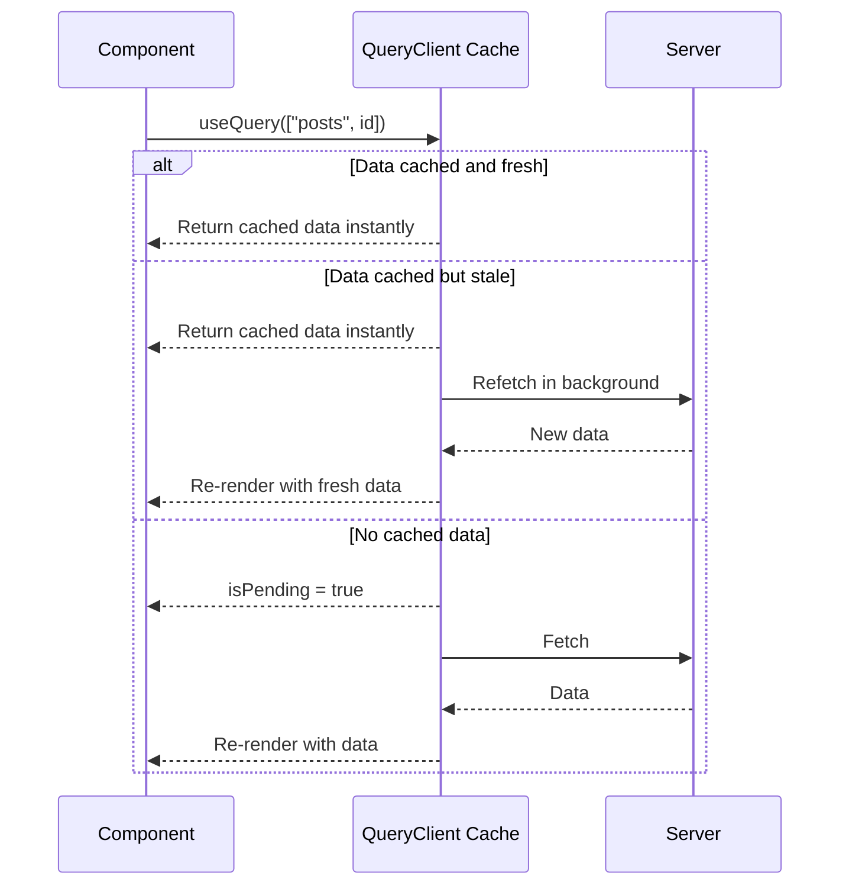
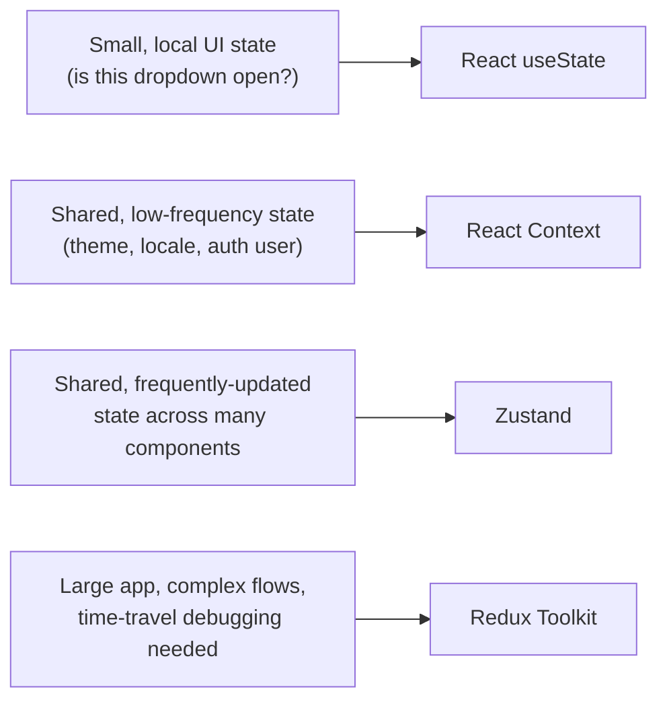

# Lecture 25: Data Fetching and State Management with TanStack Query

Server Components solved *where* your initial data comes from, but most real applications
also need to fetch, cache, and mutate data **on the client** — in response to clicks,
search boxes, infinite scrolling, and polling. This lecture covers the client-side data
libraries and state-management tools that make that reliable at production scale.

## In This Lecture

- Use client-side data fetching libraries (TanStack Query / SWR) for caching, staleness,
  mutations, and optimistic updates
- Design query keys, implement pagination, infinite queries, prefetching, and retries
- Choose the right state-management tool in Next.js: Context, Zustand, or Redux Toolkit
- Handle errors, empty states, and common data-fetching performance pitfalls

## Why You Still Need a Client-Side Data Library

You already know how to fetch data on the server inside a Server Component, `async`
straight through to your database or API, and stream the result to the client. That
covers the *initial* render. But a huge amount of application behavior happens **after**
the page has loaded, entirely in the browser:

- A user types in a search box and results should update without a full navigation.
- A "Load more" button or infinite scroll needs to append more data to a list already on
  screen.
- A dashboard needs to re-fetch its numbers every 30 seconds without the user asking.
- A "Like" button should update instantly, before the server has even confirmed it.

You could write this with `useEffect` and `fetch` by hand, but you would end up
reimplementing — badly — a set of problems that **TanStack Query** (formerly React
Query) and **SWR** already solve well: caching, request deduplication, background
refetching, retries, and cache invalidation after a mutation.

!!! note "TanStack Query vs. SWR"
    Both libraries solve the same core problem and share the same mental model: treat
    server data as a **cache** you declaratively describe, not as state you manually
    manage. SWR (`stale-while-revalidate`) is smaller and simpler, built by the Next.js
    team at Vercel. TanStack Query is more feature-rich — built-in mutations, infinite
    queries, devtools, and offline support out of the box. This lecture uses TanStack
    Query for its examples since it's the more common choice in larger production
    codebases, but the concepts (query keys, staleness, invalidation) transfer directly
    to SWR.

## Setting Up TanStack Query in the App Router

TanStack Query keeps its cache in a `QueryClient` that must live in a Client Component,
because it depends on React context and browser-only state. In the App Router, you
create it once and provide it near the root of your tree.

```tsx
// app/providers.tsx
"use client";

import { QueryClient, QueryClientProvider } from "@tanstack/react-query";
import { useState } from "react";

export function Providers({ children }: { children: React.ReactNode }) {
  // useState ensures each user session gets its own QueryClient instance,
  // which matters on the server where modules can be shared across requests.
  const [queryClient] = useState(
    () =>
      new QueryClient({
        defaultOptions: {
          queries: {
            staleTime: 60 * 1000, // 1 minute
            retry: 2,
          },
        },
      })
  );

  return (
    <QueryClientProvider client={queryClient}>{children}</QueryClientProvider>
  );
}
```

```tsx
// app/layout.tsx
import { Providers } from "./providers";

export default function RootLayout({ children }: { children: React.ReactNode }) {
  return (
    <html lang="en">
      <body>
        <Providers>{children}</Providers>
      </body>
    </html>
  );
}
```

!!! warning "Never create a `QueryClient` at module scope"
    Declaring `const queryClient = new QueryClient()` outside of a component means every
    request handled by the same server process — and, worse, every *user* — shares one
    cache. Always construct it inside a component with `useState` (or `useRef`) so each
    render tree gets its own.

## Caching, Staleness, and Query Keys

TanStack Query's central idea is the **query**: a piece of asynchronous server state
identified by a **query key** and fetched by a function you provide.

```tsx
"use client";

import { useQuery } from "@tanstack/react-query";

function getPost(id: string) {
  return fetch(`/api/posts/${id}`).then((res) => {
    if (!res.ok) throw new Error("Failed to fetch post");
    return res.json();
  });
}

export function PostView({ postId }: { postId: string }) {
  const { data, isPending, isError, error } = useQuery({
    queryKey: ["posts", postId],
    queryFn: () => getPost(postId),
  });

  if (isPending) return <p>Loading post…</p>;
  if (isError) return <p>Something went wrong: {error.message}</p>;

  return <article><h1>{data.title}</h1><p>{data.body}</p></article>;
}
```

The **query key** (`["posts", postId]`) is more than an identifier — it is the cache
key *and* the dependency list. Whenever a value inside the key array changes, TanStack
Query treats it as a different query and fetches fresh data. This is why keys should
always include every variable the fetch depends on:

```tsx
// Good — the cache correctly distinguishes each page/filter combination
useQuery({ queryKey: ["posts", { page, category }], queryFn: () => getPosts(page, category) });

// Bad — changing `category` won't trigger a refetch because it isn't in the key
useQuery({ queryKey: ["posts", page], queryFn: () => getPosts(page, category) });
```

Two settings control how long cached data is trusted:

| Setting | Meaning |
|---|---|
| `staleTime` | How long data is considered "fresh." Fresh data is served from cache with no network request at all, even on remount. Defaults to `0` (immediately stale). |
| `gcTime` (formerly `cacheTime`) | How long *unused* data stays in memory before being garbage-collected. Defaults to 5 minutes. |

!!! tip "Stale-while-revalidate, visually"
    "Stale" doesn't mean "discarded." A stale query still shows its cached data
    **instantly** while silently refetching in the background — the user sees data
    immediately, and it self-corrects a moment later if it changed. This is what makes
    these libraries feel so much faster than a naive `useEffect` fetch, which always
    shows a loading spinner first.



## Mutations and Optimistic Updates

Reading data uses `useQuery`; writing data uses `useMutation`. A mutation calls a
function that performs a side effect (usually a `POST`/`PATCH`/`DELETE`) and gives you
hooks to update the cache afterward.

```tsx
"use client";

import { useMutation, useQueryClient } from "@tanstack/react-query";

function likePost(postId: string) {
  return fetch(`/api/posts/${postId}/like`, { method: "POST" }).then((res) => {
    if (!res.ok) throw new Error("Failed to like post");
    return res.json();
  });
}

export function LikeButton({ postId }: { postId: string }) {
  const queryClient = useQueryClient();

  const mutation = useMutation({
    mutationFn: () => likePost(postId),
    // Invalidate the cached post so it refetches with the new like count.
    onSuccess: () => {
      queryClient.invalidateQueries({ queryKey: ["posts", postId] });
    },
  });

  return (
    <button onClick={() => mutation.mutate()} disabled={mutation.isPending}>
      {mutation.isPending ? "Liking…" : "Like"}
    </button>
  );
}
```

Invalidating and refetching is correct but has a visible delay. **Optimistic updates**
apply the expected result to the cache *immediately*, before the server responds, and
roll back only if the request fails:

```tsx
const mutation = useMutation({
  mutationFn: () => likePost(postId),
  onMutate: async () => {
    await queryClient.cancelQueries({ queryKey: ["posts", postId] });
    const previous = queryClient.getQueryData(["posts", postId]);

    queryClient.setQueryData(["posts", postId], (old: any) => ({
      ...old,
      likes: old.likes + 1,
    }));

    return { previous }; // passed to onError as `context`
  },
  onError: (_err, _vars, context) => {
    // Roll back to the snapshot taken in onMutate
    queryClient.setQueryData(["posts", postId], context?.previous);
  },
  onSettled: () => {
    queryClient.invalidateQueries({ queryKey: ["posts", postId] });
  },
});
```

!!! warning "Optimistic updates need a rollback path"
    Every optimistic update must snapshot the previous state in `onMutate` and restore it
    in `onError`. Skipping this means a failed request leaves the UI showing data that
    never actually happened on the server — a subtle and confusing bug to track down.

## Pagination, Infinite Queries, and Prefetching

**Paginated queries** simply include the page number in the query key, so each page is
cached independently and switching back to a previously-viewed page is instant:

```tsx
const { data, isPlaceholderData } = useQuery({
  queryKey: ["posts", { page }],
  queryFn: () => getPosts(page),
  placeholderData: (previousData) => previousData, // keep old page visible while loading next
});
```

For "Load more" and infinite-scroll patterns, `useInfiniteQuery` manages a *list of
pages* and merges them for you:

```tsx
"use client";

import { useInfiniteQuery } from "@tanstack/react-query";

export function PostFeed() {
  const { data, fetchNextPage, hasNextPage, isFetchingNextPage } = useInfiniteQuery({
    queryKey: ["posts", "feed"],
    queryFn: ({ pageParam }) => getPosts({ cursor: pageParam }),
    initialPageParam: null,
    getNextPageParam: (lastPage) => lastPage.nextCursor ?? undefined,
  });

  return (
    <div>
      {data?.pages.map((page) =>
        page.items.map((post: { id: string; title: string }) => (
          <p key={post.id}>{post.title}</p>
        ))
      )}
      <button onClick={() => fetchNextPage()} disabled={!hasNextPage || isFetchingNextPage}>
        {isFetchingNextPage ? "Loading…" : hasNextPage ? "Load more" : "No more posts"}
      </button>
    </div>
  );
}
```

**Prefetching** lets you populate the cache *before* a component needs the data — for
example, on hover over a link, or from a Server Component before hydration, so the
client-side query resolves instantly from cache:

```tsx
// Prefetch on hover, so the click feels instantaneous
<Link
  href={`/posts/${id}`}
  onMouseEnter={() =>
    queryClient.prefetchQuery({ queryKey: ["posts", id], queryFn: () => getPost(id) })
  }
>
  Read more
</Link>
```

**Retries** are automatic and use exponential backoff by default (`retry: 3` by
default in most setups you configure): a failed request is retried a few times with
increasing delay before the query is marked as errored, which quietly absorbs
transient network blips without any code on your part.

## Choosing a State-Management Tool

TanStack Query solves **server state** — data that lives on a server and is fetched,
cached, and can go stale. It is not meant for **client (UI) state** — things like "is
this modal open," "what theme is selected," or form input before submission. For that,
Next.js applications typically reach for one of three tools, roughly in order of how
much state complexity they were built for:



| Tool | Best for | Trade-offs |
|---|---|---|
| **React Context** | Low-frequency global values (theme, locale, current user) | Re-renders every consumer on any change; not built for high-frequency updates |
| **Zustand** | Shared client state that updates often (UI flags, filters, cart state) | Minimal boilerplate, selective re-renders via selectors, no provider needed |
| **Redux Toolkit** | Large applications with complex, cross-cutting state and a need for strict conventions, middleware, or time-travel debugging | More boilerplate and concepts (actions, reducers, slices) than Zustand for equivalent state |

```tsx
// Zustand — a small global store with no <Provider> required
import { create } from "zustand";

type CartState = {
  items: string[];
  addItem: (id: string) => void;
};

export const useCartStore = create<CartState>((set) => ({
  items: [],
  addItem: (id) => set((state) => ({ items: [...state.items, id] })),
}));

// In any Client Component:
// const items = useCartStore((state) => state.items);
```

!!! tip "Server state and client state are different problems"
    A common mistake is putting fetched API data into Redux or Zustand and manually
    writing loading flags, error flags, and refetch logic. Let TanStack Query own
    *server* state entirely — caching, staleness, retries — and reserve Zustand/Redux/
    Context purely for state that has no server-side source of truth.

## Errors, Empty States, and Performance Pitfalls

Every data-fetching UI needs to handle **three** states, not just the happy path:

```tsx
function PostList({ posts, isPending, isError }: {
  posts: { id: string; title: string }[] | undefined;
  isPending: boolean;
  isError: boolean;
}) {
  if (isPending) return <PostListSkeleton />;
  if (isError) return <p role="alert">Couldn't load posts. Please try again.</p>;
  if (posts?.length === 0) return <p>No posts yet — be the first to write one.</p>;

  return <ul>{posts?.map((p) => <li key={p.id}>{p.title}</li>)}</ul>;
}
```

Common performance pitfalls to avoid:

- **Fetching in a `useEffect` with no library.** You lose deduplication, caching, and
  retries, and you risk race conditions when a fast-typing user fires overlapping
  requests whose responses can arrive out of order.
- **Over-fetching with too short a `staleTime`.** A `staleTime` of `0` on data that
  rarely changes (e.g., a list of countries) causes an unnecessary refetch on every
  remount.
- **Query keys that are too broad or too narrow.** Too broad and unrelated data shares
  a cache entry incorrectly; too narrow (e.g., including a timestamp) and nothing is
  ever considered the same query, defeating caching entirely.
- **Waterfalls.** Fetching post `A`, then fetching comments only after `A` resolves,
  when both could be requested in parallel with two independent `useQuery` calls.
- **Not showing skeletons/placeholders.** A blank screen while `isPending` is true reads
  as broken; a skeleton or `placeholderData` keeps the layout stable and feels faster.

## Try It Yourself

1. Build a small "notes" feature: a paginated `useQuery` list of notes, and a
   `useMutation` to create a new note that **optimistically** appends it to the list
   before the server confirms, then rolls back on failure (simulate a failure by
   throwing inside your mock API function).
2. Convert an infinite-scrolling feed built with `useInfiniteQuery` to prefetch the next
   page as soon as the user is one screen away from the bottom, and measure (using the
   TanStack Query Devtools) how many network requests are saved versus fetching on
   demand only.

## Key Takeaways

- Client-side data libraries like TanStack Query and SWR treat server data as a
  **cache**, handling deduplication, background refetching, and retries automatically.
- **Query keys** are both the cache identity and the dependency list — every variable
  the fetch depends on must be included in the key.
- **`staleTime`** controls how long cached data is trusted before a silent background
  refetch; **`gcTime`** controls how long unused data stays cached in memory.
- **Mutations** write data and can trigger cache invalidation; **optimistic updates**
  apply the expected result immediately and must snapshot/roll back on failure.
- Use **`useInfiniteQuery`** for load-more/infinite-scroll patterns, and **prefetching**
  to make navigations feel instant.
- Reserve Context, Zustand, and Redux Toolkit for **client state** — TanStack Query
  should own **server state** so you don't duplicate loading/error/cache logic by hand.
- Always design for three UI states: loading (skeletons), error (retry affordance), and
  empty (helpful message) — not just the happy path.
