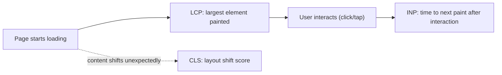
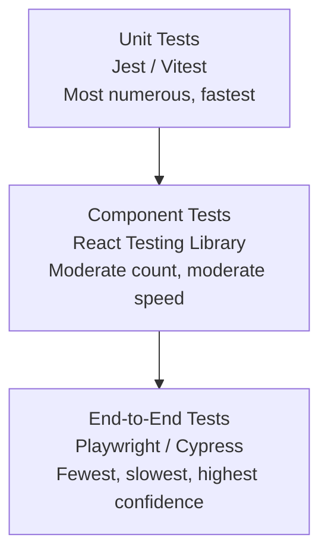

# Lecture 27: Performance Optimization and Testing in Next.js

A feature isn't done when it works on your machine — it's done when it loads fast for
real users, ranks well in search, and is protected against regressions by an automated
test suite. This lecture covers how to measure and optimize a Next.js application's
performance, make it discoverable via SEO, and test it at every level of the testing
pyramid.

## In This Lecture

- Understand Core Web Vitals (LCP, CLS, INP) and how they apply to Next.js
- Apply code splitting, dynamic imports, lazy loading, and bundle analysis; optimize
  images, fonts, and assets with `next/image` and `next/font`
- Implement SEO in Next.js: metadata, `sitemap.xml`, `robots.txt`, structured data, and
  Open Graph tags
- Write unit, component, and end-to-end tests with Jest/Vitest, React Testing Library,
  and Playwright/Cypress

## Core Web Vitals

**Core Web Vitals** are the specific, user-centric metrics Google uses to measure real
page experience, and they factor directly into search ranking. Three matter most today:

| Metric | Measures | Good threshold |
|---|---|---|
| **LCP** (Largest Contentful Paint) | Time until the largest visible element (usually a hero image or heading) has rendered | ≤ 2.5s |
| **CLS** (Cumulative Layout Shift) | How much visible content unexpectedly shifts position while loading | ≤ 0.1 |
| **INP** (Interaction to Next Paint) | How long the page takes to visibly respond after a user interaction (click, tap, keypress) | ≤ 200ms |



Next.js gives you two levers here: the framework's own defaults (automatic code
splitting, image/font optimization, streaming) push these metrics in the right direction
out of the box, but architectural choices you make — what's a Server vs. Client
Component, how images are sized, what's lazy-loaded — determine whether you actually
realize that potential.

!!! tip "Measure before you optimize"
    Use Chrome DevTools' Lighthouse panel, the PageSpeed Insights website, or the
    `web-vitals` npm package (which can report real-user metrics, not just lab data)
    before assuming where your bottleneck is. LCP problems are usually caused by a slow
    server response or an unoptimized hero image; CLS problems are almost always missing
    width/height on media or late-loading web fonts; INP problems are usually expensive
    synchronous JavaScript blocking the main thread on interaction.

```tsx
// Reporting real-user Core Web Vitals from the App Router
// app/layout.tsx
"use client";
import { useReportWebVitals } from "next/web-vitals";

export function WebVitalsReporter() {
  useReportWebVitals((metric) => {
    console.log(metric.name, metric.value); // send to your analytics endpoint instead
  });
  return null;
}
```

## Code Splitting, Dynamic Imports, and Lazy Loading

Next.js automatically splits your application into per-route JavaScript bundles — a user
visiting `/dashboard` doesn't download the code for `/settings`. You extend this further
with **dynamic imports**, which split out an individual component into its own chunk,
loaded only when it's actually needed:

```tsx
import dynamic from "next/dynamic";

// This heavy chart library is only downloaded once the component actually renders,
// keeping it out of the initial page bundle entirely.
const RevenueChart = dynamic(() => import("@/components/revenue-chart"), {
  loading: () => <p>Loading chart…</p>,
  ssr: false, // skip server rendering for client-only libraries (e.g. that read `window`)
});

export default function DashboardPage() {
  return (
    <div>
      <h1>Dashboard</h1>
      <RevenueChart />
    </div>
  );
}
```

Good candidates for dynamic imports: modals and dialogs not visible on initial load,
rich text editors, charting libraries, and anything gated behind user interaction (a
"Show advanced settings" toggle, for example).

**Bundle analysis** tells you exactly what's inflating your JavaScript payload:

```bash
npm install -D @next/bundle-analyzer
```

```javascript
// next.config.js
const withBundleAnalyzer = require("@next/bundle-analyzer")({
  enabled: process.env.ANALYZE === "true",
});

module.exports = withBundleAnalyzer({ /* your config */ });
```

```bash
ANALYZE=true npm run build
```

This generates an interactive treemap of every package in your bundle, which usually
reveals a handful of oversized dependencies (a full date library imported for one
function, an icon library imported in full rather than per-icon) that are easy wins once
visible.

## Image, Font, and Asset Optimization

`next/image` handles the single biggest lever for LCP and CLS at once: it serves
appropriately-sized, modern-format (WebP/AVIF) images, lazy-loads offscreen images by
default, and — critically — reserves layout space using the `width`/`height` you
provide, which is what prevents layout shift as the image loads.

```tsx
import Image from "next/image";

export function Hero() {
  return (
    <Image
      src="/hero.jpg"
      alt="Team collaborating around a laptop"
      width={1200}
      height={600}
      priority // marks this as the LCP candidate: loads eagerly, skips lazy-loading
    />
  );
}
```

!!! note "`priority` vs. default lazy loading"
    Every `<Image>` lazy-loads by default — great for offscreen images, harmful for the
    one image that *is* your LCP element (a hero image above the fold), since lazy
    loading would delay it unnecessarily. Mark exactly that one image `priority` so it
    loads immediately; leave everything else lazy.

`next/font` solves a related CLS problem: web fonts that load after the page has already
rendered text in a fallback font cause a visible "flash" and reflow. `next/font`
self-hosts the font files at build time (no external request to Google Fonts at
runtime) and generates a matched fallback metric, eliminating that shift:

```tsx
// app/layout.tsx
import { Inter } from "next/font/google";

const inter = Inter({ subsets: ["latin"], display: "swap" });

export default function RootLayout({ children }: { children: React.ReactNode }) {
  return (
    <html lang="en" className={inter.className}>
      <body>{children}</body>
    </html>
  );
}
```

Other asset wins: serve static assets from `public/` (or a CDN) with long cache
lifetimes, compress and lazy-load below-the-fold video, and prefer SVG for icons over
icon-font libraries that ship hundreds of unused glyphs.

## SEO in Next.js

Next.js's App Router has a first-class **Metadata API** for everything a search engine
or social platform reads from a page.

```tsx
// app/blog/[slug]/page.tsx
import type { Metadata } from "next";

export async function generateMetadata({ params }: { params: { slug: string } }): Promise<Metadata> {
  const post = await getPost(params.slug);

  return {
    title: `${post.title} | My Blog`,
    description: post.excerpt,
    openGraph: {
      title: post.title,
      description: post.excerpt,
      images: [{ url: post.coverImage, width: 1200, height: 630 }],
      type: "article",
    },
    twitter: {
      card: "summary_large_image",
      title: post.title,
      description: post.excerpt,
    },
  };
}

export default async function BlogPostPage({ params }: { params: { slug: string } }) {
  const post = await getPost(params.slug);
  return <article><h1>{post.title}</h1>{/* ... */}</article>;
}
```

**Open Graph** tags (`openGraph`, `twitter`) control how a link looks when shared on
social platforms and chat apps — the preview card image, title, and description.

Next.js also generates `sitemap.xml` and `robots.txt` from plain code files, no XML
hand-editing required:

```tsx
// app/sitemap.ts
import type { MetadataRoute } from "next";

export default async function sitemap(): Promise<MetadataRoute.Sitemap> {
  const posts = await getAllPosts();

  return [
    { url: "https://example.com", lastModified: new Date(), priority: 1 },
    ...posts.map((post) => ({
      url: `https://example.com/blog/${post.slug}`,
      lastModified: post.updatedAt,
      priority: 0.7,
    })),
  ];
}
```

```tsx
// app/robots.ts
import type { MetadataRoute } from "next";

export default function robots(): MetadataRoute.Robots {
  return {
    rules: { userAgent: "*", allow: "/", disallow: "/admin" },
    sitemap: "https://example.com/sitemap.xml",
  };
}
```

**Structured data** (JSON-LD) helps search engines understand page content well enough
to render rich results (star ratings, recipe times, event dates):

```tsx
export default async function BlogPostPage({ params }: { params: { slug: string } }) {
  const post = await getPost(params.slug);
  const jsonLd = {
    "@context": "https://schema.org",
    "@type": "BlogPosting",
    headline: post.title,
    datePublished: post.publishedAt,
    author: { "@type": "Person", name: post.author },
  };

  return (
    <>
      <script type="application/ld+json" dangerouslySetInnerHTML={{ __html: JSON.stringify(jsonLd) }} />
      <article><h1>{post.title}</h1></article>
    </>
  );
}
```

!!! note "This is one of the few safe uses of `dangerouslySetInnerHTML`"
    You control the `jsonLd` object entirely (it's built from your own database fields,
    not raw user input rendered as HTML), so there's no injection risk here — unlike
    rendering unsanitized user content, covered in Lecture 26.

## The Testing Pyramid

Different kinds of tests catch different kinds of bugs, at very different costs to run
and maintain. The **testing pyramid** describes the recommended balance: many fast, cheap
unit tests at the base; fewer, slower end-to-end tests at the top.



### Unit Testing with Jest / Vitest

**Unit tests** verify a single function or module in isolation — pure logic with no
rendering and no network. **Vitest** is a common modern choice for Next.js projects
(fast, Jest-compatible API); Jest remains widely used and fully supported.

```bash
npm install -D vitest
```

```javascript
// lib/format-price.ts
export function formatPrice(cents: number): string {
  return `$${(cents / 100).toFixed(2)}`;
}
```

```javascript
// lib/format-price.test.ts
import { describe, it, expect } from "vitest";
import { formatPrice } from "./format-price";

describe("formatPrice", () => {
  it("formats whole dollar amounts", () => {
    expect(formatPrice(2000)).toBe("$20.00");
  });

  it("formats amounts with cents", () => {
    expect(formatPrice(1999)).toBe("$19.99");
  });
});
```

### Component Testing with React Testing Library

**Component tests** render a component in a simulated DOM and interact with it the way a
user would — clicking buttons, typing into inputs — asserting on what's visible rather
than on internal implementation details.

```bash
npm install -D @testing-library/react @testing-library/user-event jsdom
```

```tsx
// components/like-button.test.tsx
import { render, screen } from "@testing-library/react";
import userEvent from "@testing-library/user-event";
import { describe, it, expect, vi } from "vitest";
import { LikeButton } from "./like-button";

describe("LikeButton", () => {
  it("calls onLike when clicked", async () => {
    const onLike = vi.fn();
    render(<LikeButton onLike={onLike} />);

    await userEvent.click(screen.getByRole("button", { name: /like/i }));

    expect(onLike).toHaveBeenCalledTimes(1);
  });
});
```

!!! tip "Query by role and accessible name, not by CSS class"
    `screen.getByRole("button", { name: /like/i })` finds elements the way assistive
    technology and real users do — by their semantic role and visible label — rather
    than by an implementation detail like a class name. Tests written this way survive
    styling changes and double as a check that your UI is actually accessible.

### End-to-End Testing with Playwright / Cypress

**End-to-end (E2E) tests** drive a real browser against your actual running application
(or a deployed preview), exercising complete user flows across multiple pages — the
closest thing to verifying "does this work the way a real user experiences it."

```bash
npm init playwright@latest
```

```typescript
// e2e/login.spec.ts
import { test, expect } from "@playwright/test";

test("user can log in and see the dashboard", async ({ page }) => {
  await page.goto("/login");
  await page.getByLabel("Email").fill("test@example.com");
  await page.getByLabel("Password").fill("correct-password");
  await page.getByRole("button", { name: "Sign in" }).click();

  await expect(page).toHaveURL("/dashboard");
  await expect(page.getByText("Welcome, test@example.com")).toBeVisible();
});
```

Cypress offers a very similar API and developer experience; Playwright has an edge in
multi-browser support (Chromium, Firefox, WebKit) and built-in parallelization, which is
why it's the more common default for new projects today.

!!! warning "E2E tests are valuable but expensive"
    A full E2E suite is slow to run (real browsers, real network) and can be flaky if
    written carelessly (relying on fixed `sleep` delays instead of Playwright's built-in
    auto-waiting). Reserve E2E tests for your critical user journeys — signup, checkout,
    login — and push everything else down the pyramid into component and unit tests,
    which run in seconds and fail with a much more precise error.

## Try It Yourself

1. Run Lighthouse (Chrome DevTools → Lighthouse tab) against a page in a Next.js project
   you're building. Identify which Core Web Vital scores worst, then fix it using one
   technique from this lecture (add `priority` to the LCP image, dynamic-import a heavy
   component, or reserve space for an ad/embed to cut CLS) and re-run Lighthouse to
   confirm the improvement.
2. For a single component (e.g., a search input with results), write one Vitest unit
   test for its underlying filter/format logic, one React Testing Library test that
   types into the input and asserts the filtered results render, and one Playwright test
   that performs the same search against the real running app.

## Key Takeaways

- **Core Web Vitals** — LCP (load speed), CLS (visual stability), INP (interaction
  responsiveness) — are the concrete, ranking-relevant metrics of real page experience.
- **Dynamic imports** (`next/dynamic`) split heavy, non-critical components out of the
  initial bundle; **bundle analysis** reveals which dependencies are worth splitting.
- **`next/image`** and **`next/font`** directly target LCP and CLS by serving
  right-sized images with reserved layout space and self-hosting fonts to prevent
  reflow.
- The **Metadata API**, `sitemap.ts`, `robots.ts`, Open Graph tags, and JSON-LD
  structured data together make a Next.js app fully discoverable and shareable.
- The **testing pyramid** favors many fast unit tests, a moderate number of component
  tests, and a small set of high-value end-to-end tests.
- **Jest/Vitest** test isolated logic; **React Testing Library** tests components the
  way a user interacts with them (by role, not implementation detail); **Playwright/
  Cypress** test complete flows in a real browser.
- Measure before optimizing, and reserve expensive E2E tests for your most critical user
  journeys rather than every possible interaction.
