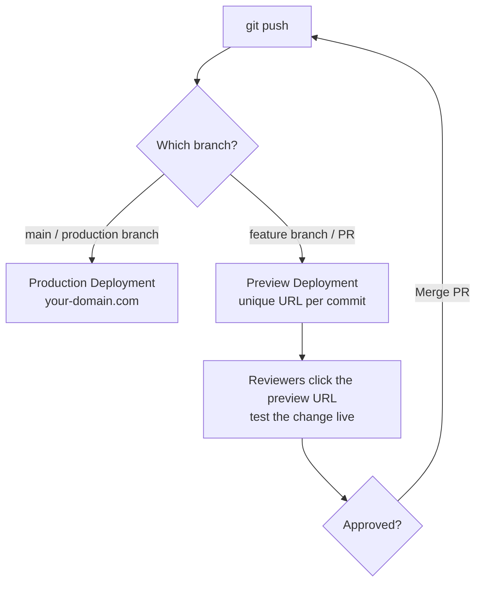
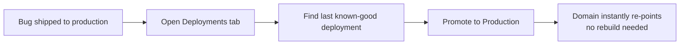

# Lecture 28: Deploying the Product on Vercel

Building an application is only half the job — it has to actually reach users, reliably,
behind a fast CDN, with a safe path for shipping every future change. This lecture covers
what a production Next.js build actually produces, how Vercel (the platform built by the
creators of Next.js) turns a Git push into a live deployment, and the operational
concerns — environment variables, custom domains, rollbacks — you're responsible for once
the app is live.

## In This Lecture

- Understand the Next.js build process, production output, and self-hosting vs. managed
  hosting
- Get productive with Vercel: projects, Git integration, preview deployments, and
  production deployments
- Configure environment variables, secrets, and build settings on Vercel
- Understand serverless and edge functions/middleware, custom domains, HTTPS, CDN/caching
  behavior, analytics, and CI/CD rollbacks

## The Next.js Build Process

Running `next build` compiles your entire application — every route, Server Component,
Client Component bundle, and API route — into an optimized production artifact stored in
`.next/`.

```bash
npm run build
# ▲ Next.js 15.x
# Route (app)                              Size     First Load JS
# ┌ ○ /                                     5.2 kB          92 kB
# ├ ● /blog/[slug]                          3.1 kB          89 kB
# ├ λ /api/posts                            0 B                0
# └ ƒ /dashboard                            8.4 kB         101 kB
#
# ○  (Static)   prerendered as static content
# ●  (SSG)      prerendered at build time, per-path
# ƒ  (Dynamic)  server-rendered on demand
# λ  (Serverless/Edge) rendered as a function
```

This build report tells you exactly how each route will be served in production —
information you should read on every build, since a route you expected to be static
(`○`) showing up as dynamic (`ƒ`) usually means something in it (a cookie read, an
uncached fetch) opted it out of static rendering unintentionally.

`next build` produces:

- **Static HTML/assets** for routes that can be fully pre-rendered — served straight
  from a CDN with no server compute per request.
- **Serverless/Edge function bundles** for dynamic routes, API Route Handlers, and
  Server Actions — code that runs per-request.
- An optimized, code-split **client JavaScript bundle**, with framework code and route
  code separated so browsers cache the framework chunk across deploys.

### Self-Hosting vs. Managed Hosting

You can take that `.next/` output and run it yourself with `next start` on any server
that runs Node.js (a VM, a container on AWS/GCP/Azure, your own hardware) — Next.js is
just a Node.js application. This is **self-hosting**.

```bash
next build
next start -p 3000
```

The alternative is **managed hosting** — a platform like Vercel that takes your source
code (not just the build output) and handles building, deploying, scaling, and serving it
for you.

| Factor | Self-Hosting | Managed Hosting (Vercel) |
|---|---|---|
| **Infrastructure setup** | You provision and maintain servers, load balancers, CDN | None — handled by the platform |
| **Scaling** | You configure auto-scaling yourself | Automatic, per-request, including serverless scale-to-zero |
| **Preview environments** | You build this yourself (or don't have it) | Automatic for every branch/PR |
| **Global CDN / edge network** | You configure it (e.g., CloudFront) | Built in |
| **Cost model** | Pay for provisioned capacity (often idle) | Pay-per-use, generous free tier for small projects |
| **Control** | Full control over the runtime environment | Constrained to the platform's supported runtime |

!!! note "Vercel isn't the only managed option"
    Netlify, AWS Amplify, and Cloudflare Pages all support Next.js to varying degrees of
    completeness. Vercel is built by the same team that builds Next.js and typically has
    same-day support for new framework features, which is why it's the default choice
    for this course — but the underlying build output (`.next/`) and concepts transfer.

## Introduction to Vercel

Vercel organizes work around **projects**: one Git repository connected to one Vercel
project, which then deploys automatically on every push.

### Connecting a Project

1. Push your Next.js app to a GitHub (or GitLab/Bitbucket) repository.
2. On [vercel.com](https://vercel.com), choose **Add New → Project** and import that
   repository.
3. Vercel detects it's a Next.js app automatically and pre-fills the build command
   (`next build`), output directory, and install command — usually nothing to change.
4. Click **Deploy**. Your first production deployment builds and goes live at a
   `your-project.vercel.app` URL.

### Git Integration: Preview and Production Deployments

Once connected, every push triggers a deployment automatically, and *which kind* of
deployment depends on the branch:



A **preview deployment** is a fully working, isolated deployment of that exact commit,
at its own unique URL — not a mockup, a real running instance of your app, including its
own serverless functions. This is what makes it possible for a reviewer, designer, or
product manager to click a link in a pull request and interact with the actual feature
before it merges, with zero setup on their end.

A **production deployment** happens automatically whenever you push to (or merge into)
your configured production branch (`main` by default) and is served from your custom
domain.

!!! tip "Every commit gets a permanent URL"
    Preview deployment URLs aren't overwritten by the next push — every commit gets its
    own immutable URL you can revisit later, which is invaluable for tracking down
    exactly when a visual regression was introduced.

## Environment Variables, Secrets, and Build Settings

Vercel's dashboard (**Project → Settings → Environment Variables**) lets you define
variables scoped to specific environments, matching the `NEXT_PUBLIC_` distinction from
Lecture 26:

| Environment | When it applies |
|---|---|
| **Production** | Deployments from your production branch |
| **Preview** | Deployments from all other branches/PRs |
| **Development** | Pulled locally via `vercel env pull` for `next dev` |

```bash
# .env.local (pulled from Vercel, never committed)
DATABASE_URL=postgres://...
AUTH_SECRET=...
NEXT_PUBLIC_APP_NAME=MyApp
```

Server-only secrets (`DATABASE_URL`, `AUTH_SECRET`) should typically be set for
Production only (and a *separate* database/secret for Preview, so pull requests never
touch production data). `NEXT_PUBLIC_*` variables get baked into the client bundle at
**build time**, so changing one requires a new deployment to take effect — it isn't
read at runtime the way server-only variables are.

!!! warning "Preview deployments should not point at production data"
    Because every branch and pull request gets a live, public preview URL, a Preview
    environment configured with your production database connection string means every
    contributor — and anyone who finds the preview link — can read or write production
    data through an unreviewed, in-progress feature. Use separate staging credentials for
    the Preview environment.

Build settings (framework preset, build command, output directory, install command,
Node.js version) live in the same **Settings** panel and are auto-detected for Next.js,
but can be overridden — for example, in a monorepo where the app lives in a subdirectory.

## Serverless and Edge Functions, Middleware

Vercel runs your dynamic Next.js code (API routes, Server Actions, dynamic pages) as
**serverless functions** by default — the same Functions-as-a-Service model from Lecture
1: each request spins up (or reuses a warm) isolated instance, scales automatically,
including to zero.

Next.js also supports the **Edge Runtime**, a lighter-weight execution environment that
runs even closer to the user, across a globally-distributed network of edge locations,
with a smaller API surface (no native Node.js APIs like `fs`) but near-instant cold
starts.

```tsx
// Opting a Route Handler into the Edge Runtime
export const runtime = "edge";

export async function GET() {
  return new Response(JSON.stringify({ region: process.env.VERCEL_REGION }), {
    headers: { "Content-Type": "application/json" },
  });
}
```

`middleware.ts` (from Lecture 26) always runs on the Edge Runtime by nature — it has to
execute before routing decisions are made, at the network edge, for every matching
request, which is why it's restricted to lightweight logic (auth redirects, header
rewrites, A/B test bucketing) rather than heavy computation or database access.

| | Serverless Functions | Edge Functions / Middleware |
|---|---|---|
| **Runtime** | Full Node.js | Lightweight Edge Runtime (Web APIs) |
| **Cold start** | Noticeable | Near-instant |
| **Location** | Single region (configurable) | Distributed globally, close to the user |
| **Use for** | Database access, heavy compute, most API routes | Auth checks, redirects, header manipulation, geolocation-based logic |

## Custom Domains, HTTPS, and CDN/Caching Behavior

Adding a **custom domain** (**Project → Settings → Domains**) requires pointing your
domain's DNS at Vercel (either an `A`/`ALIAS` record to Vercel's IP, or a `CNAME` for a
subdomain). Vercel then automatically provisions and renews a free **HTTPS** certificate
via Let's Encrypt — there's no manual certificate management.

All static assets and pre-rendered pages are served through Vercel's global **CDN**:
cached at edge locations near each visitor, so a user in Singapore and a user in Toronto
both get a fast, geographically-local response for the same static page. Dynamic
responses (serverless-rendered pages, API routes) can still opt into caching using
standard HTTP caching headers or Next.js's own `revalidate` options:

```tsx
// Revalidate this page's cached output at most once every 60 seconds (ISR)
export const revalidate = 60;

export default async function ProductsPage() {
  const products = await getProducts();
  return <ProductGrid products={products} />;
}
```

## Analytics and CI/CD Rollbacks

Vercel's built-in **Web Analytics** and **Speed Insights** (opt-in add-ons) report real
visitor traffic and real-user Core Web Vitals (Lecture 27) directly in the dashboard, with
no extra script tags required beyond enabling them for the project.

```bash
npm install @vercel/analytics @vercel/speed-insights
```

```tsx
// app/layout.tsx
import { Analytics } from "@vercel/analytics/react";
import { SpeedInsights } from "@vercel/speed-insights/next";

export default function RootLayout({ children }: { children: React.ReactNode }) {
  return (
    <html lang="en">
      <body>
        {children}
        <Analytics />
        <SpeedInsights />
      </body>
    </html>
  );
}
```

Because every deployment (production and preview) is kept and given its own immutable
URL, **rollback** is a first-class, one-click operation: on the **Deployments** tab,
select any previous production deployment and choose **Promote to Production** — Vercel
re-points your domain to that exact prior build instantly, with no rebuild required,
which is what makes it fast enough to use as a genuine incident-response tool.



!!! tip "Rollback buys you time, not a fix"
    Promoting an old deployment stops the bleeding immediately, but the bug still exists
    in your source code. Treat a rollback as step one — fix the issue, deploy forward
    through the normal preview → review → production flow, and only then consider the
    incident closed.

## Try It Yourself

1. Push a small Next.js app to GitHub, connect it to a new Vercel project, and open the
   resulting production URL. Then create a feature branch with a visible change, push
   it, and open the automatically-generated preview deployment URL — confirm it's a
   fully working, separate instance of the app.
2. Add one server-only environment variable and one `NEXT_PUBLIC_` variable in Vercel's
   dashboard, scoped only to Production. Deploy, then intentionally deploy a broken
   change to production and practice rolling back to the previous deployment from the
   **Deployments** tab.

## Key Takeaways

- `next build` produces static assets, serverless/edge function bundles, and an
  optimized client bundle — the build report shows exactly how each route will be
  served.
- **Self-hosting** (`next start` on your own infrastructure) gives full control at the
  cost of building your own scaling, CDN, and preview infrastructure; **managed hosting**
  (Vercel) provides these automatically.
- Vercel ties one Git repository to one **project**; pushes to feature branches create
  isolated **preview deployments**, and pushes to the production branch create
  **production deployments**.
- Scope environment variables by environment (Production/Preview/Development), and never
  point Preview at production secrets or databases.
- **Serverless functions** run full Node.js per-region; **Edge functions and
  middleware** run a lighter runtime distributed globally, with near-instant cold starts.
- Vercel provisions **HTTPS** automatically and serves static/cached content through a
  global **CDN**, with `revalidate`/ISR controlling how fresh dynamic content stays.
- Every deployment is immutable and one click away from being promoted, making
  **rollback** fast — but a rollback is a stopgap, not a fix.
