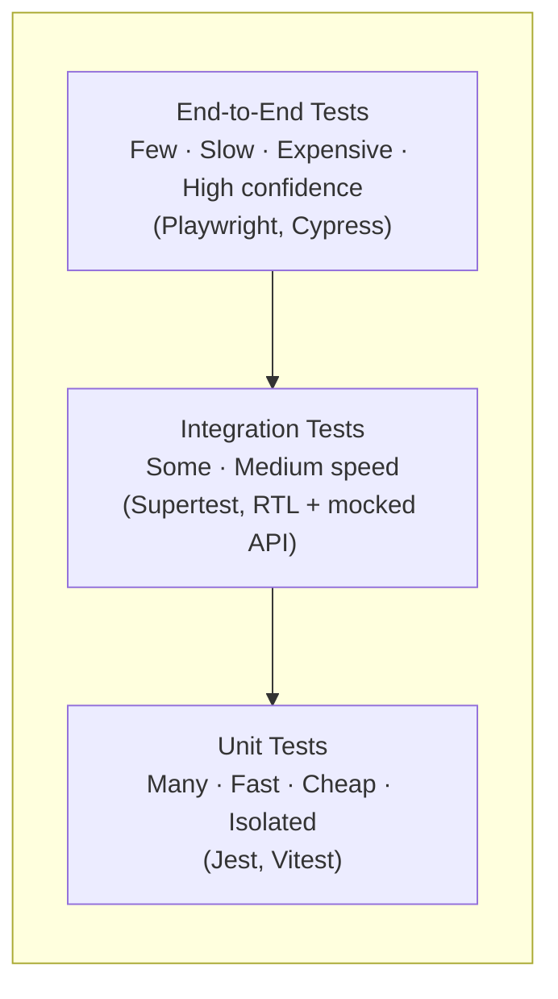
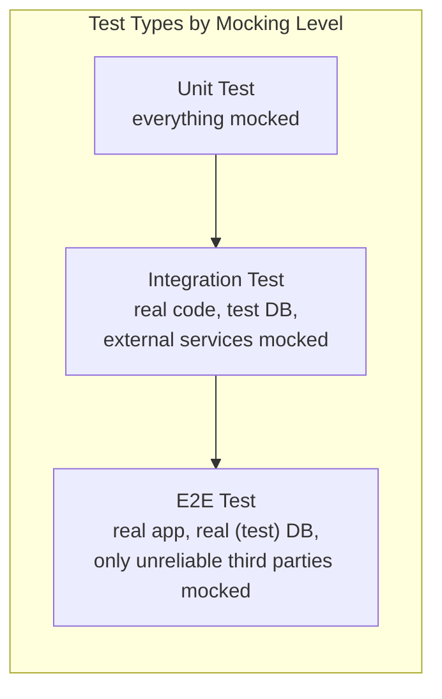

# Lecture 29: Web Application and API Testing

You've spent this course building systems that are architecturally sound, secure,
performant, and deployable. None of that matters if you can't prove — cheaply, repeatedly,
and automatically — that the system still works after every change. This lecture covers
how professional teams structure and automate that proof.

## In This Lecture

- Understand the testing pyramid and why teams write many more unit tests than end-to-end
  tests
- Write unit and integration tests with Jest/Vitest, React Testing Library, and Supertest
- Test APIs thoroughly: success paths, validation errors, authentication, and edge cases —
  and document them with Postman collections and Swagger UI
- Write end-to-end tests with Playwright/Cypress, use mocking effectively, and wire tests
  into a CI pipeline with coverage reporting

## The Testing Pyramid

Not all tests are equal in cost, speed, or the confidence they provide. The **testing
pyramid** is a mental model for how many tests of each kind a healthy codebase should
have.



- **Unit tests** exercise a single function, class, or component in isolation, with every
  external dependency (a database, an API call, another module) faked or removed. They run
  in milliseconds, so you can have thousands of them and run them on every keystroke.
- **Integration tests** exercise several units together — for example, an Express route
  handler talking to a real (in-memory or test) database, or a React component that fetches
  data from a mocked API. They catch bugs that only appear at the seams between modules.
- **End-to-end (E2E) tests** drive a real browser against a running application (frontend
  and backend together, often with a real or realistic database) the way a user would:
  clicking, typing, and asserting on what appears on screen. They give you the highest
  confidence that the *whole system* works, but they are slow, comparatively fragile
  (a CSS change can break a selector), and expensive to run and maintain.

The pyramid shape is a recommendation, not a law: write **many** unit tests, a **moderate**
number of integration tests, and only as **many E2E tests as you need** to cover critical
user journeys (sign-up, checkout, login) end to end.

!!! warning "The inverted pyramid (the ice cream cone)"
    Teams that rely mostly on E2E tests and skip unit tests end up with a slow,
    flaky test suite that takes twenty minutes to tell you a single function has a typo.
    This anti-pattern is sometimes called the "ice cream cone." If your CI pipeline takes
    longer to run than your coffee break, check whether your test suite has this shape.

## Unit and Integration Testing Tools

### Jest and Vitest

**Jest** is the long-standing standard test runner and assertion library for JavaScript;
**Vitest** is a newer runner built for Vite-based projects that is largely
API-compatible with Jest but faster in that ecosystem. Both provide a test runner, an
assertion library (`expect`), mocking utilities, and code coverage out of the box.

```javascript
// discountPolicy.js
function applyDiscount(price, code) {
  if (code === "STUDENT10") return price * 0.9;
  if (price < 0) throw new Error("Price cannot be negative");
  return price;
}
module.exports = { applyDiscount };
```

```javascript
// discountPolicy.test.js
const { applyDiscount } = require("./discountPolicy");

describe("applyDiscount", () => {
  test("applies a 10% discount for STUDENT10", () => {
    expect(applyDiscount(100, "STUDENT10")).toBe(90);
  });

  test("returns the original price when no code matches", () => {
    expect(applyDiscount(100, "INVALID")).toBe(100);
  });

  test("throws on a negative price", () => {
    expect(() => applyDiscount(-5, "")).toThrow("Price cannot be negative");
  });
});
```

Each `test` (or `it`) block should assert one behavior. `describe` groups related tests
and gives readable output when a suite runs. A **mock** replaces a real dependency (a
database call, an email service, `Date.now()`) with a fake, controllable stand-in, so a
unit test can isolate the one thing it's actually testing:

```javascript
jest.mock("../services/emailService");
const emailService = require("../services/emailService");

test("sends a welcome email after registration", async () => {
  emailService.send.mockResolvedValue(true);
  await registerUser({ email: "a@b.com", password: "secret123" });
  expect(emailService.send).toHaveBeenCalledWith(
    expect.objectContaining({ to: "a@b.com" })
  );
});
```

### React Testing Library

**React Testing Library (RTL)** tests components the way a user experiences them —
by querying rendered text, roles, and labels, rather than a component's internal state or
implementation details. This makes tests resilient to refactors that don't change user-
visible behavior.

```javascript
// LoginForm.test.jsx
import { render, screen, fireEvent, waitFor } from "@testing-library/react";
import LoginForm from "./LoginForm";

test("shows a validation error when the email field is empty", async () => {
  render(<LoginForm onSubmit={jest.fn()} />);

  fireEvent.click(screen.getByRole("button", { name: /log in/i }));

  await waitFor(() => {
    expect(screen.getByText(/email is required/i)).toBeInTheDocument();
  });
});

test("calls onSubmit with form values on valid submission", async () => {
  const handleSubmit = jest.fn();
  render(<LoginForm onSubmit={handleSubmit} />);

  fireEvent.change(screen.getByLabelText(/email/i), {
    target: { value: "user@example.com" },
  });
  fireEvent.change(screen.getByLabelText(/password/i), {
    target: { value: "hunter2" },
  });
  fireEvent.click(screen.getByRole("button", { name: /log in/i }));

  await waitFor(() =>
    expect(handleSubmit).toHaveBeenCalledWith({
      email: "user@example.com",
      password: "hunter2",
    })
  );
});
```

!!! tip "Query by what the user sees"
    Prefer `getByRole`, `getByLabelText`, and `getByText` over `getByTestId` or querying
    CSS classes. A test that queries by accessible role also indirectly checks that your
    UI is accessible — a nice side benefit.

### Supertest for API Integration Tests

**Supertest** lets you send real HTTP requests against your Express (or any Node HTTP)
application in a test, without needing a separately running server, and assert on the
response.

```javascript
// user.routes.test.js
const request = require("supertest");
const app = require("../app");
const { connectTestDB, clearTestDB, closeTestDB } = require("../test-utils/db");

beforeAll(async () => connectTestDB());
afterEach(async () => clearTestDB());
afterAll(async () => closeTestDB());

describe("POST /api/users", () => {
  test("creates a user and returns 201 with a sanitized body", async () => {
    const res = await request(app)
      .post("/api/users")
      .send({ email: "new@user.com", password: "SecurePass123!" });

    expect(res.status).toBe(201);
    expect(res.body).toMatchObject({ email: "new@user.com" });
    expect(res.body.password).toBeUndefined(); // never leak password hashes
  });

  test("returns 400 when the email is invalid", async () => {
    const res = await request(app)
      .post("/api/users")
      .send({ email: "not-an-email", password: "SecurePass123!" });

    expect(res.status).toBe(400);
    expect(res.body.errors).toEqual(
      expect.arrayContaining([expect.objectContaining({ field: "email" })])
    );
  });
});
```

Integration tests like this typically run against an in-memory or containerized test
database (e.g., `mongodb-memory-server` or a disposable Docker Postgres instance) so tests
are fast, isolated, and don't touch production or shared development data.

## API Testing: Success, Validation, Auth, and Edge Cases

A thorough API test suite deliberately covers more than the happy path. For every
endpoint, work through this checklist:

| Category | What to test | Example |
|---|---|---|
| **Success path** | Correct input produces the correct status code, body shape, and side effects | `POST /orders` with valid items returns `201` and creates a DB row |
| **Validation errors** | Missing/malformed fields, wrong types, out-of-range values | Missing `email` returns `400` with a field-level error |
| **Authentication** | Requests without a valid token are rejected; expired/tampered tokens are rejected | `GET /api/profile` with no `Authorization` header returns `401` |
| **Authorization** | An authenticated user cannot act outside their own permissions | User A cannot `DELETE` User B's order → `403` |
| **Edge cases** | Empty collections, pagination boundaries, duplicate submissions, very large payloads, concurrent requests | `GET /orders?page=999` returns an empty array, not an error |
| **Idempotency & side effects** | Repeating a request doesn't double-charge or double-create | Submitting the same order twice with the same idempotency key creates it once |

!!! note "Validation errors are not exceptions"
    A malformed request is an *expected* input, not a bug — your API should return a
    clean `400`/`422` with a machine-readable error body, never a `500` with a stack
    trace. Testing that your validation layer degrades gracefully is just as important as
    testing the success path.

### Postman Collections and Swagger UI

Automated tests answer "does the API behave correctly," but two complementary tools help
humans (and other teams) explore and verify an API manually:

- A **Postman collection** is a saved, shareable set of HTTP requests (with pre-configured
  headers, auth tokens, and example bodies) for an API, organized into folders that mirror
  your resources. Teams check collections into version control alongside the API so anyone
  can import them and immediately have working example requests, and Postman can also run
  a collection headlessly (via `newman`) as part of CI as a lightweight extra check.
- **Swagger UI** renders an **OpenAPI specification** (a YAML/JSON document describing every
  endpoint, parameter, request body, and response schema) as an interactive web page where
  you can browse endpoints and send live test requests from the browser. Because the
  OpenAPI spec is the same document that can drive client SDK generation and contract
  tests, keeping it accurate is valuable well beyond documentation.

```yaml
# openapi.yaml (excerpt)
paths:
  /api/users/{id}:
    get:
      summary: Get a user by ID
      parameters:
        - name: id
          in: path
          required: true
          schema:
            type: string
      responses:
        "200":
          description: User found
          content:
            application/json:
              schema:
                $ref: "#/components/schemas/User"
        "404":
          description: User not found
```

## End-to-End Testing with Playwright/Cypress

**Playwright** and **Cypress** are the two dominant E2E testing frameworks: both drive a
real browser (Chromium, Firefox, WebKit for Playwright) against your running application,
simulate real user interaction, and assert on the resulting UI.

```javascript
// checkout.spec.js (Playwright)
const { test, expect } = require("@playwright/test");

test("a logged-in user can complete checkout", async ({ page }) => {
  await page.goto("/login");
  await page.getByLabel("Email").fill("test@user.com");
  await page.getByLabel("Password").fill("hunter2");
  await page.getByRole("button", { name: "Log in" }).click();

  await page.goto("/cart");
  await page.getByRole("button", { name: "Checkout" }).click();

  await page.getByLabel("Card number").fill("4242424242424242");
  await page.getByRole("button", { name: "Pay now" }).click();

  await expect(page.getByText("Order confirmed")).toBeVisible();
});
```

E2E suites should focus on the handful of **critical user journeys** that, if broken,
would be a business emergency: sign-up, login, checkout, and the application's core
workflow. Trying to E2E-test every UI permutation is what pushes teams into the "ice cream
cone" anti-pattern.

### Mocking in E2E Tests

A full E2E test can talk to a real backend and a real test database — but often you want
to isolate the frontend under test from backend flakiness, or simulate a scenario that's
hard to trigger for real (a payment provider timing out, a `500` from a downstream
service). Both Playwright and Cypress can intercept network requests and return a
scripted response instead:

```javascript
// Intercept and mock a failing payment provider (Playwright)
await page.route("**/api/payments", (route) =>
  route.fulfill({
    status: 503,
    contentType: "application/json",
    body: JSON.stringify({ error: "Payment provider unavailable" }),
  })
);
await page.getByRole("button", { name: "Pay now" }).click();
await expect(page.getByText(/please try again/i)).toBeVisible();
```

This lets you write deterministic tests for error handling and edge cases without
depending on a third-party service actually being down when your test suite runs.



## Coverage and CI Integration

**Code coverage** measures what percentage of your code's lines, branches, and functions
were executed while your test suite ran. Jest and Vitest can generate a coverage report
directly:

```bash
npx jest --coverage
```

```text
--------------------|---------|----------|---------|---------|
File                | % Stmts | % Branch | % Funcs | % Lines |
--------------------|---------|----------|---------|---------|
All files           |   87.32 |    76.19 |   90.00 |   87.10 |
 discountPolicy.js  |     100 |      100 |     100 |     100 |
 user.controller.js |   78.94 |    62.50 |   83.33 |   78.57 |
--------------------|---------|----------|---------|---------|
```

!!! warning "Coverage is a signal, not a goal"
    A high coverage percentage tells you code *ran* during tests — it says nothing about
    whether the *assertions* were meaningful. It's easy to hit 100% coverage with tests
    that call every function but check nothing. Treat coverage as a tool for finding
    completely untested code, not as a target to game.

Running the full test suite manually before every commit doesn't scale to a team.
**Continuous integration (CI)** runs your test suite automatically on every push or pull
request, so a broken change is caught before it merges.

```yaml
# .github/workflows/test.yml
name: Test
on: [push, pull_request]

jobs:
  test:
    runs-on: ubuntu-latest
    steps:
      - uses: actions/checkout@v4
      - uses: actions/setup-node@v4
        with:
          node-version: 20
      - run: npm ci
      - run: npm run lint
      - run: npm test -- --coverage
      - run: npx playwright install --with-deps
      - run: npm run test:e2e
```

A typical pipeline runs fast unit/integration tests first and fails fast on lint or unit
errors before paying the cost of spinning up a browser for E2E tests — an application of
the testing pyramid to pipeline *ordering*, not just test *count*.

## Try It Yourself

1. Take a small utility function from a past project (or write one, e.g., a function that
   validates a password's strength). Write at least five Jest/Vitest unit tests covering
   the success path, an edge case, and an invalid-input case.
2. Using Supertest, write an integration test for one of your existing Express endpoints
   that asserts on: a successful request, a validation error, and an unauthenticated
   request. Then write a Playwright or Cypress test that mocks a failed API response and
   asserts your UI shows a sensible error message.

## Key Takeaways

- The **testing pyramid** favors many fast, isolated **unit tests**, a moderate number of
  **integration tests**, and few, high-value **end-to-end tests** covering critical user
  journeys.
- **Jest/Vitest** and **React Testing Library** test logic and components in isolation;
  **Supertest** tests Express routes with real HTTP requests against a test database.
- API tests should deliberately cover success paths, validation errors, authentication and
  authorization failures, and edge cases — not just the happy path.
- **Postman collections** and **Swagger UI** (backed by an OpenAPI spec) make an API
  explorable and testable by humans, complementing automated test suites.
- **Playwright/Cypress** drive a real browser for end-to-end tests and can **mock** network
  responses to test error handling deterministically.
- **Code coverage** highlights untested code but is not a proxy for test quality.
- **CI pipelines** should run cheap, fast tests first and fail fast, before paying the cost
  of a full browser-driven E2E suite.
