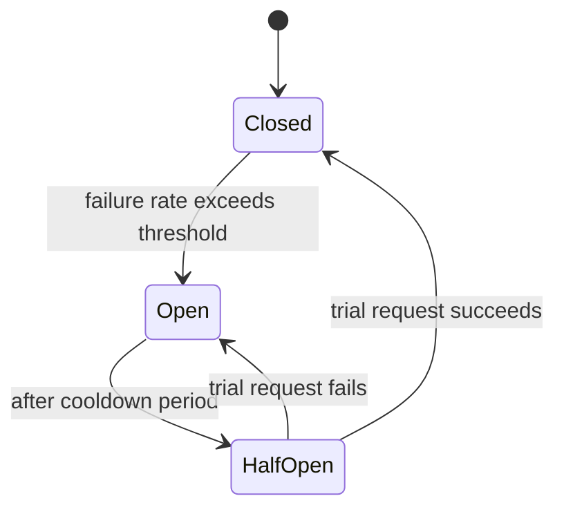
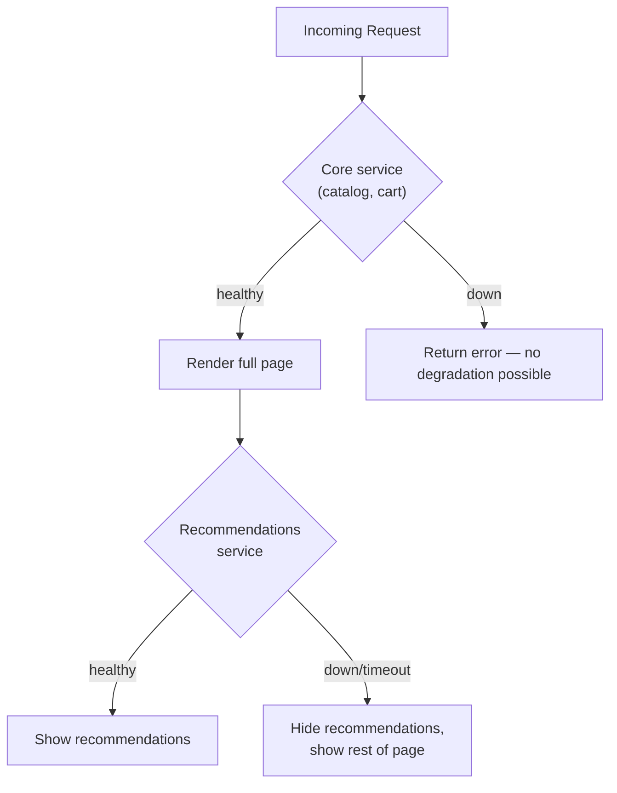
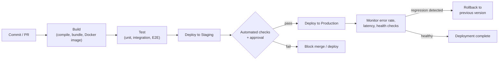
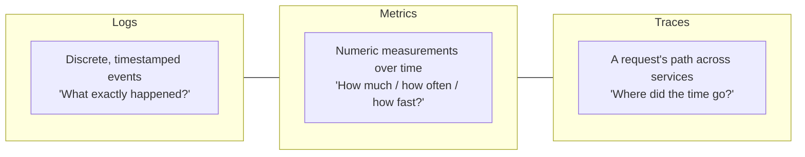
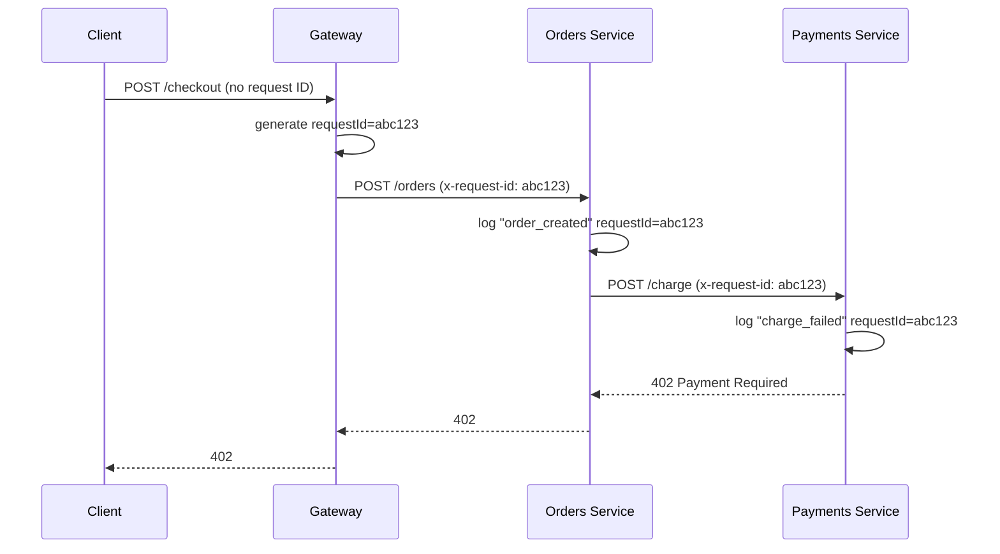
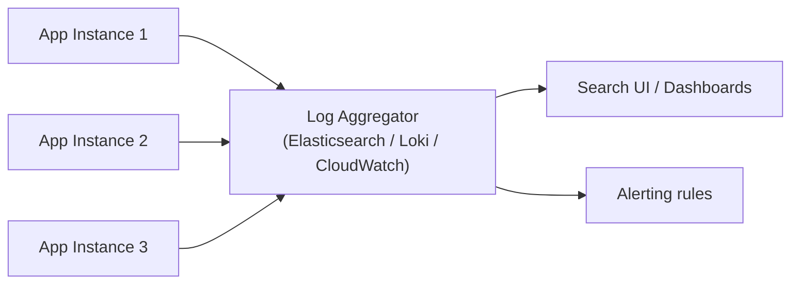

# Lecture 30: Reliability and Observability: Log Levels

Tests prove your application works before you ship it. This lecture is about everything
that keeps it working — and tells you *why* it broke — after it's live and real users
depend on it: reliability patterns, deployment pipelines, and the discipline of logging.

## In This Lecture

- Apply reliability practices: retries, circuit breakers, health checks, and graceful
  degradation
- Understand a CI/CD pipeline's stages and deployment strategies, including rollback
- Distinguish logs, metrics, and traces as complementary pillars of observability
- Use log levels (TRACE through FATAL) correctly and apply structured logging with
  correlation IDs
- Make sound decisions about log aggregation, retention, sensitive data, and signal vs.
  noise

## Reliability Practices

**Reliability** is the probability that a system keeps doing what it's supposed to do,
even when parts of it fail. Distributed systems fail constantly and in small ways — a
network blip, a slow downstream service, a database connection pool exhausted for a few
seconds — and reliable systems are built to absorb those failures rather than cascade
them into full outages.

### Retries

A **retry** re-attempts a failed operation, on the assumption that many failures (a
dropped connection, a momentary timeout) are transient and will succeed on a second try.

```javascript
async function fetchWithRetry(url, { retries = 3, baseDelayMs = 200 } = {}) {
  for (let attempt = 0; attempt <= retries; attempt++) {
    try {
      const res = await fetch(url);
      if (!res.ok) throw new Error(`HTTP ${res.status}`);
      return await res.json();
    } catch (err) {
      if (attempt === retries) throw err;
      const delay = baseDelayMs * 2 ** attempt; // exponential backoff
      await new Promise((r) => setTimeout(r, delay + Math.random() * 100));
    }
  }
}
```

!!! warning "Naive retries can make outages worse"
    If every client retries immediately and simultaneously after a failure, you create a
    **retry storm** that hammers an already-struggling service and prevents it from
    recovering. Always use **exponential backoff** (waiting longer between each retry) and
    **jitter** (a small random delay) to spread retries out, and only retry operations
    that are safe to repeat (**idempotent**) — never blindly retry "charge this credit
    card."

### Circuit Breakers

A **circuit breaker** wraps a call to a dependency and tracks its failure rate. If
failures cross a threshold, the breaker "trips" (opens) and *stops* calling the failing
dependency for a cooldown period, immediately failing fast (or falling back) instead —
protecting both the caller from wasting time on a call that likely won't succeed, and the
struggling dependency from added load while it recovers.



- **Closed** — requests pass through normally; failures are counted.
- **Open** — requests fail immediately (or return a fallback) without calling the
  dependency at all.
- **Half-open** — after a cooldown, a small number of trial requests are let through; if
  they succeed, the breaker closes again, otherwise it reopens.

### Health Checks

A **health check** is an endpoint (commonly `GET /health` or `/healthz`) that reports
whether an application instance is able to serve traffic. Load balancers and orchestrators
(like Kubernetes) poll it to decide whether to route traffic to an instance, restart it, or
remove it from rotation.

```javascript
app.get("/health", async (req, res) => {
  const dbOk = await checkDatabaseConnection();
  const cacheOk = await checkRedisConnection();
  const healthy = dbOk && cacheOk;

  res.status(healthy ? 200 : 503).json({
    status: healthy ? "ok" : "degraded",
    checks: { database: dbOk, cache: cacheOk },
    uptimeSeconds: process.uptime(),
  });
});
```

!!! note "Liveness vs. readiness"
    Production systems often split this into two checks: a **liveness** check ("is the
    process alive at all, or should it be restarted?") and a **readiness** check ("is this
    instance ready to receive traffic right now?"). An instance can be alive but not ready
    — for example, still warming up a cache on startup.

### Graceful Degradation

**Graceful degradation** means that when a non-critical dependency fails, the system keeps
serving its *core* functionality with reduced features, rather than failing entirely. If a
recommendation service is down, an e-commerce site should still let users browse and check
out — just without the "Recommended for you" section — instead of returning a `500` for
the whole page.



## CI/CD Pipelines and Deployment Strategies

A **CI/CD pipeline** automates moving code from a commit to running in production: build,
test, and deploy, ideally with a fast, safe path back out if something goes wrong.



Several deployment strategies limit the *blast radius* of a bad release:

- **Rolling deployment** — instances are updated a few at a time, so the application
  never fully goes down, but old and new versions run simultaneously for a while.
- **Blue-green deployment** — a full second environment ("green") is deployed alongside
  the live one ("blue"); traffic is switched over atomically once green is verified
  healthy, making rollback as simple as switching traffic back.
- **Canary deployment** — the new version is rolled out to a small percentage of traffic
  first; if error rates and latency stay healthy, the rollout gradually increases to 100%.

**Rollback** — reverting to the last known-good version — should be fast, automatic where
possible (triggered by monitoring, covered in Lecture 31), and rehearsed. A deployment
strategy is only as good as how quickly you can undo it.

```yaml
# Simplified deploy stage with automatic rollback trigger
deploy:
  needs: [build, test]
  steps:
    - run: ./deploy.sh --strategy=canary --percent=10
    - run: ./watch-metrics.sh --duration=10m --max-error-rate=1%
    - run: ./deploy.sh --strategy=canary --percent=100
      if: success()
    - run: ./rollback.sh
      if: failure()
```

## Logs, Metrics, and Traces

Once code is running in production, **observability** is your ability to understand its
internal state from the outside — from the signals it emits. Three complementary signal
types (often called the "three pillars of observability") work together:



- **Logs** are discrete, timestamped records of individual events — "user 42 logged in,"
  "payment failed with error X." They answer "what exactly happened, and why?" and are the
  most detailed but most expensive to store and search at volume.
- **Metrics** are numeric measurements aggregated over time — request count, average
  latency, memory usage. They're cheap to store, easy to graph and alert on, and answer
  "how much / how often / how fast?" — but not "why." (Metrics are the subject of Lecture
  31.)
- **Traces** follow a single request as it moves across multiple services, recording how
  long each step took. They answer "where did the time go, across this whole call chain?"
  and are essential once you have more than one service in the request path.

This lecture focuses on logs; Lecture 31 builds on metrics and traces for monitoring.

## Log Levels

A **log level** (or severity) tags each log entry with how important or urgent it is,
letting you filter noise from signal and configure verbosity differently per environment.

| Level | Meaning | Example |
|---|---|---|
| **TRACE** | Extremely fine-grained detail, function entry/exit, variable values | `Entering calculateTax() with amount=100` |
| **DEBUG** | Diagnostic detail useful while developing or investigating a bug | `Cache miss for key user:42, fetching from DB` |
| **INFO** | Normal but noteworthy business events | `User 42 completed checkout, order #8831` |
| **WARN** | Something unexpected happened but the system recovered or degraded gracefully | `Recommendation service timed out, showing fallback` |
| **ERROR** | An operation failed and needs attention, but the process is still running | `Failed to send confirmation email to user 42` |
| **FATAL** | An unrecoverable error; the process cannot continue safely | `Could not bind to port 3000, shutting down` |

```javascript
logger.trace("Entering applyDiscount", { price, code });
logger.debug("Cache miss", { key: `user:${userId}` });
logger.info("Order placed", { orderId, userId, total });
logger.warn("Payment provider slow, retrying", { attempt: 2 });
logger.error("Payment failed", { orderId, error: err.message });
logger.fatal("Database connection pool exhausted, exiting");
```

!!! tip "Set the level per environment, not per log statement"
    You don't delete TRACE/DEBUG statements before shipping — you configure a **minimum
    log level** per environment. Production typically runs at `INFO` or `WARN` (so logs
    stay affordable and readable); when investigating an incident, you temporarily lower
    the level to `DEBUG` to get more detail, then raise it back.

### Structured Logging and Correlation IDs

**Structured logging** emits each log entry as a machine-parseable object (usually JSON)
with consistent fields, rather than a free-text sentence. This makes logs searchable and
filterable by field in a log aggregation system, instead of relying on fragile text
matching.

```javascript
// Unstructured — hard to search reliably
console.log(`User ${userId} failed to log in from ${ip} at ${new Date()}`);

// Structured — queryable by any field
logger.warn("login_failed", {
  userId,
  ip,
  reason: "invalid_password",
  timestamp: new Date().toISOString(),
  requestId,
});
```

A **correlation ID** (or request ID / trace ID) is a unique identifier generated when a
request enters the system and passed along through every log statement, every internal
service call, and every response header for that request. It lets you pull every log line
related to one request or one user action across an entire distributed system, even one
made of several microservices.

```javascript
app.use((req, res, next) => {
  req.requestId = req.headers["x-request-id"] || crypto.randomUUID();
  res.setHeader("x-request-id", req.requestId);
  next();
});

app.post("/api/orders", (req, res) => {
  logger.info("order_creation_started", { requestId: req.requestId, userId: req.user.id });
  // ... every downstream call and log statement propagates req.requestId
});
```



Without `abc123` tying every log line together, debugging this failure across three
services means guessing which lines belong to the same request from timestamps alone.

## Log Aggregation, Retention, and Sensitive Data

In a system with more than one instance (which is nearly every production system), logs
written to local disk are nearly useless — the instance that logged the error might be
gone by the time you look. **Log aggregation** ships every instance's logs to a central
system (e.g., the ELK/Elastic stack, Datadog, Grafana Loki, CloudWatch Logs) where they can
be searched, filtered by correlation ID, and alerted on together.



**Retention** policies decide how long logs are kept before deletion — a balance between
debugging/compliance needs and storage cost. A common pattern is tiered retention: recent
logs (7–30 days) kept in fast, searchable storage; older logs archived to cheap cold
storage (or deleted) after a defined period, sometimes driven by legal/compliance
requirements rather than technical ones.

!!! warning "Never log sensitive data"
    Passwords, full credit card numbers, authentication tokens, and other secrets must
    never appear in logs — a log aggregation system is a much larger attack surface than a
    single database, often accessible to a wider set of engineers, and log retention can
    outlive the reason the data was collected. Mask or omit sensitive fields at the point
    of logging:
    ```javascript
    logger.info("payment_attempted", {
      userId,
      cardLast4: card.number.slice(-4), // never log the full number
      amount,
    });
    ```
    Personally identifiable information (PII) more broadly should be logged only when
    necessary and handled per your data protection obligations (e.g., GDPR).

### Signal vs. Noise: Deciding What to Log

Logging everything is as unhelpful as logging nothing — a flood of low-value log lines
buries the ones that matter and costs real money at aggregation-system scale. A few
guidelines:

- Log **state transitions and decisions** ("order moved to `shipped`"), not every line of
  execution.
- Log **all errors and warnings** with enough context (correlation ID, relevant IDs, the
  actual error) to diagnose without reproducing the bug.
- Avoid logging inside **tight loops** or **very high-frequency code paths** at `INFO` or
  above — use `DEBUG`/`TRACE`, or aggregate into a metric instead (Lecture 31).
- Prefer **one structured log line per meaningful event** over scattering several
  `console.log` calls across a function.

!!! tip "Ask: would this log line help me at 3 a.m.?"
    A good heuristic when deciding whether (and at what level) to log something: imagine
    being paged at 3 a.m. because this code path is failing in production. Would this log
    line help you figure out why, quickly, without redeploying with more logging first? If
    not, it's either noise or missing the context (like a correlation ID) that would make
    it useful.

## Try It Yourself

1. Add a health check endpoint to an existing Express project that checks a real
   dependency (a database connection, or a mocked external API) and returns `200` when
   healthy and `503` with details when not.
2. Take a small Express route handler and rewrite its `console.log` calls as structured
   log statements with appropriate levels (`INFO` for the happy path, `WARN` for a
   recovered failure, `ERROR` for an unrecovered one), including a request ID on every
   line.

## Key Takeaways

- **Retries** (with exponential backoff and jitter), **circuit breakers**, **health
  checks**, and **graceful degradation** are the core patterns for surviving partial
  failures without a full outage.
- A **CI/CD pipeline** automates build, test, and deploy; strategies like **rolling**,
  **blue-green**, and **canary** deployments limit the blast radius of a bad release, and
  fast **rollback** is essential.
- **Logs**, **metrics**, and **traces** are complementary observability signals — logs for
  "what happened," metrics for "how much/how often," traces for "where did the time go."
- **Log levels** (TRACE, DEBUG, INFO, WARN, ERROR, FATAL) let you control verbosity per
  environment without changing code.
- **Structured logging** with **correlation IDs** makes it possible to reconstruct one
  request's full path across a distributed system.
- **Log aggregation** centralizes logs from many instances; **retention** policies balance
  debugging needs against cost and compliance.
- Never log secrets or unnecessary PII, and be deliberate about signal vs. noise — log
  what would actually help you debug an incident.
