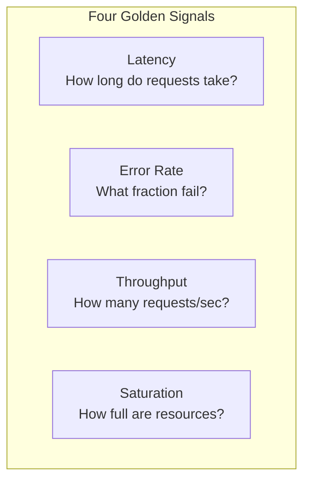
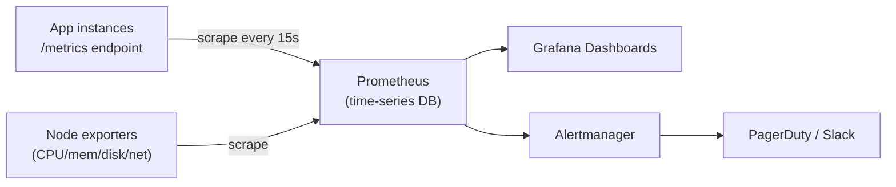
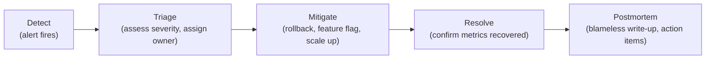

# Lecture 31: Application and Server Monitoring

Logging tells you what happened after you go looking for it. **Monitoring** tells you,
continuously and in real time, whether your system is healthy right now — and pages
someone the moment it isn't. This lecture covers the metrics, tools, and practices that
turn a running application into one you can actually operate with confidence.

## In This Lecture

- Track the key metrics that describe system health: latency, error rate, throughput, and
  saturation
- Set up health checks, uptime monitoring, and alerting
- Understand application performance monitoring (APM) and the basics of distributed
  tracing
- Monitor server-level resources (CPU, memory, disk, network) with dashboards
- Define SLIs and SLOs, and follow a sound incident response process

## Key Metrics: The Four Golden Signals

Google's Site Reliability Engineering practice popularized four metrics — often called the
**four golden signals** — that, together, describe the health of almost any service.



- **Latency** — how long a request takes to complete, usually measured as a distribution
  rather than a single average. The **p50** (median), **p95**, and **p99** (the value below
  which 95% or 99% of requests fall) matter more than the mean, because an average hides
  the slow tail that a fraction of your actual users experience.
- **Error rate** — the fraction of requests that fail (server errors, timeouts, or
  business-logic failures), typically tracked as a percentage over a rolling window (e.g.,
  "1.2% of requests in the last 5 minutes returned 5xx").
- **Throughput** — the volume of traffic the system is handling, typically requests per
  second (RPS) or transactions per second. Throughput on its own is neutral information;
  it becomes meaningful alongside latency and error rate ("throughput doubled and latency
  stayed flat" is good news; "throughput doubled and error rate spiked" is not).
- **Saturation** — how "full" a resource is relative to its capacity: CPU utilization,
  memory usage, connection pool usage, queue depth. High saturation is often a leading
  indicator of rising latency and errors before they actually happen.

!!! note "Why percentiles beat averages"
    If 95 out of 100 requests take 50ms and 5 take 5 seconds, the average is about 300ms —
    which describes almost no actual request. The **p99** (5 seconds, in this example)
    tells you what your slowest real users are experiencing, which is usually what you
    actually need to fix.

### Health Checks, Uptime Monitoring, and Alerting

Lecture 30 introduced the `/health` endpoint used by load balancers and orchestrators.
**Uptime monitoring** takes this further: an external service (e.g., Pingdom, UptimeRobot,
a synthetic check in your APM tool) periodically requests your application from *outside*
your infrastructure, on a schedule, and tracks whether it responds successfully and how
fast. This catches failures that your own internal health checks might miss — DNS
misconfiguration, a firewall rule blocking public traffic, or your entire region being
down.

**Alerting** turns a metric crossing a threshold into a notification to a human (Slack,
email, PagerDuty, phone call for the most severe cases).

```yaml
# Example alerting rule (Prometheus Alertmanager style)
- alert: HighErrorRate
  expr: rate(http_requests_total{status=~"5.."}[5m]) / rate(http_requests_total[5m]) > 0.05
  for: 5m
  labels:
    severity: critical
  annotations:
    summary: "Error rate above 5% for 5 minutes"
    description: "{{ $value | humanizePercentage }} of requests are failing"
```

!!! warning "Alert fatigue is a real failure mode"
    An alert that fires constantly for things nobody acts on trains the on-call engineer
    to ignore alerts altogether — which means the one that matters gets ignored too.
    Every alert should be **actionable** (there's something a human can actually do about
    it) and tuned to avoid firing on normal, transient blips (the `for: 5m` above requires
    the condition to persist, not just spike for one data point).

## Application Performance Monitoring (APM)

An **APM** tool (e.g., New Relic, Datadog APM, Elastic APM, Dynatrace) instruments your
application code to automatically collect latency, error, and throughput data *per
endpoint, per database query, and per external call* — not just at the whole-service
level — and presents it in dashboards, without you having to hand-write every metric.

```javascript
// Minimal custom instrumentation example (conceptual — most APM agents do this automatically)
const apm = require("elastic-apm-node").start({
  serviceName: "orders-api",
  environment: process.env.NODE_ENV,
});

app.get("/api/orders/:id", async (req, res) => {
  const span = apm.startSpan("db.orders.findById");
  const order = await Order.findById(req.params.id);
  span?.end();
  res.json(order);
});
```

Most APM tools reveal, without any custom code, which specific database query or external
API call is responsible for a slow endpoint — turning "checkout is slow" into "checkout is
slow because the `POST /charge` call to the payment provider averages 800ms."

### Distributed Tracing Basics

Once a request crosses more than one service, a single log line or a single APM
dashboard for one service can't show you the *whole* picture. **Distributed tracing**
solves this: each request gets a **trace ID** (the correlation ID from Lecture 30, used
for this exact purpose), and each unit of work within that trace — a database query, an
internal service call, an external API call — is recorded as a **span** with a start
time, duration, and parent span. Together, the spans reconstruct a timeline of exactly
where a request spent its time, across every service it touched.

```mermaid
gantt
    title Trace: POST /checkout (total 420ms)
    dateFormat X
    axisFormat %L ms
    section Gateway
    Route request           :0, 10
    section Orders Service
    Validate order          :10, 40
    Call Payments Service   :40, 380
    section Payments Service
    Charge card (external)  :60, 350
    section Orders Service
    Save order to DB        :380, 410
```

This visualization (produced by tools like Jaeger, Zipkin, or an APM's trace view)
immediately shows that the 290ms external card-charging call, not your own code, dominates
the request's latency — a conclusion that's very hard to reach from logs or per-service
metrics alone.

!!! tip "OpenTelemetry: the vendor-neutral standard"
    **OpenTelemetry (OTel)** is an open, vendor-neutral standard and set of libraries for
    generating traces, metrics, and logs from your application code, which can then be
    exported to whichever backend you choose (Jaeger, Datadog, Honeycomb, and others all
    accept OTel data). Instrumenting with OpenTelemetry instead of a proprietary agent SDK
    avoids locking your codebase to one monitoring vendor.

## Server Monitoring

Alongside application-level signals, the underlying **infrastructure** needs its own
monitoring — a healthy application process running on a starved machine will still fail.

| Resource | What to watch | Why it matters |
|---|---|---|
| **CPU** | Utilization %, load average | Sustained high CPU increases latency and can starve other processes |
| **Memory** | Used/available, swap usage | Exhaustion triggers OOM kills or crashes; a steadily climbing trend often signals a memory leak |
| **Disk** | Used space %, I/O latency, IOPS | A full disk crashes databases and logging; slow I/O bottlenecks anything reading/writing data |
| **Network** | Bandwidth, connection count, packet errors | Saturation causes timeouts and dropped connections between services |

Tools like **Prometheus** (which scrapes numeric metrics from instrumented targets on a
schedule and stores them as time series) paired with **Grafana** (which queries that
time-series data and renders it as dashboards) are the most common open-source combination
for this; cloud providers offer equivalents (CloudWatch, Azure Monitor, Google Cloud
Monitoring).



```javascript
// Exposing a custom application metric for Prometheus to scrape
const client = require("prom-client");
const ordersCreated = new client.Counter({
  name: "orders_created_total",
  help: "Total number of orders created",
});

app.post("/api/orders", async (req, res) => {
  const order = await createOrder(req.body);
  ordersCreated.inc();
  res.status(201).json(order);
});

app.get("/metrics", async (req, res) => {
  res.set("Content-Type", client.register.contentType);
  res.end(await client.register.metrics());
});
```

### Dashboards

A good dashboard tells you, at a glance, whether the system is healthy — it is not a
dumping ground for every metric you can measure. A well-designed service dashboard
typically leads with the four golden signals, followed by resource saturation, followed by
business-relevant metrics (orders/minute, signups/minute), organized so an on-call
engineer can diagnose most incidents without leaving the page.

## SLIs, SLOs, and Incident Response

Monitoring produces numbers; **SLIs** and **SLOs** turn those numbers into commitments
your team can be held to.

- A **Service Level Indicator (SLI)** is a specific, measured metric — "the percentage of
  requests served in under 300ms," "the percentage of requests that succeed."
- A **Service Level Objective (SLO)** is a target for that SLI — "99.9% of requests
  succeed, measured over a rolling 30 days." SLOs are internal engineering targets.
- A **Service Level Agreement (SLA)** is an SLO with a contractual consequence (usually a
  refund or credit) if it's missed — typically a promise made to external customers, and
  usually looser than the internal SLO backing it, to leave margin for error.

!!! note "The error budget"
    If your SLO is 99.9% availability over 30 days, you have an **error budget** of 0.1%
    — roughly 43 minutes of allowed downtime or failed requests per month. As long as
    you're within budget, teams are free to take reasonable risks (ship faster, run
    experiments); once the budget is spent, the priority shifts to stability until it
    resets. This turns "how reliable should we be?" from an argument into a number.

### Incident Response

When monitoring or an alert indicates something is actually broken, a consistent response
process keeps the situation from getting worse and produces a record the team can learn
from.



1. **Detect** — an alert fires, or a human notices a problem.
2. **Triage** — assess severity/impact and assign a clear owner (an "incident commander"
   for anything serious) so effort isn't duplicated or lost.
3. **Mitigate** — take the fastest safe action to stop user impact, which is very often
   **rollback** (Lecture 30) rather than a forward-fix under pressure.
4. **Resolve** — confirm via monitoring that the relevant metrics (error rate, latency)
   have actually returned to normal, not just that the immediate symptom stopped.
5. **Postmortem** — a **blameless** written account of what happened, why, how it was
   caught (or wasn't), and concrete follow-up actions to reduce the chance or impact of a
   recurrence. Blameless means the focus is on fixing systems and processes, not assigning
   individual fault — which is what makes people willing to report and discuss failures
   honestly in the first place.

!!! tip "Practice before you need it"
    Teams that only think about incident response *during* an incident tend to make it
    worse — arguing about ownership, searching for the rollback command, or not knowing
    who has access to a critical system. Runbooks (step-by-step guides for known failure
    scenarios) and occasional practice drills turn incident response from improvisation
    into a rehearsed process.

## Try It Yourself

1. Sketch (or build, with `prom-client` and a local Prometheus) a `/metrics` endpoint for
   a small Express app that exposes at least one counter (e.g., requests handled) and one
   histogram (e.g., request duration). Identify which of the four golden signals each
   metric maps to.
2. Write a one-page incident postmortem for a hypothetical outage of your choice (e.g.,
   "checkout returned 500s for 12 minutes because a database connection pool was
   exhausted"). Include a timeline, root cause, mitigation taken, and at least two concrete
   follow-up action items.

## Key Takeaways

- The **four golden signals** — latency, error rate, throughput, and saturation — are the
  core metrics for describing any service's health; use **percentiles** (p95/p99), not
  averages, for latency.
- **Health checks** and external **uptime monitoring** catch failures from inside and
  outside your infrastructure; **alerting** should be actionable and tuned to avoid alert
  fatigue.
- **APM** tools automatically instrument per-endpoint and per-query performance;
  **distributed tracing** (trace IDs and spans, ideally via **OpenTelemetry**) reconstructs
  where a request spent its time across multiple services.
- Server-level monitoring of **CPU, memory, disk, and network** is necessary alongside
  application metrics — a healthy app on a starved machine still fails.
- **Prometheus + Grafana** (or a managed equivalent) is the standard open-source pattern
  for scraping, storing, and dashboarding metrics.
- **SLIs** are measured values, **SLOs** are internal targets for them, and **SLAs** are
  contractual promises to customers; the **error budget** makes reliability a number, not
  an argument.
- A consistent **incident response** process — detect, triage, mitigate, resolve,
  blameless postmortem — turns outages into a rehearsed procedure and a source of
  learning, not chaos.
